# Building and evaluation of a PBPK model for antibody 7E3 in wild-type and FcRn knockout mice

| Version                                         | 1.0-OSP12.1                                                   |
| ----------------------------------------------- | ------------------------------------------------------------ |
| based on *Model Snapshot* and *Evaluation Plan* | https://github.com/Open-Systems-Pharmacology/7E3-Model/releases/tag/v1.0 |
| OSP Version                                     | 12.1                                                          |
| Qualification Framework Version                 | 3.4                                                          |

This evaluation report and the corresponding PK-Sim project file are filed at:

https://github.com/Open-Systems-Pharmacology/OSP-PBPK-Model-Library/

# Table of Contents

 * [1 Introduction](#introduction)
 * [2 Methods](#methods)
   * [2.1 Modeling Strategy](#modeling-strategy)
   * [2.2 Data](#methods-data)
     * [2.2.1 In vitro / physico-chemical Data ](#invitro-and-physico-chemical-data)
     * [2.2.2 PK Data ](#PK-data)
   * [2.3 Model Parameters and Assumptions](#model-parameters-and-assumptions)
     * [2.3.1 Absorption ](#model-parameters-and-assumptions-absorption)
     * [2.3.2 Distribution ](#model-parameters-and-assumptions-distribution)
     * [2.3.3 Metabolism and Elimination ](#model-parameters-and-assumptions-metabolism-and-elimination)
     * [2.3.4 Tissue Concentrations ](#model-parameters-and-assumptions-tissue-concentrations)
     * [2.3.5 Automated Parameter Identification ](#model-parameters-and-assumptions-parameter-identification)
 * [3 Results and Discussion](#results-and-discussion)
   * [3.1 Final input parameters](#final-input-parameters)
   * [3.2 Diagnostics Plots](#diagnostics-plots)
   * [3.3 Concentration-Time Profiles](#ct-profiles)
 * [4 Conclusion](#conclusion)
 * [5 References](#main-references)

# 1 Introduction

7E3 is a murine IgG1 antibody directed against human platelet glycoprotein IIb/IIIa. 

For 7E3, plasma and tissue concentration-time profiles for various tissues were measured in wild-type as well as FcRn knockout mice ([Garg2007, Garg2009](#5-references)). These data were used together with pharmacokinetic (PK) data from 5 other compounds to identify unknown parameters during the development of the generic large molecule physiologically based pharmacokinetic (PBPK) model in PK-Sim ([Niederalt 2018](#5-references)). 

The herein presented evaluation report evaluates the performance of a PBPK model for 7E3 in wild-type and FcRn knockout mice for the PK data used for the development of the generic large molecule model in PK-Sim.  

The presented 7E3 PBPK model as well as the respective evaluation plan and evaluation report are provided open-source (https://github.com/Open-Systems-Pharmacology/7E3-Model).

# 2 Methods

## 2.1 Modeling Strategy

The development of the large molecule PBPK model in PK-Sim® has previously been described by Niederalt et al. ([Niederalt 2018](#5-references)). In short, the model was built as an extension of the PK-Sim® model for small molecules incorporating (i) the two-pore formalism for drug extravasation from blood plasma to interstitial space, (ii) lymph flow, (iii) endosomal clearance and (iv) protection from endosomal clearance by neonatal Fc receptor (FcRn) mediated recycling. 

For model development and evaluation, PK data were used from compounds with a wide range of solute radii and from different species. The PK data used for parameter estimation were from the following compounds:  antibody–drug conjugate BAY 79-4620 in mice (Bayer in house data),  antibody 7E3 in wild-type and FcRn knockout mice  ([Garg 2007](#5-references), [Garg2009](#5-references)), domain antibody dAb2 in mice ([Sepp 2015](#5-references)), antibodies MEDI-524 and MEDI-524-YTE in monkeys ([Dall'Acqua 2006](#5-references)), and antibody CDA1 in humans ([Taylor 2008](#5-references)). The PK data used for model evaluation were from inulin in rats  ([Tsuji1983](#5-references)) and tefibazumab in humans ([Reilly 2005](#5-references)).  

The PBPK model including the estimated physiological parameters as described by Niederalt et al. ([Niederalt 2018](#5-references)) is available in the Open Systems Pharmacology Suite from version 7.1 onwards.

This evolution report focuses on the PBPK model for the antibody 7E3. 

Details about input data (physicochemical, *in vitro* and PK) can be found in  [Section 2.2](#22-data).

Details about the structural model and its parameters can be found in  [Section 2.3](#23-model-parameters-and-assumptions).

## 2.2 Data

### 2.2.1 In vitro / physico-chemical Data 

A literature search was performed to collect available information on physicochemical properties of 7E3. The obtained information from literature is summarized in the table below. 

| **Parameter** | **Unit** | **Value** | Source                       | **Description**                                              |
| :------------ | -------- | --------- | ---------------------------- | ------------------------------------------------------------ |
| MW            | g/mol    | 150000    | [Lobo 2004](#5-references)   | Molecular weight                                             |
| r             | nm       | 5.34      | [Taylor 1984](#5-references) | Hydrodynamic solute radius                                   |
| Kd (FcRn)     | µM       | 0.75      | [Zhou 2003](#5-references)   | Dissociation constant for binding of a murine IgG1 antibody to murine FcRn at pH 6 |

### 2.2.2 PK Data 

Published plasma and tissue PK data on 7E3 in wild-type and FcRn knockout mice were used.

| Publication               | Description                                                  |
| :------------------------ | :----------------------------------------------------------- |
| [Garg2007](#5-references) | Experimental plasma and tissue concentrations after single 8 mg/kg IV bolus injection. Tissue concentrations of 125I-labeled 7E3 were determined from blotted dried tissues after sacrificing 3 mice per time point. |
| [Garg2009](#5-references) | Experimental plasma and brain concentrations after single 8 mg/kg IV bolus injection. Brain concentrations were corrected for residual blood. |

## 2.3 Model Parameters and Assumptions

### 2.3.1 Absorption 

There is no absorption process since 7E3 was administered intravenously.

### 2.3.2 Distribution 

The standard lymph and fluid recirculation flow rates and the standard vascular properties of the different tissues (hydraulic conductivity, pore radii, fraction of flow via large pores) from PK-Sim were used. The antibody 7E3, among other compounds, has been used to identify these lymph and fluid recirculation flow rates used in PK-Sim ([Niederalt 2018](#5-references)).

### 2.3.3 Metabolism and Elimination 

The FcRn mediated clearance present in the standard PK-Sim model was  used as only clearance process. The standard physiological parameters related to FcRn mediated clearance were used (rate constants for endosomal uptake and recycling, association rate constant for FcRn binding and concentration of FcRn in the endosomal space). For the FcRn knockout mice, the FcRn concentration was set to 0. The antibody 7E3, among other compounds, has been used to identify these parameters using literature values for the drug affinities to FcRn in the endosomal space ([Niederalt 2018](#5-references)).

### 2.3.4 Tissue Concentrations 

For the comparison with experimental data, the parameters `Fraction of blood for sampling` used in the Observer for the tissue concentrations were set for all organs except brain to 0.18 for comparison with tissue dissection data according to the fit results (across compounds) in Ref. ([Niederalt 2018](#5-references)). Since the experimental brain concentrations of 7E3 were corrected for residual blood ([Garg 2009](#5-references)), no residual blood was assumed for brain. (The parameter `Fraction of blood for sampling` specifies residual blood in tissue as ratio of blood volume contributing to the measured tissue concentration to the total in vivo capillary blood volume.)
In the present evaluation report, the experimental gut concentrations were compared to simulated organ concentrations for small and large intestine separately in the goodness of fit plots as well as in the concentration-time profile plot. 

### 2.3.5 Automated Parameter Identification 

No drug specific parameters were fitted. The antibody 7E3, among other compounds, has been used to develop the model for proteins and large molecules in PK-Sim ([Niederalt 2018](#5-references)).

The table shows the tissue observer parameter that was specified in the model based on the parameter identification reported in Ref. ([Niederalt 2018](#5-references)), and which was not included in the PK-Sim database since version 7.1.

| Model Parameter                                              | Optimized Value | Unit |
| ------------------------------------------------------------ | --------------- | ---- |
| `Fraction of blood for sampling` (all organs) - for comparison with tissue dissection data. | 0.18            |      |

# 3 Results and Discussion

The PBPK model for 7E3 was evaluated with plasma and tissue PK data in wild-type and FcRn knockout mice. 

These PK data have been used together with PK data from 5 other compounds to simultaneously identify  parameters during the development of the generic model for proteins and large molecules in PK-Sim ([Niederalt 2018](#5-references)).

The next sections show:

1. the final model parameters for the building blocks: [Section 3.1](#final-input-parameters).
2. the overall goodness of fit: [Section 3.2](#diagnostics-plots).
3. simulated vs. observed concentration-time profiles for the clinical studies used for model building and for model verification: [Section 3.3](#ct-profiles).

## 3.1 Final input parameters

The compound parameter values of the final PBPK model are illustrated below.

### Compound: 7E3

#### Parameters

Name                                       | Value        | Value Origin                                    | Alternative | Default
------------------------------------------ | ------------ | ----------------------------------------------- | ----------- | -------
Solubility at reference pH                 | 9999 mg/l    | Unknown-/Dummy value not used in the simulation | Measurement | True   
Reference pH                               | 7            | Unknown-/Dummy value not used in the simulation | Measurement | True   
Lipophilicity                              | -5 Log Units | Unknown-/Dummy value not used in the simulation | Measurement | True   
Fraction unbound (plasma, reference value) | 1            | Unknown-Assumption                              | Measurement | True   
Is small molecule                          | No           |                                                 |             |        
Molecular weight                           | 150000 g/mol | Publication-Lobo2004                            |             |        
Plasma protein binding partner             | Unknown      |                                                 |             |        
Radius (solute)                            | 0.00534 µm   | Publication-Taylor1984                          |             |        
Kd (FcRn) in endosomal space               | 0.75 µmol/l  | Publication-Zhou2003                            |             |        

#### Calculation methods

Name                    | Value          
----------------------- | ---------------
Partition coefficients  | PK-Sim Standard
Cellular permeabilities | PK-Sim Standard

#### Processes

## 3.2 Diagnostics Plots

Below you find the goodness-of-fit visual diagnostic plots for the PBPK model performance of all data used presented in [Section 2.2.2](#PK-data).

The first plot shows observed versus simulated plasma concentration, the second weighted residuals versus time. 

**Table 3-1: GMFE for Goodness of fit plot for concentration in plasma and tissues**

|Group           |GMFE |
|:---------------|:----|
|FcRn KO mouse   |1.52 |
|Wild-type mouse |1.29 |
|All             |1.39 |

 
 

**Figure 3-1: Goodness of fit plot for concentration in plasma and tissues**

 
 

**Figure 3-2: Goodness of fit plot for concentration in plasma and tissues**

 
 

## 3.3 Concentration-Time Profiles

Simulated versus observed concentration-time profiles of all data listed in [Section 2.2.2](#PK-data) are presented below.

**Figure 3-3: Plasma - lin scale  (wild-type mice)**

 
 

**Figure 3-4: Plasma - log scale (wild-type mice)**

 
 

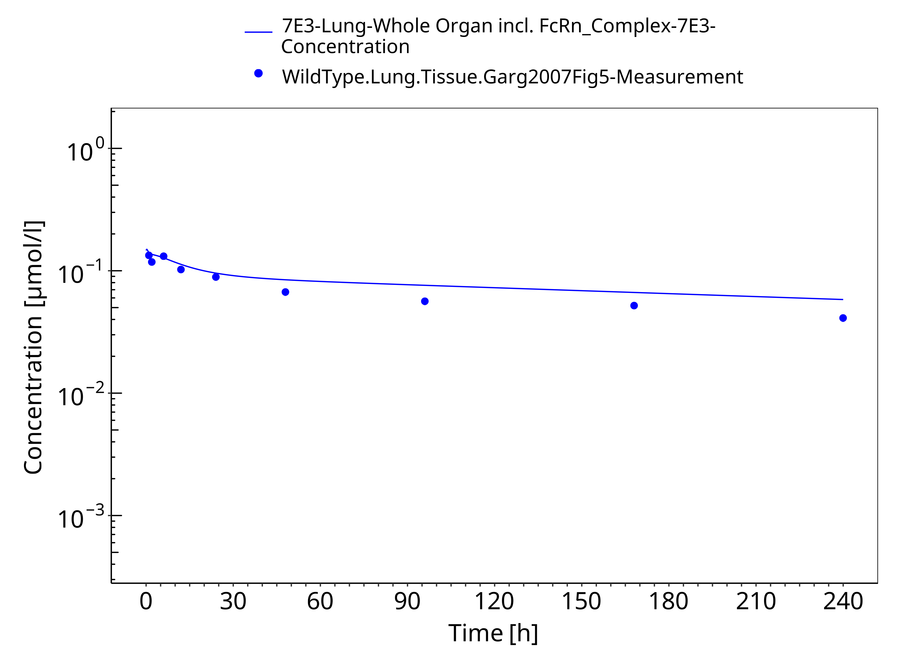

**Figure 3-5: Lung (wild-type mice)**

 
 

**Figure 3-6: Kidney (wild-type mice)**

 
 

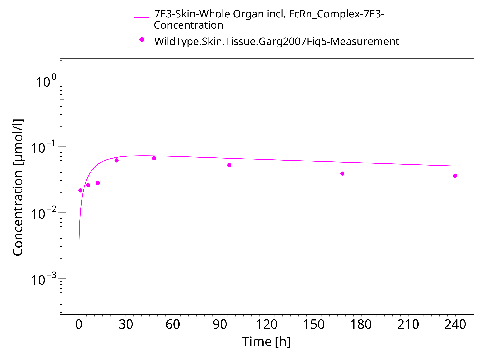

**Figure 3-7: Skin (wild-type mice)**

 
 

**Figure 3-8: Muscle (wild-type mice)**

 
 

**Figure 3-9: Spleen (wild-type mice)**

 
 

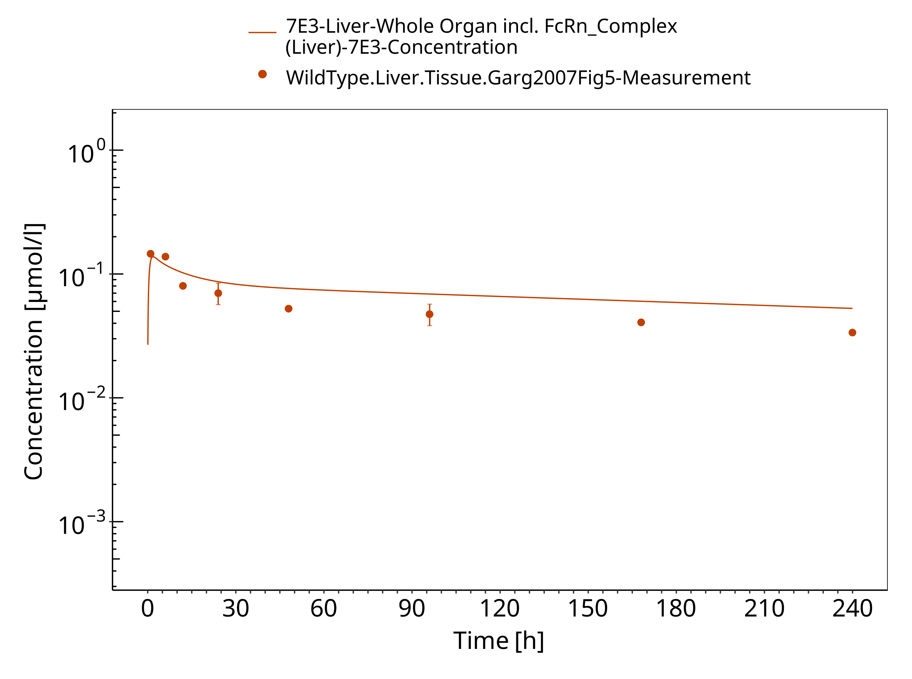

**Figure 3-10: Liver (wild-type mice)**

 
 

**Figure 3-11: Heart (wild-type mice)**

 
 

**Figure 3-12: Gut (wild-type mice)**

 
 

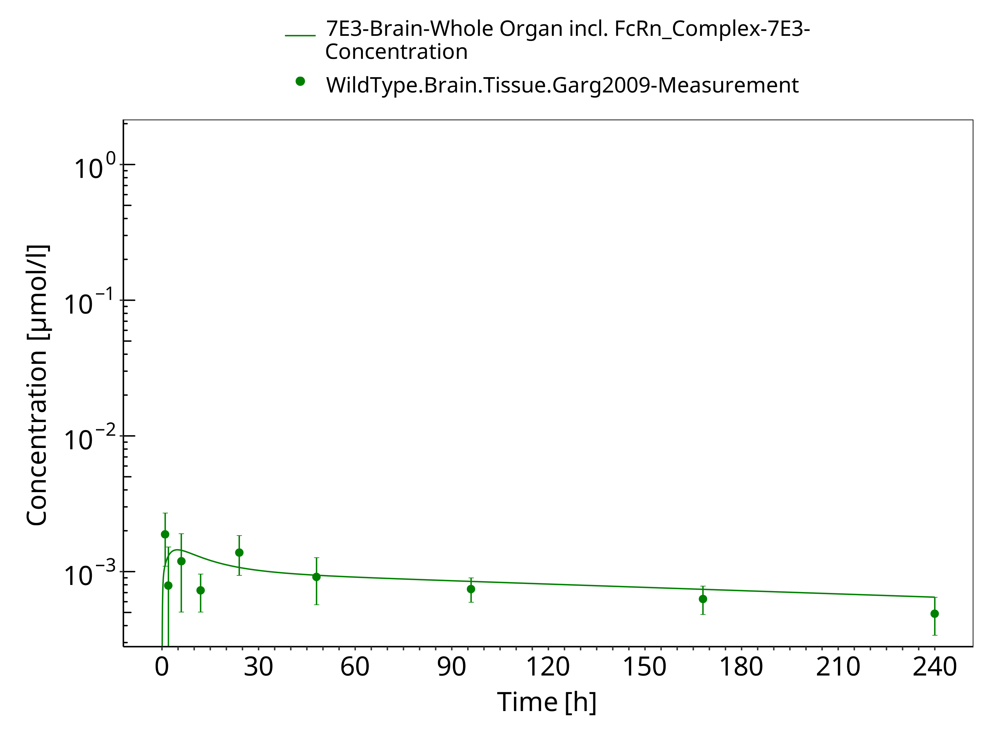

**Figure 3-13: Brain (wild-type mice)**

 
 

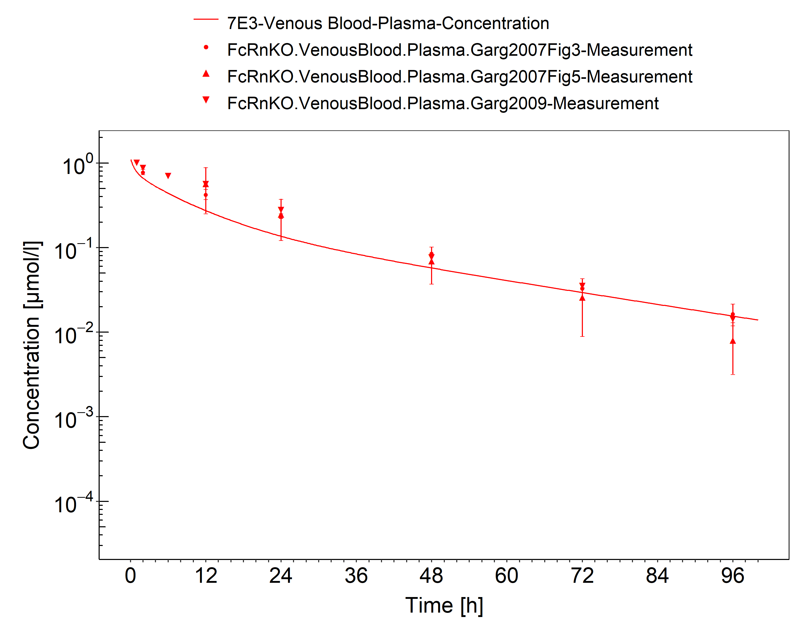

**Figure 3-14: Plasma (FcRn KO mice)**

 
 

**Figure 3-15: Lung (FcRn KO mice)**

 
 

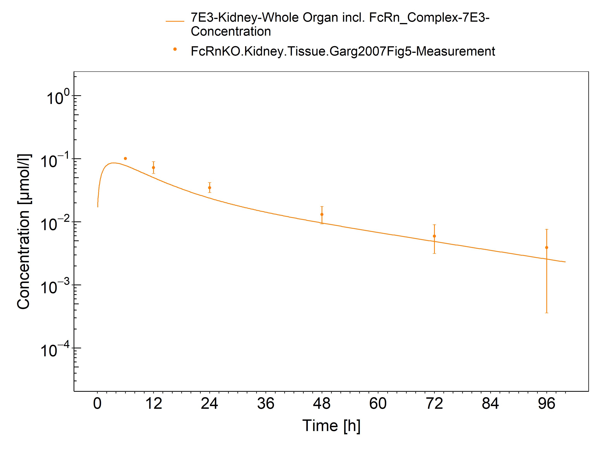

**Figure 3-16: Kidney (FcRn KO mice)**

 
 

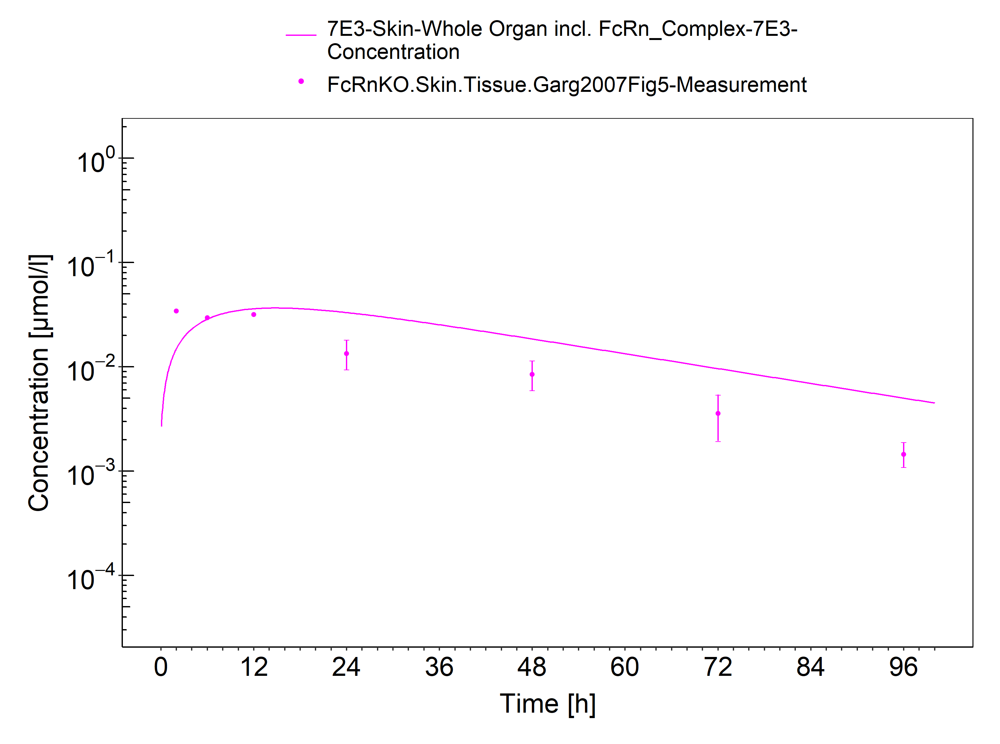

**Figure 3-17: Skin (FcRn KO mice)**

 
 

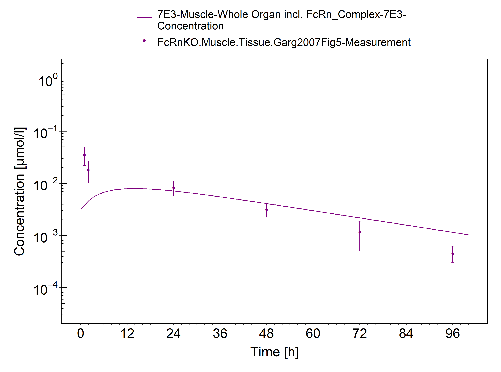

**Figure 3-18: Muscle (FcRn KO mice)**

 
 

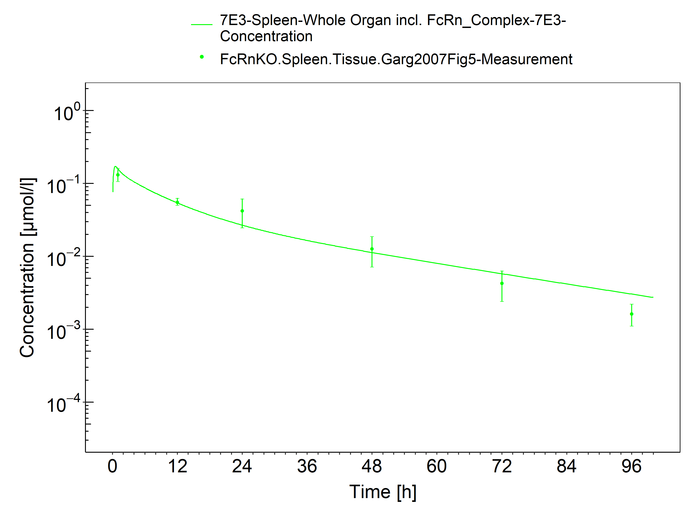

**Figure 3-19: Spleen (FcRn KO mice)**

 
 

**Figure 3-20: Liver (FcRn KO mice)**

 
 

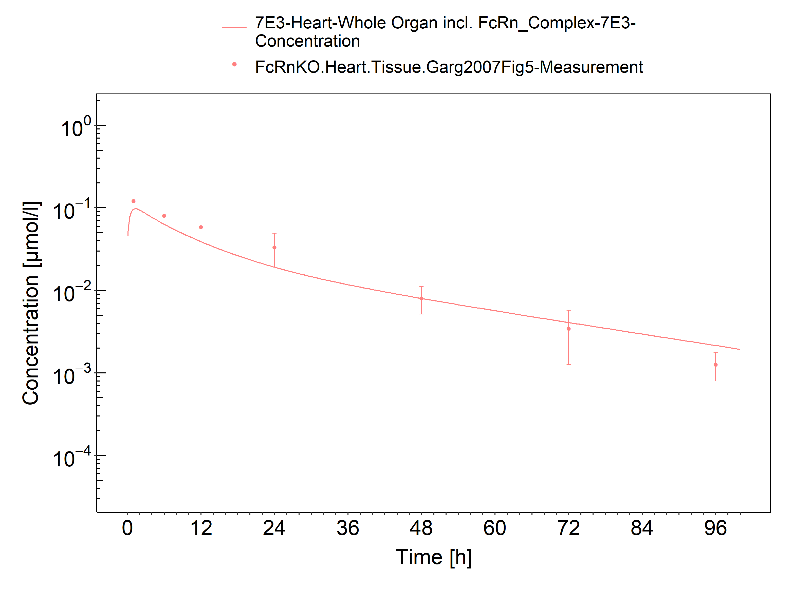

**Figure 3-21: Heart (FcRn KO mice)**

 
 

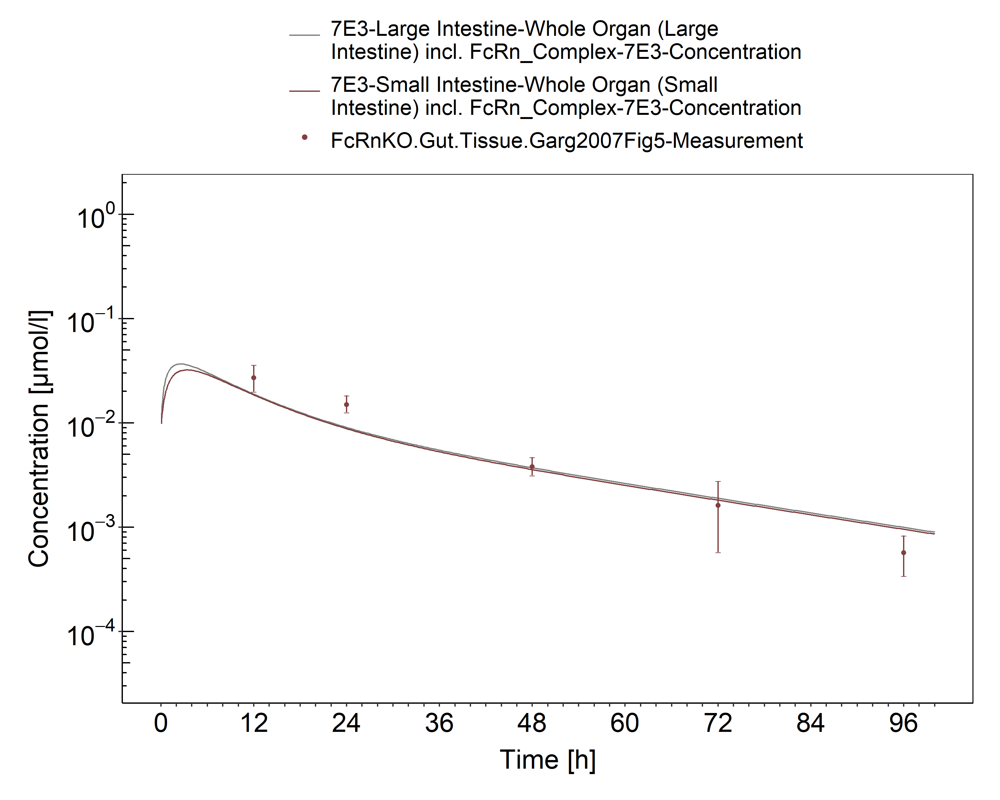

**Figure 3-22: Gut (FcRn KO mice)**

 
 

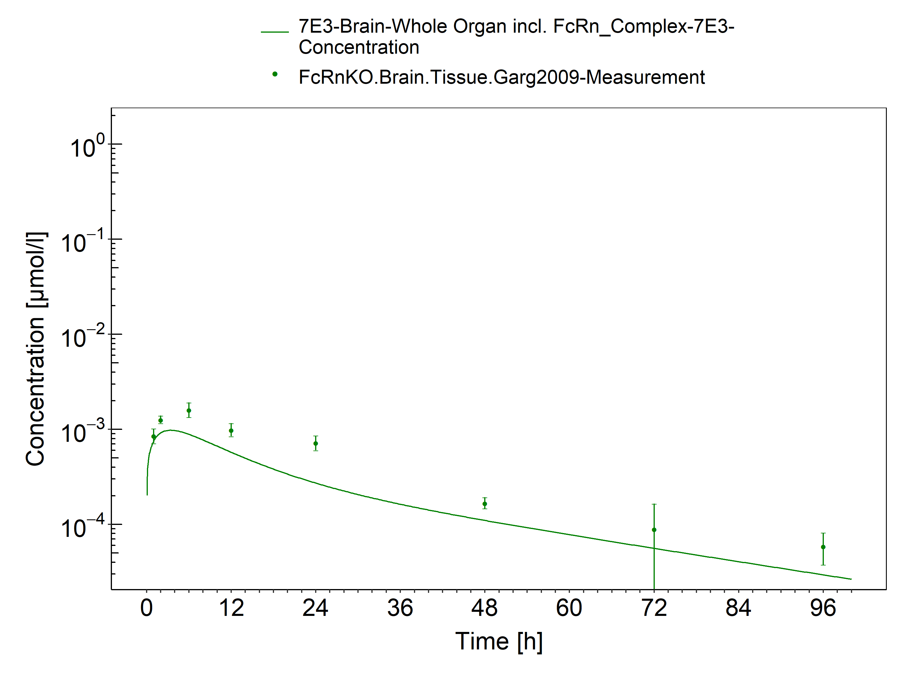

**Figure 3-23: Brain (FcRn KO mice)**

 
 

# 4 Conclusion

The herein presented PBPK model overall adequately describes the pharmacokinetics of 7E3 in mice. The higher antibody clearance in the FcRn KO mice compared to the clearance in the wild-type mice is well described by the model. The largest deviations between measured and simulated concentration time profiles were observed for skin concentrations in the FcRn KO mice and spleen concentrations in the wild-type mice which were overestimated by the model and for brain concentrations in the FcRn KO mice which were underestimated. The initial concentrations in muscle, especially for the FcRn KO mice, as well as in kidney and gut for the wild-type mice were underestimated.  

The PK data had been used during the development of the generic large molecule PBPK model in PK-Sim ([Niederalt 2018](#5-references)) together with PK data from 5 other compounds (BAY 79-4620, CDA1, dAb2, MEDI-524 & MEDI-524-YTE). 

# 5 References

**Dall'Acqua 2006** Dall’Acqua WF, Kiener PA, Wu H. Properties of human IgG1s engineered for enhanced binding to the neonatal Fc receptor (FcRn). J Biol Chem. 2006 Aug; 281(33):23514-23524. doi: 10.1074/jbc.M604292200.

**Garg 2007** Garg A, Balthasar JP. Physiologically-based pharmacokinetic (PBPK) model to predict IgG tissue kinetics in wild-type and FcRn-knockout mice. J Pharmacokinet Pharmacodyn. 2007 Jul; 34(5):687-709. doi: 10.1007/s10928-007-9065-1. 

**Garg 2009** Garg A, Balthasar J. Investigation of the influence of FcRn on the distribution of IgG to the brain. AAPS J. 2009 July; 11(3):553-557. doi: 10.1208/s12248-009-9129-9. 

**Lobo 2004** Lobo ED, Hansen R J, Balthasar JP.  Antibody pharmacokinetics and pharmacodynamics. J Pharm Sci. 2004 Nov;93(11):2645-2668. doi: 10.1002/jps.20178.

**Niederalt 2018** Niederalt C, Kuepfer L, Solodenko J, Eissing T, Siegmund HU, Block M, Willmann S, Lippert J. A generic whole body physiologically based pharmacokinetic model for therapeutic proteins in PK-Sim. J Pharmacokinet Pharmacodyn. 2018 Apr;45(2):235-257. doi: 10.1007/s10928-017-9559-4.

**Reilly 2005** Reilley S, Wenzel E, Reynolds L, Bennett B, Patti JM, Hetherington S. Open-label, dose escalation study of the safety and pharmacokinetic profile of tefibazumab in healthy volunteers. Antimicrob Agents Chemother. 2005 Mar;49(3):959–962. doi: 10.1128/AAC.49.3.959-962.2005.

**Sepp 2015** Sepp A, Berges A, Sanderson A, Meno-Tetang G. Development of a physiologically based pharmacokinetic model for a domain antibody in mice using the two-pore theory. J Pharmacokinet Pharmacodyn. 2015 Jan;42(2):97-109. doi: 10.1007/s10928-014-9402-0.

**Taylor 1984** Taylor AE, Granger DN. Exchange of macromolecules across the microcirculation. Handbook of Physiology - Cardiovascular System. Microcirculation (Eds. Renkin EM and Michel CC. Bethesda, MD, American Physiological Society). 1984; Vol. 4(Pt 2):467–520.

**Taylor 2008** Taylor CP, Tummala S, Molrine D, Davidson L, Farrell RJ, Lembo A, Hibberd PL, Lowy I, Kelly CP. Open-label, dose escalation phase I study in healthy volunteers to evaluate the safety and pharmacokinetics of a human monoclonal antibody to Clostridium difficile toxin A. Vaccine. 2008 Jun;26(27-28):3404–3409. doi: 10.1016/j.vaccine.2008.04.042.

**Tsuji 1983** Tsuji A, Yoshikawa T, Nishide K, Minami H, Kimura M, Nakashima E, Terasaki T, Miyamoto E, Nightingale CH, Yamana T. Physiologically based pharmacokinetic model for beta-lactam antibiotics I: tissue distribution and elimination in rats. J Pharm Sci. 1983 Nov;72(11):1239-1252. doi: 10.1002/jps.2600721103.

**Zhou 2003** Zhou J, Johnson JE, Ghetie V, Ober RJ, Ward ES. Generation of mutated variants of the human form of the MHC class I-related receptor, FcRn, with increased affinity for mouse immunoglobulin G. J Mol Biol. 2003 Sep;332(4):901-913. doi: 10.1016/s0022-2836(03)00952-5.

