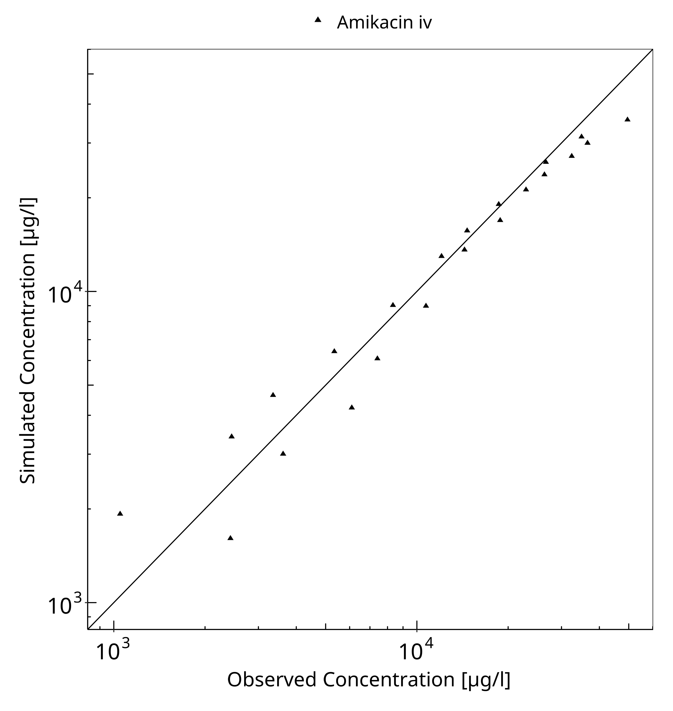
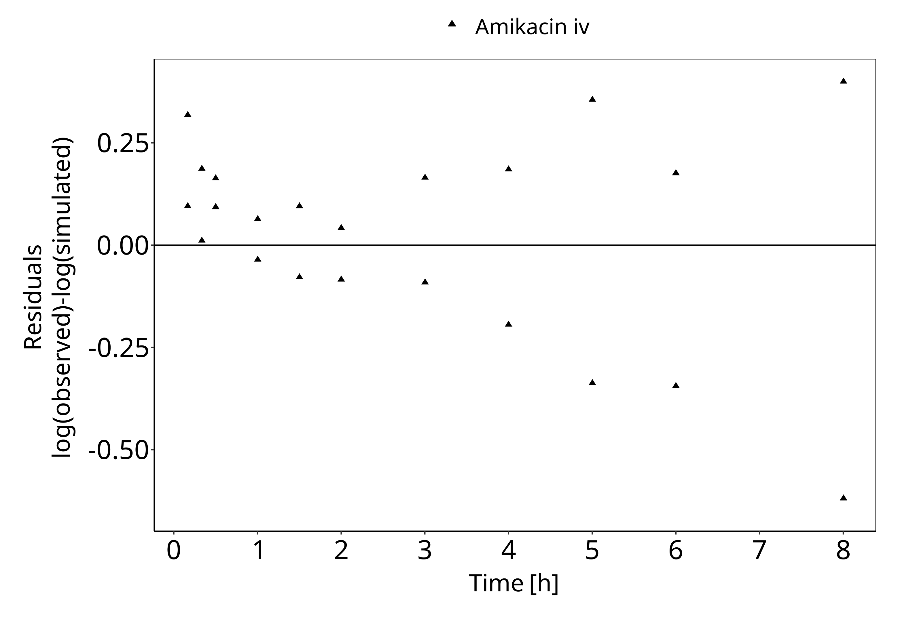
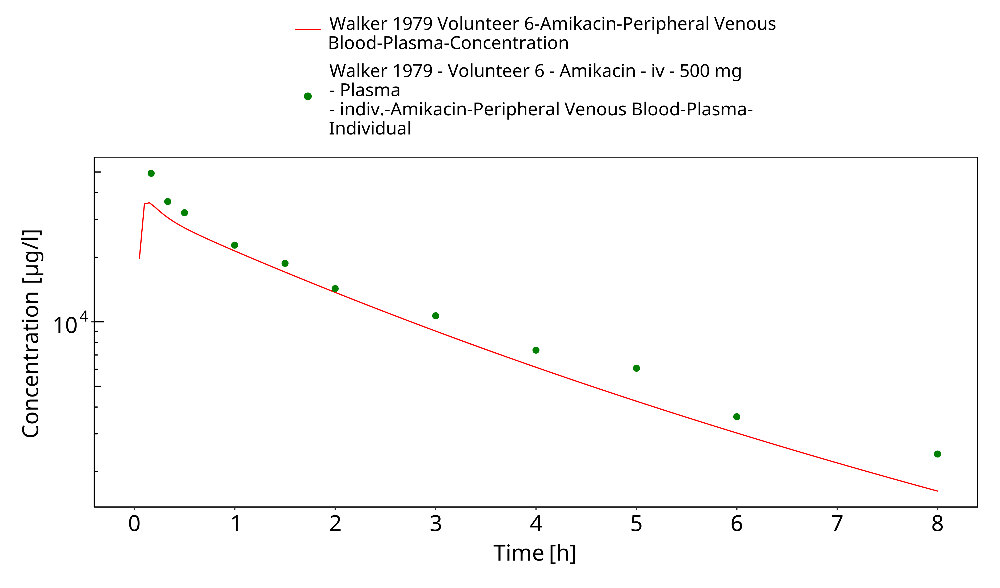
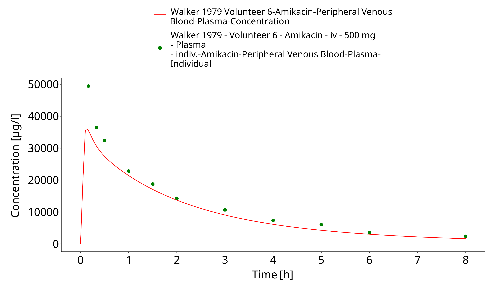
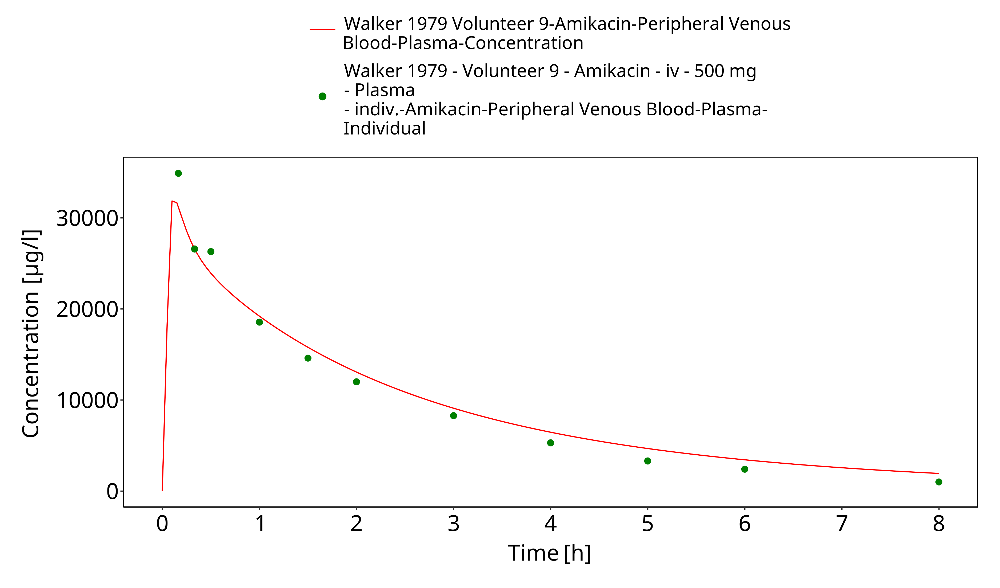
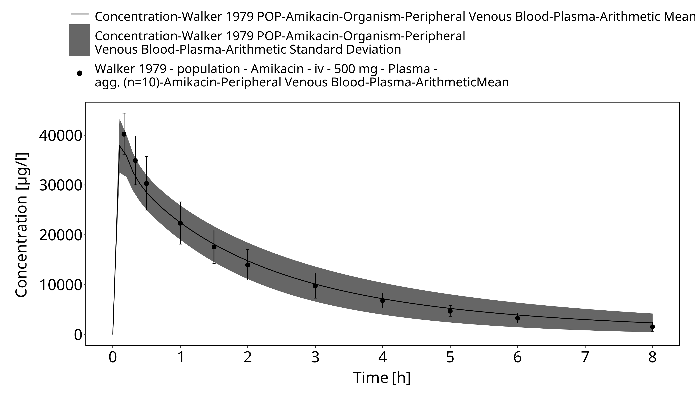

# Building and evaluation of a PBPK model for amikacin in adults

| Version                                         | 2.0-OSP12.1                                                   |
| ----------------------------------------------- | ------------------------------------------------------------ |
| based on *Model Snapshot* and *Evaluation Plan* | https://github.com/Open-Systems-Pharmacology/Amikacin-Model/releases/tag/v2.0 |
| OSP Version                                     | 12.1                                                          |
| Qualification Framework Version                 | 3.4                                                          |

This evaluation report and the corresponding PK-Sim project file are filed at:

https://github.com/Open-Systems-Pharmacology/OSP-PBPK-Model-Library/

# Table of Contents

 * [1 Introduction](#introduction)
 * [2 Methods](#methods)
   * [2.1 Modeling Strategy](#modeling-strategy)
   * [2.2 Data](#data)
   * [2.3 Model Parameters and Assumptions](#model-parameters-and-assumptions)
 * [3 Results and Discussion](#results-and-discussion)
   * [3.1 Final input parameters](#final-input-parameters)
   * [3.2 Diagnostics Plots](#diagnostics-plots)
   * [3.3 Concentration-Time Profiles](#concentration-time-profiles)
 * [4 Conclusion](#conclusion)
 * [5 References](#references)

# 1 Introduction

The presented model building and evaluation report evaluates the performance of a PBPK model for amikacin in adults.

Amikacin is a semi-synthetic aminoglycoside antibiotic used for a number of bacterial infections. Amikacin is administered in several forms, including intravenous or intramuscular injection. The PBPK model for amikacin was previously developed in PK-sim for adults ([Wendl 2011](#5-references)) and preterm neonates ([Claassen 2015](#5-references)). As the latter model was built more recently, this PBPK model was used to evaluate the predictive performance of glomerular filtration rate (GFR) mediated clearance in adults without further changes. In this chapter we show that amikacin adequately described the pharmacokinetics of amikacin in adults, based on the PBPK model build and reported in preterm neonates.

The amikacin model is a whole-body PBPK model, allowing for dynamic translation between individuals with GFR based renal elimination. The amikacin report demonstrates the level of confidence in the amikacin PBPK model build with the OSP suite with regard to reliable predictions of amikacin PK in adults during model-informed drug development.

# 2 Methods

## 2.1 Modeling Strategy

The general concept of building a PBPK model has previously been described by Kuepfer et al. ([Kuepfer 2016](#5-references)). Relevant information on anthropometric (height, weight) and physiological parameters (e.g. blood flows, organ volumes, binding protein concentrations, hematocrit, cardiac output) in adults was gathered from the literature and has been previously published ([Schlender 2016](#5-references)). The information was incorporated into PK-Sim® and was used as default values for the simulations in adults.

The  applied activity and variability of plasma proteins and active processes that are integrated into PK-Sim® are described in the publicly available PK-Sim® Ontogeny Database Version 7.3 ([PK-Sim Ontogeny Database Version 7.3](#5-references)) or otherwise referenced for the specific process.

The amikacin model was evaluated in adults using data of the following  publication:

- Walker JM, Wise R, Mitchard M. The pharmacokinetics of amikacin and gentamicin in volunteers: a comparison of individual differences. J Antimicrob Chemother. 1979 Jan;5(1):95-9.
  (https://academic.oup.com/jac/article/5/1/95/747852)

As the PBPK model of amikacin has been previously developed, this model was rebuilt, without any further parameter identification. 

Simulations using this PBPK model were compared to the reported data to evaluate model appropriateness and to assess model evaluation, by means of diagnostics plots and predicted versus observed concentration-time profiles, of which the results support an adequate prediction of the PK in adults.

During model building, uncertainties in data quality, as well as study differences may cause not being able to adequately describe the PK of all reported clinical studies. 

## 2.2 Data

### 2.2.1 In vitro / physicochemical data

A literature search was performed to collect available information on physicochemical properties of amikacin. The obtained information from literature is summarized in the table below, and is used for model building.

| **Parameter**   | **Unit** | **Value (reference)**                            | **Description**                        |
| :-------------- | -------- | ------------------------------------------------ | -------------------------------------- |
| MW              | g/mol    | 588.6 ([Claassen 2015](#5-references))           | Molecular weight                       |
| pKa             |          | 9.7, 8.92, 8.13 ([Claassen 2015](#5-references)) | Acid dissociation constants            |
| Solubility (pH) | mg/L     | 50 (7)  ([Drugbank.ca](#5-references))           | Solubility                             |
| logMA           |          | -0.48 ([Claassen 2015](#5-references))           | The logarithm of the membrane affinity |
| fu              |          | 1 ([Claassen 2015](#5-references))               | Fraction unbound                       |
| GFR fraction    |          | 1 ([Claassen 2015](#5-references))               | Glomerular Filtration Rate fraction    |

### 2.2.2 Clinical data

A literature search was performed to collect available clinical data on amikacin in adults. 

The following publication was found in adults for the evaluation of the reported amikacin PBPK model:

| Publication                       | Study description                                            |
| :-------------------------------- | :----------------------------------------------------------- |
| [Walker 1979](#5-references) | The pharmacokinetics of amikacin and gentamicin in healthy volunteers |

## 2.3 Model Parameters and Assumptions

### 2.3.1 Absorption

As amikacin was administered only intravenously, absorption did not play a role in the PK of amikacin. 

### 2.3.2 Distribution

Amikacin is a renally cleared antibiotic with relatively low distribution volume (approximately 0.25 –0.50 L/kg in adults) ([Lanao 1982](#5-references)). 

As the FDA ([FDA Label](#5-references)) and the US national library of medicine ([DailyMed](#5-references))  report a serum protein binding ≤ 10% and range from 0 to 11% respectively,  Claassen et al. ([Claassen 2015](#5-references)) have applied a fraction unbound of 1 in the reported amikacin PBPK model.

The PK-Sim standard organ-plasma partition coefficient and cell permeability calculation methods that are built in PK-Sim were applied to evaluate the observed clinical data. Specific organ permeability normalized to surface area was automatically calculated by PK-Sim.

### 2.3.3 Metabolism and Elimination

Amikacin is eliminated by the kidneys without metabolism. In adults with normal renal function, 94-98% of a single IM or IV dose of amikacin is excreted unchanged by glomerular filtration in the kidney within 24 hours. ([DailyMed](#5-references))

# 3 Results and Discussion

The previously developed PBPK model for amikacin was evaluated with available with clinical pharmacokinetic data in healthy adults after intravenous amikacin administration. 

The fit resulted in an adequate description of the available data. 

## 3.1 Final input parameters

The compound parameter values of the final amikacin PBPK model are illustrated below.

### Compound: Amikacin

#### Parameters

Name                                       | Value           | Value Origin                          | Alternative | Default
------------------------------------------ | --------------- | ------------------------------------- | ----------- | -------
Solubility at reference pH                 | 50 mg/l         | Publication-In Vitro-Drugbank.de      | Measurement | True   
Reference pH                               | 7               | Publication-In Vitro-Drugbank.de      | Measurement | True   
Lipophilicity                              | -0.48 Log Units | Publication-Other-Claassen et al 2015 | Measurement | True   
Fraction unbound (plasma, reference value) | 1               | Publication-Other-Claassen et al 2015 | Measurement | True   
Is small molecule                          | Yes             |                                       |             |        
Molecular weight                           | 588.6 g/mol     | Publication-Claassen et al 2015       |             |        
Plasma protein binding partner             | Albumin         |                                       |             |        

#### Calculation methods

Name                    | Value          
----------------------- | ---------------
Partition coefficients  | PK-Sim Standard
Cellular permeabilities | PK-Sim Standard

#### Processes

##### Systemic Process: Glomerular Filtration-Claassen et al 2015

Species: Human

###### Parameters

Name         | Value | Value Origin                   
------------ | -----:| -------------------------------
GFR fraction |     1 | Publication-Claassen et al 2015

## 3.2 Diagnostics Plots

Below you find the goodness-of-fit visual diagnostic plots for amikacin PBPK model performance (Individually simulated versus observed plasma concentration) and residuals versus time of all data used for model building.

**Table 3-1: GMFE for Goodness of fit plot for concentration in plasma.**

|Group       |GMFE |
|:-----------|:----|
|Amikacin iv |1.21 |

 
 

**Figure 3-1: Goodness of fit plot for concentration in plasma.**

 
 

**Figure 3-2: Goodness of fit plot for concentration in plasma.**

 
 

## 3.3 Concentration-Time Profiles

Simulated versus observed plasma concentration-time profiles of all data listed in [Section 2.2.2](#222-clinical-data) are presented below.

**Figure 3-3: Time Profile Analysis**

 
 

**Figure 3-4: Time Profile Analysis 1**

 
 

**Figure 3-5: Time Profile Analysis**

 
 

**Figure 3-6: Time Profile Analysis 1**

 
 

**Figure 3-7: Time Profile Analysis**

 
 

**Figure 3-8: Time Profile Analysis 1**

 
 

# 4 Conclusion

The amikacin PBPK model applies glomerular filtration and adequately describes the pharmacokinetics of amikacin in adults receiving intravenous administration of amikacin. 

This model could be applied for the translation to special populations such as pediatrics with regard to renal elimination via glomerular filtration.

# 5 References

**Claassen 2015** Claassen K, Thelen K, Coboeken K, Gaub T, Lippert J, Allegaert K, Willmann S1. Development of a Physiologically-Based Pharmacokinetic Model for Preterm Neonates: Evaluation with In Vivo Data. Curr Pharm Des. 2015;21(39):5688-98.

**DailyMed** (https://dailymed.nlm.nih.gov/dailymed/fda/fdaDrugXsl.cfm?setid=6ec3129b-c53b-4bdb-913d-a2d0060fa140&type=display)

**Drugbank.ca** (https://go.drugbank.com/drugs/DB00479 )

**FDA Label** (https://s3-us-west-2.amazonaws.com/drugbank/fda_labels/DB00479.pdf?1540245531)

**Kuepfer 2016** Kuepfer L, Niederalt C, Wendl T, Schlender JF, Willmann S, Lippert J, Block M, Eissing T, Teutonico D. Applied Concepts in PBPK Modeling: How to Build a PBPK/PD Model. CPT Pharmacometrics Syst Pharmacol. 2016 Oct;5(10):516-531. doi: 10.1002/psp4.12134. Epub 2016 Oct 19. 

**Lanao 1982** Lanao JM, Dominguez-Gil A, Dominguez-Gil AA, et al. Modification in the pharmacokinetics of amikacin during development. Eur J Clin Pharmacol 1982; 23(2): 155-60.

**PK-Sim Ontogeny Database Version 7.3** (https://github.com/Open-Systems-Pharmacology/OSPSuite.Documentation/blob/38cf71b384cfc25cfa0ce4d2f3addfd32757e13b/PK-Sim%20Ontogeny%20Database%20Version%207.3.pdf)

**Walker 1979** Walker JM, Wise R, Mitchard M. The pharmacokinetics of amikacin and gentamicin in volunteers: a comparison of individual differences. J Antimicrob Chemother. 1979 Jan;5(1):95-9.

**Wendl 2011** Wendl T, Niederalt C, Becker C, et al. Modeling of renal failure, dialysis, inhalation and mechanical ventilation: Development of a whole-body physiologically-based pharmacokinetic (PBPK) model for ICU patients with and without renal failure receiving inhalatively administered Amikacin via a tracheal tube. Presented at: *The Annual Meeting of the Population Approach Group in Europe* Athens. 2011; Abstr. 2194.

