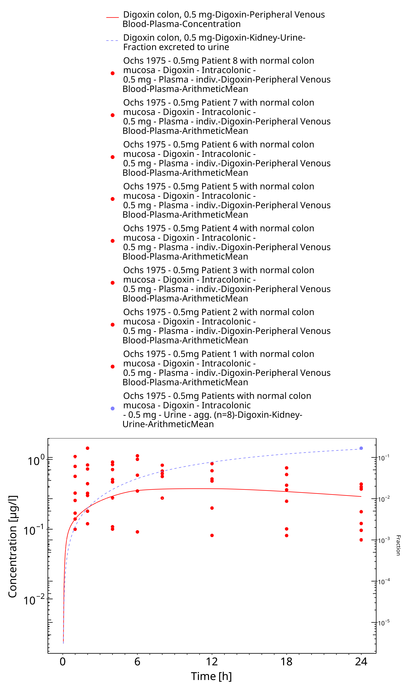
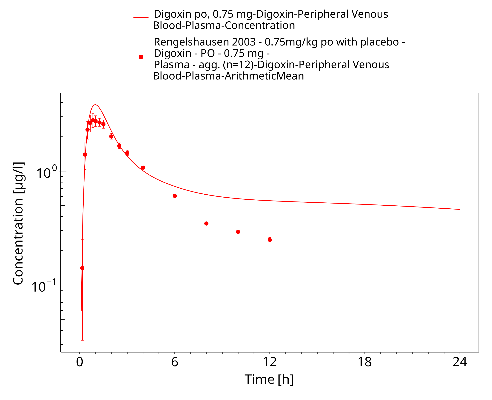
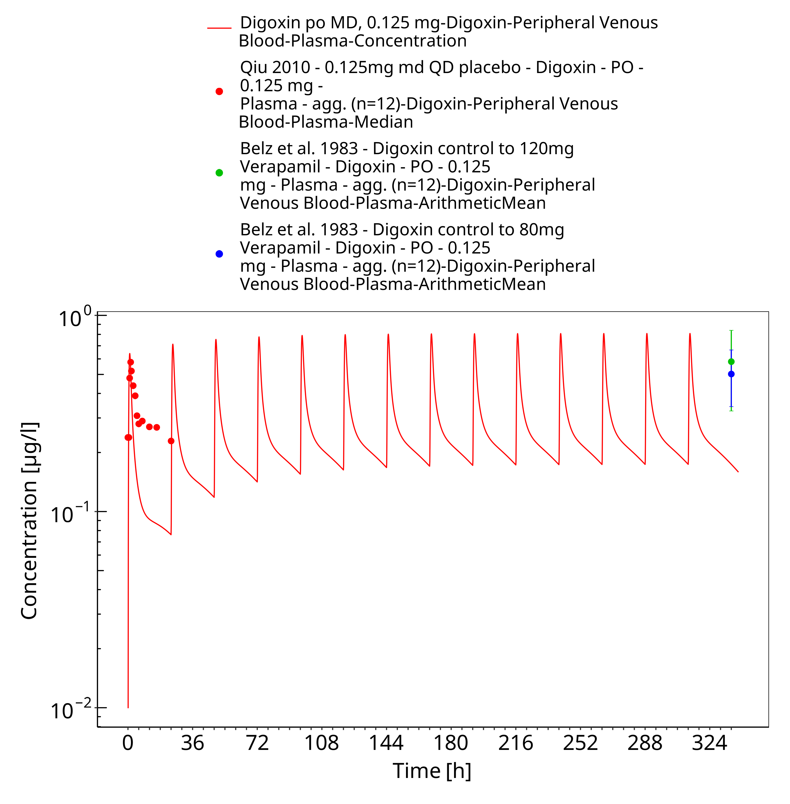
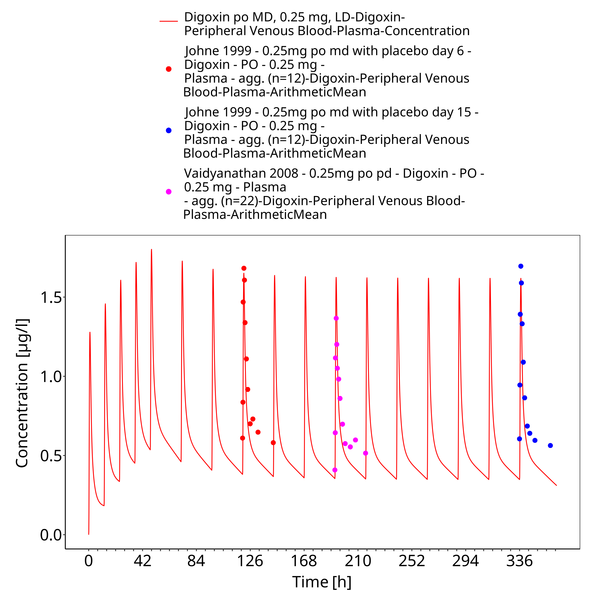

# Building and evaluation of a PBPK model for digoxin in adults

| Version                                         | 2.0-OSP12.1                                                   |
| ----------------------------------------------- | ------------------------------------------------------------ |
| based on *Model Snapshot* and *Evaluation Plan* | https://github.com/Open-Systems-Pharmacology/Digoxin-Model/releases/tag/v2.0 |
| OSP Version                                     | 12.1                                                          |
| Qualification Framework Version                 | 3.4                                                          |

This evaluation report and the corresponding PK-Sim project file are filed at:

https://github.com/Open-Systems-Pharmacology/OSP-PBPK-Model-Library/

# Table of Contents

 * [1 Introduction](#introduction)
 * [2 Methods](#methods)
   * [2.1 Modeling strategy](#modeling-strategy)
   * [2.2 Data](#data)
   * [2.3 Model parameters and assumptions](#model-parameters-and-assumptions)
 * [3 Results and Discussion](#results-and-discussion)
   * [3.1 Digoxin final input parameters](#final-input-parameters)
   * [3.2 Digoxin Diagnostics Plots](#diagnostics-plots)
   * [3.3 Digoxin Concentration-Time profiles](#ct-profiles-model-building)
 * [4 Conclusion](#conclusion)
 * [5 References](#references)

# 1 Introduction

The presented model building and evaluation report evaluates the performance of a PBPK model for digoxin in adults.

Digoxin is a cardiac glycoside used to treat atrial fibrillation, atrial flutter and heart failure.
Digoxin is transported by P-glycoprotein 1 (P-gp), also known as multidrug resistance protein 1 (MDR1) or ATP-binding cassette sub-family B member 1 (ABCB1) or cluster of differentiation 243 (CD243) poly-glycoprotein. P-gp and mainly excreted unchanged via the kidneys with a small fraction eliminated via biliary excretion and only a very low degree of hepatic metabolism  ([Greiner 1999, Ochs 1978 ](#References)).
Many other substrates of P-gp are metabolized by CYP3A4, setting digoxin apart as an
exception and thereby turning it into a model victim drug of P-gp-mediated DDIs.

Digoxin is reported to have a large volume of distribution due to extensive tissue binding and to be mainly excreted unchanged to urine (50 - 70%) while the remainder of a dose is eliminated by hepatic metabolism and biliary excretion ([Ochs 1978, Bauer 2008](#References))]. The final digoxin model applies target-binding, transport by P-gp in various organs including gut, liver and kidney, an unspecific hepatic metabolic clearance and glomerular filtration, and adequately described the pharmacokinetics of digoxin in adults.

The digoxin model is a whole-body PBPK model, allowing for dynamic translation between individuals. The digoxin report demonstrates the level of confidence in the digoxin PBPK model with the OSP suite with regard to reliable predictions of digoxin PK in adults during model-informed drug development.

# 2 Methods

The PBPK model for digoxin in this report is based on the developed and published digoxin PBPK model by Hanke *et al.* 2018. ([Hanke 2018](#References))

## 2.1 Modeling strategy

The general concept of building a PBPK model has previously been described by Kuepfer et al. ([Kuepfer 2016](#References)). Relevant information on anthropometric (height, weight) and physiological parameters (e.g. blood flows, organ volumes, binding protein concentrations, hematocrit, cardiac output) in adults was gathered from the literature and has been previously published ([Schlender 2016](#References)). The information was incorporated into PK-Sim® and was used as default values for the simulations in adults.

The  applied activity and variability of plasma proteins and active processes that are integrated into PK-Sim® are described in the publicly available PK-Sim® Ontogeny Database Version 7.3 ([PK-Sim Ontogeny Database Version 7.3](#References)) or otherwise referenced for the specific process.

First, a base mean model was built using data from the single dose escalation study to find an appropriate structure describing the PK of digoxin. The mean PK model was developed using a typical European individual. Unknown parameters were identified using the Parameter Identification module provided in PK-Sim®. Structural model selection was mainly guided by visual inspection of the resulting description of data and biological plausibility.

Once the appropriate structural model was identified, additional parameters for different formulations were identified, if available. 

A final PBPK model was established and simulations were compared to the reported data to evaluate model appropriateness and to assess model, by means of diagnostics plots and predicted versus observed concentration-time profiles, of which the results support an adequate prediction of the PK in adults.

During model building, uncertainties in data quality, as well as study differences may cause not being able to adequately describe the PK of all reported clinical studies. 

## 2.2 Data

### 2.2.1 In vitro / physico-chemical data

A literature search was performed to collect available information on physicochemical properties of digoxin. The obtained information from the literature is summarized in the table below, and is used for model building.

| **Parameter**   | **Unit**    | **Digoxin literature** | **Description**                                  |
| :-------------- | ----------- | ----------------------------------- | ------------------------------------------------ |
| MW              | g/mol       | 780.93 ([Drugbank](#References)) | Molecular weight                                 |
| pKa             |             | none | Acid dissociation constant                   |
| Solubility (pH) | mg/L       | 64.8 (7) ([Drugbank](#References)) | Solubility                                       |
| logP            |             | 1.22, 1.62, 1.67  ([Alsenz 2007, Hinderling 1984, Atkinson 1988](#References)) | Partition coefficient between octanol and water  |
| fu              |             | 70.0, 71.0, 77.7 ([Hinderling 1984, Obach 2008, Neuhoff 2013](#References)) | Fraction unbound                                 |
| ATP1A2 KD | µmol/L | 0.0256 ([Katz 2010](#References)) | Dissociation constant |
| ATP1A2 koff | 1/min | n.a. | Dissociation rate constant |
| P-gp KM | µmol/L | 73.0, 177.0 ([Collett 2004, Troutman 2003](#References)) | Michaelis-Menten constant |
| P-gp kcat       | 1/min    | n.a. | P-gp catalytic rate constant |
| CLhep       | mL/min | n.a. | Hepatic plasma clearance |
| GFR fraction       | 1/min    | 1 | Fraction of filtered drug reaching the urine |
| Formulation       |     | solution | Formulation used in predictions |
| Cell permeabilities       |     | PK-Sim | Permeation across cell membranes |
| Partition coefficients       |     | Rodgers & Rowland | Organ-plasma partition coefficients |
| Specific intest. perm.       | dm/min   | n.a. | Normalized to surface area |
| Specific organ perm.       | dm/min   | n.a. | Normalized to surface area |

* ATP1A2: ATPase Na+/K+ transporting subunit alpha 2, CL: clearance, GFR: glomerular filtration rate, intest.: intestinal, n.a.: not available, perm.: permeability, P-gp: Pglycoprotein, PK-Sim: PK-Sim Standard calculation method, R + R: Rodgers and Rowland calculation method

  

### 2.2.2 Clinical data

A literature search was performed to collect available clinical data on digoxin in adults. 

The following publications were found in adults for model building and evaluation:

| Publication                         | Study  description                                           |
| ----------------------------------- | ------------------------------------------------------------ |
| [Becquemont   2001](#References)    | Becquemont, L. et al. Effect  of grapefruit juice on digoxin pharmacokinetics in humans. Clin. Pharmacol.  Ther. 70, 311–6 (2001). |
| [Ding   2004](#References)          | Ding, R. et al. Substantial  pharmacokinetic interaction between digoxin and ritonavir in healthy  volunteers. Clin. Pharmacol. Ther. 76, 73–84 (2004). |
| [Eckermann   2012](#References)     | Eckermann, G., Lahu, G.,  Nassr, N. & Bethke, T.D. Absence of pharmacokinetic interaction between  roflumilast and digoxin in healthy adults. J. Clin. Pharmacol. 52, 251–7  (2012). |
| [Friedrich   2011](#References)     | Friedrich, C. et al.  Evaluation of the pharmacokinetic interaction after multiple oral doses of  linagliptin and digoxin in healthy volunteers. Eur. J. Drug Metab.  Pharmacokinet. 36, 17–24 (2011). |
| [Greiner   1999](#References)       | Greiner, B. et al. The role of  intestinal P-glycoprotein in the interaction of digoxin and rifampin. J.  Clin. Invest. 104, 147–53 (1999). |
| [Gurley   2008b](#References)       | Gurley, B.J., Swain, A.,  Williams, D.K., Barone, G. & Battu, S.K. Gauging the clinical  significance of P-glycoprotein-mediated herb-drug interactions: comparative  effects of St. John’s wort, Echinacea, clarithromycin, and rifampin on  digoxin pharmacokinetics. Mol. Nutr. food Res. 52, 772–9 (2008). |
| [Hayward   1978](#References)       | Hayward, R.P., Greenwood, H.  & Hamer, J. Comparison of digoxin and medigoxin in normal subjects. Br.  J. Clin. Pharmacol. 6, 81–6 (1978). |
| [Jalava   1997 ](#References)       | Jalava, K.M., Partanen, J.  & Neuvonen, P.J. Itraconazole decreases renal clearance of digoxin. Ther.  Drug Monit. 19, 609–13 (1997). |
| [Johne   1999](#References)         | Johne, A. et al.  Pharmacokinetic interaction of digoxin with an herbal extract from St John’s  wort (Hypericum perforatum). Clin. Pharmacol. Ther. 66, 338–45 (1999). |
| [Kirby   2012](#References)         | Kirby B.J., Collier A.C., Kharasch E.D., Whittington D., Thummel K.E., Unadkat J.D. Complex drug interactions of the HIV protease inhibitors 3: effect of simultaneous or staggered dosing of digoxin and ritonavir, nelfinavir, rifampin, or bupropion. Drug Metab Dispos. 2012 Mar;40(3):610-6. |
| [Kirch   1986](#References)         | Kirch, W., Hutt, H.J.,  Dylewicz, P., Gräf, K.J. & Ohnhaus, E.E. Dose-dependence of the  nifedipine-digoxin interaction? Clin. Pharmacol. Ther. 39, 35–9 (1986). |
| [Koup   1975](#References)          | Koup, J.R., Greenblatt, D.J.,  Jusko, W.J., Smith, T.W. & Koch-Weser, J. Pharmacokinetics of digoxin in  normal subjects after intravenous bolus and infusion doses. J. Pharmacokinet.  Biopharm. 3, 181–92 (1975). |
| [Kramer   1979](#References)        | Kramer, W.G. et al.  Pharmacokinetics of digoxin: relationship between response intensity and  predicted compartmental drug levels in man. J. Pharmacokinet. Biopharm. 7,  47–61 (1979). |
| [Lalonde   1985](#References)       | Lalonde, R.L., Deshpande, R.,  Hamilton, P.P., McLean, W.M. & Greenway, D.C. Acceleration of digoxin  clearance by activated charcoal. Clin. Pharmacol. Ther. 37, 367–71 (1985). |
| [Larsen   2007](#References)        | Larsen, U.L. et al. Human  intestinal P-glycoprotein activity estimated by the model substrate digoxin.  Scand. J. Clin. Lab. Invest. 67, 123–34 (2007). |
| [Martin   1997](#References)        | Martin, D.E. et al. Lack of  effect of eprosartan on the single dose pharmacokinetics of orally  administered digoxin in healthy male volunteers. Br. J. Clin. Pharmacol. 43,  661–4 (1997). |
| [Ochs   1975](#References)          | Ochs, H., Bodem, G., Schäfer, P.K., Kodrat, G., Dengler, H.J. Absorption of digoxin from the distal parts of the intestine in man. Eur J Clin Pharmacol. 1975 Dec 19;9(2-3):95-7. |
| [Ochs   1978](#References)          | Ochs, H., Greenblatt, D.J.,  Bodem, G. & Harmatz, J.S. Dose-independent pharmacokinetics of digoxin in  humans. Am. Heart J. 96, 507–11 (1978). |
| [Oosterhuis   1991](#References)    | Oosterhuis, B., Jonkman, J.H.,  Andersson, T., Zuiderwijk, P.B. & Jedema, J.N. Minor effect of multiple  dose omeprazole on the pharmacokinetics of digoxin after a single oral dose.  Br. J. Clin. Pharmacol. 32, 569–72 (1991). |
| [Qiu   2010](#References)           | Qiu, R. et al. Lack of a  pharmacokinetic interaction between dimebon (latrepirdine) and digoxin in  healthy subjects. Am. Soc. Clin. Pharmacol. Ther. Meet. Atlanta, GA, USA  (2010). |
| [Ragueneau   1999](#References)     | Ragueneau, I. et al.  Pharmacokinetic and pharmacodynamic drug interactions between digoxin and  macrogol 4000, a laxative polymer, in healthy volunteers. Br. J. Clin.  Pharmacol. 48, 453–6 (1999). |
| [Rengelshausen   2003](#References) | Rengelshausen, J. et al.  Contribution of increased oral bioavailability and reduced nonglomerular  renal clearance of digoxin to the digoxin-clarithromycin interaction. Br. J.  Clin. Pharmacol. 56, 32–8 (2003). |
| [Rodin   1988](#References)         | Rodin, S.M., Johnson, B.F.,  Wilson, J., Ritchie, P. & Johnson, J. Comparative effects of verapamil  and isradipine on steady-state digoxin kinetics. Clin. Pharmacol. Ther. 43,  668–72 (1988). |
| [Steiness   1982](#References)      | Steiness, E., Waldorff, S.  & Hansen, P.B. Renal digoxin clearance: dependence on plasma digoxin and  diuresis. Eur. J. Clin. Pharmacol. 23, 151–4 (1982). |
| [Tayrouz   2003](#References)       | Tayrouz, Y. et al.  Pharmacokinetic and pharmaceutic interaction between digoxin and Cremophor  RH40. Clin. Pharmacol. Ther. 73, 397–405 (2003). |
| [Tsutsumi   2002](#References)      | Tsutsumi, K. et al. The effect  of erythromycin and clarithromycin on the pharmacokinetics of intravenous  digoxin in healthy volunteers. J. Clin. Pharmacol. 42, 1159–64 (2002). |
| [Vaidyanathan   2008](#References)  | Vaidyanathan, S. et al.  Pharmacokinetics of the oral direct renin inhibitor aliskiren in combination  with digoxin, atorvastatin, and ketoconazole in healthy subjects: the role of  P-glycoprotein in the disposition of aliskiren. J. Clin. Pharmacol. 48, 1323–38  (2008). |
| [Verstuyft   2003](#References)     | Verstuyft, C. et al.  Dipyridamole enhances digoxin bioavailability via P-glycoprotein inhibition.  Clin. Pharmacol. Ther. 73, 51–60 (2003). |
| [Wagner   1981](#References)        | Wagner, J.G., Popat, K.D.,  Das, S.K., Sakmar, E. & Movahhed, H. Evidence of nonlinearity in digoxin  pharmacokinetics. J. Pharmacokinet. Biopharm. 9, 147–66 (1981). |
| [Westphal   2000](#References)      | Westphal, K. et al. Oral  bioavailability of digoxin is enhanced by talinolol: evidence for involvement  of intestinal P-glycoprotein. Clin. Pharmacol. Ther. 68, 6–12 (2000). |

## 2.3 Model parameters and assumptions

### 2.3.1 Absorption

For oral administration of digoxin, the following parameters, amongst others, play a role with regards to the absorption kinetics of a compound, which can be estimated with PBPK: solubility, lipophilicity and intestinal permeability. To accurately predict the digoxin plasma concentrations following intravenous and oral administration, the relative expression of P-gp in the intestinal mucosa was increased (3.57-fold) compared to the PK-Sim database RT-PCR expression profile (see table below). This factor has been identified in an optimization that included digoxin plasma concentrations and fraction excreted to urine data following intravenous and oral administration plus digoxin excreted to duodenum measurements after intravenous administration [Caldwell 1976](#References). The optimized P-gp expression profile shows highest expression in small intestinal mucosa (1.41 µmol/L), followed by kidney (1.00 µmol/L), large intestinal mucosa (0.56 µmol/L), liver (0.27 µmol/L) and tissues of lower expression. Implementation of transport by OATP (4C1) did not improve the model performance and was not used in the final model. 

| **Protein** | **Mean reference concentration [µmol protein/L in the tissue of highest expression]** | **Geometric standard deviation of reference concentration** | **Relative expression in the different organs (PK-Sim expression database profile)** | Half-life liver [h] | Half-life intestine [h] |
| :-------------- | ----------- | ----------------------------------- | ------------------------------------------------ | --------------- | --------------- |
| P-gp (efflux) | 1.41 optimized | 1.60 ([Prasad 2014](#References)) | RT-PCR, with the relative expression in intestinal mucosa increased by a factor of 3.57 (optimized)([Nishimura 2005](#References)) | 36 | 23 |

### 2.3.2 Distribution

Digoxin is reported to have a large volume of distribution due to extensive tissue binding and to be mainly excreted unchanged to urine (50 - 70%) while the remainder of a dose is eliminated by hepatic metabolism and biliary excretion ([Ochs 1978, Bauer 2008](#References)). Implementation of target-binding to the ATPase Na+/K+ transporting subunit alpha 2 (ATP1A2) was crucial, to mechanistically describe the large volume of distribution and the long plasma half-life of digoxin. 

It has reported that the fraction unbound of digoxin ranges from 70 to 77.9% ([Hinderling 1984, Obach 2008, Neuhoff 2013](#References)).  

After testing the available organ-plasma partition coefficient and cell permeability calculation methods built in PK-Sim, observed clinical data was best described by choosing the partition coefficient calculation method by Rodgers and Rowland, and PK-Sim standard cell permeability calculation method. Specific organ permeability normalized to surface area was automatically calculated by PK-Sim.

### 2.3.3 Metabolism and Elimination

The final digoxin model applies target-binding to the ATP1A2, transport by P-gp in various organs including gut, liver and kidney, an unspecific hepatic metabolic clearance and glomerular filtration.

# 3 Results and Discussion

The PBPK model for digoxin was developed with clinical pharmacokinetic data covering intravenous as well as oral administration with a dose range of 0.125 to 1.5 mg including single dose and multiple dose clinical data, for different types of tablet formulations.

During the model-fitting, the following parameters were estimated (all other parameters were fixed to reported values):

* Lipophilicity
* ATP1A2 Dissociation constant (Kd)
* P-gp catalytic rate constant (Kcat)
* Hepatic Clearance (CLhep)
* Specific intestinal permeability (transcellular)
* Specific organ permeability 

The fit resulted in an adequate description of the clinical data. Additional implementation of transport by OATP (4C1) did not improve the model performance and was not used in the final model.

## 3.1 Digoxin final input parameters

The compound parameter values of the final digoxin PBPK model are illustrated below.

### Compound: Digoxin

#### Parameters

Name                                             | Value                | Value Origin                                      | Alternative        | Default
------------------------------------------------ | -------------------- | ------------------------------------------------- | ------------------ | -------
Solubility at reference pH                       | 64.8 mg/l            | Internet-In Vitro-Drugbank                        | Aqueous Solubility | True   
Reference pH                                     | 7                    | Internet-In Vitro-Drugbank                        | Aqueous Solubility | True   
Lipophilicity                                    | 1.40017663 Log Units | Parameter Identification-Parameter Identification | fitted             | True   
Fraction unbound (plasma, reference value)       | 0.71                 | Publication-In Vitro-Neuhoff 2013                 | Neuhoff (2013)     | True   
Permeability                                     | 1.0115E-05 dm/min    |                                                   | fitted             | True   
Specific intestinal permeability (transcellular) | 2.7627E-07 dm/min    |                                                   | fitted             | True   
Is small molecule                                | Yes                  |                                                   |                    |        
Molecular weight                                 | 780.93 g/mol         | Internet-In Vitro-Drugbank                        |                    |        
Plasma protein binding partner                   | Albumin              |                                                   |                    |        

#### Calculation methods

Name                    | Value              
----------------------- | -------------------
Partition coefficients  | Rodgers and Rowland
Cellular permeabilities | PK-Sim Standard    

#### Processes

##### Specific Binding: ATP1A2-Katz (2010)

Molecule: ATP1A2

###### Parameters

Name | Value            | Value Origin                  
---- | ---------------- | ------------------------------
koff | 0.00098888 1/min | Publication-In Vitro-Katz 2010
Kd   | 25.6 nmol/l      | Parameter Identification      

##### Systemic Process: Total Hepatic Clearance-Fitted

Species: Human

###### Parameters

Name                          | Value                | Value Origin            
----------------------------- | -------------------- | ------------------------
Fraction unbound (experiment) | 0.71                 |                         
Lipophilicity (experiment)    | 1.40017663 Log Units |                         
Plasma clearance              | 0 ml/min/kg          |                         
Specific clearance            | 0.03758077 1/min     | Parameter Identification

##### Transport Protein: P-gp-Stephens (2001)

Molecule: P-gp

###### Parameters

Name                      | Value           | Value Origin            
------------------------- | --------------- | ------------------------
Transporter concentration | 1 µmol/l        |                         
Vmax                      | 8.67 µmol/l/min |                         
Km                        | 177 µmol/l      |                         
kcat                      | 71.163 1/min    | Parameter Identification

##### Systemic Process: Glomerular Filtration-Steiness (1982)

Species: Human

###### Parameters

Name         | Value | Value Origin               
------------ | -----:| ---------------------------
GFR fraction |     1 | Publication-Steiness (1982)

## 3.2 Digoxin Diagnostics Plots

Below you find the goodness-of-fit visual diagnostic plots for digoxin PBPK model performance (observed versus individually simulated plasma concentration and weighted residuals versus time, including the geometric mean fold error (GMFE)) of all data used for model building.

**Table 3-1: GMFE for Goodness of fit plot for concentration in plasma.**

|Group                  |GMFE |
|:----------------------|:----|
|Digoxin colonic admin. |2.13 |
|Digoxin iv             |1.45 |
|Digoxin po SD          |1.30 |
|Digoxin po, MD         |1.64 |
|All                    |1.46 |

 
 

**Figure 3-1: Goodness of fit plot for concentration in plasma.**

 
 

**Figure 3-2: Goodness of fit plot for concentration in plasma.**

 
 

## 3.3 Digoxin Concentration-Time profiles

Simulated versus observed plasma concentration-time profiles of all data are listed below.

**Figure 3-3: Time Profile Analysis 1**

 
 

**Figure 3-4: Time Profile Analysis**

 
 

**Figure 3-5: Time Profile Analysis**

 
 

**Figure 3-6: Time Profile Analysis 1**

 
 

**Figure 3-7: Time Profile Analysis**

 
 

**Figure 3-8: Time Profile Analysis 1**

 
 

**Figure 3-9: Time Profile Analysis**

 
 

**Figure 3-10: Time Profile Analysis 1**

 
 

**Figure 3-11: Time Profile Analysis**

 
 

**Figure 3-12: Time Profile Analysis 1**

 
 

**Figure 3-13: Time Profile Analysis**

 
 

**Figure 3-14: Time Profile Analysis 1**

 
 

**Figure 3-15: Time Profile Analysis**

 
 

**Figure 3-16: Time Profile Analysis 1**

 
 

**Figure 3-17: Time Profile Analysis**

 
 

**Figure 3-18: Time Profile Analysis 1**

 
 

**Figure 3-19: Time Profile Analysis**

 
 

**Figure 3-20: Time Profile Analysis 1**

 
 

**Figure 3-21: Time Profile Analysis**

 
 

**Figure 3-22: Time Profile Analysis 1**

 
 

**Figure 3-23: Time Profile Analysis**

 
 

**Figure 3-24: Time Profile Analysis 1**

 
 

**Figure 3-25: Time Profile Analysis**

 
 

**Figure 3-26: Time Profile Analysis 1**

 
 

**Figure 3-27: Time Profile Analysis**

 
 

**Figure 3-28: Time Profile Analysis 1**

 
 

**Figure 3-29: Time Profile Analysis**

 
 

**Figure 3-30: Time Profile Analysis 1**

 
 

**Figure 3-31: Time Profile Analysis**

 
 

**Figure 3-32: Time Profile Analysis 1**

 
 

**Figure 3-33: Time Profile Analysis**

 
 

**Figure 3-34: Time Profile Analysis 1**

 
 

**Figure 3-35: Time Profile Analysis**

 
 

**Figure 3-36: Time Profile Analysis 1**

 
 

**Figure 3-37: Time Profile Analysis**

 
 

**Figure 3-38: Time Profile Analysis 1**

 
 

**Figure 3-39: Time Profile Analysis**

 
 

**Figure 3-40: Time Profile Analysis 1**

 
 

**Figure 3-41: Time Profile Analysis**

 
 

**Figure 3-42: Time Profile Analysis 1**

 
 

**Figure 3-43: Time Profile Analysis**

 
 

**Figure 3-44: Time Profile Analysis 1**

 
 

**Figure 3-45: Time Profile Analysis**

 
 

**Figure 3-46: Time Profile Analysis 1**

 
 

# 4 Conclusion

The final digoxin PBPK model applies elimination mainly via GFR and P-gp and adequately describes the pharmacokinetics of digoxin in adults receiving intravenous, and oral SD and MD of digoxin ranging from 0.125 to 1.5 mg, for different types of tablet formulations that were described using a single formulation. 

This model could be applied for the investigation of drug-drug interactions (DDI), and translation to special populations such as pediatrics with regard to P-gp based elimination.

# 5 References

**Alsenz 2007** Alsenz, J., Meister, E. & Haenel, E. Development of a partially automated solubility screening (PASS) assay for early drug development. J. Pharm. Sci. 96, 1748–62 (2007).

**Atkinson 1988** Atkinson, H.C. & Begg, E.J. Relationship between human milk lipid-ultrafiltrate and octanolwater partition coefficients. J. Pharm. Sci. 77, 796–8 (1988).

**Bauer 2008** Bauer, L.A. Applied Clinical Pharmacokinetics. (2008).

**Becquemont 2001** Becquemont, L. et al. Effect of grapefruit juice on digoxin pharmacokinetics in humans. Clin. Pharmacol. Ther. 70, 311–6 (2001). 

**Caldwell 1976** Caldwell, J.H. & Cline, C.T. Biliary excretion of digoxin in man. Clin. Pharmacol. Ther. 19, 410–5 (1976).

**Collett 2004** Collett, A., Tanianis-Hughes, J., Hallifax, D. & Warhurst, G. Predicting P-glycoprotein effects on oral absorption: correlation of transport in Caco-2 with drug pharmacokinetics in wildtype and mdr1a(-/-) mice in vivo. Pharm. Res. 21, 819–26 (2004).

**Ding 2004** Ding, R. et al. Substantial pharmacokinetic interaction between digoxin and ritonavir in healthy volunteers. Clin. Pharmacol. Ther. 76, 73–84 (2004). 

**Drugbank.ca** (https://go.drugbank.com/drugs/DB00390)

**Eckermann 2012** Eckermann, G., Lahu, G., Nassr, N. & Bethke, T.D. Absence of pharmacokinetic interaction between roflumilast and digoxin in healthy adults. J. Clin. Pharmacol. 52, 251–7 (2012).

**Friedrich 2011** Friedrich, C. et al. Evaluation of the pharmacokinetic interaction after multiple oral doses of linagliptin and digoxin in healthy volunteers. Eur. J. Drug Metab. Pharmacokinet. 36, 17–24 (2011). 

**Greiner 1999** Greiner, B. et al. The role of intestinal P-glycoprotein in the interaction of digoxin and rifampin. J. Clin. Invest. 104, 147–53 (1999).

**Gurley 2008b** Gurley, B.J., Swain, A., Williams, D.K., Barone, G. & Battu, S.K. Gauging the clinical significance of P-glycoprotein-mediated herb-drug interactions: comparative effects of St. John’s wort, Echinacea, clarithromycin, and rifampin on digoxin pharmacokinetics. Mol. Nutr. food Res. 52, 772–9 (2008). 

**Hanke 2018** Hanke N, Frechen S, Moj D, Britz H, Eissing T, Wendl T, Lehr T. PBPK Models for CYP3A4 and P-gp DDI Prediction: A Modeling Network of Rifampicin, Itraconazole, Clarithromycin, Midazolam, Alfentanil, and Digoxin. CPT Pharmacometrics Syst Pharmacol.. 2018 Oct;7(10):647-659.

**Hayward 1978** Hayward, R.P., Greenwood, H. & Hamer, J. Comparison of digoxin and medigoxin in normal subjects. Br. J. Clin. Pharmacol. 6, 81–6 (1978). 

**Hinderling 1984** Hinderling, P.H. Kinetics of partitioning and binding of digoxin and its analogues in the subcompartments of blood. J. Pharm. Sci. 73, 1042–53 (1984).

**Jalava 1997** Jalava, K.M., Partanen, J. & Neuvonen, P.J. Itraconazole decreases renal clearance of digoxin. Ther. Drug Monit. 19, 609–13 (1997). 

**Johne 1999** Johne, A. et al. Pharmacokinetic interaction of digoxin with an herbal extract from St John’s wort (Hypericum perforatum). Clin. Pharmacol. Ther. 66, 338–45 (1999). 

**Katz 2010** Katz, A. et al. Selectivity of digitalis glycosides for isoforms of human Na,K-ATPase. J. Biol. Chem. 285, 19582–92 (2010).

**Kirch 1986** Kirch, W., Hutt, H.J., Dylewicz, P., Gräf, K.J. & Ohnhaus, E.E. Dose-dependence of the nifedipine-digoxin interaction? Clin. Pharmacol. Ther. 39, 35–9 (1986). 

**Koup 1975** Koup, J.R., Greenblatt, D.J., Jusko, W.J., Smith, T.W. & Koch-Weser, J. Pharmacokinetics of digoxin in normal subjects after intravenous bolus and infusion doses. J. Pharmacokinet. Biopharm. 3, 181–92 (1975). 

**Kramer 1979** Kramer, W.G. et al. Pharmacokinetics of digoxin: relationship between response intensity and predicted compartmental drug levels in man. J. Pharmacokinet. Biopharm. 7, 47–61 (1979). 

**Kuepfer 2016** Kuepfer L, Niederalt C, Wendl T, Schlender JF, Willmann S, Lippert J, Block M, Eissing T, Teutonico D. Applied Concepts in PBPK Modeling: How to Build a PBPK/PD Model.CPT Pharmacometrics Syst Pharmacol. 2016 Oct;5(10):516-531. doi: 10.1002/psp4.12134. Epub 2016 Oct 19.

**Lalonde 1985** Lalonde, R.L., Deshpande, R., Hamilton, P.P., McLean, W.M. & Greenway, D.C. Acceleration of digoxin clearance by activated charcoal. Clin. Pharmacol. Ther. 37, 367–71 (1985). 

**Larsen 2007** Larsen, U.L. et al. Human intestinal P-glycoprotein activity estimated by the model substrate digoxin. Scand. J. Clin. Lab. Invest. 67, 123–34 (2007).

**Martin 1997** Martin, D.E. et al. Lack of effect of eprosartan on the single dose pharmacokinetics of orally administered digoxin in healthy male volunteers. Br. J. Clin. Pharmacol. 43, 661–4 (1997). 

**Neuhoff 2013** Neuhoff, S. et al. Application of permeability-limited physiologically-based pharmacokinetic models: part I-digoxin pharmacokinetics incorporating P-glycoprotein-mediated efflux. J. Pharm. Sci. 102, 3145–60 (2013).

**Nishimura 2005** Nishimura, M. & Naito, S. Tissue-specific mRNA expression profiles of human ATP-binding cassette and solute carrier transporter superfamilies. Drug Metab. Pharmacokinet. 20, 452–77 (2005).

**Obach 2008** Obach, R.S., Lombardo, F. & Waters, N.J. Trend analysis of a database of intravenous pharmacokinetic parameters in humans for 670 drug compounds. Drug Metab. Dispos. 36, 1385–405 (2008).

**Ochs 1975** Ochs, H., Bodem, G., Schäfer, P.K., Kodrat, G., Dengler, H.J. Absorption of digoxin from the distal parts of the intestine in man. Eur J Clin Pharmacol. 1975 Dec 19;9(2-3):95-7.

**Ochs 1978** Ochs, H.R., Greenblatt, D.J., Bodem, G. & Harmatz, J.S. Dose-independent pharmacokinetics of digoxin in humans. Am. Heart J. 96, 507–11 (1978). 

**Oosterhuis 1991** Oosterhuis, B., Jonkman, J.H., Andersson, T., Zuiderwijk, P.B. & Jedema, J.N. Minor effect of multiple dose omeprazole on the pharmacokinetics of digoxin after a single oral dose. Br. J. Clin. Pharmacol. 32, 569–72 (1991). 

**PK-Sim Ontogeny Database Version 7.3** (https://github.com/Open-Systems-Pharmacology/OSPSuite.Documentation/blob/38cf71b384cfc25cfa0ce4d2f3addfd32757e13b/PK-Sim%20Ontogeny%20Database%20Version%207.3.pdf)

**Prasad 2014** Prasad, B. et al. Interindividual variability in hepatic organic anion-transporting polypeptides and P-glycoprotein (ABCB1) protein expression: quantification by liquid chromatography tandem mass spectroscopy and influence of genotype, age, and sex. Drug Metab. Dispos. 42, 78–88 (2014).

**Qiu 2010** Qiu, R. et al. Lack of a pharmacokinetic interaction between dimebon (latrepirdine) and digoxin in healthy subjects. Am. Soc. Clin. Pharmacol. Ther. Meet. Atlanta, GA, USA (2010). 

**Ragueneau 1999** Ragueneau, I. et al. Pharmacokinetic and pharmacodynamic drug interactions between digoxin and macrogol 4000, a laxative polymer, in healthy volunteers. Br. J. Clin. Pharmacol. 48, 453–6 (1999). 

**Rengelshausen 2003** Rengelshausen, J. et al. Contribution of increased oral bioavailability and reduced nonglomerular renal clearance of digoxin to the digoxin-clarithromycin interaction. Br. J. Clin. Pharmacol. 56, 32–8 (2003).

**Rodin 1988** Rodin, S.M., Johnson, B.F., Wilson, J., Ritchie, P. & Johnson, J. Comparative effects of verapamil and isradipine on steady-state digoxin kinetics. Clin. Pharmacol. Ther. 43, 668–72 (1988). 

**Schlender 2016** Schlender JF, Meyer M, Thelen K, Krauss M, Willmann S, Eissing T, Jaehde U. Development of a Whole-Body Physiologically Based Pharmacokinetic Approach to Assess the Pharmacokinetics of Drugs in Elderly Individuals. Clin Pharmacokinet. 2016 Dec;55(12):1573-1589.

**Steiness 1982** Steiness, E., Waldorff, S. & Hansen, P.B. Renal digoxin clearance: dependence on plasma digoxin and diuresis. Eur. J. Clin. Pharmacol. 23, 151–4 (1982). 

**Stephens 2001** Stephens R.H., O'Neill C.A., Warhurst A., Carlson G.L., Rowland M-, Warhurst G. Kinetic profiling of P-glycoprotein-mediated drug efflux in rat and human intestinal epithelia. J. Pharmacol Exp Ther. 2001 Feb;296(2):584-91.

**Tayrouz 2003** Tayrouz, Y. et al. Pharmacokinetic and pharmaceutic interaction between digoxin and Cremophor RH40. Clin. Pharmacol. Ther. 73, 397–405 (2003). 

**Troutman 2003** Troutman, M.D. & Thakker, D.R. Efflux ratio cannot assess P-glycoprotein-mediated attenuation of absorptive transport: asymmetric effect of P-glycoprotein on absorptive and secretory transport across Caco-2 cell monolayers. Pharm. Res. 20, 1200–9 (2003).

**Tsutsumi 2002** Tsutsumi, K. et al. The effect of erythromycin and clarithromycin on the pharmacokinetics of intravenous digoxin in healthy volunteers. J. Clin. Pharmacol. 42, 1159–64 (2002). 

**Vaidyanathan 2008** Vaidyanathan, S. et al. Pharmacokinetics of the oral direct renin inhibitor aliskiren in combination with digoxin, atorvastatin, and ketoconazole in healthy subjects: the role of P-glycoprotein in the disposition of aliskiren. J. Clin. Pharmacol. 48, 1323–38 (2008). 

**Verstuyft 2003** Verstuyft, C. et al. Dipyridamole enhances digoxin bioavailability via P-glycoprotein inhibition. Clin. Pharmacol. Ther. 73, 51–60 (2003). 

**Wagner 1981** Wagner, J.G., Popat, K.D., Das, S.K., Sakmar, E. & Movahhed, H. Evidence of nonlinearity in digoxin pharmacokinetics. J. Pharmacokinet. Biopharm. 9, 147–66 (1981). 

**Westphal 2000** Westphal, K. et al. Oral bioavailability of digoxin is enhanced by talinolol: evidence for involvement of intestinal P-glycoprotein. Clin. Pharmacol. Ther. 68, 6–12 (2000).

