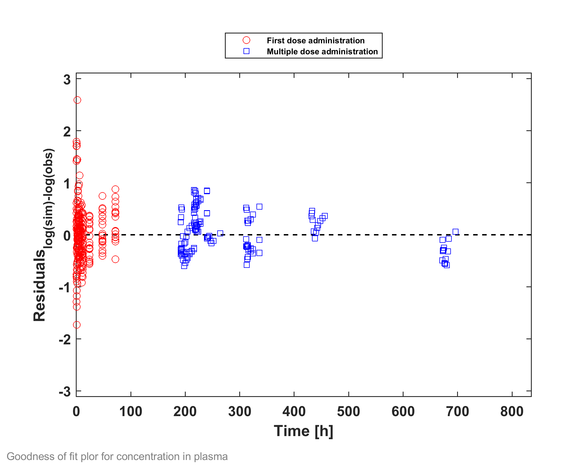
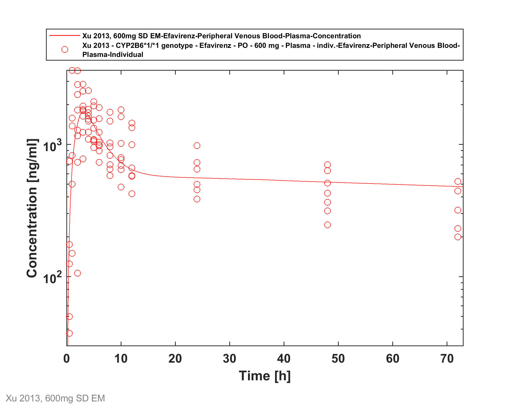
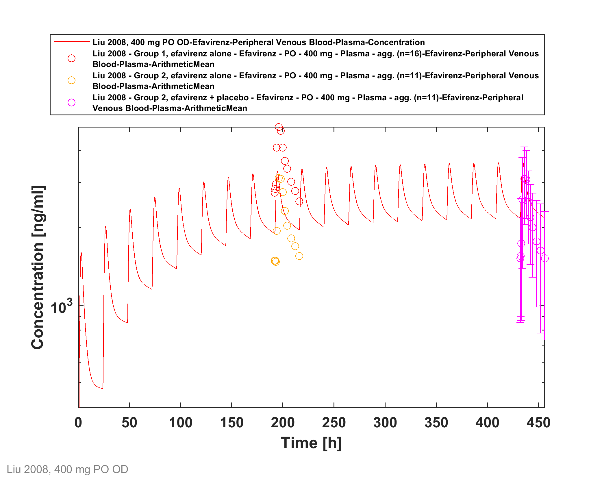
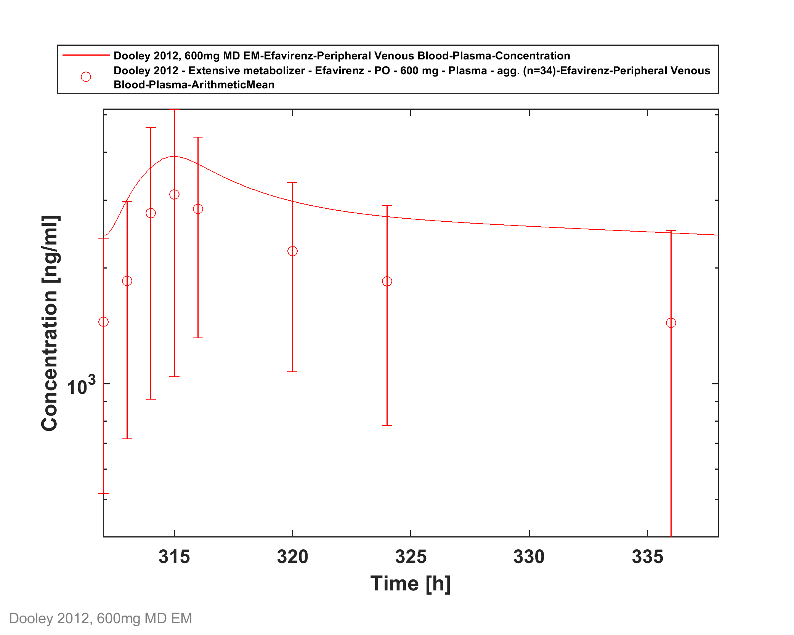
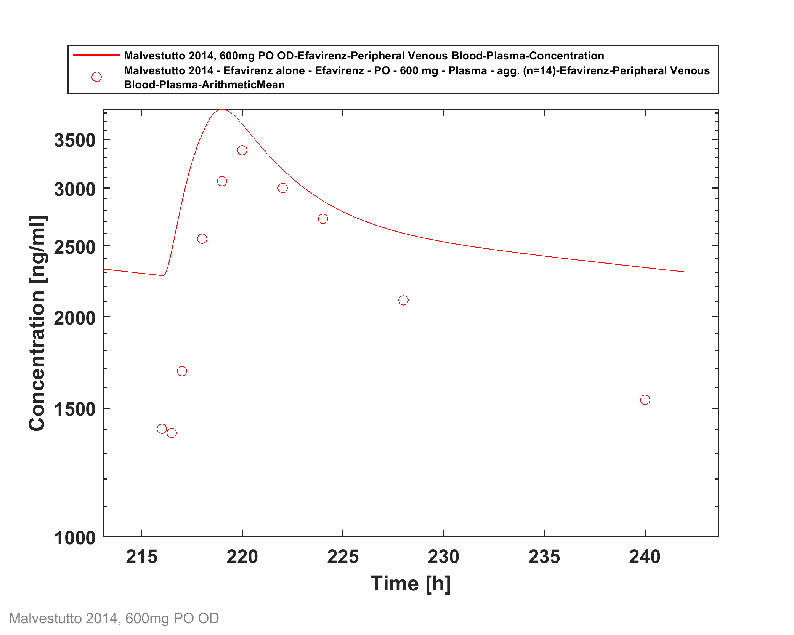
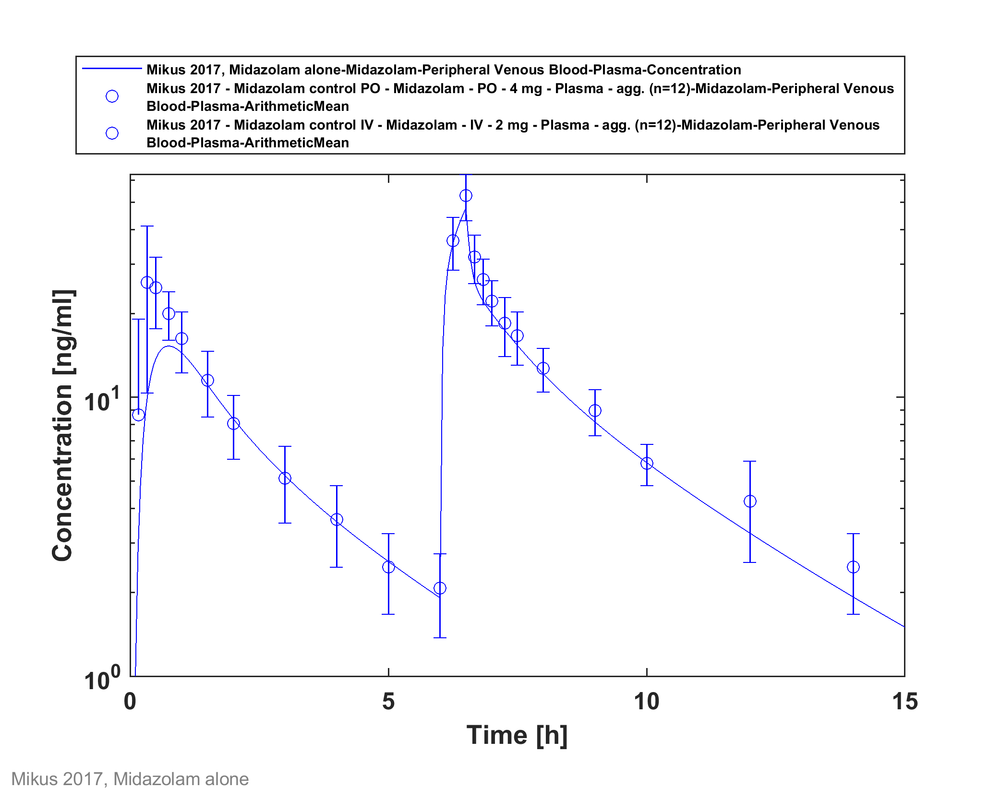
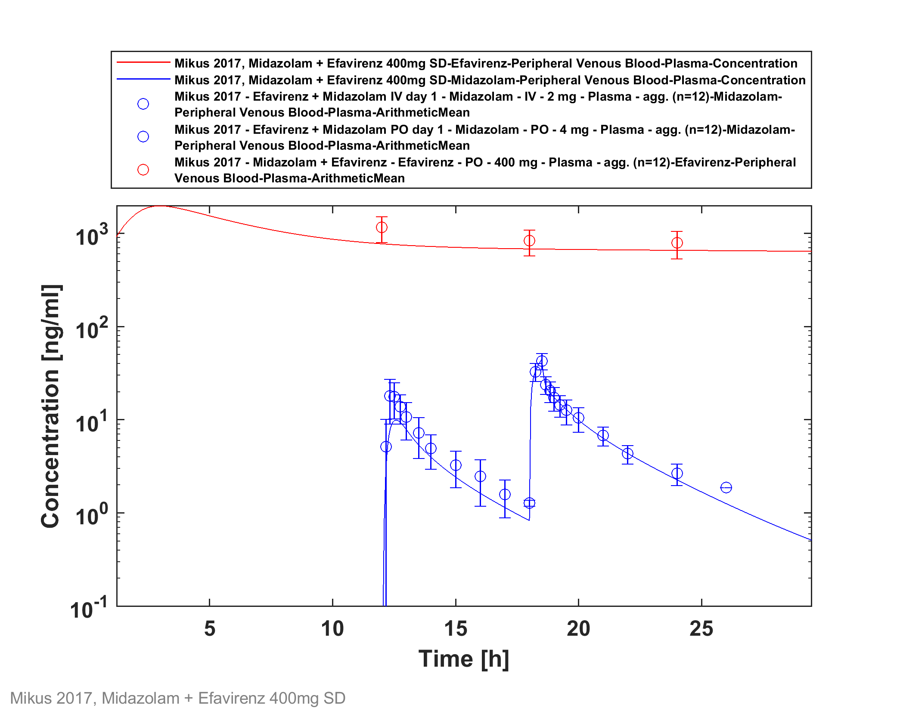
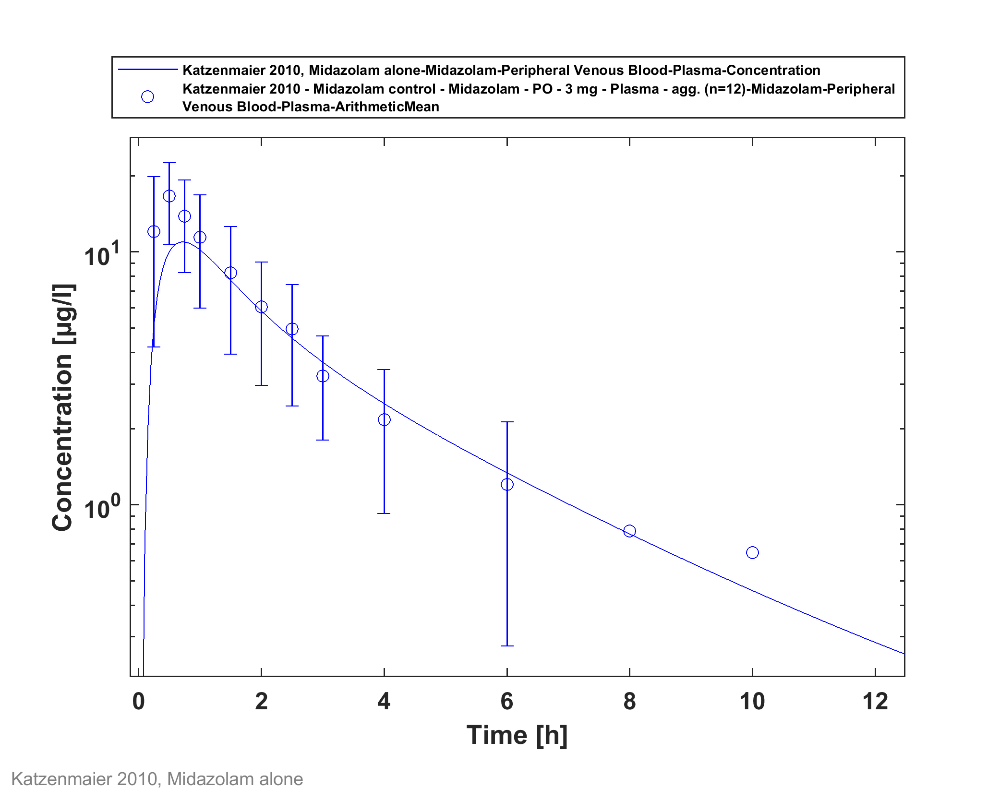
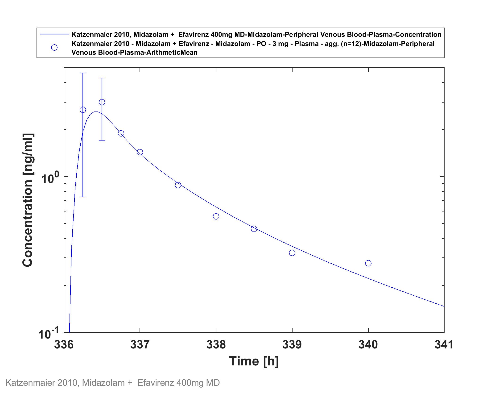

# Building and evaluation of a PBPK model for efavirenz in healthy adults

| Version     | 1.0-OSP9.1            |
| ----------- | --------------------- |
| Based on Model Snapshot and Evaluation Plan | https://github.com/Open-Systems-Pharmacology/Efavirenz-Model/releases/tag/v1.0 |
| OSP Version | 9.1                   |
| Qualification Framework Version | 2.2                   |

This evaluation report and the corresponding PK-Sim project file are stored at:

https://github.com/Open-Systems-Pharmacology/OSP-PBPK-Model-Library/
# Table of Contents
  * [1 Introduction](#1-introduction)
  * [2 Methods](#2-methods)
    * [2.1 Modeling Strategy](#21-modeling-strategy)
    * [2.2 Data](#22-data)
    * [2.3 Model Parameters and Assumptions](#23-model-parameters-and-assumptions)
  * [3 Results and Discussion](#3-results-and-discussion)
    * [3.1 Final input parameters](#31-final-input-parameters)
    * [3.2 Diagnostics Plots](#32-diagnostics-plots)
    * [3.3: Concentration-Time Profiles](#33-concentration-time-profiles)
      * [3.3.1 Model Building](#331-model-building)
      * [3.3.2 Fitted interaction with Midazolam](#332-fitted-interaction-with-midazolam)
  * [4 Conclusion](#4-conclusion)
  * [5 References](#5-references)
# 1 Introduction
Efavirenz is a non-nucleoside reverse transcriptase inhibitor (NNRTI) and is an antiretroviral drug to treat HIV.

Its major metabolizing enzyme is CYP2B6, but CYP3A4, CYP3A5, CYP1A2 and CYP2A6 also play a role ([Ward 2003](#5-References), [Ogburn 2010](#5-References)). CYP2B6 polymorphism is a major determinant of clinical efavirenz disposition and dose adjustment. Efavirenz activates the pregnane X receptor (PXR) and induces its target gene expression. As a consequence, some cytochrome P450 genes are upregulated, and, e.g. higher CYP3A4  ([Shou 2008](#5-References)) and CYP2B6 ([Ke 2016](#5-References)) activity levels can be measured.

It has a long half-life ranging from 52 to 76 hours following single oral doses and 40 to 55 hours following long term administration as a result of auto-induction of efavirenz metabolism. The long plasma half-life allows for once daily administration with long term administration of a single 600 mg daily dose ([Smith 2001](#5-References)). 

The presented efavirenz model was established using clinical PK data of 7 publications covering a dose range from 200 to 600 mg after single and multiple oral administration.  

The herein presented model building and evaluation report evaluates the performance of the PBPK model for efavirenz in (healthy) adults. 

The established efavirenz PBPK model is verified for the use as a perpetrator drug in drug-drug interaction simulations.

# 2 Methods

## 2.1 Modeling Strategy
The general concept of building a PBPK model has previously been described by e.g. Kuepfer et al. ([Kuepfer 2016](#5-References)). The relevant anthropometric (height, weight) and physiological information (e.g. blood flows, organ volumes, binding protein concentrations, hematocrit, cardiac output) in adults was gathered from the literature and has been previously published ([Willmann 2007](#5-References)). This information was incorporated into PK-Sim® and was used as default values for the simulations in adults.

Variability of plasma proteins and CYP enzymes are integrated into PK-Sim® and described in the publicly available PK-Sim® Ontogeny Database Version 7.3 ([PK-Sim Ontogeny Database Version 7.3](#5-References)) or otherwise referenced for the specific process.

First, a base mean model was built using clinical data including single and multiple dose studies with oral applications of efavirenz (Sustiva) to find an appropriate structure to describe the pharmacokinetics in plasma. The mean PBPK model was developed using a typical European individual adjusted to the demography of the respective study population. The relative tissue-specific expressions of enzymes predominantly being involved in the metabolism of efavirenz were derived from RT-PCR data from [Nishimura 2003](#5-References) and are implemented in the model as described previously ([Meyer 2012](#5-References)).

Unknown parameters (see below) were identified using the Parameter Identification module provided in PK-Sim®. Structural model selection was mainly guided by visual inspection of the resulting description of data and biological plausibility.

CYP3A4 plays only a minor role in efavirenz metabolism, and, therefore, auto-induction of CYP3A4 plays a minor role for efavirenz pharmacokinetics. Hence, to parameterize CYP3A4 induction, midazolam was used as victim substance and Emax and EC50 were identified by adjusted by . 

Details about input data (physicochemical, *in vitro* and clinical) can be found in  [Section 2.2](#22-Data).

Details about the structural model and its parameters can be found in [Section 2.3](#23-Model-Parameters-and-Assumptions).

## 2.2 Data
### 2.2.1 In vitro / physico-chemical Data

A literature search was performed to collect available information on physiochemical properties of efavirenz. The obtained information from literature is summarized in the table below. 

| **Parameter**   | **Unit** | **Value**       | Source                                                       | **Description**                                 |
| :-------------- | -------- | --------------- | ------------------------------------------------------------ | ----------------------------------------------- |
| MW              | g/mol    | 315.675         | https://www.drugbank.ca/                                     | Molecular weight                                |
| pKa  | 10.1     | (base)          | [Rabel 1996](#5-References)                                | Acid dissociation constant                      |
| Solubility (pH) | mg/L     | 11.5 (6.4) | [Cristofoletti 2013](#5-References)        | Water solubility                               |
| logP            |          | 2.07, 4.6       | [Almond 2005](#5-References), https://www.drugbank.ca/     | Partition coefficient between octanol and water |
| logD            |          | 5.1       | [Janneh 2009](#5-References) | Partition coefficient between octanol and buffer solution |
| fu              |         | 0.006 [0.004 - 0.015] | [Almond 2005](#5-References) | Fraction unbound in plasma                      |
| Emax (CYP3A4) |          | 7.27, 3.15 (average 5.21) | [Shou 2008](#5-References) | Maximum induction effect |
| EC50 (CYP3A4) | µmol/l | 12.5, 2.18 (average 7.34) | [Shou 2008](#5-References) | Concentration at half maximum induction |
| Emax (CYP2B6) |          | 5.1       | [Ke 2016](#5-References) | Maximum induction effect |
| EC50 (CYP2B6) | µmol/l | 5.1       | [Ke 2016](#5-References) | Concentration at half maximum induction |

### 2.2.2 Clinical Data

A literature search was performed to collect available clinical data on efavirenz in healthy adults.

#### 2.2.2.1 Model Building

The following studies were used for model building:

| Publication                  | Arm / Treatment / Information used for model building        |
| :--------------------------- | :----------------------------------------------------------- |
| [Mouly 2002](#5-References)  | Healthy subjects receiving a single oral dose of 200 and 400 mg |
| [Ogburn 2013](#5-References) | Healthy subjects receiving a single oral dose of 600 mg      |
| [Xu 2013](#5-References)     | Healthy subjects with different CYP2B6 genotypes receiving a single oral dose of 600 mg |
| [Dooley 2012](#5-References) | Healthy subjects with different CYP2B6 genotypes receiving multiple doses of 600 mg |
| [Garg 2013](#5-References)   | Healthy subjects receiving multiple doses of 600 mg          |
| [Huang 2012](#5-References)  | Healthy subjects receiving multiple doses of 600 mg          |

#### 2.2.2.2 Midazolam interaction studies used to parameterize CYP3A4 interaction

The following studies were used for parameterization of CYP3A4 interaction:

| Publication                       | Arm / Treatment / Information used for model building        |
| :-------------------------------- | :----------------------------------------------------------- |
| [Mikus 2017](#5-References)       | Healthy subjects receiving a single oral dose of  400 mg Efavirenz at t=0h, 4 mg midazolam at t=12h and a single intravenous dose of 2 mg midazolam at t=18h. |
| [Katzenmaier 2010](#5-References) | Healthy subjects receiving multiple oral doses of 400 mg efavirenz QD. On day 14, subjects receive a single oral midazolam dose of 3 mg. |

## 2.3 Model Parameters and Assumptions
### 2.3.1 Absorption

Absorption observed in clinical studies can be fully explained by passive absorption.

### 2.3.2 Distribution

After testing the available organ-plasma partition coefficient and cell permeability calculation methods built in PK-Sim, observed clinical data was best described by choosing the partition coefficient calculation by `Schmitt` and cellular permeability calculation by `PK-Sim Standard`. 

### 2.3.3 Metabolism, Elimination and Induction

Efavirenz is metabolized by CYP2B6, CYP3A4, CYP3A5, CYP1A2 and CYP2A6. 

Induction of CYP3A4  ([Shou 2008](#5-References)) and CYP2B6 ([Ke 2016](#5-References)) was taken into account.

### 2.3.4 Automated Parameter Identification

The parameter identification tool in PK-Sim has been used to estimate selected model parameters by adjusting to PK data of the clinical studies that were used in the model building process. For some of the parameters, factors were optimized to maintain their ratio, e.g. a factor for the kcat clearances values for CYP2B6, CYP3A4, CYP3A5, CYP1A2 and CYP2A6 was optimized to keep the ratio constant.

The is result of the final parameter identification is shown in the table below:

| Model Parameter            | Optimized Value | Unit |
| -------------------------- | --------------- | ---- |
| Lipophilicity             | 3.437       |        |
| Specific intestinal permeability | 2.972E-5    | cm/min |
| Solubility at reference pH | 39.922   | mg/l |
| fraction unbound | 5.955E-3 |  |
| kcat CYP2B6 | 1.601 (factor: 0.31833 of literature reference) | 1/min |
| kcat CYP3A4 | 0.051 (factor: 0.31833 of literature reference) | 1/min |
| kcat CYP3A5 | 0.191 (factor: 0.31833 of literature reference) | 1/min |
| kcat CYP1A2 | 0.191 (factor: 0.31833 of literature reference) | 1/min |
| kcat CYP2A6 | 0.318 (factor: 0.31833 of literature reference) | 1/min |
| EC50 CYP3A4 | 0.071 (factor: 0.009711of literature reference) | µmol/l |
| EC50 CYP2B6 | 0.012 (factor: 0.009711of literature reference) | µmol/l |
| Dissolution time (50% dissolved) | 60 | min  |
| Dissolution shape | 0.272 |   |

# 3 Results and Discussion
The PBPK model for efavirenz was developed and evaluated using publicly available clinical pharmacokinetic data from studies listed in [Section 2.2.2](#222-Clinical-Data).

The next sections show:

1. the final model parameters for the building blocks: [Section 3.1](#31-Final-Input-Parameters).
2. the overall goodness of fit: [Section 3.2](#32-Diagnostics-Plots).
3. simulated vs. observed concentration-time profiles for the clinical studies used for model building and for model verification: [Section 3.3](#33-Concentration-Time-Profiles).

## 3.1 Final input parameters
The compound parameter values of the final PBPK model are illustrated below.

### Compound: Efavirenz

#### Parameters

Name                                             | Value                   | Value Origin                                                                                                                 | Alternative | Default
------------------------------------------------ | ----------------------- | ---------------------------------------------------------------------------------------------------------------------------- | ----------- | -------
Solubility at reference pH                       | 39.9217804729 mg/l      | Parameter Identification-Parameter Identification-Value updated from 'Parameter Identification 7 (Mida)' on 2019-10-11 09:02 | Measurement | True   
Reference pH                                     | 0                       |                                                                                                                              | Measurement | True   
Lipophilicity                                    | 3.4369753585 Log Units  | Parameter Identification-Parameter Identification-Value updated from 'Parameter Identification 7 (Mida)' on 2019-10-11 09:02 | Optimized   | True   
Fraction unbound (plasma, reference value)       | 0.0059553692487         | Parameter Identification-Parameter Identification-Value updated from 'Parameter Identification 7 (Mida)' on 2019-10-11 09:02 | Measurement | True   
Specific intestinal permeability (transcellular) | 2.9720579005E-05 cm/min | Parameter Identification-Parameter Identification-Value updated from 'Parameter Identification 7 (Mida)' on 2019-10-11 09:02 | Optimized   | True   
Cl                                               | 1                       |                                                                                                                              |             |        
F                                                | 3                       |                                                                                                                              |             |        
Is small molecule                                | Yes                     |                                                                                                                              |             |        
Molecular weight                                 | 315.675 g/mol           |                                                                                                                              |             |        
Plasma protein binding partner                   | Albumin                 |                                                                                                                              |             |        
#### Calculation methods

Name                    | Value          
----------------------- | ---------------
Partition coefficients  | Schmitt        
Cellular permeabilities | PK-Sim Standard
#### Processes

##### Metabolizing Enzyme: CYP2B6-Ward2003

Molecule: CYP2B6
Metabolite: 8-OH efavirenz
###### Parameters

Name                             | Value                         | Value Origin                                                                                                                
-------------------------------- | ----------------------------- | ----------------------------------------------------------------------------------------------------------------------------
In vitro Vmax/recombinant enzyme | 3.5 pmol/min/pmol rec. enzyme |                                                                                                                             
Km                               | 6.4 µmol/l                    |                                                                                                                             
kcat                             | 1.601451904 1/min             | Parameter Identification-Parameter Identification-Value updated from 'Parameter Identification 7 (Mida)' on 2019-10-11 09:02
##### Metabolizing Enzyme: CYP1A2-Ward2003

Molecule: CYP1A2
Metabolite: 8-OH efavirenz
###### Parameters

Name                             | Value                         | Value Origin                                                                                                                
-------------------------------- | ----------------------------- | ----------------------------------------------------------------------------------------------------------------------------
In vitro Vmax/recombinant enzyme | 0.6 pmol/min/pmol rec. enzyme |                                                                                                                             
Km                               | 8.3 µmol/l                    |                                                                                                                             
kcat                             | 0.1910198104 1/min            | Parameter Identification-Parameter Identification-Value updated from 'Parameter Identification 7 (Mida)' on 2019-10-11 09:02
##### Metabolizing Enzyme: CYP3A4-Ward2003

Molecule: CYP3A4
Metabolite: 8-OH efavirenz
###### Parameters

Name                             | Value                          | Value Origin                                                                                                                
-------------------------------- | ------------------------------ | ----------------------------------------------------------------------------------------------------------------------------
In vitro Vmax/recombinant enzyme | 0.16 pmol/min/pmol rec. enzyme |                                                                                                                             
Km                               | 23.5 µmol/l                    |                                                                                                                             
kcat                             | 0.0509386161 1/min             | Parameter Identification-Parameter Identification-Value updated from 'Parameter Identification 7 (Mida)' on 2019-10-11 09:02
##### Metabolizing Enzyme: CYP3A5-Ward2003

Molecule: CYP3A5
Metabolite: 8-OH efavirenz
###### Parameters

Name                             | Value                         | Value Origin                                                                                                                
-------------------------------- | ----------------------------- | ----------------------------------------------------------------------------------------------------------------------------
In vitro Vmax/recombinant enzyme | 0.6 pmol/min/pmol rec. enzyme |                                                                                                                             
Km                               | 19.1 µmol/l                   |                                                                                                                             
kcat                             | 0.1910198104 1/min            | Parameter Identification-Parameter Identification-Value updated from 'Parameter Identification 7 (Mida)' on 2019-10-11 09:02
##### Metabolizing Enzyme: CYP2A6-Ogburn2010

Molecule: CYP2A6
Metabolite: 8-OH efavirenz
###### Parameters

Name                             | Value                       | Value Origin                                                                                                                
-------------------------------- | --------------------------- | ----------------------------------------------------------------------------------------------------------------------------
In vitro Vmax/recombinant enzyme | 1 pmol/min/pmol rec. enzyme |                                                                                                                             
Km                               | 7.7 µmol/l                  |                                                                                                                             
kcat                             | 0.3183663507 1/min          | Parameter Identification-Parameter Identification-Value updated from 'Parameter Identification 7 (Mida)' on 2019-10-11 09:02
##### Metabolizing Enzyme: CYP2B6-CYP2B6*1/*6

Molecule: CYP2B6
Metabolite: 8-OH efavirenz
###### Parameters

Name                             | Value                              | Value Origin
-------------------------------- | ---------------------------------- | ------------:
In vitro Vmax/recombinant enzyme | 2.268966 pmol/min/pmol rec. enzyme |             
Km                               | 6.4 µmol/l                         |             
##### Metabolizing Enzyme: CYP2B6-CYP2B6*6/*6

Molecule: CYP2B6
Metabolite: 8-OH efavirenz
###### Parameters

Name                             | Value                              | Value Origin
-------------------------------- | ---------------------------------- | ------------:
In vitro Vmax/recombinant enzyme | 1.448276 pmol/min/pmol rec. enzyme |             
Km                               | 6.4 µmol/l                         |             
##### Induction: CYP3A4-Shou2008

Molecule: CYP3A4
###### Parameters

Name | Value              | Value Origin                                                                                                                
---- | ------------------ | ----------------------------------------------------------------------------------------------------------------------------
EC50 | 0.071279975 µmol/l | Parameter Identification-Parameter Identification-Value updated from 'Parameter Identification 7 (Mida)' on 2019-10-11 09:02
Emax | 5.21               | Parameter Identification-Parameter Identification-Value updated from 'Parameter Identification 7 (Mida)' on 2019-10-11 09:02
##### Induction: CYP2B6-Ke2016

Molecule: CYP2B6
###### Parameters

Name | Value               | Value Origin                                                                                                                
---- | ------------------- | ----------------------------------------------------------------------------------------------------------------------------
EC50 | 0.0116534019 µmol/l | Parameter Identification-Parameter Identification-Value updated from 'Parameter Identification 7 (Mida)' on 2019-10-11 09:02
Emax | 5.2                 | Parameter Identification-Parameter Identification-Value updated from 'Parameter Identification 7 (Mida)' on 2019-10-11 09:02
##### Systemic Process: Glomerular Filtration-GFR

Species: Human
###### Parameters

Name         | Value | Value Origin
------------ | -----:| ------------:
GFR fraction |     1 |             

### Formulation: Sustiva

Type: Weibull
#### Parameters

Name                             | Value        | Value Origin                                                                                                                
-------------------------------- | ------------ | ----------------------------------------------------------------------------------------------------------------------------
Dissolution time (50% dissolved) | 60 min       | Parameter Identification-Parameter Identification-Value updated from 'Parameter Identification 7 (Mida)' on 2019-10-11 09:02
Lag time                         | 0 min        |                                                                                                                             
Dissolution shape                | 0.2720936819 | Parameter Identification-Parameter Identification-Value updated from 'Parameter Identification 7 (Mida)' on 2019-10-11 09:02
Use as suspension                | Yes          |                                                                                                                             

## 3.2 Diagnostics Plots
Below you find the goodness-of-fit visual diagnostic plots for the PBPK model performance of all data used presented in [Section 2.2.2](#222-Clinical-Data).

The first plot shows simulated versus observed plasma concentration, the second weighted residuals versus time. 

GMFE = 1.445154 

## 3.3: Concentration-Time Profiles
Simulated versus observed concentration-time profiles of all data listed in [Section 2.2.2](#222-Clinical-Data) are presented below.

### 3.3.1 Model Building

### 3.3.2 Fitted interaction with Midazolam

# 4 Conclusion
The herein presented PBPK model adequately describes the pharmacokinetics of efavirenz after single and multiple oral administration of various doses to healthy adults. 

Apart from drug-drug interaction parameters, all optimized parameters are in a close range to the measured or calculated values. EC50 values for CYP3A4 and CYP2B6 were reduced approximately 100-fold in order to reach a relevant induction.

In conclusion, the presented efavirenz PBPK model is well-suited to be applied in drug-drug-interaction scenarios.

# 5 References
**Almond 2005** Almond LM, Hoggard PG, Edirisinghe D, Khoo SH, Back DJ. Intracellular and plasma pharmacokinetics of efavirenz in HIV-infected individuals. J Antimicrob Chemother. 2005 Oct;56(4):738-44. Epub 2005 Sep 1. PubMed PMID: 16141277.

**Cristofoletti 2013** Cristofoletti R, Nair A, Abrahamsson B, Groot DW, Kopp S, Langguth P, Polli JE, Shah VP, Dressman JB. Biowaiver monographs for immediate release solid oral dosage forms: efavirenz. J Pharm Sci. 2013 Feb;102(2):318-29. doi: 10.1002/jps.23380. Epub 2012 Nov 22. Review. PubMed PMID: 23175470.

**Dooley 2012** Dooley KE, Park JG, Swindells S, Allen R, Haas DW, Cramer Y, Aweeka F, Wiggins I, Gupta A, Lizak P, Qasba S, van Heeswijk R, Flexner C; ACTG 5267 Study Team. Safety, tolerability, and pharmacokinetic interactions of the antituberculous agent TMC207 (bedaquiline) with efavirenz in healthy volunteers: AIDS Clinical Trials Group Study A5267. J Acquir Immune Defic Syndr. 2012 Apr 15;59(5):455-62. doi: 10.1097/QAI.0b013e3182410503. PubMed PMID: 22126739; PubMed Central PMCID: PMC3302922.

**DrugBank DB00625** (https://www.drugbank.ca/drugs/DB00625), accessed 05-15-2020.

**Garg 2013** Garg V, Chandorkar G, Yang Y, Adda N, McNair L, Alves K, Smith F, van Heeswijk RP. The effect of CYP3A inhibitors and inducers on the pharmacokinetics of telaprevir in healthy volunteers. Br J Clin Pharmacol. 2013 Feb;75(2):431-9. doi: 10.1111/j.1365-2125.2012.04345.x. PubMed PMID: 22642697; PubMed Central PMCID: PMC3579258.

**Hanke 2018** Hanke N, Frechen S, Moj D, Britz H, Eissing T, Wendl T, Lehr T. PBPK  Models for CYP3A4 and P-gp DDI Prediction: A Modeling Network of  Rifampicin, Itraconazole, Clarithromycin, Midazolam, Alfentanil, and  Digoxin. CPT Pharmacometrics Syst Pharmacol. 2018 Oct;7(10):647-659. doi: 10.1002/psp4.12343. Epub 2018 Sep 7.

**Huang 2012** Huang L, Parikh S, Rosenthal PJ, Lizak P, Marzan F, Dorsey G, Havlir D, Aweeka FT. Concomitant efavirenz reduces pharmacokinetic exposure to the antimalarial drug artemether-lumefantrine in healthy volunteers. J Acquir Immune Defic Syndr. 2012 Nov 1;61(3):310-6. doi: 10.1097/QAI.0b013e31826ebb5c. PubMed PMID: 22918158; PubMed Central PMCID: PMC3511816.

**Janneh 2009** Janneh O, Chandler B, Hartkoorn R, Kwan WS, Jenkinson C, Evans S, Back DJ, Owen A, Khoo SH. Intracellular accumulation of efavirenz and nevirapine is independent of P-glycoprotein activity in cultured CD4 T cells and primary human lymphocytes. J Antimicrob Chemother. 2009 Nov;64(5):1002-7. doi: 10.1093/jac/dkp335. Epub 2009 Sep 11. PubMed PMID: 19748977.

**Katzenmaier 2010** Katzenmaier S, Markert C, Mikus G. Proposal of a new limited sampling strategy to predict CYP3A activity using a partial AUC of midazolam. Eur J Clin Pharmacol. 2010 Nov;66(11):1137-41. doi: 10.1007/s00228-010-0878-2. Epub 2010 Aug 3. PubMed PMID: 20680253.

**Ke 2016** Ke A, Barter Z, Rowland-Yeo K, Almond L. Towards a Best Practice Approach in PBPK Modeling: Case Example of Developing a Unified Efavirenz Model Accounting for Induction of CYPs 3A4 and 2B6. CPT Pharmacometrics Syst Pharmacol. 2016 Jul;5(7):367-76. doi: 10.1002/psp4.12088. Epub 2016 Jul 20. PubMed PMID: 27435752; PubMed Central PMCID: PMC4961080.

**Kharasch 2012** Kharasch ED, Whittington D, Ensign D, Hoffer C, Bedynek PS, Campbell S, Stubbert K, Crafford A, London A, Kim T. Mechanism of efavirenz influence on methadone pharmacokinetics and pharmacodynamics. Clin Pharmacol Ther. 2012 Apr;91(4):673-84. doi: 10.1038/clpt.2011.276. Epub 2012 Mar 7.

**Kuepfer 2016** Kuepfer L, Niederalt C, Wendl T, Schlender JF, Willmann S, Lippert J, Block M, Eissing T, Teutonico D. Applied Concepts in PBPK Modeling: How to Build a PBPK/PD Model. CPT Pharmacometrics Syst Pharmacol. 2016 Oct;5(10):516-531. doi: 10.1002/psp4.12134. Epub 2016 Oct 19.

**Meyer 2012** Meyer M, Schneckener S, Ludewig B, Kuepfer L, Lippert J. Using expression data for quantification of active processes in physiologically based pharmacokinetic modeling. Drug Metab Dispos. 2012 May;40(5):892-901.

**Mikus 2017** Mikus G, Heinrich T, Bödigheimer J, Röder C, Matthee AK, Weiss J, Burhenne J, Haefeli WE. Semisimultaneous Midazolam Administration to Evaluate the Time Course of CYP3A Activation by a Single Oral Dose of Efavirenz. J Clin Pharmacol. 2017 Jul;57(7):899-905. doi: 10.1002/jcph.879. Epub 2017 Feb 14. PubMed PMID: 28194792.

**Mouly 2002** Mouly S, Lown KS, Kornhauser D, Joseph JL, Fiske WD, Benedek IH, Watkins PB. Hepatic but not intestinal CYP3A4 displays dose-dependent induction by efavirenz in humans. Clin Pharmacol Ther. 2002 Jul;72(1):1-9. PubMed PMID: 12151999.

**Nishimura 2003** Nishimura, M., Yaguti, H., Yoshitsugu, H., Naito, S. & Satoh, T. Tissue distribution of mRNA expression of human cytochrome P450 isoforms assessed by high-sensitivity real-time reverse transcription PCR. J. Pharm. Soc. Japan 123, 369–75 (2003).

**Ogburn 2010** Ogburn ET, Jones DR, Masters AR, Xu C, Guo Y, Desta Z. Efavirenz primary and secondary metabolism in vitro and in vivo: identification of novel metabolic pathways and cytochrome P450 2A6 as the principal catalyst of efavirenz 7-hydroxylation. Drug Metab Dispos. 2010 Jul;38(7):1218-29. doi: 10.1124/dmd.109.031393. Epub 2010 Mar 24. PubMed PMID: 20335270; PubMed Central PMCID: PMC2908985.

**PK-Sim Ontogeny Database Version 7.3** (https://github.com/Open-Systems-Pharmacology/OSPSuite.Documentation/blob/38cf71b384cfc25cfa0ce4d2f3addfd32757e13b/PK-Sim%20Ontogeny%20Database%20Version%207.3.pdf)

**Rabel 1996** Rabel SR, Maurin MB, Rowe SM, Hussain M. Determination of the pKa and pH-solubility behavior of an ionizable cyclic carbamate, (S)-6-chloro-4-(cyclopropylethynyl)-1,4-dihydro-4-
(trifluoromethyl)-2H-3,1-benzoxazin-2-one (DMP 266). Pharm Dev Technol. 1996 Apr;1(1):91-5. PubMed PMID: 9552335.

**Shou 2008** Shou M, Hayashi M, Pan Y, Xu Y, Morrissey K, Xu L, Skiles GL. Modeling, prediction, and in vitro in vivo correlation of CYP3A4 induction. Drug Metab Dispos. 2008 Nov;36(11):2355-70. doi: 0.1124/dmd.108.020602. Epub 2008 Jul 31. PubMed PMID: 18669588.

**Ward 2003** Ward BA, Gorski JC, Jones DR, Hall SD, Flockhart DA, Desta Z. The cytochrome P450 2B6 (CYP2B6) is the main catalyst of efavirenz primary and secondary metabolism: implication for HIV/AIDS therapy and utility of efavirenz as a substrate marker of CYP2B6 catalytic activity. J Pharmacol Exp Ther. 2003 Jul;306(1):287-300. Epub 2003 Apr 3. PubMed PMID: 12676886.

**Willmann 2007** Willmann S, Höhn K, Edginton A, Sevestre M, Solodenko J, Weiss W, Lippert J, Schmitt W. Development of a physiology-based whole-body population model for assessing the influence of individual variability on the pharmacokinetics of drugs. J Pharmacokinet Pharmacodyn. 2007, 34(3): 401-431.

**Xu 2013** Xu C, Quinney SK, Guo Y, Hall SD, Li L, Desta Z. CYP2B6 pharmacogenetics-based in vitro-in vivo extrapolation of efavirenz clearance by physiologically based pharmacokinetic modeling. Drug Metab Dispos. 2013 Dec;41(12):2004-11. doi: 10.1124/dmd.113.051755. Epub 2013 Jul 11. PubMed PMID: 23846872; PubMed Central PMCID: PMC3834132.
