# Building and evaluation of a PBPK model for Ethinylestradiol in adults

| Version                                         | 2.0-OSP12.1                                                   |
| ----------------------------------------------- | ------------------------------------------------------------ |
| based on *Model Snapshot* and *Evaluation Plan* | https://github.com/Open-Systems-Pharmacology/Ethinylestradiol-Model/releases/tag/v2.0 |
| OSP Version                                     | 12.1                                                          |
| Qualification Framework Version                 | 3.4                                                          |

This evaluation report and the corresponding PK-Sim project file are filed at:

https://github.com/Open-Systems-Pharmacology/OSP-PBPK-Model-Library/

# Table of Contents

 * [1 Introduction](#introduction)
 * [2 Methods](#methods)
   * [2.1 Modeling Strategy](#modeling-strategy)
   * [2.2 Data](#data)
   * [2.3 Model Parameters and Assumptions](#model-parameters-and-assumptions)
 * [3 Results and Discussion](#results-and-discussion)
   * [3.1 Final input parameters](#final-input-parameters)
   * [3.2 Diagnostics Plots](#diagnostics-plots)
   * [3.3 Concentration-Time Profiles](#concentration-time-profiles)
     * [3.3.1 Model Building](#model-building)
     * [3.3.2 Model Verification](#model-validation)
 * [4 Conclusion](#conclusion)
 * [5 References](#references)
 * [6 Glossary](#glossary)

# 1 Introduction

The presented PBPK model of ethinylestradiol (EE) has been developed to be used in a PBPK Drug-Drug-Interactions (DDI) network with ethinylestradiol as perpetrator of CYP1A2.

Ethinylestradiol is an estrogen medication which is used widely as a birth control pills in combination with progestins. The following ADME properties characterize ethinylestradiol ([SmPC Namuscla](#5-references), [FDA. QUARTETTE](#5-references)):

**Absorption**: ethinylestradiol is rapidly and completely absorbed from the gut but it undergoes some first pass metabolism in the gut wall (mediated by a.o. CYP3A4 ([Wiesinger 2015](#5-references), [Wang 2004](#5-references))). After oral administration, an initial peak occurs in plasma at 2 to 3 hours, with a secondary peak at about 12 hours after dosing; the second peak is interpreted as evidence for extensive enterohepatic circulation of ethinylestradiol.

**Distribution**: ethinylestradiol is rapidly distributed throughout most body tissues with the largest concentration found in adipose tissue. It distributes into breast milk, with low concentrations. More than 80% of ethinylestradiol in serum is conjugated as sulphate and almost all the conjugated form is bound to albumin.

**Metabolism**: ethinylestradiol is metabolized in the liver. Hydroxylation appears to be the main metabolic pathway. 60% of a dose is excreted in the urine and 40% in the faeces. 

**Excretion**: About 30% is excreted in the urine and bile as the glucuronide or sulphate conjugate. The rate of metabolism of ethinylestradiol is affected by several factors, including enzyme-inducing agents, antibiotics, and cigarette smoking. The elimination half-life of ethinylestradiol ranges from 5 to 16 hours.

After i.v. administration, ethinylestradiol displays approximately linear dose relationship in the dose range 30-100 µg. A wide variability is present in the terminal part of the dose-normalized concentrations.

After p.o. single dose, ethinylestradiol shows linear dose relationship in the dose range 30-3000 µg. Secondary peaks can be observed in individual data, compatible with enterohepatic re-circulation. However, mean data do not display such feature as a result of such peak being averaged out. Therefore, enterohepatic re-circulation was not taken into account in the model.

# 2 Methods

## 2.1 Modeling Strategy

The general workflow for building an adult PBPK model has been described by Kuepfer et al. ([Kuepfer 2016](#5-references)). Relevant information on the anthropometry (height, weight) was gathered from the respective clinical study, if reported. Information on physiological parameters (e.g. blood flows, organ volumes, hematocrit) in adults was gathered from the literature and has been incorporated in PK-Sim® as described previously ([Willmann 2007](#5-references)). The  applied activity and variability of plasma proteins and active processes that are integrated into PK-Sim® are described in the publicly available 'PK-Sim® Ontogeny Database Version 7.3' ([PK-Sim Ontogeny Database Version 7.3](#5-references)).

The following steps were undertaken in model development:

1. Define lipophilicity and distribution model on data after i.v. administration with linear total hepatic clearance fitted to data and renal clearance set to literature value ([Ezuruike 2018](#5-references)).

2. Predict p.o. data after single dose and at steady state 

3. Detail metabolic contribution of different CYPs and UGTs to total hepatic clearance.

Details about input data (physicochemical, *in vitro* and clinical) can be found in [Section 2.2](#22-data).

Details about the structural model and its parameters can be found in [Section 2.3](#23-model-parameters-and-assumptions).

A standard female subject was created based on the European (ICRP,2002) PK-Sim database (age = 30 y, weight = 60 kg, height = 163 cm, BMI = 22,58 kg/m2) and used for simulations, until stated otherwise. Expression of the enzymes CYP3A4, CYP2C9, CYP1A2, CYP2C8, and UGT1A1 from RT PCR database were added.

## 2.2 Data

### 2.2.1 In vitro and physico-chemical data

A literature search was performed to collect available information on physico-chemical properties of ethinylestradiol, see [Table 1](#table-1).

| **Parameter**                   | **Unit**          | **Value**        | Source                            | **Description**                                |
| :------------------------------ | ----------------- | ---------------- | --------------------------------- | ---------------------------------------------- |
| MW+                  | g/mol             | 296.4            | [DrugBank DB00977](#5-references) | Molecular weight                               |
| pKa,acid+ |                   | 10.33            | [DrugBank DB00977](#5-references) | Acidic dissociation constant                   |
| Solubility (pH)+     | mg/mL             | 6.77e-3 (7) | [DrugBank DB00977](#5-references) | Aqueous Solubility                             |
| logD                            |                   | 3.63 - 3.9       | [DrugBank DB00977](#5-references) | Distribution coefficient                       |
| fu+                  | %                 | 3                | [DrugBank DB00977](#5-references) | Fraction unbound in plasma                     |
| CYP1A2 CL+           | µl/min/pmol       | 0.51             | [Ezuruike 2018](#5-references)    | Clearance by CYP1A2                            |
| CYP2C8 CL+           | µl/min/pmol       | 0.13             | [Ezuruike 2018](#5-references)    | Clearance by CYP2C8                            |
| CYP2C9 CL+           | µl/min/pmol       | 0.51             | [Ezuruike 2018](#5-references)    | Clearance by CYP2C9                            |
| CYP3A4 CL+           | µl/min/pmol       | 0.5              | [Ezuruike 2018](#5-references)    | Clearance by CYP3A4                            |
| Km UGT1A1+           | µmol/l            | 19.22            | [Ezuruike 2018](#5-references)    | UGT1A1 saturation constant                     |
| Vmax UGT1A1+         | pmol/min/mg prot. | 408.5            | [Ezuruike 2018](#5-references)    | Maximal metabolization rate by UGT1A1          |
| Renal Elimination+   | l/h               | 2.079            | [Stanczyk 2013](#5-references)    | Renal clearance                                |
| Clint HLM+           | µL/min/mg prot.   | 118.83           | [Ezuruike 2018](#5-references)    | Intrinsic clearance in Human Liver Microsomes |
| Ki CYP1A2                       | µmol/l            | 10.6             | [Karjalainen 2008](#5-references) | CYP1A2 inhibition constant                     |

**Table 1:** Physico-chemical and *in-vitro* metabolization properties of ethinylestradiol extracted from literature. *+: Value used in final model*

### 2.2.2 Clinical data

A literature search was performed to collect available clinical data on ethinylestradiol, see [Table 2](#table-2).

| **Source**           | Route | **Dose [mg]/**  **Schedule \*** | **Pop.**     | **Sex** | **N** | **Form.** |
| -------------------- | ------------------------------- | ------------ | ------- | --------------------------------- | --------------------------------- | --------------------------------- |
| [Back 1981](#5-references)+ | i.v.   | 0.03                            | HV       | F       | 5     | solution            |
| [Back 1981](#5-references)+          | p.o.  | 0.03                            | HV       | F       | 5     | tablet              |
| [Back 1979](#5-references)+          | i.v.  | 0.05                            | HV       | F       | 6     | solution            |
| [Back 1979](#5-references)+          | p.o.  | 0.05                            | HV       | F       | 6     | NA                  |
| [Back 1987](#5-references)                      | p.o.  | 0.05 q.d.                      | HV       | F       | 5     | tablet              |
| [Orme 1991](#5-references)+          | i.v.  | 0.03                            | HV       | F       | 10    | solution            |
| [Orme 1991](#5-references)+          | p.o.  | 0.03                            | HV       | F       | 10    | tablet              |
| [Kuhnz 1996](#5-references)                     | i.v.  | 0.06                            | HV       | F       | 19    | solution            |
| [Goebelsmann 1986](#5-references)+   | p.o.  | 0.03                            | HV       | F       | 24    | solution and tablet |
| [Stanczyk 1983](#5-references)+      | p.o.  | 0.12                            | HV       | F       | 24    | solution and tablet |
| [Zhang 2017](#5-references)+         | p.o.  | 0.03                            | HV       | F       | 12    | tablet              |
| [Martin 2016](#5-references)                    | p.o.  | 0.03 q.d.                       | HV       | F       | 27    | tablet              |
| [Stockis 2014](#5-references)                   | p.o.  | 0.03 q.d.                       | HV       | F       | 24    | tablet              |
| [Sidhu 2006](#5-references)                     | p.o.  | 0.03 q.d.                       | HV       | F       | 16    | tablet              |
| [Kothare 2012](#5-references)+       | p.o.  | 0.03/0.03 q.d.                  | HV       | F       | 20    | tablet              |
| [Timmer 2000](#5-references)+        | p.o.  | 0.03                            | HV       | F       | -     | tablet              |

**Table 2:** Literature sources of clinical concentration data of ethinylestradiol used for model development and validation. *\*: single dose unless otherwise specified;+: Data used for final parameter identification*

## 2.3 Model Parameters and Assumptions

### 2.3.1 Absorption

Intestinal permeability was fitted to po data. Formulation of ethinylestradiol tablet was modeled with Weibull-function and parameters `Dissolution time (50% dissolved)` and `Lag time` fitted to po data.

### 2.3.2 Distribution

Physico-chemical parameters were set to the reported values (see [Section 2.2.1](#221-in-vitro-and-physico-chemical-data)). It was assumed that the major binding partner in plasma is albumin. The value of lipophilicity was estimated by fitting the model to iv and po data.

After testing the available organ-plasma partition coefficient and cell permeability calculation methods available in PK-Sim, observed clinical data were best described by choosing the partition coefficient calculation by `Berezhkovskiy` and cellular permeability calculation by `PK-Sim Standard`.

### 2.3.3 Metabolism and Elimination

Following metabolization processes have been implemented based on [Ezuruike 2018](#5-references):

- Linear CYP1A2 CL
- Linear CYP2C8 CL
- Linear CYP2C9 CL
- Linear CYP3A4 CL
- Saturable UGT1A1
- Unspecific liver metabolization

Renal plasma clearance is modeled with `Plasma clearance` set to 2.079 l/h reported in literature ([Stanczyk 2013](#5-references)). The value was normalized to body weight by dividing by 70 kg.

### 2.3.4 Enzyme Inhibition

Simulations of co-administration of ethinylestradiol with tizanidine (see [CYP1A2 DDI Qualification report](https://github.com/Open-Systems-Pharmacology/OSP-Qualification-Reports/releases)) indicate that the reported competitive inhibition of CYP1A2 by ethinylestradiol ([Karjalainen 2008](#5-references)) is not sufficient to describe the increased concentrations of tizanidine after multiple days administration. Therefore, it was decided to fit a time-dependent inhibition (TDI) function to the CYP1A2 enzyme system. The parameters `Kinact` and `K_kinact_half` were estimated by fitting the model to concentration-time profiles of tizanidine ([Granfors 2005](#5-references)).

### 2.3.5 Automated Parameter Identification

Following parameter values were estimated for the model:

- `Lipophilicity`
- `Specific intestinal permeability`
- `Dissolution time (50% dissolved)` (Weibull formulation)
- `Lag time` (Weibull formulation)
- `Kinact` (CYP1A2 TDI)
- `K_kinact_half` (CYP1A2 TDI)

# 3 Results and Discussion

The next sections show:

1. Final model input parameters for the building blocks: [Section 3.1](#31-final-input-parameters).
2. Overall goodness of fit: [Section 3.2](#32-diagnostics-plots).
3. Simulated vs. observed concentration-time profiles for the clinical studies used for model building and for model verification: [Section 3.3](#33-concentration-time-profiles).

## 3.1 Final input parameters

The parameter values of the final PBPK model are illustrated below.

### Compound: Ethinylestradiol

#### Parameters

Name                                             | Value                  | Value Origin              | Alternative | Default
------------------------------------------------ | ---------------------- | ------------------------- | ----------- | -------
Solubility at reference pH                       | 0.00677 mg/ml          | Database-DrugBank DB00977 | S_aq        | True   
Reference pH                                     | 7                      | Database-DrugBank DB00977 | S_aq        | True   
Lipophilicity                                    | 3.4805414593 Log Units | Parameter Identification  | LogP        | True   
Fraction unbound (plasma, reference value)       | 0.03                   | Database-DrugBank DB00977 | fu_plasma   | True   
Specific intestinal permeability (transcellular) | 0.000168 cm/min        | Parameter Identification  | Fit         | True   
Is small molecule                                | Yes                    |                           |             |        
Molecular weight                                 | 296.4 g/mol            | Database-DrugBank DB00977 |             |        
Plasma protein binding partner                   | Albumin                |                           |             |        

#### Calculation methods

Name                    | Value          
----------------------- | ---------------
Partition coefficients  | Berezhkovskiy  
Cellular permeabilities | PK-Sim Standard

#### Processes

##### Metabolizing Enzyme: CYP1A2-Ezuruike_2018

Molecule: CYP1A2

###### Parameters

Name                           | Value                        | Value Origin             
------------------------------ | ---------------------------- | -------------------------
In vitro CL/recombinant enzyme | 0.51 µl/min/pmol rec. enzyme | Publication-Ezuruike 2018

##### Metabolizing Enzyme: CYP2C8-Ezuruike_2018

Molecule: CYP2C8

###### Parameters

Name                           | Value                        | Value Origin             
------------------------------ | ---------------------------- | -------------------------
In vitro CL/recombinant enzyme | 0.13 µl/min/pmol rec. enzyme | Publication-Ezuruike 2018

##### Metabolizing Enzyme: CYP2C9-Ezuruike_2018

Molecule: CYP2C9

###### Parameters

Name                           | Value                        | Value Origin             
------------------------------ | ---------------------------- | -------------------------
In vitro CL/recombinant enzyme | 0.51 µl/min/pmol rec. enzyme | Publication-Ezuruike 2018

##### Metabolizing Enzyme: CYP3A4-Ezuruike_2018

Molecule: CYP3A4

###### Parameters

Name                           | Value                       | Value Origin             
------------------------------ | --------------------------- | -------------------------
In vitro CL/recombinant enzyme | 0.5 µl/min/pmol rec. enzyme | Publication-Ezuruike 2018

##### Metabolizing Enzyme: UGT1A1-Ezuruike_2018

Molecule: UGT1A1

###### Parameters

Name                                        | Value                          | Value Origin             
------------------------------------------- | ------------------------------ | -------------------------
In vitro Vmax for liver microsomes          | 408.5 pmol/min/mg mic. protein | Publication-Ezuruike 2018
Content of CYP proteins in liver microsomes | 33.6 pmol/mg mic. protein      | Publication-Ezuruike 2018
Km                                          | 19.22 µmol/l                   | Publication-Ezuruike 2018

##### Systemic Process: Renal Clearances-Stanczyk_2013

Species: Human

###### Parameters

Name                          | Value         | Value Origin                        
----------------------------- | ------------- | ------------------------------------
Fraction unbound (experiment) | 0.03          |                                     
Plasma clearance              | 0.0285 l/h/kg | Publication-Stanczyk_2013; 2.079/73=

##### Systemic Process: Total Hepatic Clearance-Ezuruike_2018

Species: Human

###### Parameters

Name                          | Value                  | Value Origin                                                                                                  
----------------------------- | ---------------------- | --------------------------------------------------------------------------------------------------------------
Fraction unbound (experiment) | 0.03                   |                                                                                                               
Lipophilicity (experiment)    | 3.4805414593 Log Units |                                                                                                               
Plasma clearance              | 0 ml/min/kg            |                                                                                                               
Specific clearance            | 1.1002777778 1/min     | Publication-Ezuruike 2018 - Calculated from 118.83 µl/min/mg mic. protein divided by 108 pmol/mg/ mic. protein

##### Inhibition: CYP1A2-Fit

Molecule: CYP1A2

###### Parameters

Name          | Value               | Value Origin            
------------- | ------------------- | ------------------------
kinact        | 200 1/min           | Parameter Identification
K_kinact_half | 0.4833013314 µmol/l | Parameter Identification

### Formulation: Ethinylestradiol tablet

Type: Weibull

#### Parameters

Name                             | Value             | Value Origin            
-------------------------------- | ----------------- | ------------------------
Dissolution time (50% dissolved) | 36.5087007601 min | Parameter Identification
Lag time                         | 6.7747764588 min  | Parameter Identification
Dissolution shape                | 0.92              |                         
Use as suspension                | Yes               |                         

## 3.2 Diagnostics Plots

The following section displays the goodness-of-fit visual diagnostic plots for the PBPK model performance of all data listed in [Section 2.2.2](#222-clinical-data).

The first plot shows observed versus simulated plasma concentration, the second weighted residuals versus time. 

**Table 3-1: GMFE for Ethinylestradiol concentration in plasma**

|Group                                  |GMFE |
|:--------------------------------------|:----|
|iv administration (model building)     |1.45 |
|iv administration (model validation)   |1.27 |
|Oral administration (model building)   |1.46 |
|Oral administration (model validation) |1.26 |
|All                                    |1.41 |

 
 

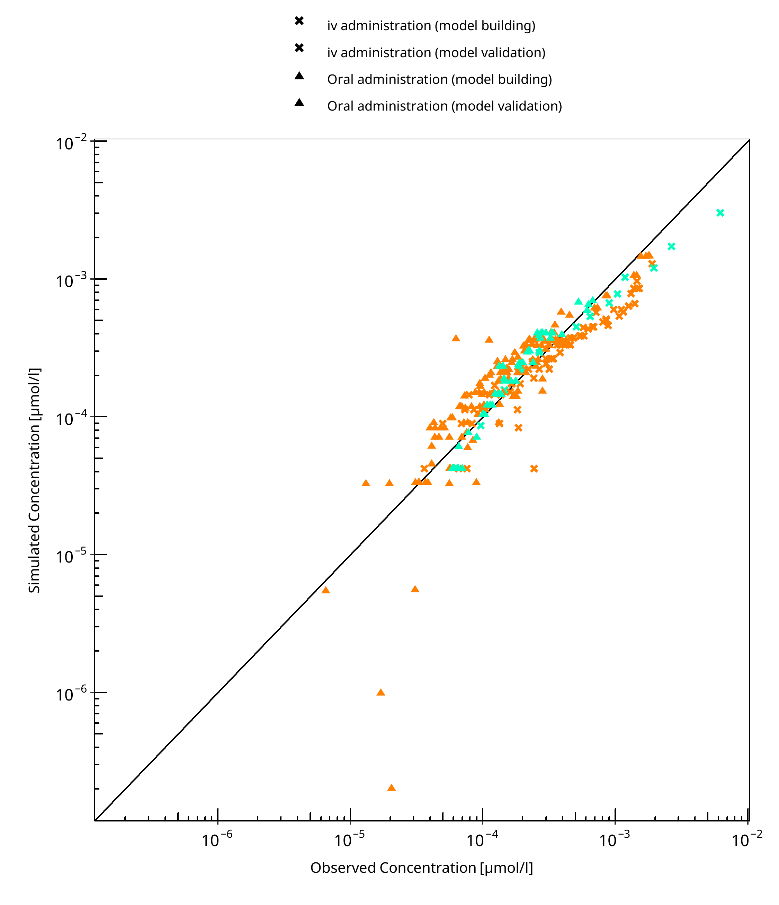

**Figure 3-1: Ethinylestradiol concentration in plasma**

 
 

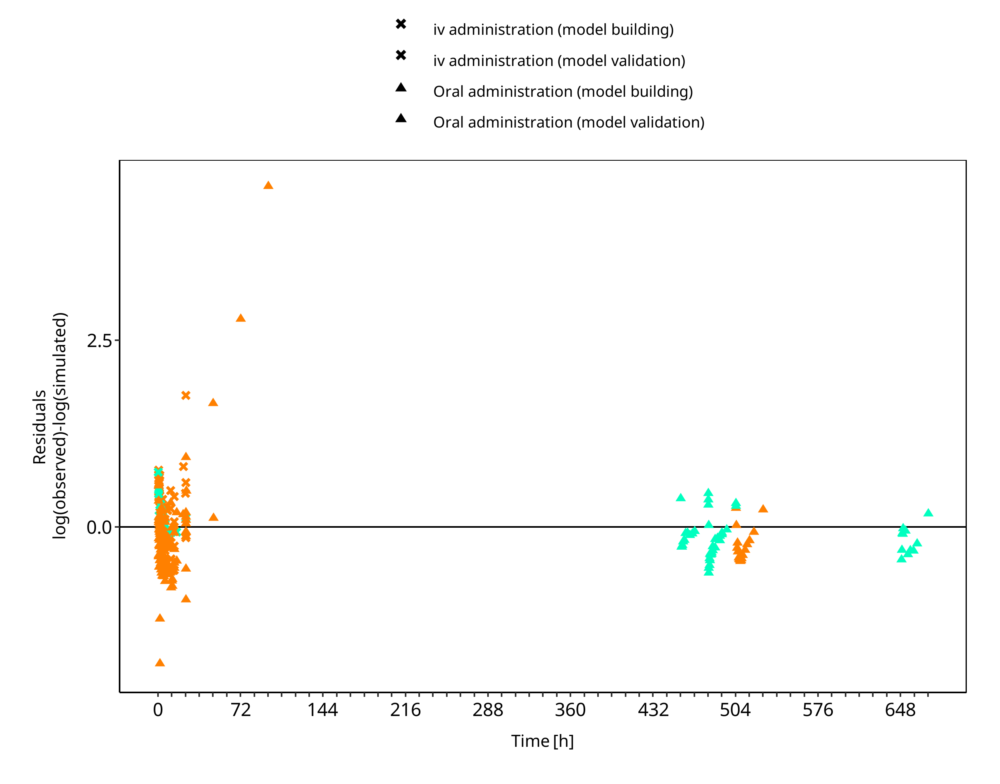

**Figure 3-2: Ethinylestradiol concentration in plasma**

 
 

## 3.3 Concentration-Time Profiles

Simulated versus observed concentration-time profiles of all data listed in [Section 2.2.2](#222-clinical-data) are presented below.

### 3.3.1 Model Building

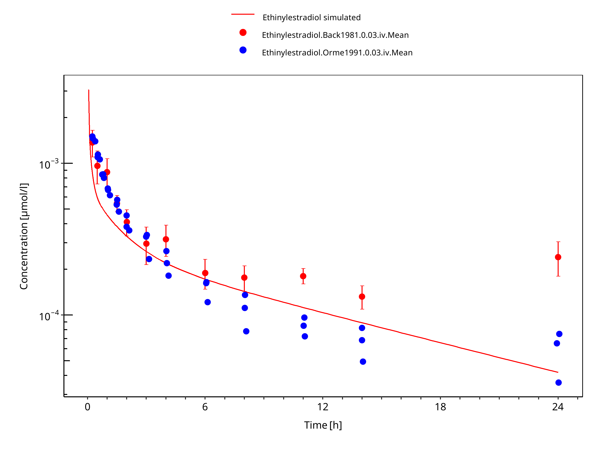

**Figure 3-3: Ethinylestradiol 0.03 mg iv**

 
 

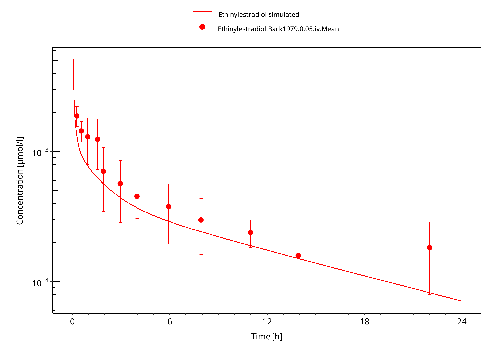

**Figure 3-4: Ethinylestradiol 0.05 mg iv**

 
 

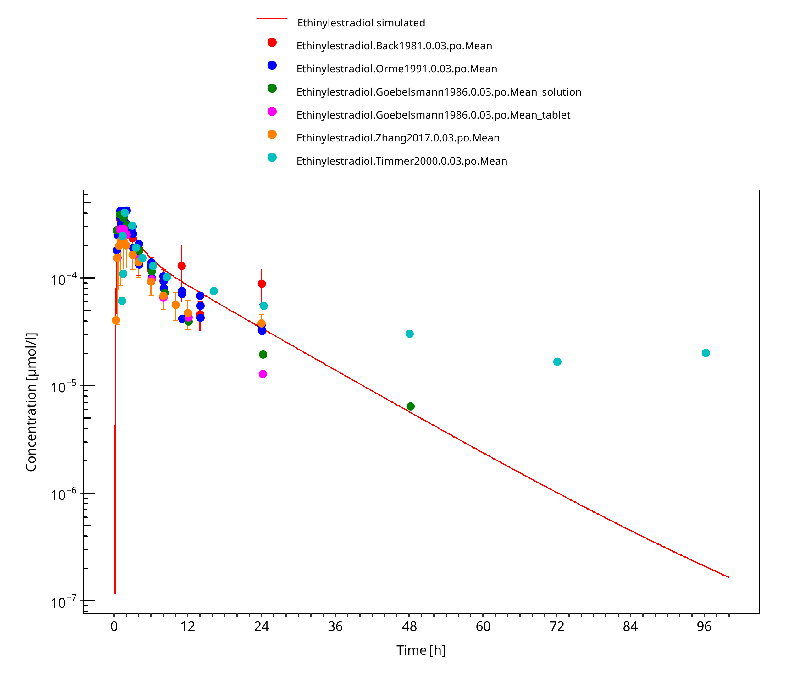

**Figure 3-5: Ethinylestradiol 0.03 mg po**

 
 

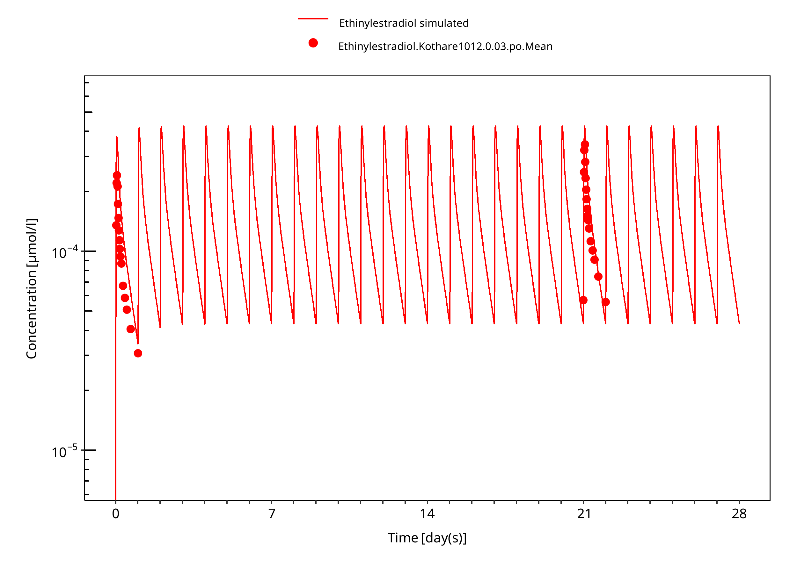

**Figure 3-6: Ethinylestradiol 0.03 mg po 28d**

 
 

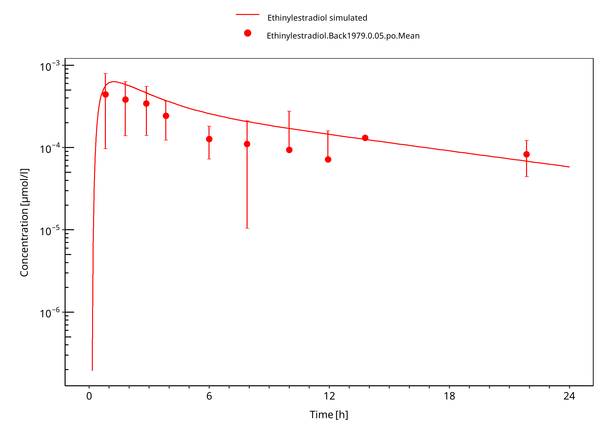

**Figure 3-7: Ethinylestradiol 0.05 mg po**

 
 

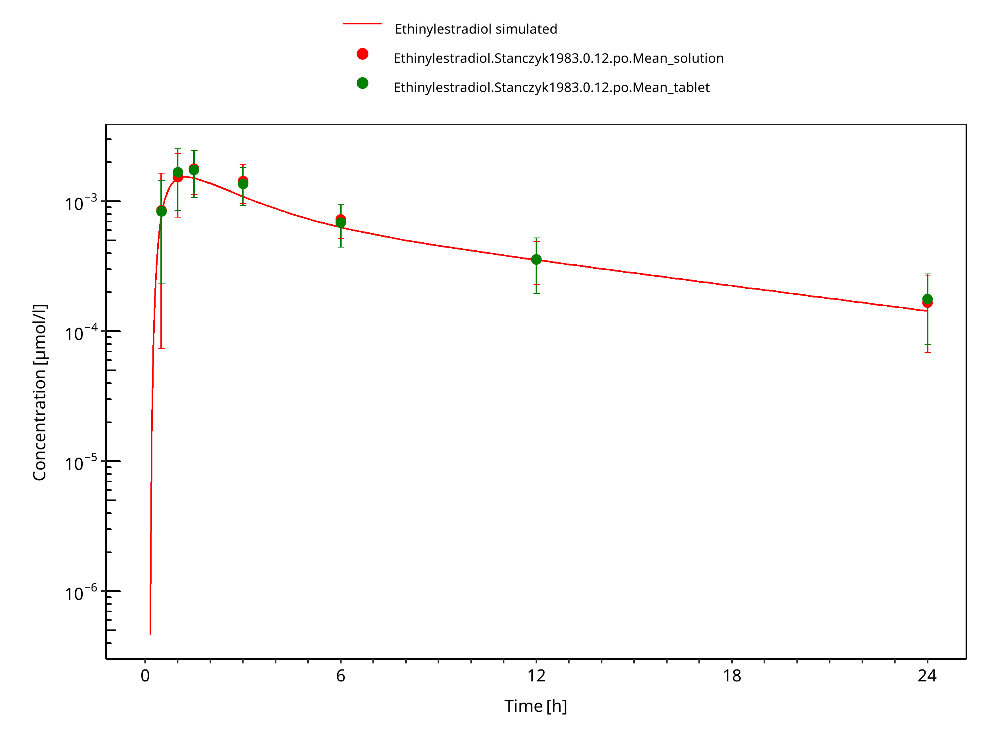

**Figure 3-8: Ethinylestradiol 0.12 mg po**

 
 

### 3.3.2 Model Verification

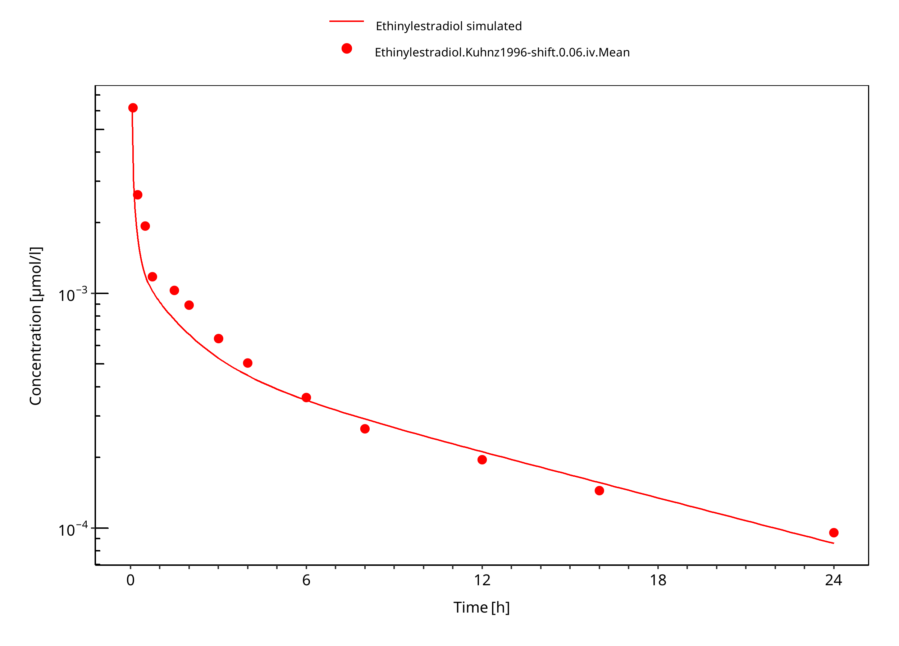

**Figure 3-9: Ethinylestradiol 0.06 mg iv**

 
 

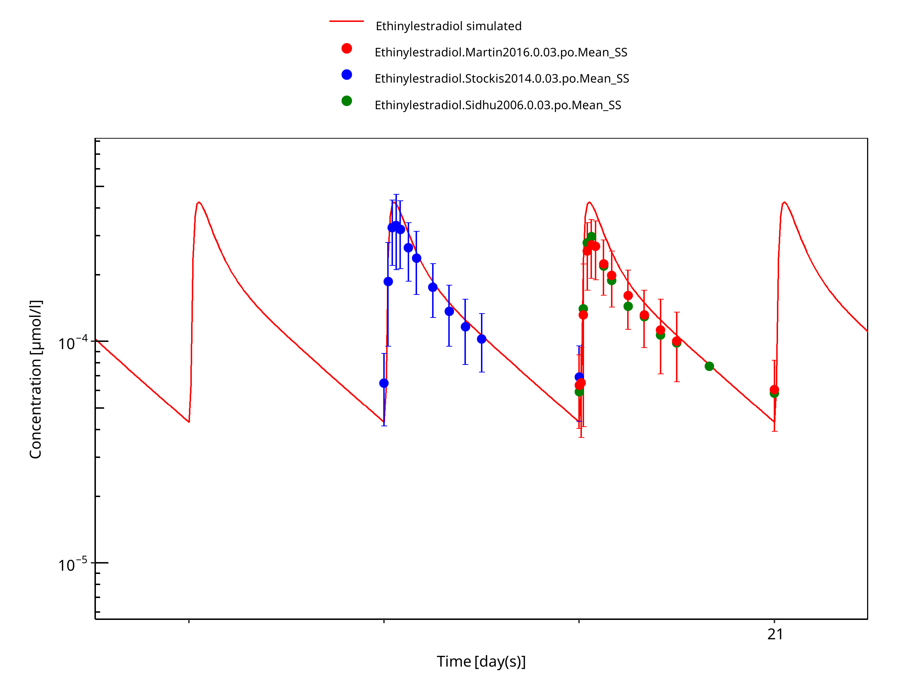

**Figure 3-10: Ethinylestradiol 0.03 mg po 28d pred**

 
 

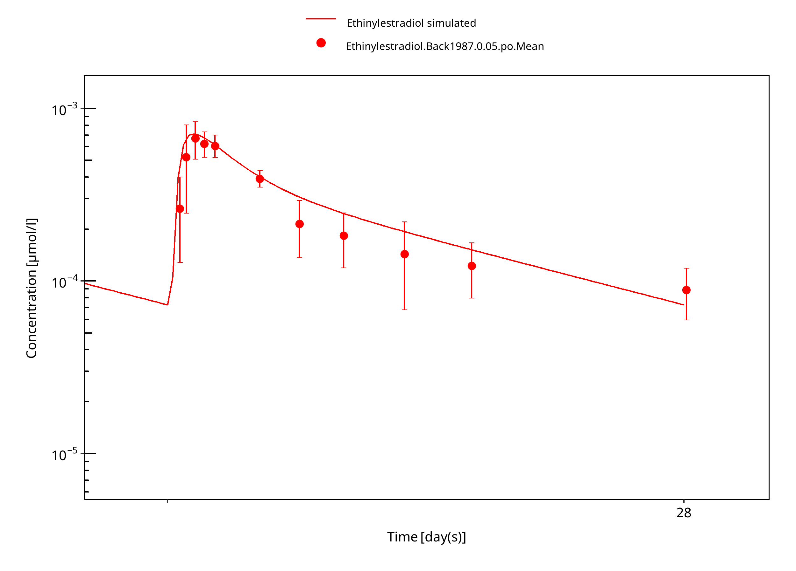

**Figure 3-11: Ethinylestradiol 0.05 mg po 28d**

 
 

# 4 Conclusion

The developed PBPK model of ethinylestradiol is able to predict the time-profiles following single and multiple dosing of ethinylestradiol accurately.

The implemented TDI mechanism for ethinylestradiol was not evident in literature ([Zanaflex prescribing information](#5-references), [Karjalainen 2008](#5-references)). The substantial and prolonged inhibition may result from CYP1A2 inhibition by EE-metabolites having a different half-life from the parent. [Chang 2009](#5-references) for example found that the EE-2hydroxy and EE-2methoxy IC50s toward rCYP1A1 and rCYP1A2 are comparable to that of the parent. However, not having the possibility to model EE-metabolites contribution, a time-dependent inhibition function on CYP1A2 was used instead to account for this effect.

# 5 References

**Back 1979** Back DJ, Breckenridge AM, Crawford FE, et al. An investigation of the pharmacokinetics of ethynylestradiol in women using radioimmunoassay. *Contraception*. 1979;20(3):263-273.

**Back 1981** Back DJ, Bates M, Breckenridge AM, et al. The pharmacokinetics of levonorgestrel and ethynylestradiol in women - studies with Ovran and Ovranette. *Contraception*. 1981;23(3):229-239.

**Back 1987** Back DJ, Grimmer SF, Rogers S, Stevenson PJ, Orme ML. Comparative pharmacokinetics of levonorgestrel and ethinyloestradiol following intravenous, oral and vaginal administration. *Contraception*. 1987;36(4):471-479.

**Balogh 1995** Balogh A, Boerner A, Kuhnz W, Klinger G, Vollanth R, Henschel L. Influence of ethinylestradiol-containing combination oral contraceptives with gestodene or levonorgestrel on caffeine elimination. *Eur J Clin Pharmacol*. 1995;48(2):161-166.

**Chang 2009** Chang, S. Y., Chen, C., Yang, Z., Rodrigues, A. D. (2009). Further assessment of 17α-ethinyl estradiol as an inhibitor of different human cytochrome P450 forms in vitro. *Drug Metabolism and Disposition*, 37(8), 1667-1675.

**DrugBank DB00977** (https://www.drugbank.ca/drugs/DB00977)

**Ezuruike 2018** Ezuruike U, Humphries H, Dickins M, Neuhoff S, Gardner I, Rowland Yeo K. Risk–Benefit Assessment of Ethinylestradiol Using a Physiologically Based Pharmacokinetic Modeling Approach. *Clin Pharmacol Ther*. 2018;104(6):1229-1239

**FDA. QUARTETTE** FDA. QUARTETTE (levonorgestrel/ethinyl estradiol and ethinyl estradiol) tablets, for oral use. Website: https://www.accessdata.fda.gov/drugsatfda_docs/label/2013/204061s000lbl.pdf

**Goebelsmann 1986** Goebelsmann U, Hoffman D, Chiang S, Woutersz T. The relative bioavailability of levonorgestrel and ethinyl estradiol administered as a low-dose combination oral contraceptive. *Contraception*. 1986;34(4):341-351.

**Granfors 2005** Granfors MT, Backman JT, Laitila J, Neuvonen PJ. Oral contraceptives containing ethinyl estradiol and gestodene markedly increase plasma concentrations and effects of tizanidine by inhibiting cytochrome P450 1A2. *Clin Pharmacol Ther*. 2005;78(4):400-411.

**Karjalainen 2008** Karjalainen, M. (Thesis, 2008). Inhibition of CYP1A2-mediated drug metabolism in vitro and in humans: With special emphasis on rofecoxib and other NSAIDs. Website: https://helda.helsinki.fi/bitstream/handle/10138/23039/inhibiti.pdf?sequence=1&origin=publication_detail

**Kothare 2012** Kothare PA, Seger ME, Northrup J, Mace K, Mitchell MI, Linnebjerg H. Effect of exenatide on the pharmacokinetics of a combination oral contraceptive in healthy women: an open-label, randomised, crossover trial. *BMC Clin Pharmacol*. 2012;12:8. 

**Kuepfer 2016** Kuepfer L, Niederalt C, Wendl T, Schlender JF, Willmann S, Lippert J, Block M, Eissing T, Teutonico D. Applied Concepts in PBPK Modeling: How to Build a PBPK/PD Model.CPT Pharmacometrics Syst Pharmacol. 2016 Oct;5(10):516-531.

**Kuhnz 1996** Kuhnz W, Humpel M, Biere H, Gross D. Influence of repeated oral doses of ethinyloestradiol on the metabolic disposition of [13C2]-ethinyloestradiol in young women. *Eur J Clin Pharmacol*. 1996;50(3):231-235.

**Martin 2016** Martin P, Gillen M, Ritter J, et al. Effects of Fostamatinib on the Pharmacokinetics of Oral Contraceptive, Warfarin, and the Statins Rosuvastatin and Simvastatin: Results From Phase I Clinical Studies. *Drugs R D*. 2016;16(1):93-107.

**Orme 1991** Orme M, Back DJ, Ward S, Green S. The pharmacokinetics of ethynylestradiol in the presence and absence of gestodene and desogestrel. *Contraception*. 1991;43(4):305-316.

**PK-Sim Ontogeny Database Version 7.3** (https://github.com/Open-Systems-Pharmacology/OSPSuite.Documentation/blob/38cf71b384cfc25cfa0ce4d2f3addfd32757e13b/PK-Sim%20Ontogeny%20Database%20Version%207.3.pdf)

**Sidhu 2006** Sidhu J, Job S, Singh S, Philipson R. The pharmacokinetic and pharmacodynamic consequences of the co-administration of lamotrigine and a combined oral contraceptive in healthy female subjects. *Br J Clin Pharmacol*. 2006;61(2):191-199.

**SmPC Namuscla** SmPC Namuscla 167 mg hard capsules, 2019, website https://www.medicines.org.uk/emc/product/9838/smpc

**Stanczyk 1983** Stanczyk FZ, Mroszczak EJ, Ling T, et al. Plasma levels and pharmacokinetics of norethindrone and ethinylestradiol administered in solution and as tablets to women. *Contraception*. 1983;28(3):241-251.

**Stanczyk 2013** Stanczyk FZ, Archer DF, Bhavnani BR. Ethinyl estradiol and 17beta-estradiol in combined oral contraceptives: pharmacokinetics, pharmacodynamics and risk assessment. *Contraception*. 2013;87(6):706-727.

**Stockis 2014** Stockis A, Watanabe S, Fauchoux N. Interaction between brivaracetam (100 mg/day) and a combination oral contraceptive: A randomized, double-blind, placebo-controlled study. *Epilepsia*. 2014;55(3):27-31.

**Study c13608215-02** Study c13608215. A study to investigate the pharmacokinetic drug-drug interaction following oral administration of ethinylestradiol/levonorgestrel (Microgynon®) and BI 409306 in healthy Korean premenopausal female subjects (an open-label, two-period, fixed-sequence study).” Boehringer Ingelheim Pharma, 06-Aug-2018.

**Timmer 2000** Timmer C, Mulders T. Pharmacokinetics of etonogestrel and ethinylestradiol released from a combined vaginal ring. *Clin Pharmacokinet*. 2000;39(3):233-242.

**Wang 2004** Wang, B., Sanchez, R.I., Franklin, R.B., Evans, D.C.,Huskey, S.E. The involvement of CYP3A4 and CYP2C9 in the metabolism of 17 alpha-ethinylestradiol. *Drug Metab. Dispos*. 32, 1209–1212 (2004).

**Wiesinger 2015**  Wiesinger, H. et al. Pharmacokinetic interaction between the CYP3A4 inhibitor ketoconazole and the hormone drospirenone in combination with ethinylestradiol or estradiol. *Br. J. Clin. Pharmacol*. 80, 1399–1410 (2015).

**Willmann 2007** Willmann S, Höhn K, Edginton A, Sevestre M, Solodenko J, Weiss W, Lippert J, Schmitt W. Development of a physiology-based whole-body population model for assessing the influence of individual variability on the pharmacokinetics of drugs. *J Pharmacokinet Pharmacodyn* 2007, 34(3): 401-431.

**Zanaflex prescribing information**  Zanaflex prescribing information. Website: https://www.accessdata.fda.gov/drugsatfda_docs/label/2006/020397s021,021447s002lbl.pdf , 2006, Acorda Therapeutics Inc

**Zhang 2017** Zhang C, Li H, Xiong X, et al. An open-label, two-period comparative study on pharmacokinetics and safety of a combined ethinylestradiol/gestodene transdermal contraceptive patch. *Drug Des Devel Ther*. 2017;11:725-731.

# 6 Glossary

| ADME    | Absorption, Distribution, Metabolism,  Excretion             |
| ------- | ------------------------------------------------------------ |
| AUC     | Area under the plasma concentration  versus time curve       |
| AUCinf  | AUC until infinity                                           |
| AUClast | AUC until last measurable sample                             |
| AUCR    | Area under the plasma concentration  versus time curve Ratio |
| b.i.d.  | Twice daily (bis in diem)                                    |
| CL      | Clearance                                                    |
| Clint   | Intrinsic liver clearance                                    |
| Cmax    | Maximum concentration                                        |
| CmaxR   | Maximum concentration Ratio                                  |
| CYP     | Cytochrome P450 oxidase                                      |
| CYP1A2  | Cytochrome P450 1A2 oxidase                                  |
| CYP2C19 | Cytochrome P450 2C19 oxidase                                 |
| CYP3A4  | Cytochrome P450 3A4 oxidase                                  |
| DDI     | Drug-drug interaction                                        |
| e.c.    | Enteric coated                                               |
| EE      | Ethinylestradiol                                             |
| EM      | Extensive metabolizers                                       |
| fm      | Fraction metabolized                                         |
| FMO     | Flavin-containing monooxygenase                              |
| fu      | Fraction unbound                                             |
| FDA     | Food and Drug administration                                 |
| GFR     | Glomerular filtration rate                                   |
| HLM     | Human liver microsomes                                       |
| hm      | homozygous                                                   |
| ht      | heterozygous                                                 |
| IM      | Intermediate metabolizers                                    |
| i.v.    | Intravenous                                                  |
| IVIVE   | In Vitro to In  Vivo Extrapolation                           |
| Ka      | Absorption rate constant                                     |
| kcat    | Catalyst rate constant                                       |
| Ki      | Inhibitor constant                                           |
| Kinact  | Rate of enzyme inactivation                                  |
| Km      | Michaelis Menten constant                                    |
| m.d.    | Multiple dose                                                |
| OSP     | Open Systems Pharmacology                                    |
| PBPK    | Physiologically-based pharmacokinetics                       |
| PK      | Pharmacokinetics                                             |
| PI      | Parameter identification                                     |
| PM      | Poor metabolizers                                            |
| RT-PCR  | Reverse transcription polymerase chain  reaction             |
| p.o.    | Per os                                                       |
| q.d.    | Once daily (quaque diem)                                     |
| SD      | Single Dose                                                  |
| SE      | Standard error                                               |
| s.d.SPC | Single dose Summary of Product Characteristics                |
| SD      | Standard deviation                                           |
| TDI     | Time dependent inhibition                                    |
| t.i.d   | Three times a day (ter in die)                               |
| UGT     | Uridine  5'-diphospho-glucuronosyltransferase                |
| UM      | Ultra-rapid metabolizers                                     |

