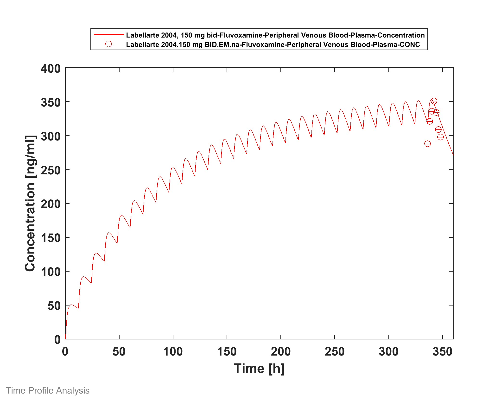
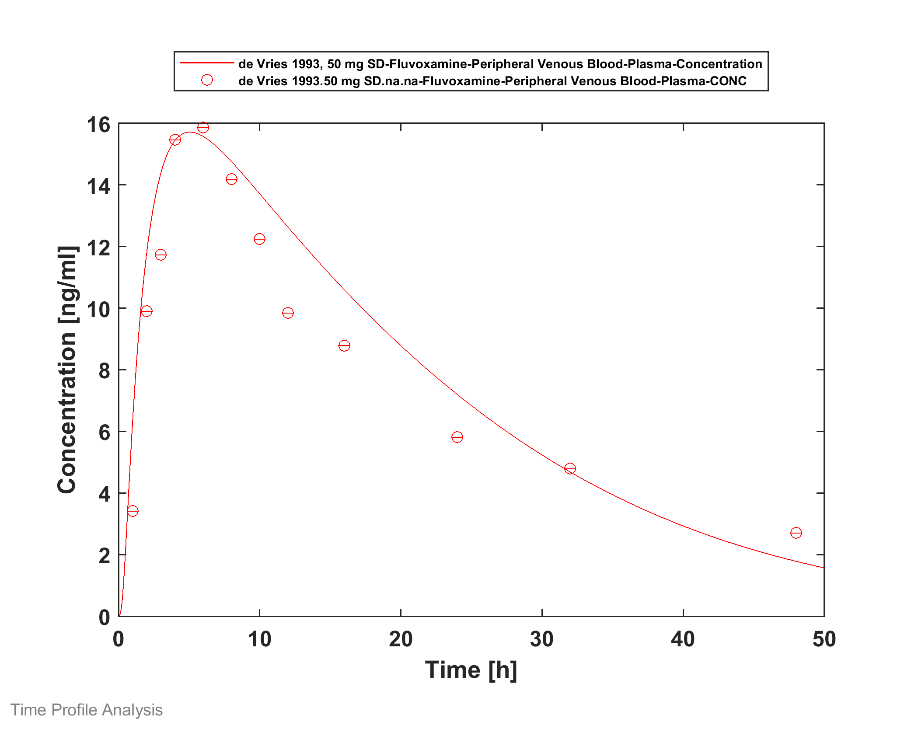

# Building and evaluation of a PBPK model for Fluvoxamine in adults

| Version                                         | 1.1-OSP10.0                                                  |
| ----------------------------------------------- | ------------------------------------------------------------ |
| based on *Model Snapshot* and *Evaluation Plan* | https://github.com/Open-Systems-Pharmacology/Fluvoxamine-Model/releases/tag/v1.0 |
| OSP Version                                     | 10.0                                                         |
| Qualification Framework Version                 | 2.3                                                          |

This evaluation report and the corresponding PK-Sim project file are filed at:

https://github.com/Open-Systems-Pharmacology/OSP-PBPK-Model-Library/
# Table of Contents
  * [1 Introduction](#1-introduction)
  * [2 Methods](#2-methods)
    * [2.1 Modeling Strategy](#21-modeling-strategy)
    * [2.2 Data](#22-data)
    * [2.3 Model Parameters and Assumptions](#23-model-parameters-and-assumptions)
  * [3 Results and Discussion](#3-results-and-discussion)
    * [3.1 Final input parameters](#31-final-input-parameters)
    * [3.2 Diagnostics Plots](#32-diagnostics-plots)
    * [3.3 Concentration-Time Profiles](#33-concentration-time-profiles)
      * [3.3.1 Model Building](#331-model-building)
      * [3.3.2 Model Verification](#332-model-verification)
  * [4 Conclusion](#4-conclusion)
  * [5 References](#5-references)
  * [6 Glossary](#6-glossary)
# 1 Introduction
The presented PBPK model of fluvoxamine has been developed to be used in a PBPK Drug-Drug-Interactions (DDI) network with fluvoxamine as an inhibitor of CYP2C19 and CYP1A2.

Fluvoxamine is a selective serotonin reuptake inhibitor. After oral administration, fluvoxamine-maleate is absorbed moderately fast with peak plasma concentrations reached at approx. 2-4 hours post-dose. Approximately 77% of the drug is bound to plasma proteins. The concentration-time profile elicits a bi-phasic shape ([Perucca 1994](#5-References)). Fluvoxamine is extensively metabolised via CYP2D6 and CYP1A2. Plasma concentrations increase non-proportionally with increasing doses, suggesting (partially) saturable metabolism. Fluvoxamine is a strong inhibitor of CYP2C19 and CYP1A2 ([FDA DDI Labeling](#5-References)), and a weak inhibitor of CYP3A (AUCR <2) ([Lam 2003](#5-References)). Only a very minor part of the dose is recovered unchanged in the urine.

# 2 Methods

## 2.1 Modeling Strategy
The general workflow for building an adult PBPK model has been described by Kuepfer et al. ([Kuepfer 2016](#5-References)). Relevant information on the anthropometry (height, weight) was gathered from the respective clinical study, if reported. Information on physiological parameters (e.g. blood flows, organ volumes, hematocrit) in adults was gathered from the literature and has been incorporated in PK-Sim® as described previously ([Willmann 2007](#5-References)). The  applied activity and variability of plasma proteins and active processes that are integrated into PK-Sim® are described in the publicly available 'PK-Sim® Ontogeny Database Version 7.3' ([PK-Sim Ontogeny Database Version 7.3](#5-References)).

In general, the following step-wise modeling work flow was followed:

1. Predict i.v.-profiles based on in vitro data alone and optimize distribution model and metabolism parameters
2. Predict single dose data following oral solution
3. Optimize intestinal permeability and revisit metabolism model
4. Predict single dose data following enteric-coated tablet
5. Multiple dose predictions with preliminary model
6. Refine model and optimize permeability and metabolism parameters.

Selection of the distribution model was performed with i.v. data ([Iga 2015](# 5 References)) with a place-holder linear clearance. A typical Japanese subject (age = 30 y, weight = 61.87 kg, height = 168.99 cm, BMI = 21.67 kg/m2) was created in PK-Sim from predefined database “Japanese (2015)” by adding CYP1A2 and CYP2D6 expression from PK-Sim RT PCR database.

Intestinal permeability and the kinetics of the CYP1A2 and CYP2D6 clearance processes were estimated using the Parameter Identification module provided in PK-Sim® with the concentration-time data listed in [Section 2.2](#2.2-Data). The predefined “Standard European Male for DDI” individual (age = 30 y, weight = 73 kg, height = 176 cm, BMI = 23.57 kg/m2) with CYP1A2 and CYP2D6 expression obtained from PK-Sim RT PCR database was used for simulations of European individuals. Additionally, fractions metabolized via CYP1A2 and CYP2D6 were fitted to 29.5% and 66.5%, respectively ([Alqahtani 2016](# 5 References), [Britz 2018](# 5 References)). For simulations of poor metabolizers ([Carillo 1996](#5-References), [Spigset 1997](#5-References)), the CYP2D6 pathway was turned off.

Details about input data (physicochemical, *in vitro* and clinical) can be found in [Section 2.2](#2.2-Data).

Details about the structural model and its parameters can be found in [Section 2.3](#2.3-Model-Parameters-and-Assumptions).

## 2.2 Data
### 2.2.1 In vitro and physico-chemical data

A literature search was performed to collect available information on physico-chemical properties of fluvoxamine ([Table 1](#Table 1)).

| **Parameter**                     | **Unit** | **Value**       | Source                            | **Description**                                              |
| :-------------------------------- | -------- | --------------- | --------------------------------- | ------------------------------------------------------------ |
| MW+                    | g/mol    | 318.33          | [DrugBank DB00176](#5-References) | Molecular weight of free base. Dose of commercial product usually refers to amount of fluvoxamine maleate – conversion factor is 0.733 |
| pKa,base+   |          | 9.16            | [Alqahtani 2016](#5-References)   | Basic dissociation constant                                  |
| Solubility (pH)+       | mg/mL    | 0.06 (7.4) | [PubChem 9560989](#5-References)  | Aqueous Solubility                                           |
| logP+                  |          | 3.38            | [Alqahtani 2016](#5-References)   | Partitioning coefficient                                     |
| fu+                    | %        | 23              | [Alqahtani 2016](#5-References)   | Fraction unbound in plasma                                   |
| Ki CYP1A2+  | nmol/L   | 2.97            | [Iga 2016](#5-References)         | CYP1A2 inhibition constant                                   |
| Ki CYP2C19+ | nmol/L   | 3.6             | [Iga 2016](#5-References)         | CYP2C19 inhibition constant (omeprazole as substrate)        |
| Ki CYP2C19+ | nmol/L   | 2.6             | [Iga 2016](#5-References)         | CYP2C19 inhibition constant (s-mephenytoin as substrate)     |

**Table 1:** Physico-chemical and *in-vitro* metabolization properties of fluvoxamine extracted from literature. *+: Value used in final model*

### 2.2.2 Clinical data

A literature search was performed to collect available clinical data on fluvoxamine in adults. Data used for model development and validation is listed in [Table 2](#Table 2).

| **Source**           | **Route** | **Dose [mg]/**  **Schedule \*** | **Pop.**     | **Age [yrs] (mean)** | **Weight [kg] (mean)** | **Sex** | **N** | **Form.** | **Comment**                       |
| -------------------- | --------- | ------------------------------- | ------------ | -------------------- | ---------------------- | ------- | ----- | --------- | --------------------------------- |
| [Carillo 1996](#5-References) | p.o.      | 50                              | HV           | -                    | -                      | m/f     | 5     | e.c. Tab  | Non-smoking  EM / Smoking EM  |
| [Carillo 1996](#5-References)+ | p.o. | 50 | HV | - | - | m/f | 5 | e.c. Tab | Non-smoking PM |
| [Spigset 1997](#5-References)+ | p.o.      | 50                              | HV           | -                    | -                      |         | 5     | e.c. Tab  | PM                                |
| [Spigset 1997](#5-References) | p.o.      | 50                              | HV           | -                    | -                      |         | 5     | e.c. Tab  | EM                                |
| [Iga 2015](#5-References)+ | i.v. | 50                        | Japanese     | -    | -    | -    | -    | -             | -                                   |
| [Iga 2015](#5-References) | p.o. | 50                        | Japanese     | -    | -    | -    | -    | -             | -                                   |
| [Orlando 2009](#5-References) | p.o. | 50                        | HV           | 35   | 79   | male | 10   | -             | -                                   |
| [Spigset 1998](#5-References)+ | p.o. | 50 / 100 b.i.d. | HV           | 28.9 | 85.6 | male | 10   | e.c. Tab      | -                                   |
| [Spigset 1998](#5-References) | p.o. | 12.5/ 25 b.i.d. | HV | 28.9 | 85.6 | male | 10 | e.c. Tab | - |
| [DeVries 1993](#5-References)+ | p.o. | 25 / 50/ 100              | HV           | -    | -    | male | 12   | solution      | -                                   |
| [VanHarten 1994](#5-References) | p.o. | 50                        | HV           | -    | -    | male | 17   | capsule       | -                                   |
| [VanHarten 1991](#5-References) | p.o. | 50                        | HV           | 24   | 73   | m/f  | 12   | e.c. Tab      | With/ without food                  |
| [Kunii 2005](#5-References) | p.o. | 50                        | HV           | 29.7 | 69.3 | m    | 10   | e.c. Tab      | -                                   |
| [Fukasawa 2006](#5-References) | p.o. | 50                        | HV           | 29.6 | 68.3 | m    | 12   | e.c. Tab      | -                                   |
| [Fleishaker 1994](#5-References)+ | p.o. | 12.5 - 25 - 50 - 100 q.d. | HV           | 32   | 80   | m    | 20   | e.c. Tab      | -                                   |
| [Labellarte 2004](#5-References)+ | p.o. | 25 / 50 / 100/ 150 b.i.d. | Adole-scents | 14   | 60   | m/f  | 23   | e.c. Tab      | -                                   |
| [Spigset 1997](#5-References) | p.o. | 50                        | HV           | 34.7 | 66.5 | m/f  | 12   | e.c. Tab      | non-smokers / smoker                |
| [FDA_ClinPharmReview LuvoxCR](#5-References)+ | p.o. | 100      | HV           | -    | -    | -    | 20   | e.c. Tab / CR | -                                   |
| [FDA_ClinPharmReview LuvoxCR](#5-References)+ | p.o. | 100 q.d. | HV | - | - | - | 20 | e.c. Tab / CR | - |
| [FDA_ClinPharmReview LuvoxCR](#5-References) | p.o. | 200 / 300 q.d. | HV | - | - | - | 20 | e.c. Tab / CR | - |

**Table 2:** Literature sources of clinical concentration data of fluvoxamine used for model development and validation. *e.c.: enteric coated; -: respective information was not provided in the literature source; \*:single dose unless otherwise specified; +: Data used for final parameter identification*
## 2.3 Model Parameters and Assumptions
### 2.3.1 Absorption

The model parameter `Specific intestinal permeability` was optimized to best match clinical data (see  [Section 2.3.4](#2.3.4-Automated-Parameter-Identification)). The default solubility was assumed to be the measured value in the FaSSIF medium (see [Section 2.2.1](#2.2.1-In-vitro-and-physico-chemical-data)).

The dissolution of enteric-coated tablets were implemented via an empirical Weibull dissolution equation with `Dissolution time (50% dissolved)` = 10 min and `Lag time ` = 30 min.

### 2.3.2 Distribution

Physico-chemical parameter values were set to the reported values (see [Section 2.2.1](#2.2.1-In-vitro-and-physico-chemical-data)). It was assumed that the major binding partner in plasma is albumin.

After testing the available organ-plasma partition coefficient and cell permeability calculation methods available in PK-Sim, observed clinical data were best described by choosing the partition coefficient calculation by `Rodgers and Rowland` and cellular permeability calculation by `PK-Sim Standard`.

### 2.3.3 Metabolism and Elimination

Two metabolic pathways were implement in the model:

* CYP2D6 (saturable Michealis-Menten)
* CYP1A2 (linear)

As the single elimination route via CYP2D6 was not sufficient to correctly describe the multiple dose administrations, elimination through CYP1A2 has been added as suggested by others ([Alqahtani 2016](# 5 References)).

Expression profiles for CYP1A2 and CYP2D6 were obtained from PK-Sim RT PCR database. 

Additionally, renal glomerular filtration was implemented with `GFR fraction` = 1, that resulted in less than 2% of parent fluvoxamine being excreted in urine (4% observed in [DeVries 1993](#5-References)).

### 2.3.4 Inhibition

Competitive inhibition of  CYP1A2 and CYP2C19 was added with Ki values as listed in [Section 2.2.1](#2.2.1-In-vitro-and-physico-chemical-data). For inhibition of CYP2C19, multiple substrate-specific Ki values are reported, and the modeler has to decide which to select depending on the substrate.

### 2.3.5 Automated Parameter Identification

Following parameter values were estimated for the base model:

- `Specific intestinal permeability (transcellular)`
- `Km` (CYP2D6)
- `kcat` (CYP2D6)
- `In vitro CL/recombinant enzyme` (CYP1A2)
# 3 Results and Discussion
The next sections show:

1. Final model input parameters for the building blocks: [Section 3.1](#3.1-Final-Input-Parameters).
2. Overall goodness of fit: [Section 3.2](#3.2-Diagnostics-Plots).
3. Simulated vs. observed concentration-time profiles for the clinical studies used for model building and for model verification: [Section 3.3](#3.3-Concentration-Time-Profiles).

## 3.1 Final input parameters
The parameter values of the final PBPK model are illustrated below.

### Formulation: Fluvoxamine tablet

Type: Weibull
#### Parameters

Name                             | Value  | Value Origin
-------------------------------- | ------ | ------------
Dissolution time (50% dissolved) | 10 min | Manual Fit  
Lag time                         | 30 min | Manual Fit  
Dissolution shape                | 0.92   |             
Use as suspension                | Yes    |             

### Compound: Fluvoxamine

#### Parameters

Name                                             | Value                   | Value Origin                                      | Alternative                | Default
------------------------------------------------ | ----------------------- | ------------------------------------------------- | -------------------------- | -------
Solubility at reference pH                       | 0.062 mg/ml             | Database-PubChem 9560989                          | Water Solubility - Pubchem | True   
Reference pH                                     | 7.4                     | Database-PubChem 9560989                          | Water Solubility - Pubchem | True   
Lipophilicity                                    | 3.38 Log Units          | Publication-Alqahtani 2016                        | LogP Alqahtani2016         | True   
Fraction unbound (plasma, reference value)       | 0.23                    | Publication-Alqahtani 2016                        | fu Alqahtani2016           | True   
Specific intestinal permeability (transcellular) | 1.2322894625E-05 cm/min | Parameter Identification-Parameter Identification | Fit                        | True   
F                                                | 3                       | Database-DrugBank DB00176                         |                            |        
Is small molecule                                | Yes                     |                                                   |                            |        
Molecular weight                                 | 318.3346 g/mol          | Database-DrugBank DB00176                         |                            |        
Plasma protein binding partner                   | Albumin                 |                                                   |                            |        
#### Calculation methods

Name                    | Value              
----------------------- | -------------------
Partition coefficients  | Rodgers and Rowland
Cellular permeabilities | PK-Sim Standard    
#### Processes

##### Metabolizing Enzyme: CYP1A2-Linear_Fit_1A2_rec

Molecule: CYP1A2
###### Parameters

Name                           | Value                                | Value Origin
------------------------------ | ------------------------------------ | ------------:
In vitro CL/recombinant enzyme | 0.5382573259 µl/min/pmol rec. enzyme |             
##### Metabolizing Enzyme: CYP2D6-MM_2D6_rec

Molecule: CYP2D6
###### Parameters

Name                             | Value                        | Value Origin                                     
-------------------------------- | ---------------------------- | -------------------------------------------------
In vitro Vmax/recombinant enzyme | 55 nmol/min/pmol rec. enzyme |                                                  
Km                               | 0.00097708157358 µmol/l      | Parameter Identification-Parameter Identification
kcat                             | 0.0362433252 1/min           | Parameter Identification-Parameter Identification
##### Systemic Process: Glomerular Filtration-GFR

Species: Human
###### Parameters

Name         | Value | Value Origin    
------------ | -----:| ----------------
GFR fraction |     1 | Other-Assumption
##### Inhibition: CYP1A2-Iga2016_Tab2_CAF

Molecule: CYP1A2
###### Parameters

Name | Value       | Value Origin        
---- | ----------- | --------------------
Ki   | 2.97 nmol/l | Publication-Iga 2016
##### Inhibition: CYP2C19-Iga 2016 in vivo unbound KI - Omeprazole

Molecule: CYP2C19
###### Parameters

Name | Value      | Value Origin        
---- | ---------- | --------------------
Ki   | 3.6 nmol/l | Publication-Iga 2016
##### Inhibition: CYP2C19-Iga 2016 in vivo unbound KI - S-mephenytoine

Molecule: CYP2C19
###### Parameters

Name | Value      | Value Origin        
---- | ---------- | --------------------
Ki   | 2.6 nmol/l | Publication-Iga 2016
##### Inhibition: CYP1A2-Fit-Tizanidine

Molecule: CYP1A2
###### Parameters

Name | Value         | Value Origin                                             
---- | ------------- | ---------------------------------------------------------
Ki   | 0.8697 nmol/l | Parameter Identification-Fit to tizanidine concentrations

## 3.2 Diagnostics Plots
The following section displays the goodness-of-fit visual diagnostic plots for the PBPK model performance of all data listed in [Section 2.2.2](#2.2.2-Clinical-data).

The first plot shows observed versus simulated plasma concentration, the second weighted residuals versus time. 

GMFE = 1.679152 

## 3.3 Concentration-Time Profiles
Simulated versus observed concentration-time profiles of all data listed in [Section 2.2.2](#2.2.2-Clinical-data) are presented below.

### 3.3.1 Model Building

### 3.3.2 Model Verification

# 4 Conclusion
The developed PBPK model of fluvoxamine describes the PK data after administrations of single as well as multiple doses well. The predictions of the 50 mg dose align closer to the studies where higher concentrations were observed. The most likely explanation is the smoking status of the subjects in the studies showing lower concentrations. Cigarette smoke is known to induce the CYP1A2 enzyme system. Hence, lower fluvoxamine concentrations would be expected in smokers due to the higher metabolism. Although there is no built-in smoking status in PK-Sim, this could be modeled by adapting CYP1A2 expression.

In two studies, data from poor metabolizers were available ([Carillo 1996](#5-References), [Spigset 1997](#5-References)). Concentrations reported by [Carillo 1996](#5-References) were much higher than what [Spigset 1997](#5-References) reported for the subset of PM data. However, notice that plasma levels of extensive metabolizers were also higher in the Carillo-study compared to the other reports. Subjects in the Spigset 1997 dataset were all non-smokers. The reason for this discrepancy is unclear.

The estimated values for Km and Kcat defining the metabolization of fluvoxamine by CYP2D6 were highly correlated (correlation of 0.93), indicating that more data would still be needed to estimate the saturable process with more precision.
# 5 References
**Alqahtani 2016** Alqahtani S, Kaddoumi A. Development of a Physiologically Based Pharmacokinetic/Pharmacodynamic Model to Predict the Impact of Genetic Polymorphisms on the Pharmacokinetics and Pharmacodynamics Represented by Receptor/Transporter Occupancy of Central Nervous System Drugs. Clinical Pharmacokinetics. 2016 Aug;55(8):957–69.

**Britz 2018** Britz H, Hanke N, Lehr T. Physiologically-based pharmacokinetic (PBPK) modeling of the strong CYP1A2 inhibitor fluvoxamine. PAGE meeting, Montreux, June 2018.

**Carillo 1996** Carrillo JA, Dahl ML, Svensson JO, Alm C, Rodríguez I, Bertilsson L.
Disposition of fluvoxamine in humans is determined by the polymorphic
CYP2D6 and also by the CYP1A2 activity. Clin Pharmacol Ther. 1996
Aug;60(2):183-90  

**DeVries 1993** De Vries MH, Van Harten J, Van Bemmel P, Raghoebar M. Pharmacokinetics of fluvoxamine maleate after increasing single oral doses in healthy subjects. Biopharmaceutics & Drug Disposition. 1993 May;14(4):291--6.

**DrugBank DB00176** (https://www.drugbank.ca/drugs/DB00176)

**FDA_ClinPharmReview LuvoxCR** FDA\_ClinPharmReview LuvoxCR, NDA 22-033, FDADrug\_42.pdf, website: digitalcollections.ohsu.edu/downloads/6m311p63g?locale=en

**FDA DDI Labeling** U.S. Food and Drug Administration. Drug development and drug interactions: table of substrates, inhibitors and inducers. \<Website fda.gov/Drugs/DevelopmentApprovalProcess/DevelopmentResources/DrugInteractionsLabeling/ucm093664.html (2017). Accessed 04 March 2019.

**Fleishaker 1994** Fleishaker JC, Hulst LK. A pharmacokinetic and pharmacodynamic evaluation of the combined administration of alprazolam and fluvoxamine. European Journal of Clinical Pharmacology. 1994;46(1):35--9.

**Fukasawa 2006** Fukasawa T, Yasui-Furukori N, Suzuki A, et al. Effects of Caffeine on the Kinetics of Fluvoxamine and its Major Metabolite in Plasma After a Single Oral Dose of the Drug. Ther Drug Monit. 2006;28(3):308-311.

**Iga 2015** Iga K. Use of Three-Compartment Physiologically Based Pharmacokinetic Modeling to Predict Hepatic Blood Levels of Fluvoxamine Relevant for Drug-Drug Interactions. J Pharm Sci. 2015;104(4):1478-1491.

**Iga 2016** Iga K. Dynamic and Static Simulations of Fluvoxamine-Perpetrated Drug-Drug Interactions Using Multiple Cytochrome P450 Inhibition Modeling, and Determination of Perpetrator-Specific CYP Isoform Inhibition Constants and Fractional CYP Isoform Contributions to Vic. *J Pharm Sci*.Victim Clearance. Journal of Pharmaceutical Sciences. 2016 Mar;105(3):1307-1317–17.

**Kuepfer 2016** Kuepfer L, Niederalt C, Wendl T, Schlender JF, Willmann S, Lippert J, Block M, Eissing T, Teutonico D. Applied Concepts in PBPK Modeling: How to Build a PBPK/PD Model.CPT Pharmacometrics Syst Pharmacol. 2016 Oct;5(10):516-531.

**Kunii 2005** Kunii T, Fukasawa T, Yasui-Furukori N, et al. Interaction Study Between Enoxacin and Fluvoxamine. Ther Drug Monit. 2005;27(3):349-353.

**Labellarte 2004** Labellarte M, Biederman J, Emslie G, et al. Multiple-dose pharmacokinetics of fluvoxamine in children and adolescents. J Am Acad Child Adolesc Psychiatry. 2004;43(12):1497-1505

**Lam 2003** Lam YWF, Alfaro CL, Ereshefsky L, Miller M. Pharmacokinetic and pharmacodynamic interactions of oral midazolam with ketoconazole, fluoxetine, fluvoxamine, and nefazodone. *J Clin Pharmacol*. 2003;43(11):1274-1282.

**Orlando 2009** Orlando R, De Martin S, Andrighetto L, Floreani M, Palatini P. Fluvoxamine pharmacokinetics in healthy elderly subjects and elderly patients with chronic heart failure. Br J Clin Pharmacol. 20 0 Mar;69(3):279-86.

**Perucca 1994** Perucca E, Gatti G, Spina E. Clinical Pharmacokinetics of Fluvoxamine: *Clinical Pharmacokinetics*. 1994 Sep;27(3):175--90.

**PK-Sim Ontogeny Database Version 7.3** (https://github.com/Open-Systems-Pharmacology/OSPSuite.Documentation/blob/38cf71b384cfc25cfa0ce4d2f3addfd32757e13b/PK-Sim%20Ontogeny%20Database%20Version%207.3.pdf)

**PubChem 9560989** (https://pubchem.ncbi.nlm.nih.gov/compound/9560989)

**Spigset 1997** Spigset O, Granberg K, Hägg S, Norström A, Dahlqvist R. Relationship between fluvoxamine pharmacokinetics and CYP2D6/CYP2C19 phenotype polymorphisms. Eur J Clin Pharmacol. 1997;52(2):129-33.

**Spigset 1998** Spigset O, Hägg S, Dahlqvist R, Granberg K, Söderström E. Non-linear fluvoxamine disposition. Br J Clin Pharmacol. 1998;45(3):257-263.

**NCT02853136** Influence of fluvoxamine on the pharmacokinetics of BI 409306 after oral administration (randomized, open-label, two-treatment, two-sequence, two-period crossover study)

**VanHarten 1991** Van Harten J, Van Bemmel P, Dobrinska MR, Ferguson RK, Raghoebar M. Bioavailability of fluvoxamine given with and without food. Biopharm Drug Dispos. 1991;12(8):571-576.

**VanHarten 1994** Van Harten J, Kok F, A. Lönnebo A. Grahnén A. Pharmacokinetics of fluvoxamine after intravenous and oral administration. Poster. P-1-58. 1994;4(3):331.

**Willmann 2007** Willmann S, Höhn K, Edginton A, Sevestre M, Solodenko J, Weiss W, Lippert J, Schmitt W. Development of a physiology-based whole-body population model for assessing the influence of individual variability on the pharmacokinetics of drugs. *J Pharmacokinet Pharmacodyn* 2007, 34(3): 401-431.

# 6 Glossary
| ADME    | Absorption, Distribution, Metabolism,  Excretion             |
| ------- | ------------------------------------------------------------ |
| AUC     | Area under the plasma concentration  versus time curve       |
| AUCinf  | AUC until infinity                                           |
| AUClast | AUC until last measurable sample                             |
| AUCR    | Area under the plasma concentration  versus time curve Ratio |
| b.i.d.  | Twice daily (bis in diem)                                    |
| CL      | Clearance                                                    |
| Clint   | Intrinsic liver clearance                                    |
| Cmax    | Maximum concentration                                        |
| CmaxR   | Maximum concentration Ratio                                  |
| CYP     | Cytochrome P450 oxidase                                      |
| CYP1A2  | Cytochrome P450 1A2 oxidase                                  |
| CYP2C19 | Cytochrome P450 2C19 oxidase                                 |
| CYP3A4  | Cytochrome P450 3A4 oxidase                                  |
| DDI     | Drug-drug interaction                                        |
| e.c.    | Enteric coated                                               |
| EE      | Ethinylestradiol                                             |
| EM      | Extensive metabolizers                                       |
| fm      | Fraction metabolized                                         |
| FMO     | Flavin-containing monooxygenase                              |
| fu      | Fraction unbound                                             |
| FDA     | Food and Drug administration                                 |
| GFR     | Glomerular filtration rate                                   |
| HLM     | Human liver microsomes                                       |
| hm      | homozygous                                                   |
| ht      | heterozygous                                                 |
| IM      | Intermediate metabolizers                                    |
| i.v.    | Intravenous                                                  |
| IVIVE   | In Vitro to In  Vivo Extrapolation                           |
| Ka      | Absorption rate constant                                     |
| kcat    | Catalyst rate constant                                       |
| Ki      | Inhibitor constant                                           |
| Kinact  | Rate of enzyme inactivation                                  |
| Km      | Michaelis Menten constant                                    |
| m.d.    | Multiple dose                                                |
| OSP     | Open Systems Pharmacology                                    |
| PBPK    | Physiologically-based pharmacokinetics                       |
| PK      | Pharmacokinetics                                             |
| PI      | Parameter identification                                     |
| PM      | Poor metabolizers                                            |
| RT-PCR  | Reverse transcription polymerase chain  reaction             |
| p.o.    | Per os                                                       |
| q.d.    | Once daily (quaque diem)                                     |
| SD      | Single Dose                                                  |
| SE      | Standard error                                               |
| s.d.SPC | Single doseSummary of Product Characteristics                |
| SD      | Standard deviation                                           |
| TDI     | Time dependent inhibition                                    |
| t.i.d   | Three times a day (ter in die)                               |
| UGT     | Uridine  5'-diphospho-glucuronosyltransferase                |
| UM      | Ultra-rapid metabolizers                                     |
