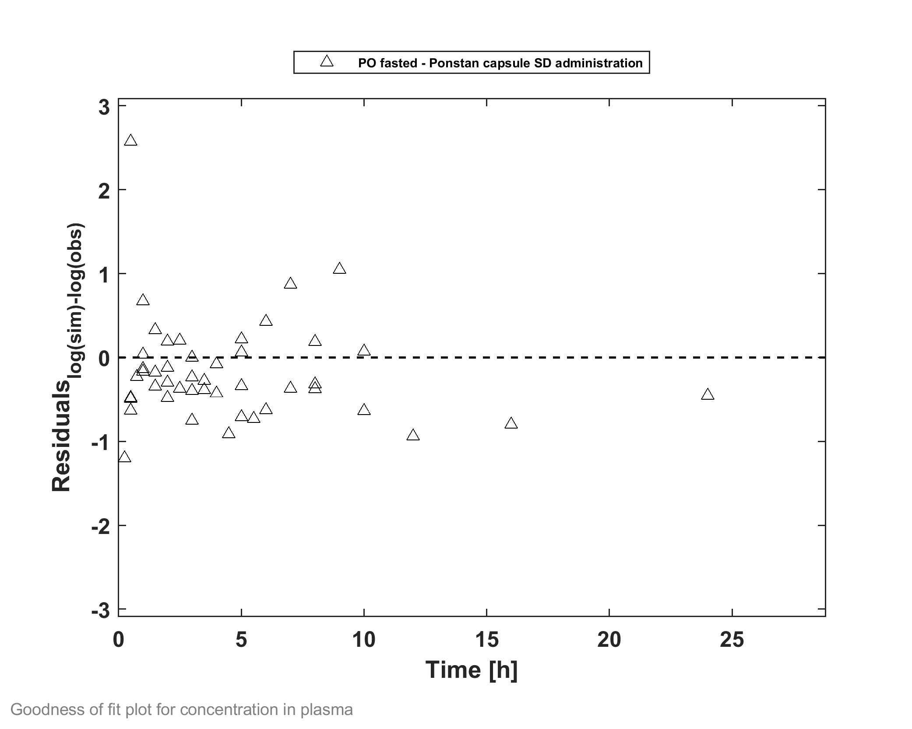
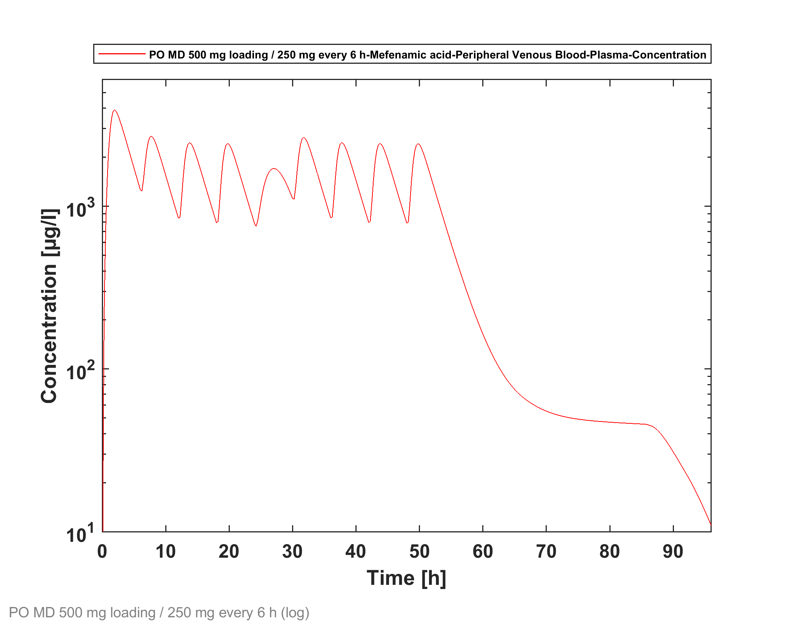
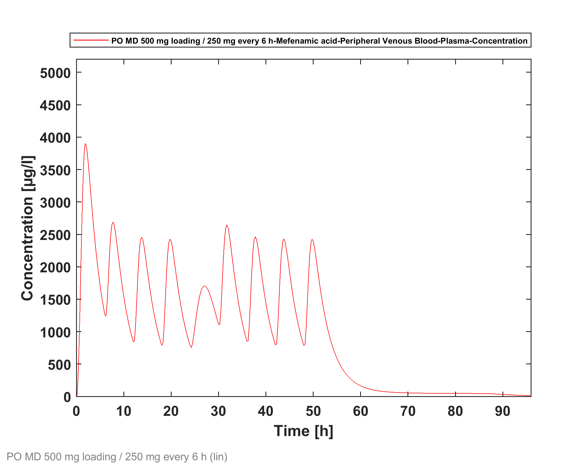
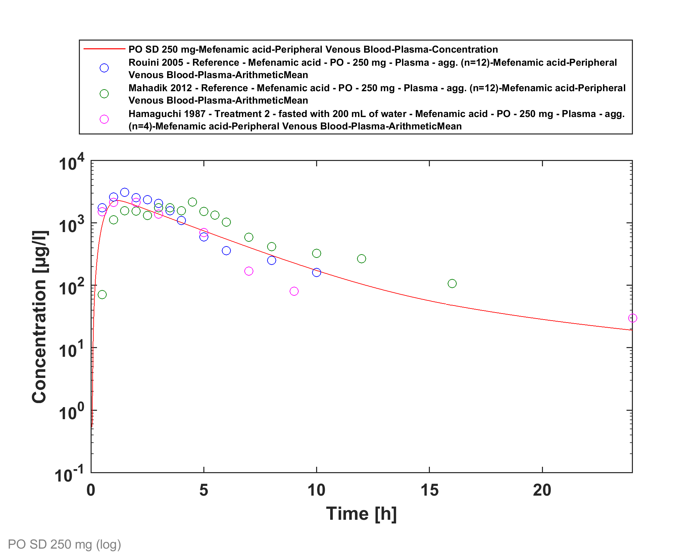
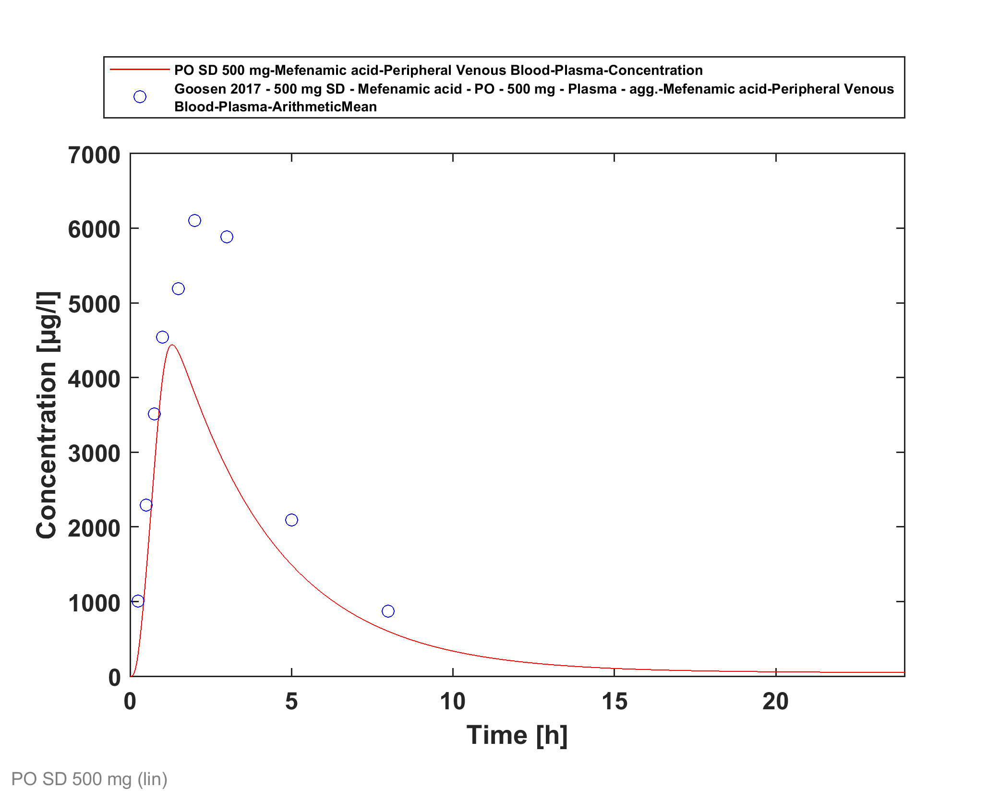

# Building and Evaluation of a PBPK Model for Mefenamic Acid in Adults

| Version                                         | 1.1-OSP9.1                                                   |
| ----------------------------------------------- | ------------------------------------------------------------ |
| based on *Model Snapshot* and *Evaluation Plan* | https://github.com/Open-Systems-Pharmacology/Mefenamic-acid-Model/releases/tag/v1.1 |
| OSP Version                                     | 9.1                                                          |
| Qualification Framework Version                 | 2.2                                                          |

This evaluation report and the corresponding PK-Sim project file are filed at:

https://github.com/Open-Systems-Pharmacology/OSP-PBPK-Model-Library/
# Table of Contents
  * [1 Introduction](#1-introduction)
  * [2 Methods](#2-methods)
    * [2.1 Modeling Strategy](#21-modeling-strategy)
    * [2.2 Data](#22-data)
    * [2.3 Model Parameters and Assumptions](#23-model-parameters-and-assumptions)
  * [3 Results and Discussion](#3-results-and-discussion)
    * [3.1 Final input parameters](#31-final-input-parameters)
    * [3.2 Diagnostics Plots](#32-diagnostics-plots)
    * [3.3 Concentration-Time Profiles](#33-concentration-time-profiles)
  * [4 Conclusion](#4-conclusion)
  * [5 References](#5-references)
# 1 Introduction
Mefenamic acid is a nonsteroidal anti-inflammatory drug (NSAID). The mechanism of action of mefenamic acid, like that of other NSAIDs, is not completely understood but involves inhibition of cyclooxygenase (COX-1 and COX-2).

Mefenamic acid has been described to undergo metabolism by CYP2C9; it is also glucuronidated directly ([DrugBank DB00784](#5-References)).

Furthermore, mefenamic acid is known to be a potent inhibitor of uridine diphosphate-glucuronosyltransferase 1A9 (UGT1A9) and used in clinical drug-drug interaction (DDI) studies as a perpetrator to investigate the DDI potential of potential UGT1A9 substrates.

The presented model building and evaluation report evaluates the performance of a PBPK model for mefenamic acid in adults.

The objective is to establish a whole-body PBPK model for mefenamic acid featuring:

* a description of the systemic plasma concentration of mefenamic acid after oral administration.
* reversible UGT1A9 inhibition. 

The presented model building and evaluation report evaluates the performance of the PBPK model for mefenamic acid in (healthy) adults.

# 2 Methods

## 2.1 Modeling Strategy
The general concept of building a PBPK model has previously been described by Kuepfer *et al.* ([Kuepfer 2016](#5-References)). Relevant information on anthropometric (height, weight) and physiological parameters (e.g. blood flows, organ volumes, binding protein concentrations, hematocrit, cardiac output) in adults was gathered from the literature and has been previously published ([PK-Sim Ontogeny Database Version 7.3](#5-References)). The information was incorporated into PK-Sim® and was used as default values for the simulations in adults.

The  applied activity and variability of plasma proteins and active processes that are integrated into PK-Sim® are described in the publicly available PK-Sim® Ontogeny Database Version 7.3 ([Schlender 2016](#5-References)) or otherwise referenced for the specific process.

A base mean model was built using clinical Phase I data including data from published single dose studies after oral application of mefenamic acid and data from an in-house clinical multiple-dose study to find an appropriate structure to describe the pharmacokinetics in plasma. The mean PBPK model was developed using a typical European individual. 

Unknown parameters (see below) were identified using the Parameter Identification module provided in PK-Sim®. Structural model selection was mainly guided by visual inspection of the resulting description of data and biological plausibility.

Finally, an *in vitro* in-house determined Ki value of mefenamic acid on glucuronidation of propofol via UGT1A9 was applied to incorporate reversible UGT1A9 inhibition.

Details about input data (physicochemical, *in vitro* and clinical) can be found in [Section 2.2](#22-Data).

Details about the structural model and its parameters can be found in [Section 2.3](#23-Model-Parameters-and-Assumptions).

## 2.2 Data
### 2.2.1 In vitro / physicochemical Data

A literature search was performed to collect available information on physiochemical properties of mefenamic acid. The obtained information from literature is summarized in the table below. 

| **Parameter**   | **Unit** | **Value** | Source                                                       | **Description**                                 |
| :-------------- | -------- | --------- | ------------------------------------------------------------ | ----------------------------------------------- |
| MW              | g/mol    | 241.29    | [DrugBank DB00784](#5-References)                           | Molecular weight                                |
| pKa  |          | 4.2       | [DrugBank DB00784](#5-References)                           | Acid dissociation constant                      |
| Solubility (pH) | mg/L     | 20 (7)    | [DrugBank DB00784](#5-References)                           | Aqueous Solubility                              |
| logP            |          | 5.12      | [DrugBank DB00784](#5-References) (experimental)       | Partition coefficient between octanol and water |
|                 |          | 5.33      | [Vitas-M Lab ID: STK666691](#5-References) (experimental) | Partition coefficient between octanol and water |
| fu              | %        | 1.9       | [Goosen 2016](#5-References)                                 | Fraction unbound in plasma                      |

With regard to UGT1A9 inhibition, mefenamic acid inhibited propofol glucuronidation in recombinant UGT1A9 by a mixed-type mechanism, however close to a competitive type (*BAYER in-house*: [Jungmann 2019](#5-References)):

| **Parameter**    | **Unit** | **Value** | Source                          | **Description**                      |
| :--------------- | -------- | --------- | ------------------------------- | ------------------------------------ |
| Ki    | µmol/L   | 0.30      | [Jungmann 2019](#5-References) | Inhibition constant                  |
| Alpha            |          | 71        | [Jungmann 2019](#5-References) | Alpha value in mixed-type inhibition |
| fuinc | %        | 1         | [Fricke 2020](#5-References)   | determined *in vitro* at 0.30 µmol/L of mefenamic acid |

### 2.2.2 Clinical Data

A literature search was performed to collect available clinical data on mefenamic acid in adults. 

The following publications were found for adults and, unless noted otherwise, used for model building and evaluation:

| Publication                                           | Study description                                            |
| :---------------------------------------------------- | :----------------------------------------------------------- |
| [Hamaguchi 1987](#5-References)                       | Treatment 2 - fasted with 200 mL of water - with an oral single dose of 250 mg, fasted |
| [Mahadik 2012](#5-References)                         | Reference (Ponstan capsule)  with an oral single dose of 250 mg, fasted |
| [Rouini 2005](#5-References)                          | Reference (Ponstan capsule) with an oral single dose of 250 mg, fasted |
| [Becker 2015](#5-References)  (*BAYER in-house*) | 500 mg oral dose, fed condition, then 250 mg oral dose every 6 h (8 doses), fed conditions ***confidential data*** |
| [Goosen 2017](#5-References)                          | ***not used for model building (unclear study design)*** 500 mg oral dose |

## 2.3 Model Parameters and Assumptions
### 2.3.1 Absorption

Studies including only oral applications of mefenamic acid could be used for model building. During model building  the *in vivo* intestinal permeability and an effective *in vivo* solubility in this PBPK model were optimized (see also [Section 2.3.5](#235-Automated-Parameter-Identification)).

Dissolution kinetics of the Ponstan capsule  were implemented via an empirical Weibull dissolution function. It was tried to identify the respective parameters. Model building, however, showed that these parameters do not appear to be rate-limiting. Thus, the values were fixed to an instantaneous release with a `Dissolution time (50% dissolved)` of 1 minute and a `Dissolution shape` of 10. 

Mefenamic acid is typically administered in fed conditions. Mefenamic acid was administered in the in-house study ([Becker 2015](#5-References)) with meals or snacks. For the 5th administration at 24 h in this study (simultaneous administration with vericiguat) a standard meal in PK-Sim `Meal: High-fat breakfast (Human)` was considered. All other administration considered a snack. The parameter `Meal energy content` for this snack was optimized to best match clinical data  (see also [Section 2.3.5](#235-Automated-Parameter-Identification)).

### 2.3.2 Distribution

Mefenamic acid was reported as being greater than 90% bound to albumin in plasma ([Champion 1978](#5-References)). However, exact values are unknown. Goosen *et al.* ([Goosen 2017](#5-References)) reported a fraction unbound in 2% bovine serum albumin solution of 3.8%. Assuming human serum albumin (HSA) as major binding partner and a HSA concentration in plasma *in vivo* of 40 g/dL = 4%, a calculated fraction unbound in plasma of 1.9% can be obtained. This value was used in this PBPK model. 

An important parameter influencing the resulting volume of distribution is lipophilicty. The reported experimental logP values were in the range of 5. This value served as a starting value. Finally, the model parameter `Lipophilicity` was optimized to best match clinical data (see also [Section 2.3.5](#235-Automated-Parameter-Identification)).

After testing the available organ-plasma partition coefficient and cell permeability calculation methods built in PK-Sim, observed clinical data was best described by choosing the partition coefficient calculation by `Rodgers and Rowland` and cellular permeability calculation by `PK-Sim Standard`. 

### 2.3.3 Metabolism and Elimination

Since this PBPK model was built for the purpose of acting as a perpetrator drug for UGT1A9-mediated drug-drug interactions, no detailed representation of the metabolism and excretion was implemented. A simple unspecific hepatic clearance was optimized to best match clinical data (see also [Section 2.3.5](#235-Automated-Parameter-Identification)).

### 2.3.4 UGT1A9 Inhibition

An in-house *in vitro* study ([Jungmann 2019](#5-References)) evaluated the inhibitory constant (Ki) of mefenamic acid on the glucuronidation of the selective substrate propofol in recombinant UGT1A9. A mixed-type mechanism, however close to a competitive type, was found. After correcting for fraction unbound (but here this was 1 ([Fricke 2020](#5-References)), the obtained *in vitro* values were directly implemented:

| **Model Parameter** | Value | Unit   | **Description**                           |
| :------------------ | ----- | ------ | ----------------------------------------- |
| `Ki_c`              | 0.3   | µmol/L | Ki * fu,inc         |
| `Ki_u`              | 21.3  | µmol/L | Alpha * Ki * fu,inc |

### 2.3.5 Automated Parameter Identification

This is the result of the final parameter identification.

| Model Parameter                                       | Optimized Value | Unit       |
| ----------------------------------------------------- | --------------- | ---------- |
| `Lipophilicity`                                       | 5.030           | Log Units  |
| `Specific intestinal permeability`                    | 1.41E-05        | cm/min     |
| `Solubility at reference pH`                          | 80.95           | µg/ml      |
| `Specific clearance` (unspecific hepatic clearance)   | 9.503           | l/µmol/min |
| `Meal energy content` of snack (mefenamic acid study) | 29.27           | kcal       |
| `Dissolution time (50% dissolved)` of Ponstan capsule | 1 FIXED         | min        |
| `Dissolution shape` of Ponstan capsule                | 10 FIXED        |            |

# 3 Results and Discussion
The PBPK model for mefenamic acid was developed. The model was evaluated covering data from studies including

* single and multiple doses
* a dose range of 250 to 500 mg
* fasted and fed administration.

The model does not quantify specific metabolic pathways of mefenamic acid as it was developed to be used in the context of UGT inhibition. UGT1A9 inhibition was implemented as a (reversible) mixed-type inhibition. Input values were directly incorporated from an in-house *in vitro* experiment.

The next sections show:

1. the final model parameters for the building blocks: [Section 3.1](#31-Final-Input-Parameters).
2. the overall goodness of fit: [Section 3.2](#32-Diagnostics-Plots).
   *Note that data from [Becker 2015](#5-References) are not shown for data confidentiality reasons.*
3. simulated vs. observed concentration-time profiles for the clinical studies used for model building and for model verification: [Section 3.3](#33-Concentration-Time-Profiles).
   *Note that data from [Becker 2015](#5-References) are not shown for data confidentiality reasons.*

## 3.1 Final input parameters
The compound parameter values of the final mefenamic acid PBPK model are illustrated below.

### Compound: Mefenamic acid

#### Parameters

Name                                             | Value                   | Value Origin                                                                                                                                             | Alternative | Default
------------------------------------------------ | ----------------------- | -------------------------------------------------------------------------------------------------------------------------------------------------------- | ----------- | -------
Solubility at reference pH                       | 80.9542823654 µg/ml     | Parameter Identification-Parameter Identification-Value updated from 'PI (Pint, CLspec, Lipo, Solub, meal; fu=1.9, Disso fix) FINAL' on 2019-08-06 18:52 | Optimized   | True   
Reference pH                                     | 5.5                     |                                                                                                                                                          | Optimized   | True   
Lipophilicity                                    | 5.0302455255 Log Units  | Parameter Identification-Parameter Identification-Value updated from 'PI (Pint, CLspec, Lipo, Solub, meal; fu=1.9, Disso fix) FINAL' on 2019-08-06 18:52 | Optimized   | True   
Fraction unbound (plasma, reference value)       | 1.9 %                   | Parameter Identification-Parameter Identification-Value updated from 'PI (Pint, CLspec, Lipo, Solub, meal; fu=1.9, Disso fix) FINAL' on 2019-08-06 18:52 | Goosen 2016 | True   
Specific intestinal permeability (transcellular) | 1.4111809841E-05 cm/min | Parameter Identification-Parameter Identification-Value updated from 'PI (Pint, CLspec, Lipo, Solub, meal; fu=1.9, Disso fix) FINAL' on 2019-08-06 18:52 | Optimized   | True   
Is small molecule                                | Yes                     |                                                                                                                                                          |             |        
Molecular weight                                 | 241.29 g/mol            |                                                                                                                                                          |             |        
Plasma protein binding partner                   | Albumin                 |                                                                                                                                                          |             |        
#### Calculation methods

Name                    | Value              
----------------------- | -------------------
Partition coefficients  | Rodgers and Rowland
Cellular permeabilities | PK-Sim Standard    
#### Processes

##### Systemic Process: Total Hepatic Clearance-Simcyp (oral CL)

Species: Human
###### Parameters

Name                          | Value              | Value Origin                                                                                                                                            
----------------------------- | ------------------ | --------------------------------------------------------------------------------------------------------------------------------------------------------
Fraction unbound (experiment) | 0.01               |                                                                                                                                                         
Lipophilicity (experiment)    | 3.52 Log Units     |                                                                                                                                                         
Plasma clearance              | 0.2328761 l/h/kg   |                                                                                                                                                         
Specific clearance            | 9.5031504329 1/min | Parameter Identification-Parameter Identification-Value updated from 'PI (Pint, CLspec, Lipo, Solub, meal; fu=1.9, Disso fix) FINAL' on 2019-08-06 18:52
##### Inhibition: UGT1A9-PH-41095

Molecule: UGT1A9
###### Parameters

Name | Value       | Value Origin
---- | ----------- | ------------:
Ki_c | 0.3 µmol/l  |             
Ki_u | 21.3 µmol/l |             

### Formulation: Ponstan capsule

Type: Weibull
#### Parameters

Name                             | Value | Value Origin                                                                                                                                            
-------------------------------- | ----- | --------------------------------------------------------------------------------------------------------------------------------------------------------
Dissolution time (50% dissolved) | 1 min | Parameter Identification-Parameter Identification-Value updated from 'PI (Pint, CLspec, Lipo, Solub, meal; fu=1.9, Disso fix) FINAL' on 2019-08-06 18:52
Lag time                         | 0 min |                                                                                                                                                         
Dissolution shape                | 10    | Parameter Identification-Parameter Identification-Value updated from 'PI (Pint, CLspec, Lipo, Solub, meal; fu=1.9, Disso fix) FINAL' on 2019-08-06 18:52
Use as suspension                | Yes   |                                                                                                                                                         

## 3.2 Diagnostics Plots
Below you find the goodness-of-fit visual diagnostic plots for the PBPK model performance of all data used presented in [Section 2.2.2](#222-Clinical-Data).

The first plot shows simulated versus observed plasma concentrations, the second weighted residuals versus time. 

GMFE = 1.605453 

## 3.3 Concentration-Time Profiles
Simulated versus observed concentration-time profiles of all data listed in [Section 2.2.2](#222-Clinical-Data) are presented below.

*Note that data from [Becker 2015](#5-References) are not shown for data confidentiality reasons. Some plots may be duplicated.*

# 4 Conclusion
The herein presented PBPK model adequately describes the pharmacokinetics of mefenamic acid in adults.

In particular, it applies inhibition of UGT1A9. The model is fit for purpose to be applied for the investigation of drug-drug interactions with regard to UGT1A9 inhibition.

# 5 References
**Becker 2015** Becker C, Boettcher M.-F. Study 17116: Interaction study to investigate the influence of a starting dose of 500 mg followed by multiple doses of 250 mg mefenamic acid every 6 hours on pharmacokinetics as well as safety and tolerability of a single dose of 2.5 mg vericiguat in comparison to a single dose of 2.5 mg vericiguat alone in healthy male subjects in a randomized, non-blinded, non-placebo-controlled, two-fold cross-over design. Bayer AG Clinical study report. 2015 Oct. Report-No. PH-38616.
***confidential data***

**Champion 1978** Champion GD, Graham GG: Pharmacokinetics of non-steroidal anti-inflammatory agents. Aust NZ J Med. 8 (Supp 1): 94-100, Jun 1978.

**DrugBank DB00784** (https://www.drugbank.ca/drugs/DB00784)

**Fricke 2020** Fricke R. Vericiguat: Investigations on Binding of Atazanavir to Recombinant UGT1A1 and of Mefenamic Acid to Recombinant UGT1A9. 2020. Report-No. PH-41346.

**Goosen 2016** Goosen TC, Callegari E, Lin J, Tse S, Sahasrabudhe V. Physiologically based Pharmacokinetic Modeling of Drug-drug Interaction following Coadministration of Ertugliflozin and UGT Inhibitor Mefenamic Acid. Presented as poster at the 7th International Workshop on Regulatory Requirements and Current Scientific Aspects on the Preclinical and Clinical Investigations of Drug-Drug Interactions. 2016 May 29-31. Marbach Castle, Germany.

**Goosen 2017** Goosen TC, Callegari E, Lin J, Tse S, Sahasrabudhe V. Characterization of UGT Inhibition as a
Necessary and Important Strategy in Drug Development. Presented at the 20th Anniversary of the International Conference on Drug-Drug Interactions , Washington. 2017 June 21. Seattle, Washington, USA. (https://www.ifscomm.org/wp-content/uploads/2015/04/2017-06-21-GOOSEN_UGT-DDI_FINAL.pdf)

**Hamaguchi 1987** Hamaguchi T, Shinkuma D, Yamanaka Y, Mizuno N. Effects of food on absorption of mefenamic acid from two commercial capsules differing in bioavailability under the fasting state. J Pharmacobiodyn. 1987 Jan;10(1):21-5.

**Jungmann 2019** Jungmann N. Vericiguat: Determination of Ki Values of Atazanavir on 3-Glucuronidation of 17β-Estradiol via UGT1A1 and of Mefenamic Acid on Glucuronidation of Propofol via UGT1A9. Bayer AG Nonclinical study report. 2019 Aug. Report-No. PH-41095.

**Kuepfer 2016** Kuepfer L, Niederalt C, Wendl T, Schlender JF, Willmann S, Lippert J, Block M, Eissing T, Teutonico D. Applied Concepts in PBPK Modeling: How to Build a PBPK/PD Model.CPT Pharmacometrics Syst Pharmacol. 2016 Oct;5(10):516-531. doi: 10.1002/psp4.12134. Epub 2016 Oct 19. 	

**Mahadik 2013** Mahadik M, Dhaneshwar S, Bhavsar R. A high performance liquid chromatography-tandem mass spectrometric method for the determination of mefenamic acid in human plasma: application to pharmacokinetic study. Biomed Chromatogr. 2012 Oct;26(10):1137-42. doi: 10.1002/bmc.1755.

**Nishimura 2013** Nishimura M, Yaguti H, Yoshitsugu H, Naito S, Satoh T. Tissue distribution of mRNA expression of human cytochrome P450 isoforms assessed by high-sensitivity real-time reverse transcription PCR. Yakugaku Zasshi. 2003 May;123(5):369-75.	

**Ohtsuki 2012** Ohtsuki S, Schaefer O, Kawakami H, Inoue T, Liehner S, Saito A, Ishiguro N, Kishimoto W, Ludwig-Schwellinger E, Ebner T, Terasaki T. Simultaneous absolute protein quantification of transporters, cytochromes P450, and UDP-glucuronosyltransferases as a novel approach for the characterization of individual human liver: comparison with mRNA levels and activities. Drug Metab Dispos. 2012 Jan;40(1):83-92. doi: 10.1124/dmd.111.042259.	

**PK-Sim Ontogeny Database Version 7.3** (https://github.com/Open-Systems-Pharmacology/OSPSuite.Documentation/blob/38cf71b384cfc25cfa0ce4d2f3addfd32757e13b/PK-Sim%20Ontogeny%20Database%20Version%207.3.pdf)	

**Rouini 2004** Rouini MR, Asadipour A, Ardakani YH, Aghdasi F. Liquid chromatography method for determination of mefenamic acid in human serum. J Chromatogr B Analyt Technol Biomed Life Sci. 2004 Feb 5;800(1-2):189-92.

**Schlender 2016** Schlender JF, Meyer M, Thelen K, Krauss M, Willmann S, Eissing T, Jaehde U. Development of a Whole-Body Physiologically Based Pharmacokinetic Approach to Assess the Pharmacokinetics of Drugs in Elderly Individuals. Clin Pharmacokinet. 2016 Dec;55(12):1573-1589.

**Vitas-M Lab ID: STK666691** (https://www.vitasmlab.biz/finded-stk/?stk=STK666691)
