# Building and evaluation of a PBPK model for Mexiletine in adults

| Version                                         | 2.0-OSP12.1                                                   |
| ----------------------------------------------- | ------------------------------------------------------------ |
| based on *Model Snapshot* and *Evaluation Plan* | https://github.com/Open-Systems-Pharmacology/Mexiletine-Model/releases/tag/v2.0 |
| OSP Version                                     | 12.1                                                          |
| Qualification Framework Version                 | 3.4                                                          |

This evaluation report and the corresponding PK-Sim project file are filed at:

https://github.com/Open-Systems-Pharmacology/OSP-PBPK-Model-Library/

# Table of Contents

 * [1 Introduction](#introduction)
 * [2 Methods](#methods)
   * [2.1 Modeling Strategy](#modeling-strategy)
   * [2.2 Data](#data)
   * [2.3 Model Parameters and Assumptions](#model-parameters-and-assumptions)
 * [3 Results and Discussion](#results-and-discussion)
   * [3.1 Final input parameters](#final-input-parameters)
   * [3.2 Diagnostics Plots](#diagnostics-plots)
   * [3.3 Concentration-Time Profiles](#ct-profiles)
     * [3.3.1 Model Building](#model-building)
     * [3.3.2 Model Verification](#model-verification)
 * [4 Conclusion](#conclusion)
 * [5 References](#main-references)
 * [6 Glossary](#glossary)

# 1 Introduction

The presented PBPK model of mexiletine has been developed to be used in a PBPK Drug-Drug-Interactions (DDI) network with mexiletine as a substrate and inhibitor of CYP1A2.

Mexiletine is a non-selective voltage-gated sodium channel blocker which belongs to the Class IB anti-arrhythmic group of medicines. It is used to treat arrhythmias within the heart, or seriously irregular heartbeats. The following ADME properties characterize mexiletine pharmacokinetics ([Mexiletine Drugs.com](#5-references), [SmPC Namuscla](#5-references)):

**Absorption**: Mexiletine is well absorbed (~90%) from the gastrointestinal tract. Its first-pass metabolism is low. Peak blood levels are reached in two to three hours.

**Distribution**: It is 50% to 60% bound to plasma protein, with a volume of distribution of 5 to 7 l/kg.

**Metabolism**: Mexiletine is mainly metabolized in the liver, the primary pathway being CYP2D6 metabolism, although it is also a substrate for CYP1A2. With involvement of CYP2D6, there can be either poor or extensive metabolizer phenotypes. The metabolic degradation proceeds via various pathways including aromatic and aliphatic hydroxylation, dealkylation, deamination and N-oxidation. Several of the resulting metabolites are submitted to further conjugation with glucuronic acid (phase II metabolism); among these are the major metabolites p-Hydroxymexiletine, hydroxy-methylMexiletine, and N-hydroxy-Mexiletine.

**Elimination**: In normal subjects, the plasma elimination half-life of mexiletine is approximately 10 to 12 hours. Approximately 10% is excreted unchanged by the kidney.

After i.v. administration, mexiletine shows linear pharmacokinetics in the dose range 167-200 mg (free base) and healthy volunteers and patients show similar profiles. p.o. data appear dose linear in the range of 83-500 mg as free base. The summary of product characteristics (SPC) for mexiletine ([Mexiletine, Drugs.com](#5-references)) reports that absorption rate of mexiletine is reduced in clinical situations such as acute myocardial infarction in which gastric emptying time is increased. For this reason, clinical data from patients after p.o. administration have not been considered during model development.

# 2 Methods

## 2.1 Modeling Strategy

The general workflow for building an adult PBPK model has been described by Kuepfer et al. ([Kuepfer 2016](#5-references)). Relevant information on the anthropometry (height, weight) was gathered from the respective clinical study, if reported. Information on physiological parameters (e.g. blood flows, organ volumes, hematocrit) in adults was gathered from the literature and has been incorporated in PK-Sim® as described previously ([Willmann 2007](#5-references)). The  applied activity and variability of plasma proteins and active processes that are integrated into PK-Sim® are described in the publicly available 'PK-Sim® Ontogeny Database Version 7.3' ([PK-Sim Ontogeny Database Version 7.3](#5-references)).

A stepwise approach was used to fit the model to data.

1. Define distribution model, cellular permeability, renal and metabolic clearance on data after single i.v. administration. For this purpose, literature values from [Mexiletine, Drugs.com](#5-references) were derived for renal CL and CYP2D6 combined with CYP1A2 metabolic clearance, or total hepatic CL, fitted against the data.

2. Define intestinal permeability and fraction absorbed by fitting the model against data after p.o. single dose administration ([Pringle 1986](#5-references)). Investigate multiple oral doses predictions in CYP2D6 extensive and poor metabolizers ([Labbé 2000](#5-references)).

The predefined “Standard European Male for DDI” individual (age = 30 y, weight = 73 kg, height = 176 cm, BMI = 23.57 kg/m2) with added CYP2D6 expression obtained from PK-Sim RT PCR database was used if not stated otherwise. For simulations of Japanese subjects ([Kusumoto 1998](#5-references)), a typical Japanese individual (age = 30 y, weight = 61.87 kg, height = 168.99 cm, BMI = 21.67 kg/m2) was created in PK-Sim from predefined database “Japanese (2015)” by adding CYP1A2 and CYP2D6 expression from PK-Sim RT PCR database.

For simulations of CYP2D6 PM, the CYP2D6 pathway has been switched off.

Population simulation of single 83 mg p.o. administration was conducted to visually compare the predicted concentration-time profiles to the observed concentrations reported in the literature, in terms of mean and variability. A population of 1000 male individuals was generated based on “Standard European Male for DDI”. Age range was limited to 20-40 years.

Details about input data (physicochemical, *in vitro* and clinical) can be found in [Section 2.2](#22-data).

Details about the structural model and its parameters can be found in [Section 2.3](#23-model-parameters-and-assumptions).

## 2.2 Data

### 2.2.1 In vitro and physico-chemical data

A literature search was performed to collect available information on physico-chemical properties of mexiletine, see [Table 1](#table-1).

| **Parameter**                   | **Unit** | **Value**             | Source                            | **Description**                                              |
| :------------------------------ | -------- | --------------------- | --------------------------------- | ------------------------------------------------------------ |
| MW+                  | g/mol    | 179.26                | [DrugBank DB00379](#5-references) | Molecular weight                                             |
| pKa,base+ |          | 9.2                   | [DrugBank DB00379](#5-references) | Basic dissociation constant                                  |
| Solubility (pH)+     | mg/mL    | 0.54 (7)         | [DrugBank DB00379](#5-references) | Aqueous Solubility                                           |
| logD                            |          | 2.15 - 2.46           | [DrugBank DB00379](#5-references) | Distribution coefficient                                     |
| fu+                  | %        | 50                    | [DrugBank DB00379](#5-references) | Fraction unbound in plasma                                   |
| CYP1A2 CL                       | l/h      | 0.5 - 11              | [Labbé 2000](#5-references)       | Partial metabolic clearance of mexiletine to N-Hydroxymexiletine |
| CYP2D6 CL                       | l/h      | 12 - 13               | [Labbé 2000](#5-references)       | Difference in non-renal CL between CYP2D6 extensive and poor metabolizers |
| Unspecific liver CL             | l/h      | 12 - 24               | [Labbé 2000](#5-references)       | Non-renal CL – CYP2D6 CL – CYP1A2 CL                         |
| Renal elimination+   | l/h      | 1.8+ - 2.1 | [Labbé 2000](#5-references)       | Renal clearance                                              |
| Ki CYP1A2+           | µmol/l   | 0.28                  | [Wei 1991](#5-references)         | CYP1A2 inhibition constant                                   |

**Table 1:** Physico-chemical and *in-vitro* metabolization properties of mexiletine extracted from literature. *+: Value used in final model*

### 2.2.2 Clinical data

A literature search was performed to collect available clinical data on mexiletine, see [Table 2](#table-2).

| **Source**           | Route | **Dose [mg]/**  **Schedule \*** | **Pop.**     | **Sex** | **N** | **Form.** | **Comment**                       |
| -------------------- | ------------------------------- | ------------ | ------- | --------------------------------- | --------------------------------- | --------------------------------- | -------------------- |
| [Campbell 1978](#5-references)+ | i.v.   | 200                                      | HV                           | m       | 5     | solution  |              |
| [Campbell 1978](#5-references)+    | p.o.  | 200                                      | HV                           | m       | 5     | -         |                              |
| [Begg 1982](#5-references)+     | p.o.  | 333.24                                   | HV                           | m/f     | 6     | tablet    | 6 IDs                        |
| [Labbé 2000](#5-references)                   | p.o.  | 83.31 b.i.d.                             | HV                           | m/f     | 1     | -         | EM/PM                        |
| [Campbell 1978](#5-references)+    | i.v.  | 200                                      | patients                     | -       | 10    | solution  |                              |
| [Pringle 1986](#5-references)+     | p.o.  | 83.31 - 166.62 - 249.9 -  333.24 - 499.9 | HV                           | m       | 12    | capsule   |                              |
| [Kusumoto 1998](#5-references)+    | p.o.  | 166.62                                   | HV                           | m       | 9     | capsule   |                              |
| [Pentikäinen 1984](#5-references)+ | i.v.  | 166.62                                   | acute myocardial  infarction | -       | 18    | solution  | acute myocardial  infarction |
| [Joeres 1987](#5-references)+      | p.o.  | 200                                      | HV                           | -       | 1     | -         |                              |

**Table 2:** Literature sources of clinical concentration data of mexiletine used for model development and validation. *\*: single dose unless otherwise specified; EM: extensive metabolizers; PM: poor metabolizers; +: Data used for final parameter identification*

## 2.3 Model Parameters and Assumptions

### 2.3.1 Absorption

Gastrointestinal permeability was fitted to concentration data after single dose oral administration.

The default dissolution Weibull profile (`Dissolution time (50% dissolved)` = 60min, `Dissolution shape` = 0.92) was used for description of formulation.

### 2.3.2 Distribution

Physico-chemical parameters were set to the reported values (see [Section 2.2.1](#221-in-vitro-and-physico-chemical-data)). It was assumed that the major binding partner in plasma is albumin.

Because mexiletine is a strong base, permeation across the barriers between interstitial space and intracellular space (cellular permeability) had to be adjusted manually, as only uncharged molecules can pass through membranes, which is not accounted for by the permeability calculated by PK-Sim. The parameters `Specific organ permeability` and `Lipophilicity` defining the distribution in tissues were fitted to i.v. data.

After testing the available organ-plasma partition coefficient and cell permeability calculation methods available in PK-Sim, observed clinical data were best described by choosing the partition coefficient calculation by `Rodgers and Rowland` and cellular permeability calculation by `PK-Sim Standard`.

### 2.3.3 Metabolism and Elimination

Following metabolization and elimination processes are implemented:

- Linear CYP1A2, with specific clearance set to 28.6% of estimated total Liver Plasma Clearance (according to [Labbé 2000](#5-references))
- Linear CYP2D6, with specific clearance set to 37.1% of estimated total Liver Plasma Clearance (according to [Labbé 2000](#5-references))
- Liver plasma clearance,  with specific clearance set to 34.3% of estimated total Liver Plasma Clearance (according to [Labbé 2000](#5-references))
- Kidney plasma clearance with plasma clearance value set to reported value (see [Section 2.2.1](#221-in-vitro-and-physico-chemical-data))

The model has been developed with kidney and liver plasma clearances only, without separating between the different enzymes. The parameter `Specific clearance` of the total hepatic clearance was estimated by fitting the model to observed data (see [Section 2.2.2](#222-clinical-data)). The parameters `Specific clearance` of the linear CYP1A2 and CYP2D6 metabolization processes have been calculated from from the total hepatic clearance by multiplying the identified total hepatic clearance by the reported percentage contribution of the respective enzyme and dividing by the `Reference concentration` of the respective enzyme as given by the PK-Sim database (1.8 µmol/l for CYP1A2 and 0.4 µmol/l for CYP2D6). This is necessary as the `Specific clearance` is multiplied by the concentration of the enzymes in the respective organ, with reference concentration of the dummy enzyme used in the total hepatic clearance being 1 µmol/l per default. With the applied parameter values, CYP1A2 in the liver is responsible for 25% of total mexiletine metabolization, while CYP2D6 in the liver is responsible for 33% of total metabolization. Additional metabolization by CYP2D6 takes place in intestinal mucosa, though to a minor extent.

### 2.3.4 Automated Parameter Identification

Following parameter values were estimated for the model:

- `Specific clearance` (Total hepatic clearance)
- `Specific organ permeability`
- `Lipophilicity`
- `Plasma clearance` of total Liver Plasma Clearance (divided between three processes in final model)
- `Intestinal permeability (transcellular)`

# 3 Results and Discussion

The next sections show:

1. Final model input parameters for the building blocks: [Section 3.1](#31-final-input-parameters).
2. Overall goodness of fit: [Section 3.2](#32-diagnostics-plots).
3. Simulated vs. observed concentration-time profiles for the clinical studies used for model building and for model verification: [Section 3.3](#33-concentration-time-profiles).

## 3.1 Final input parameters

The parameter values of the final PBPK model are illustrated below.

### Compound: Mexiletine

#### Parameters

Name                                             | Value                   | Value Origin              | Alternative | Default
------------------------------------------------ | ----------------------- | ------------------------- | ----------- | -------
Solubility at reference pH                       | 0.54 mg/ml              | Database-DrugBank DB00379 | S_aq        | True   
Reference pH                                     | 7                       | Database-DrugBank DB00379 | S_aq        | True   
Lipophilicity                                    | 2.3770265519 Log Units  | Parameter Identification  | LogP        | True   
Fraction unbound (plasma, reference value)       | 0.5                     | Database-DrugBank DB00379 | fu_plasma   | True   
Permeability                                     | 0.001637391584 cm/min   | Parameter Identification  | Fit         | True   
Specific intestinal permeability (transcellular) | 0.00047373454608 cm/min | Parameter Identification  | Fit         | True   
Is small molecule                                | Yes                     |                           |             |        
Molecular weight                                 | 179.26 g/mol            | Database-DrugBank DB00379 |             |        
Plasma protein binding partner                   | Albumin                 |                           |             |        

#### Calculation methods

Name                    | Value              
----------------------- | -------------------
Partition coefficients  | Rodgers and Rowland
Cellular permeabilities | PK-Sim Standard    

#### Processes

##### Metabolizing Enzyme: CYP1A2-Linear fit

Species: Human

Molecule: CYP1A2

###### Parameters

Name                | Value            | Value Origin                                                                                            
------------------- | ---------------- | --------------------------------------------------------------------------------------------------------
Intrinsic clearance | 0 l/min          |                                                                                                         
Specific clearance  | 0.07944444 1/min | Other-Assumption-28.6% of 0.50 tot hep spec CL - divided by 1.8 µmol/l reference concentration of CYP1A2

##### Metabolizing Enzyme: CYP2D6-Linear fit

Species: Human

Molecule: CYP2D6

###### Parameters

Name                | Value         | Value Origin                                                                                            
------------------- | ------------- | --------------------------------------------------------------------------------------------------------
Intrinsic clearance | 0 l/min       |                                                                                                         
Specific clearance  | 0.46375 1/min | Other-Assumption-37.1% of 0.50 tot hep spec CL - divided by 0.4 µmol/l reference concentration of CYP2D6

##### Systemic Process: Total Hepatic Clearance-Linear fit

Species: Human

###### Parameters

Name                          | Value                  | Value Origin                                  
----------------------------- | ---------------------- | ----------------------------------------------
Fraction unbound (experiment) | 0.5                    |                                               
Lipophilicity (experiment)    | 2.3770265519 Log Units |                                               
Plasma clearance              | 0 ml/min/kg            |                                               
Specific clearance            | 0.1715 1/min           | Other-Assumption-34.3% of 0.50 tot hep spec CL

##### Systemic Process: Renal Clearances-CLR - Rmex - Labbe2000

Species: Human

###### Parameters

Name                          | Value              | Value Origin
----------------------------- | ------------------ | ------------
Fraction unbound (experiment) | 0.5                |             
Plasma clearance              | 0 ml/min/kg        |             
Specific clearance            | 0.1434490274 1/min | Unknown     

##### Inhibition: CYP1A2-Wei 1991

Molecule: CYP1A2

###### Parameters

Name | Value       | Value Origin        
---- | ----------- | --------------------
Ki   | 0.28 µmol/l | Publication-Wei 1991

### Formulation: Mexiletine tablet

Type: Weibull

#### Parameters

Name                             | Value  | Value Origin
-------------------------------- | ------ | ------------:
Dissolution time (50% dissolved) | 60 min |             
Lag time                         | 0 min  |             
Dissolution shape                | 0.92   |             
Use as suspension                | Yes    |             

## 3.2 Diagnostics Plots

The following section displays the goodness-of-fit visual diagnostic plots for the PBPK model performance of all data listed in [Section 2.2.2](#222-clinical-data).

The first plot shows observed versus simulated plasma concentration, the second weighted residuals versus time. 

**Table 3-1: GMFE for Mexiletine concentration in plasma**

|Group                                       |GMFE |
|:-------------------------------------------|:----|
|Intravenous administration (model building) |1.19 |
|Oral administration (model building)        |1.32 |
|Oral administration (model validation)      |1.24 |
|All                                         |1.28 |

 
 

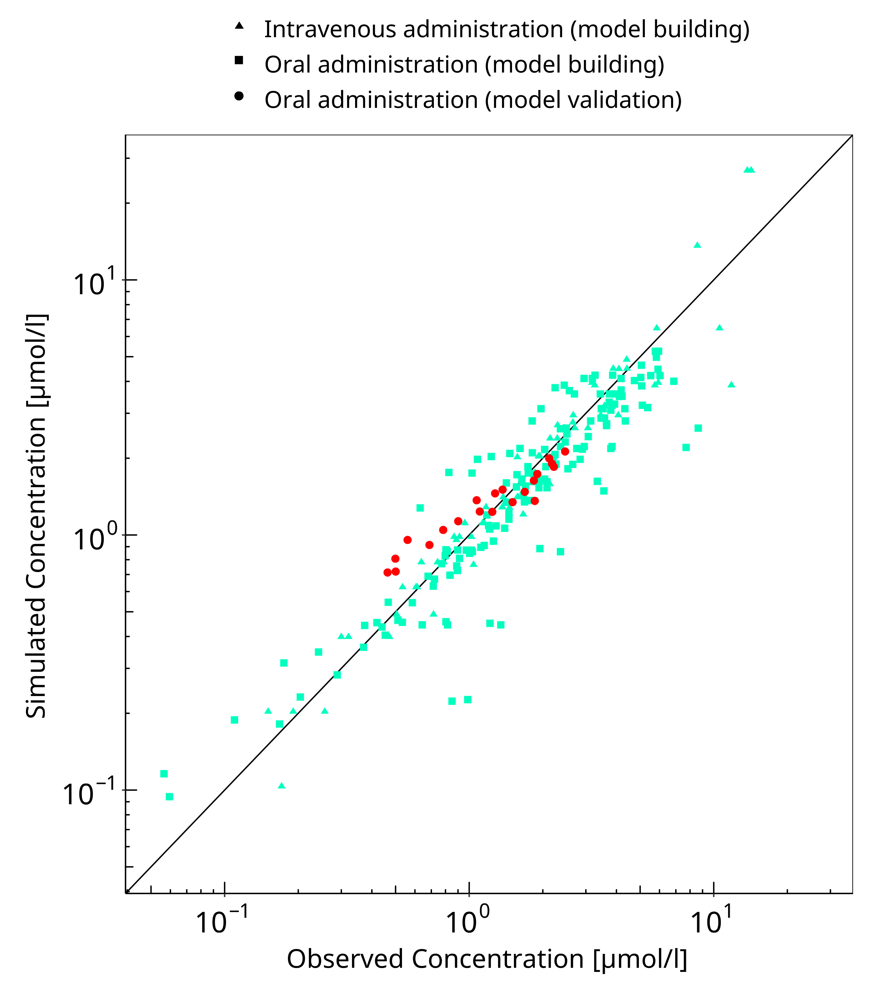

**Figure 3-1: Mexiletine concentration in plasma**

 
 

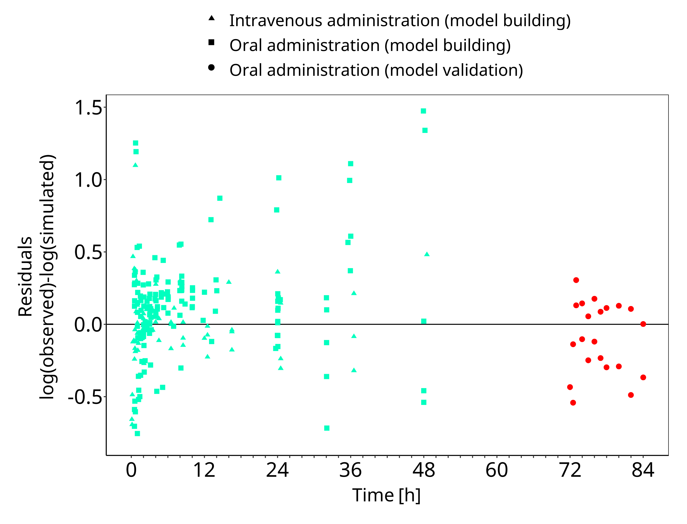

**Figure 3-2: Mexiletine concentration in plasma**

 
 

## 3.3 Concentration-Time Profiles

Simulated versus observed concentration-time profiles of all data listed in [Section 2.2.2](#222-clinical-data) are presented below.

### 3.3.1 Model Building

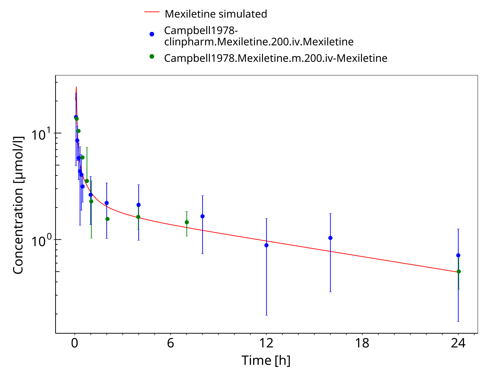

**Figure 3-3: Mexiletine 200 mg iv**

 
 

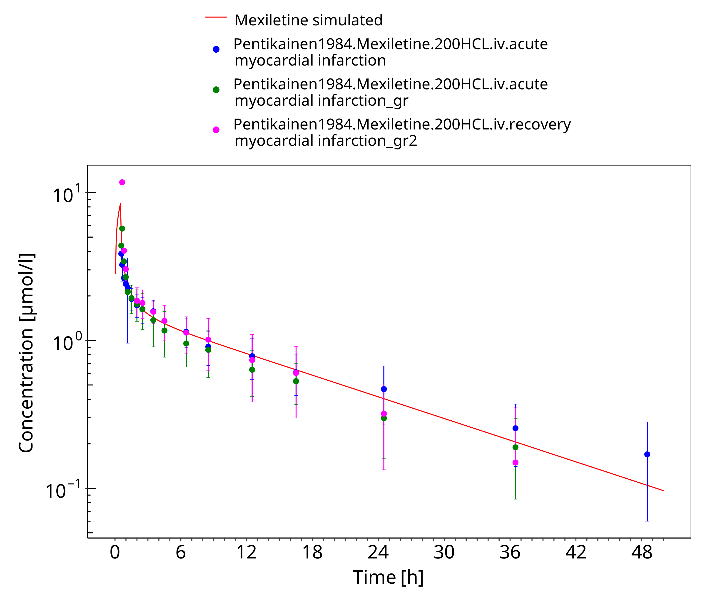

**Figure 3-4: Mexiletine 200 mg iv 30 min**

 
 

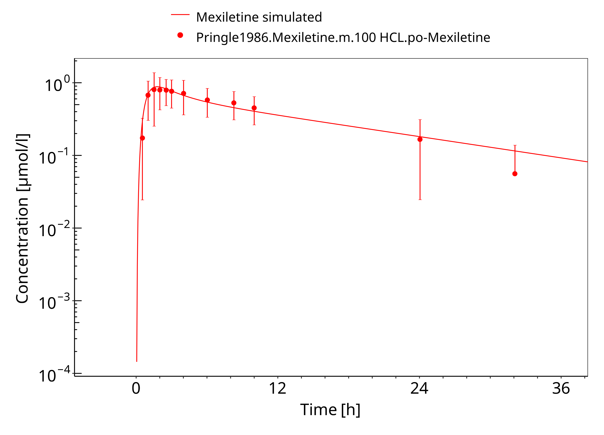

**Figure 3-5: Mexiletine HCL 100 mg po**

 
 

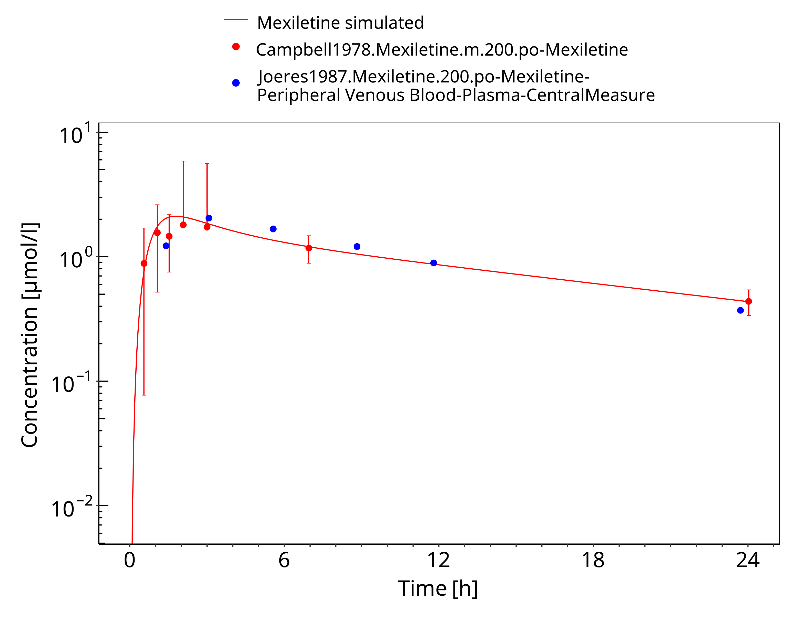

**Figure 3-6: Mexiletine 200 mg po**

 
 

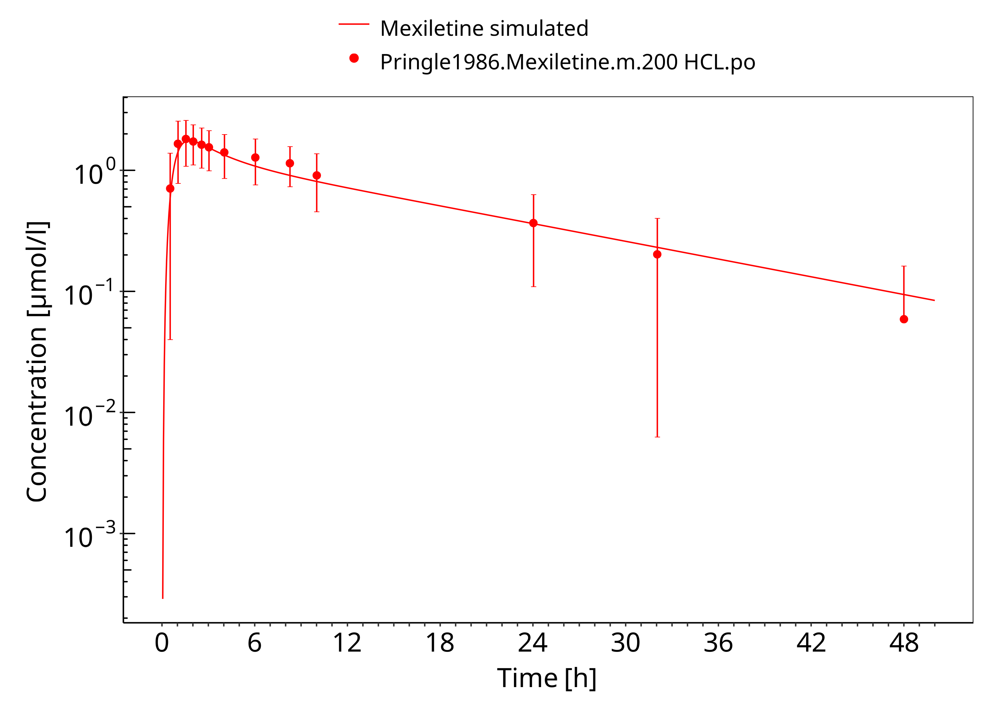

**Figure 3-7: Mexiletine HCL 200 mg po**

 
 

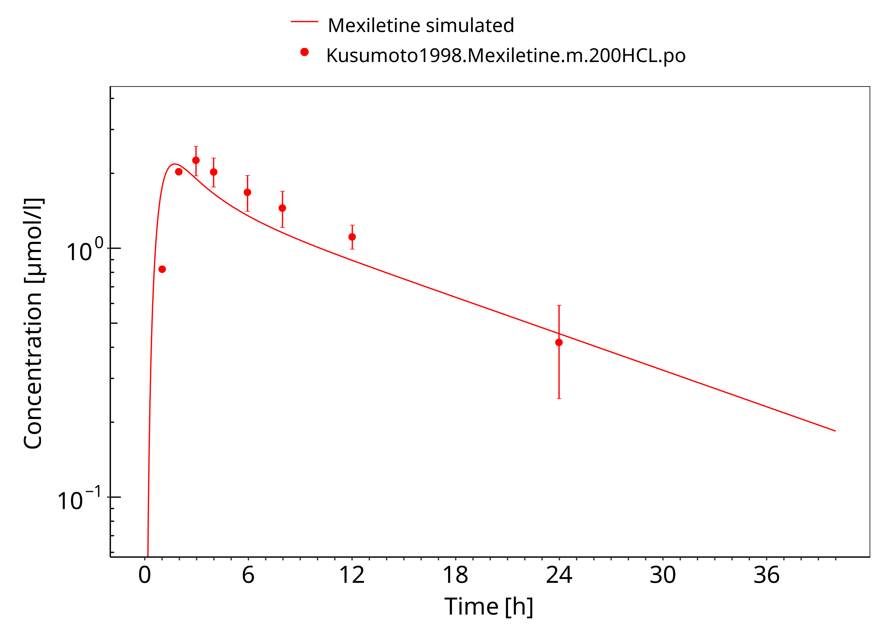

**Figure 3-8: Mexiletine HCL 200 mg po asian**

 
 

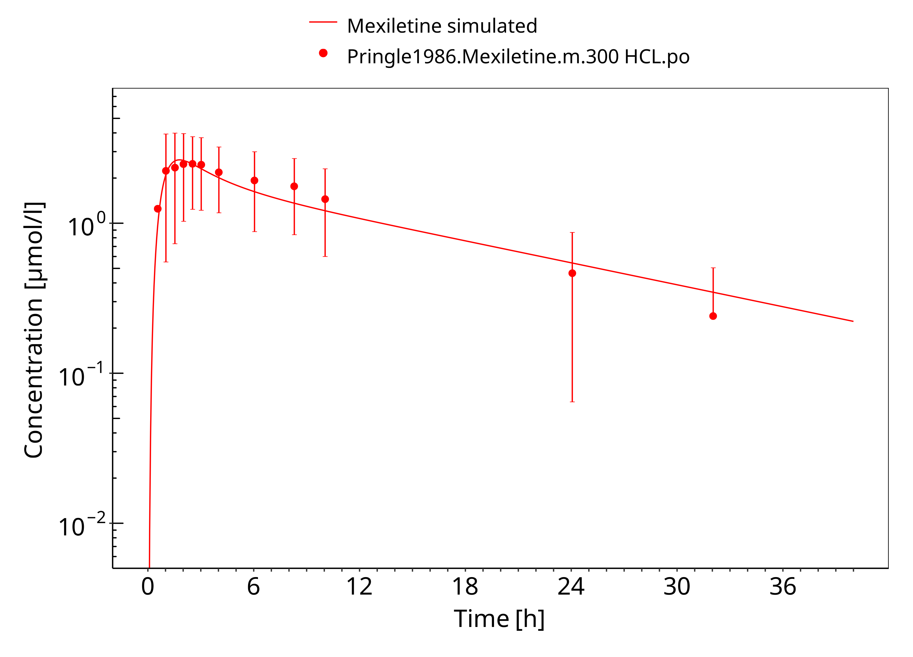

**Figure 3-9: Mexiletine HCL 300 mg po**

 
 

**Figure 3-10: Mexiletine HCL 400 mg po**

 
 

**Figure 3-11: Mexiletine 400 mg po**

 
 

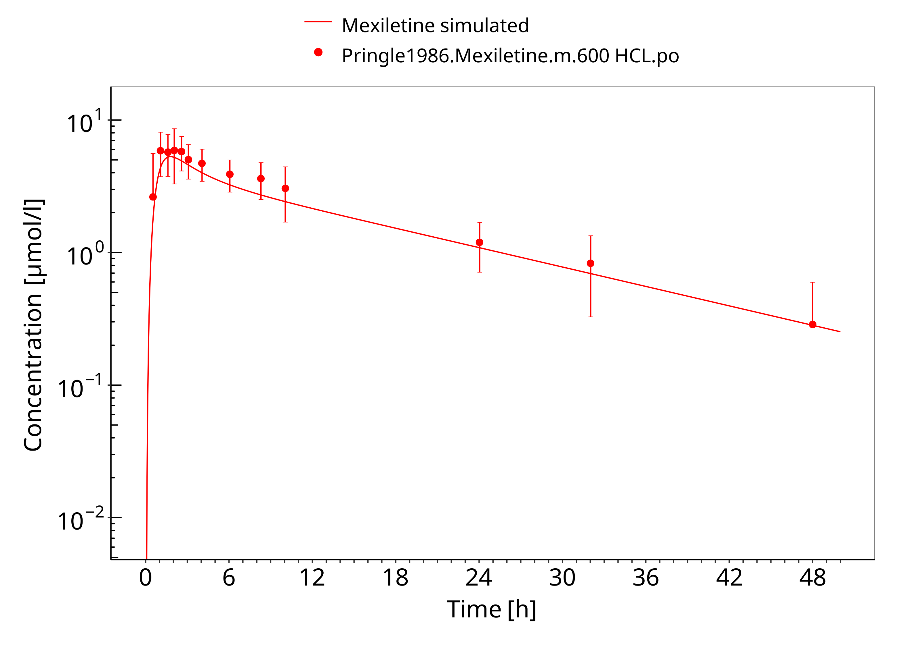

**Figure 3-12: Mexiletine HCL 600 mg po**

 
 

### 3.3.2 Model Verification

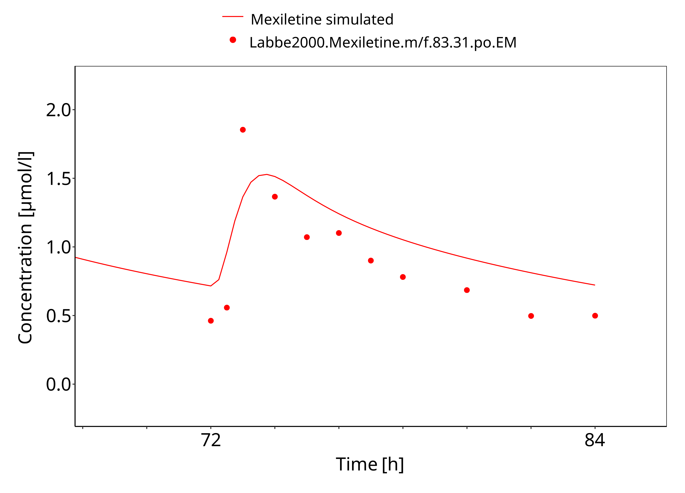

**Figure 3-13: Mexiletine 83.31 mg po bid EM**

 
 

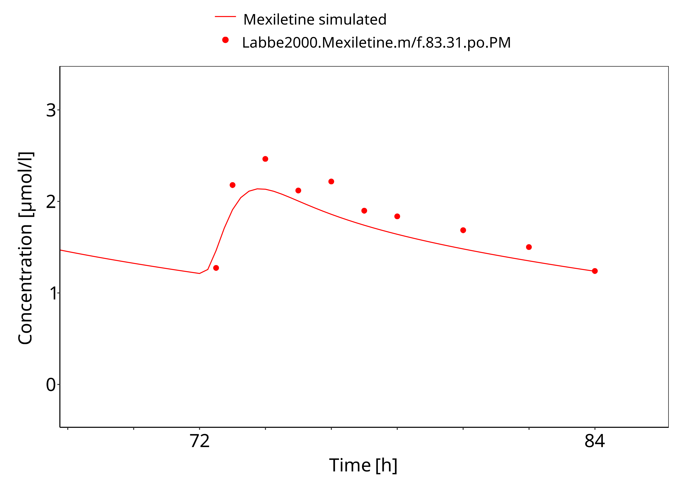

**Figure 3-14: Mexiletine 83.31 mg po bid PM**

 
 

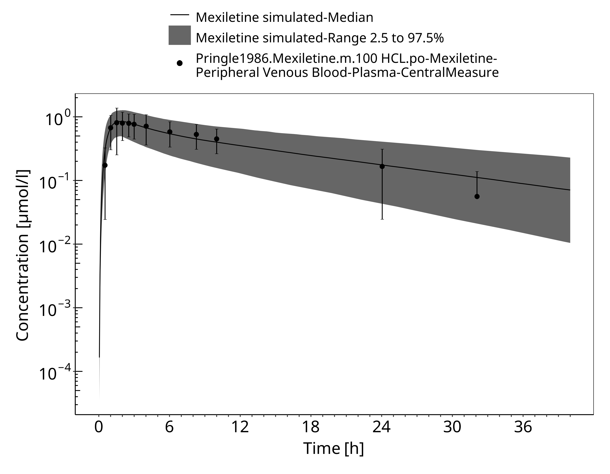

**Figure 3-15: Time Profile Analysis**

 
 

# 4 Conclusion

The PBPK model developed for mexiletine was able to accurately predict the time-profiles following i.v. and p.o. dosing of mexiletine in EM and PM phenotypes. Observed variability was generally larger than the predicted in population simulations. Depending on study population, smoking status or variation in CYP-phenotypes may lead to additional variability which might be not included in the PK-Sim ontogeny factor.

The predicted fraction excreted in urine was similar to the fraction reported in the label (9% vs 10%). The predicted bioavailability was 85%, compared to the observed as per label of 90%.

# 5 References

**Begg 1982** Begg, E., Chinwah, P., Webb, C., Day, R. & Wade, D. Enhanced metabolism of mexiletine after phenytoin administration. *British Journal of Clinical Pharmacology* **14**, 219–223 (1982).

**Campbell 1978** Campbell NP, Kelly JG, Adgey AA, Shanks RG. Mexiletine in normal volunteers. *Br J Clin Pharmacol*. 1978;6(4):372-373.

**DrugBank DB00379** (https://www.drugbank.ca/drugs/DB00379)

**Joeres 1987** Joeres, R., Klinker, H., Heusler, H., Epping, J., Richter, E. (1987). Influence of mexiletine on caffeine elimination*. Pharmacology & therapeutics*, 33(1), 163-169.

**Kuepfer 2016** Kuepfer L, Niederalt C, Wendl T, Schlender JF, Willmann S, Lippert J, Block M, Eissing T, Teutonico D. Applied Concepts in PBPK Modeling: How to Build a PBPK/PD Model.CPT Pharmacometrics Syst Pharmacol. 2016 Oct;5(10):516-531.

**Kusumoto 1998** Kusumoto M, Ueno K, Tanaka K, et al. Lack of pharmacokinetic interaction between mexiletine and omeprazole. *Ann Pharmacother*. 1998;32(2):182-184. 

**Labbé 2000** Labbé L, O’Hara G, Lefebvre M, et al. Pharmacokinetic and pharmacodynamic interaction be mexiletine and propafenone in human beings. *Clin Pharmacol Ther*. 2000;68(1):44-57.

**Mexiletine, Drugs.com** Mexiletine, Drugs.com, Website https://www.drugs.com/pro/mexiletine.html

**Pentikäinen 1984** Pentikainen P, Halinen M, Helin M. Pharmacokinetics of intravenous Mexiletine in patients with acute myocardial infarction. *J Cardiovasc Pharmacol*. 1984;6:1-6.

**PK-Sim Ontogeny Database Version 7.3** (https://github.com/Open-Systems-Pharmacology/OSPSuite.Documentation/blob/38cf71b384cfc25cfa0ce4d2f3addfd32757e13b/PK-Sim%20Ontogeny%20Database%20Version%207.3.pdf)

**Pringle 1986** Pringle T, Fox J, McNeill J, et al. Dose independent pharmacokinetics of mexiletine in healthy volunteers. *Br J Clin Pharmacol*. 1986;21(3):319-321.

**SmPC Namuscla** SmPC Namuscla 167 mg hard capsules, 2019, website https://www.medicines.org.uk/emc/product/9838/smpc

**Begg 1982** Webb C, Day R, Chinwah P, Wade D, Begg E. Enhanced metabolism of mexiletine after phenytoin administration. *Br J Clin Pharmacol*. 2012;14(2):219-223. 

**Wei 1991** Wei X, Dai R, Zhai S, Thummel KE, Friedman FK, Vestal RE. Inhibition of human liver cytochrome P-450 1A2 by the class IB antiarrhythmics mexiletine, lidocaine, and tocainide. *J Pharmacol Exp Ther*. 1999;289(2):853-858.

**Willmann 2007** Willmann S, Höhn K, Edginton A, Sevestre M, Solodenko J, Weiss W, Lippert J, Schmitt W. Development of a physiology-based whole-body population model for assessing the influence of individual variability on the pharmacokinetics of drugs. *J Pharmacokinet Pharmacodyn* 2007, 34(3): 401-431.

# 6 Glossary

| ADME    | Absorption, Distribution, Metabolism,  Excretion             |
| ------- | ------------------------------------------------------------ |
| AUC     | Area under the plasma concentration  versus time curve       |
| AUCinf  | AUC until infinity                                           |
| AUClast | AUC until last measurable sample                             |
| AUCR    | Area under the plasma concentration  versus time curve Ratio |
| b.i.d.  | Twice daily (bis in diem)                                    |
| CL      | Clearance                                                    |
| Clint   | Intrinsic liver clearance                                    |
| Cmax    | Maximum concentration                                        |
| CmaxR   | Maximum concentration Ratio                                  |
| CYP     | Cytochrome P450 oxidase                                      |
| CYP1A2  | Cytochrome P450 1A2 oxidase                                  |
| CYP2C19 | Cytochrome P450 2C19 oxidase                                 |
| CYP3A4  | Cytochrome P450 3A4 oxidase                                  |
| DDI     | Drug-drug interaction                                        |
| e.c.    | Enteric coated                                               |
| EE      | Ethinylestradiol                                             |
| EM      | Extensive metabolizers                                       |
| fm      | Fraction metabolized                                         |
| FMO     | Flavin-containing monooxygenase                              |
| fu      | Fraction unbound                                             |
| FDA     | Food and Drug administration                                 |
| GFR     | Glomerular filtration rate                                   |
| HLM     | Human liver microsomes                                       |
| hm      | homozygous                                                   |
| ht      | heterozygous                                                 |
| IM      | Intermediate metabolizers                                    |
| i.v.    | Intravenous                                                  |
| IVIVE   | In Vitro to In  Vivo Extrapolation                           |
| Ka      | Absorption rate constant                                     |
| kcat    | Catalyst rate constant                                       |
| Ki      | Inhibitor constant                                           |
| Kinact  | Rate of enzyme inactivation                                  |
| Km      | Michaelis Menten constant                                    |
| m.d.    | Multiple dose                                                |
| OSP     | Open Systems Pharmacology                                    |
| PBPK    | Physiologically-based pharmacokinetics                       |
| PK      | Pharmacokinetics                                             |
| PI      | Parameter identification                                     |
| PM      | Poor metabolizers                                            |
| RT-PCR  | Reverse transcription polymerase chain  reaction             |
| p.o.    | Per os                                                       |
| q.d.    | Once daily (quaque diem)                                     |
| SD      | Single Dose                                                  |
| SE      | Standard error                                               |
| s.d.SPC | Single dose Summary of Product Characteristics                |
| SD      | Standard deviation                                           |
| TDI     | Time dependent inhibition                                    |
| t.i.d   | Three times a day (ter in die)                               |
| UGT     | Uridine  5'-diphospho-glucuronosyltransferase                |
| UM      | Ultra-rapid metabolizers                                     |

