# Building and evaluation of a PBPK model for Pitavastatin in healthy adults

| Version                                         | 1.0-OSP12.1                                                   |
| ----------------------------------------------- | ------------------------------------------------------------ |
| based on *Model Snapshot* and *Evaluation Plan* | https://github.com/Open-Systems-Pharmacology/Pitavastatin-Model/releases/tag/v1.0 |
| OSP Version                                     | 12.1                                                          |
| Qualification Framework Version                 | 3.4                                                          |

This evaluation report and the corresponding PK-Sim project file are filed at:

https://github.com/Open-Systems-Pharmacology/OSP-PBPK-Model-Library/

# Table of Contents

 * [1 Introduction](#1)
 * [2 Methods](#2)
   * [2.1 Modeling strategy](#21)
   * [2.2 Data used](#22)
   * [2.3 Model parameters and assumptions](#23)
 * [3 Results and Discussion](#3)
   * [3.1 Pitavastatin final input parameters](#31)
   * [3.2 Pitavastatin Diagnostics Plots](#32)
   * [3.3 Concentration-Time Profiles](#33)
     * [3.3.1 Model Building](#331)
     * [3.3.2 Model Verification](#332)
 * [4 Conclusion](#4)
 * [5 References](#5)

# 1 Introduction

Pitavastatin  is an inhibitor of HMG-CoA reductase and indicated for hypercholesterolaemia and for the prevention of cardiovascular disease. Pitavastatin is an orally delivered drug with a bioavailability of about 80%. Pitavastatin is mainly excreted
via the bile via uptake into the liver by OATP1Bs and efflux to bile via BCRP, renal excretion is negligible.  

This pitavastatin model is intended to be used as a victim drug in OATP1B1-mediated drug-drug interactions (DDI).

This whole-body PBPK model of pitavastatin has been developed using published pharmacokinetic clinical data by Mori 2020 ([Mori 2020](#5-references)), Takehara 2018 ([Takehara 2018](#5-references)), Lou 2015 ([Lou 2015](#5-references)), Kimoto 2022 ([Kimoto 2022](#5-references)), Chen 2013 ([Chen 2013](#5-references)) and Prueksaritanont 2014 ([Prueksaritanont 2014](#5-references)). 
The clinical data included both intravenous and orally administration and a dose range of 0.2mg to 4 mg pitavastatin. 
The model has then been evaluated by simulating clinical studies with individuals of different SLO1B1 genotypes and comparing with respective observed data. 

The presented model includes the following features:

- metabolism by unspecified UGT enzyme present in the liver,
- transport by OATP1B1/B3,
- transport by BCRP,
- no renal clearance,
- oral absorption with dissolution rate assigned to the Lint80 function.

# 2 Methods

## 2.1 Modeling strategy

The general concept of building a PBPK model has previously been described by Kuepfer et al. ([Kuepfer 2016](#5-references)). Relevant information on anthropometric (height, weight) and physiological parameters (e.g. blood flows, organ volumes, binding protein concentrations, hematocrit, cardiac output) in adults was gathered from the literature and has been previously published ([Willmann 2007](#5-references)). The information was incorporated into PK-Sim® and was used as default values for the simulations in adults.

The applied activity and variability of plasma proteins and active processes that are integrated into PK-Sim® are described in the publicly available PK-Sim® Ontogeny Database Version 7.3 ([PK-Sim Ontogeny Database Version 7.3](#5-references)) or otherwise referenced for the specific process.

A mean model was built based on clinical data from studies with intravenous and oral administration of pitavastatin by Mori 2020 ([Mori 2020](#5-references)), Takehara 2018 ([Takehara 2018](#5-references)), Lou 2015 ([Lou 2015](#5-references)), Kimoto 2022 ([Kimoto 2022](#5-references)), Chen 2013 ([Chen 2013](#5-references)) and Prueksaritanont 2014 ([Prueksaritanont 2014](#5-references)). The studies reported mean plasma concentrations of pitavastatin. The mean PBPK model was developed using a mean individual based on the demographic data for each study and if no demographic data were provided the following values were used; male, European, 30 years of age, 73 kg body weight and 176 cm body height. The relative tissue-specific expressions of the enzyme and transporter predominantly being involved in the metabolism/transport of pitavastatin (OATP1B1 and BCRP) were considered ([Meyer 2012](#5-references)). A Lint80 function with 80% of tablet dissolved in 30 minutes were applied according to Cho 2024 ([Cho 2024](#5-references)). 

Due to the large inter-study variability of pitavastatin plasma concentration, a large part of the available clinical data was used for model building.

A specific set of parameters (see below) was optimized to describe the disposition of pitavastatin using the Parameter Identification module provided in PK-Sim®. Structural model selection was mainly guided by visual inspection and total error of the resulting description of data, 95% confidence interval of the identified parameter values and biological plausibility.

The model was then verified by simulating further clinical studies reporting pharmacokinetic concentration-time profiles after oral administration of pitavastatin in individuals with different SLCO1B1 genotypes.

Details about input data (physicochemical, *in vitro* and clinical) can be found in [Section 2.2](#22-data-used).

Details about the structural model and its parameters can be found in [Section 2.3](#23-model-parameters-and-assumptions).

## 2.2 Data used

### 2.2.1 In vitro and physicochemical data

A literature search was performed to collect available information on physicochemical properties of pitavastatin. The obtained information from literature is summarized in the table below, and is used for model building.

| **Parameter**           | **Unit** | **Value** | Source                               | **Description**                                              |
| :---------------------- | -------- | --------- | ------------------------------------ | ------------------------------------------------------------ |
| MW                      | g/mol    | 421.46    | [Yoshikado 2018](#5-references)        | Molecular weight                                             |
| pKa (acid)   |          | 4.24      | [Yoshikado 2018](#5-references)         | acid dissociation constant of conjugate acid                 |
| pKa (base)   |          | 4.68      | [Yoshikado 2018](#5-references)         | acid dissociation constant of conjugate base                 |
| Solubility (pH7.4)      | mg/mL    | 0.004     | [DrugBank](#5-references)              | Aqueous Solubility in pH 7.4                 |
| logP                    |          | 1.92     | [Yoshikado 2018](#5-references)         | Partition coefficient between octanol and water              |
|                         |          |2.91      | [Kimoto 2022](#5-references)         | Partition coefficient between octanol and water              |
| fu                      | %        | 0.52       | [Yoshikado 2018](#5-references)   | Fraction unbound in plasma                                   |
| Km OATP1B1   | µmol/L   | 0.77     | [Duan 2017](#5-references)            | OATP1B1 Michaelis-Menten constant                             |
| Km BCRP      | µmol/L   | 2.02       | Assumed same as for Rosuvastatin| BCRP Michaelis-Menten                                    |
| Lint80 Dissolution time | min      | 30     | [Cho 2024](#5-references)          | Dissolution time until 80% of drug is dissolved              |
| GFR fraction            | fraction | 0     | [Mochizuki 2022](#5-references)        | glomerular filtration rate              |

### 2.2.2 Clinical data

A literature search was performed to collect available clinical data on pitavastatin in adults. 

The following publications were found in adults for model building:

| Publication                   | Arm / Treatment / Information used for model building        |
| :---------------------------- | :----------------------------------------------------------- |
| [Kimoto 2022](#5-references)   | Plasma PK profiles in healthy subjects after single iv infusion (1h) of 2 mg pitavastatin and oral administration of 2 and 4 mg pitavastatin|
| [Mori 2020](#5-references)  | Plasma PK profiles in healthy subjects after single oral administration of 0.2 mg pitavastatin |
| [Takehara 2018](#5-references) | Plasma PK profiles in healthy subjects after single oral administration of 0.2 mg pitavastatin|
| [Lou 2015](#5-references)   | Plasma PK profiles in healthy subjects after single oral administration of 1, 2 and 4 mg pitavastatin |
| [Chen 2013](#5-references)   | Plasma PK profiles in healthy subjects after single oral administration of 4 mg pitavastatin |
| [Prueksaritanont 2014](#5-references)   | Plasma PK profiles in healthy subjects after single oral administration of 1 mg pitavastatin |

The following dosing scenarios were simulated and compared to respective data for model verification:

| Scenario                                                     | Data reference                       |
| ------------------------------------------------------------ | ------------------------------------ |
| po 2 mg in 3 different SLCO1B1 genotypes                     |[Ieiri 2007](#5-references)           |

## 2.3 Model parameters and assumptions

### 2.3.1 Absorption

The parameter value for  `Specific intestinal permeability`  was optimized based on clinical oral data, see results of optimization in [Section 2.3.4](#234-automated-parameter-identification). The solubility was obtained from DrugBank (see [Section 2.2.1](#221-in-vitro-and-physicochemical-data))

The dissolution of tablets was implemented via empirical Lint80 dissolution, according to Cho 2023 ([Cho 2024](#5-references)). 

### 2.3.2 Distribution

Pitavastatin is highly bound to plasma proteins (>99 %) (see [Section 2.2.1](#221-in-vitro-and-physicochemical-data)). A value of 0.52% was used in this PBPK model for `Fraction unbound (plasma, reference value)`. The major binding partner was set to albumin (see [Section 2.2.1](#221-in-vitro-and-physicochemical-data)).

An important parameter influencing the resulting volume of distribution is lipophilicity. The reported experimental logP values are in the range of 1.92-2.91 (see [Section 2.2.1](#221-in-vitro-and-physicochemical-data)) which served as a starting value. Finally, the model parameters `Lipophilicity` was optimized to match clinical data (see also [Section 2.3.4](#234-automated-parameter-identification)).

After testing the available organ-plasma partition coefficient and cell permeability calculation methods built in PK-Sim, observed clinical data was best described by choosing the partition coefficient calculation by `Rodgers and Rowland` and cellular permeability calculation by `Charge dependent Schmitt`.

### 2.3.3 Metabolism and Elimination

One metabolic pathway was implement into the model a first order process 

* Unspecific UGT
Metabolic enzyme activity is described as first order process

The unspecific UGT was set to only be expressed in the liver. Metabolic enzyme activity was set to be described as first order process, were the `CLspec/[Enzyme]` was optimized based on clinical data (see [Section 2.3.4](#234-automated-parameter-identification)).

And two transport protein was implemented into the model via Michaelis-Menten kinetics 

* OATP1B1

The OATP1B1 expression profiles is based on high-sensitive real-time RT-PCR ([Nishimura 2003](#5-references)). The reference concentration for OATP1B1 was measured by liquid chromatography tandem mass spectroscopy ([Prasad 2014](#5-references)), i.e not according to the default implementation in PK-Sim. Transporter activity was described as saturable process following Michaelis-Menten kinetics, were the `Km` was taken from literature and the `kcat` was optimized based on clinical data (see [Section 2.3.4](#234-automated-parameter-identification)).

* BCRP

The BCRP expression profiles is based on Microarray expression data from ArrayExpress. The reference concentration for BCRP was measured by liquid chromatography tandem mass spectroscopy ([Prasad 2013](#5-references)), i.e not according to the default implementation in PK-Sim. Transporter activity was described as saturable process following Michaelis-Menten kinetics, were the `Km` was taken from literature and the `kcat` was optimized based on clinical data (see [Section 2.3.4](#234-automated-parameter-identification)).

Additionally, renal clearance was set to 0 according to literature (see [Section 2.2.1](#221-in-vitro-and-physicochemical-data)).

### 2.3.4 Automated Parameter Identification

The following parameters were optimized by fitting the model to the data:

| Model Parameter                |
| ------------------------------ | 
| `Lipophilicity`                | 
| `kcat` (OATP1B1)               |
| `CLspec/[Enzyme]` (OAT3)       |
| `kcat` (BCRP)                  |
| `Specific intestinal permeability`| 

 

# 3 Results and Discussion

The PBPK model for pitavastatin was developed and verified with clinical pharmacokinetic data.

The model was built and evaluated covering data from studies including in particular

* single intravenous administration and single oral administrations (tablets).
* a dose range of 0.2 to 4 mg.

The model quantifies excretion via bile through BCRP transport, influx to liver via OATP1B1/1B3 and metabolism via unspecified UGT enzyme present in the liver.

The next sections show:

1. the final model input parameters for the building blocks: [Section 3.1](#31-pitavastatin-final-input-parameters).
2. the overall goodness of fit: [Section 3.2](#32-pitavastatin-diagnostics-plots).
3. simulated vs. observed concentration-time profiles for the clinical studies used for model building and for model verification: [Section 3.3](#33-concentration-time-profiles).

## 3.1 Pitavastatin final input parameters

The compound parameter values of the final PBPK model are illustrated below.

### Compound: Pitavastatin

#### Parameters

Name                                             | Value                  | Value Origin                                                                                             | Alternative | Default
------------------------------------------------ | ---------------------- | -------------------------------------------------------------------------------------------------------- | ----------- | -------
Solubility at reference pH                       | 0.004 mg/ml            | Database-DrugBank                                                                                        | Measurement | True   
Reference pH                                     | 7                      | Database-DrugBank                                                                                        | Measurement | True   
Lipophilicity                                    | 0.9683645282 Log Units | Parameter Identification-Parameter Identification-Value updated from 'PI-final' on 2024-03-18 16:36      | fit         | True   
Fraction unbound (plasma, reference value)       | 0.52 %                 | Parameter Identification-Parameter Identification-Value updated from 'PI#3c_MC_JE_5' on 2024-03-07 12:12 | Measurement | True   
Specific intestinal permeability (transcellular) | 0.0140921913 cm/min    | Parameter Identification-Parameter Identification-Value updated from 'PI-final' on 2024-03-18 16:37      | fit         | True   
F                                                | 1                      | Publication-Yoshikado 2018                                                                               |             |        
Is small molecule                                | Yes                    |                                                                                                          |             |        
Molecular weight                                 | 421.46 g/mol           | Publication-Yoshikado 2018                                                                               |             |        
Plasma protein binding partner                   | Albumin                |                                                                                                          |             |        

#### Calculation methods

Name                    | Value                   
----------------------- | ------------------------
Partition coefficients  | Rodgers and Rowland     
Cellular permeabilities | Charge dependent Schmitt

#### Processes

##### Transport Protein: BCRP-PI

Molecule: BCRP

###### Parameters

Name                      | Value              | Value Origin                                                                                       
------------------------- | ------------------ | ---------------------------------------------------------------------------------------------------
Transporter concentration | 1 µmol/l           |                                                                                                    
Vmax                      | 0 µmol/l/min       |                                                                                                    
Km                        | 2.02 µmol/l        | Other-In Vitro-Hanke et al Assuming similar Km as for Rosuvastatin                                 
kcat                      | 0.3826135266 1/min | Parameter Identification-Parameter Identification-Value updated from 'PI-final' on 2024-03-18 16:36

##### Transport Protein: OATP1B1/1B3-PI

Molecule: OATP1B1/1B3

###### Parameters

Name                      | Value         | Value Origin                                                                                                                   
------------------------- | ------------- | -------------------------------------------------------------------------------------------------------------------------------
Transporter concentration | 1 µmol/l      |                                                                                                                                
Vmax                      | 0 µmol/l/min  |                                                                                                                                
Km                        | 0.77 µmol/l   | Publication-In Vitro-Duan et al 2017                                                                                           
kcat                      | 739.176 1/min | Parameter Identification-Parameter Identification-Value updated from 'PI-final' on 2024-03-18 16:36 and correction OSP to Hanke

##### Systemic Process: Glomerular Filtration-GFR

Species: Human

###### Parameters

Name         | Value | Value Origin    
------------ | -----:| ----------------
GFR fraction |     0 | Other-Assumption

##### Metabolizing Enzyme: UGT-fit

Molecule: UGT

###### Parameters

Name                           | Value                     | Value Origin                                                                                       
------------------------------ | ------------------------- | ---------------------------------------------------------------------------------------------------
In vitro CL/recombinant enzyme | 0 µl/min/pmol rec. enzyme |                                                                                                    
CLspec/[Enzyme]                | 0.0220585031 l/µmol/min   | Parameter Identification-Parameter Identification-Value updated from 'PI-final' on 2024-03-18 16:37

##### Transport Protein: OATP1B1/1B3-genotype SLCO1B1_1b_15

Molecule: OATP1B1/1B3

###### Parameters

Name                      | Value         | Value Origin                                                  
------------------------- | ------------- | --------------------------------------------------------------
Transporter concentration | 1 µmol/l      |                                                               
Vmax                      | 0 µmol/l/min  |                                                               
Km                        | 0.77 µmol/l   | Publication-In Vitro-Duan et al 2017                          
kcat                      | 369.588 1/min | Parameter Identification-Assumption-half of PI fitted activity

##### Transport Protein: OATP1B1/1B3-genotype SLCO1B1_15_15

Molecule: OATP1B1/1B3

###### Parameters

Name                      | Value         | Value Origin                                          
------------------------- | ------------- | ------------------------------------------------------
Transporter concentration | 1 µmol/l      |                                                       
Vmax                      | 0 µmol/l/min  |                                                       
Km                        | 0.77 µmol/l   | Publication-In Vitro-Duan et al 2017                  
kcat                      | 184.794 1/min | Parameter Identification-Assumption-1/4 of PI activity

## 3.2 Pitavastatin Diagnostics Plots

Below you find the goodness-of-fit visual diagnostic plots for the PBPK model performance of all data used presented in [Section 2.2.2](#222-clinical-data).

The first plot shows observed versus simulated plasma concentration, the second weighted residuals versus time. 

**Table 3-1: GMFE for Goodness of fit plot for concentration in plasma.**

|Group                                                 |GMFE |
|:-----------------------------------------------------|:----|
|Pitavastatin iv (model building)                      |1.31 |
|Pitavastatin oral administration (model building)     |2.04 |
|Pitavastatin oral administration (model verification) |1.42 |
|All                                                   |1.76 |

 
 

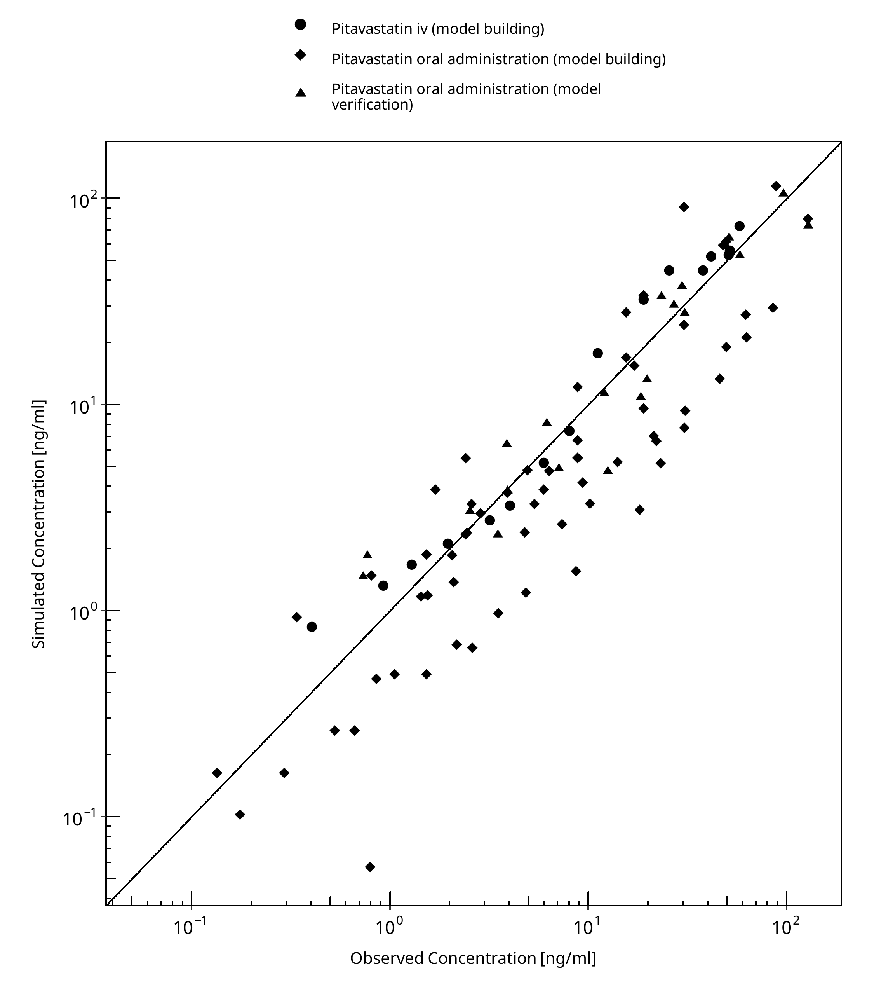

**Figure 3-1: Goodness of fit plot for concentration in plasma.**

 
 

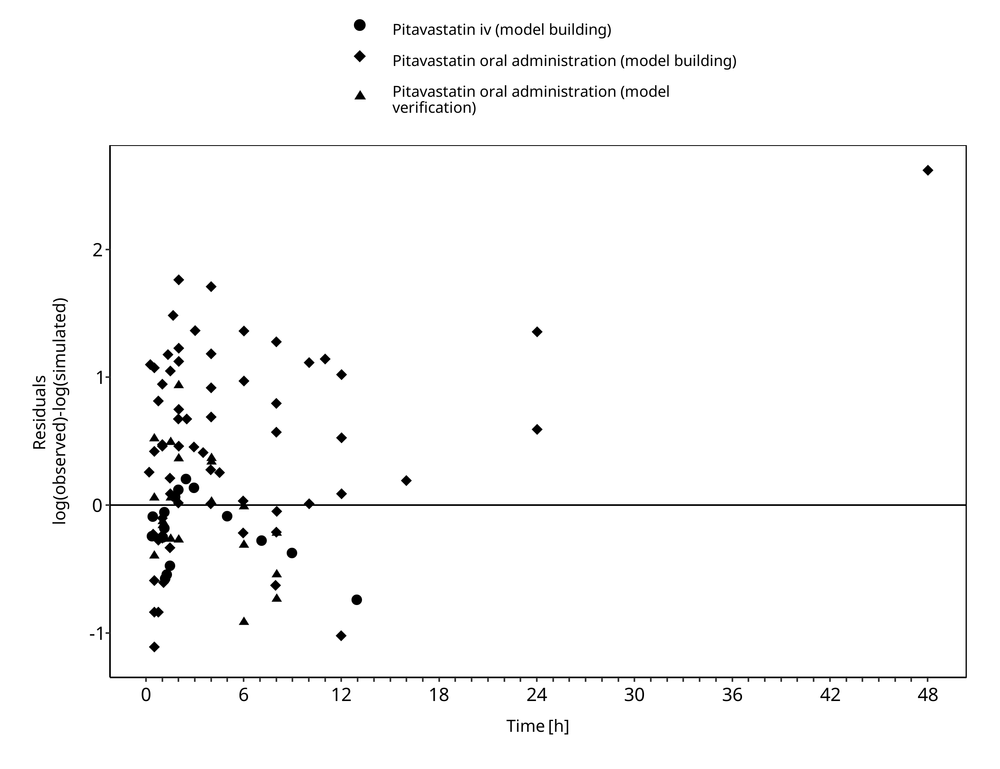

**Figure 3-2: Goodness of fit plot for concentration in plasma.**

 
 

## 3.3 Concentration-Time Profiles

Simulated versus observed concentration-time profiles of all data listed in [Section 2.2.2](#222-clinical-data) are presented below.

### 3.3.1 Model Building

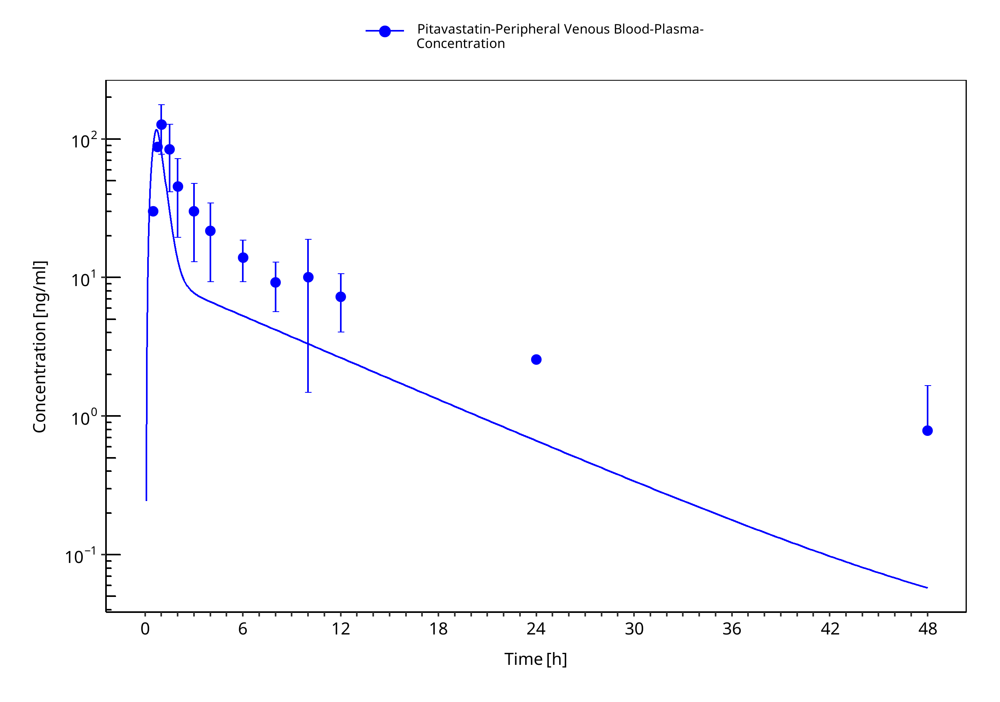

**Figure 3-3: Chen et al. 2013 po 4 mg**

 
 

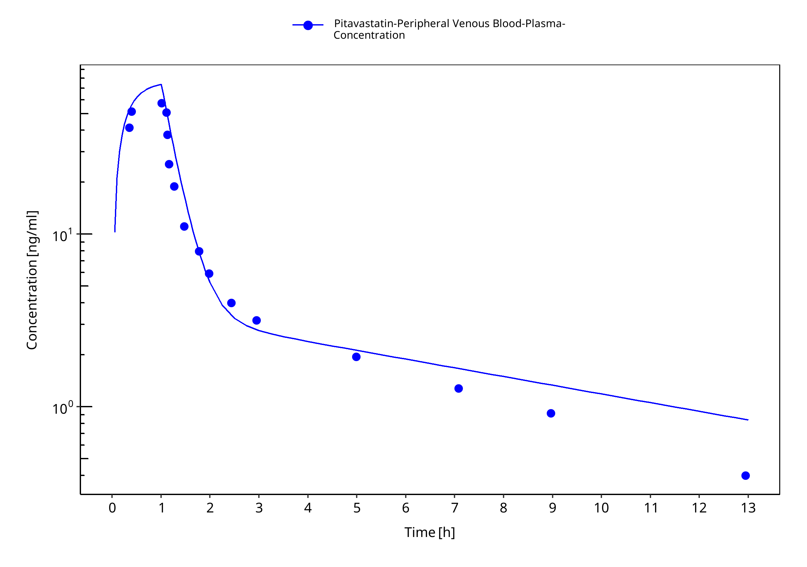

**Figure 3-4: Kimoto et al 2022 - Pitavastatin 2 mg iv infusion**

 
 

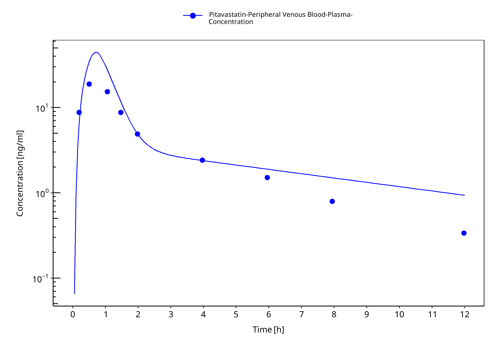

**Figure 3-5: Kimoto et al 2022 - Pitavastatin po 2mg**

 
 

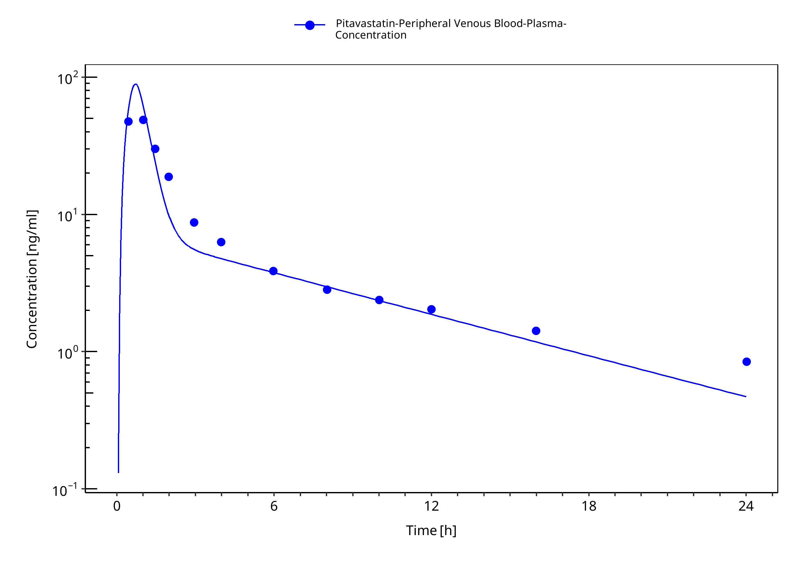

**Figure 3-6: Kimoto et al 2022 - Pitavastatin po 4mg**

 
 

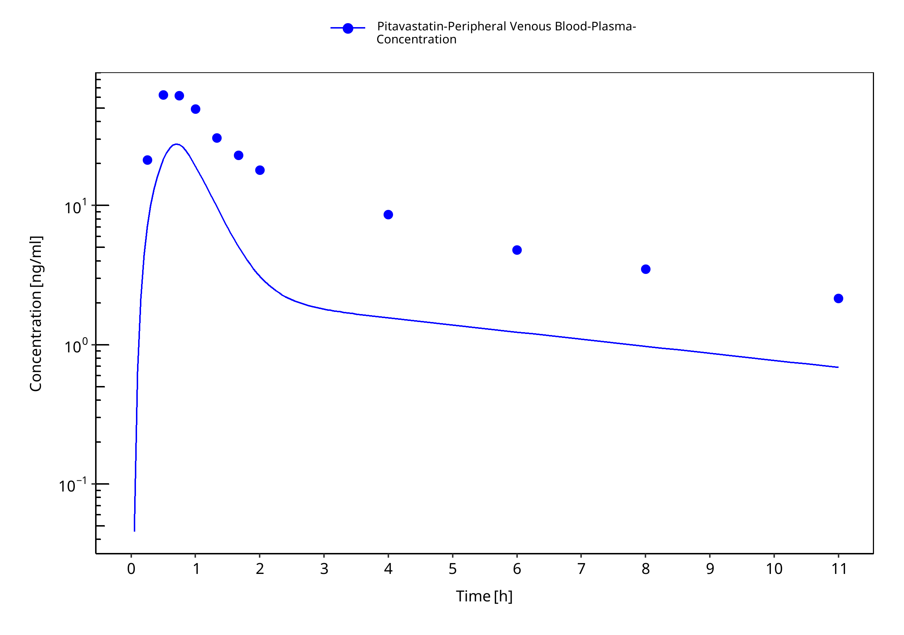

**Figure 3-7: Lou et al. 2015 - Pitavastatin po 1 mg**

 
 

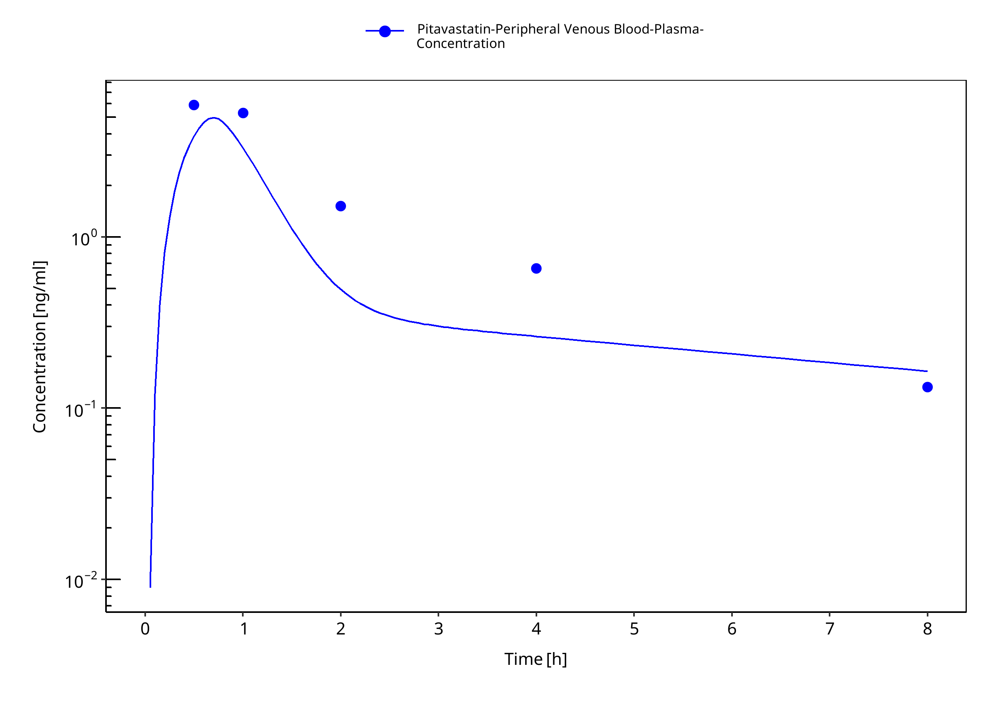

**Figure 3-8: Mori et al 2020 - Pitavastatin po 0.2 mg**

 
 

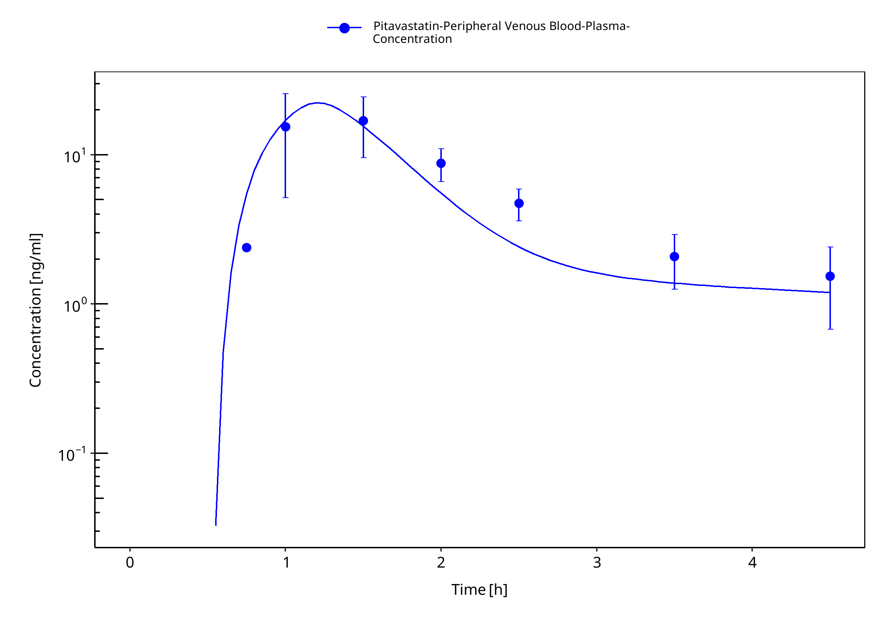

**Figure 3-9: Prueksaritanont et al. 2014 - Pitavastatin po 1 mg**

 
 

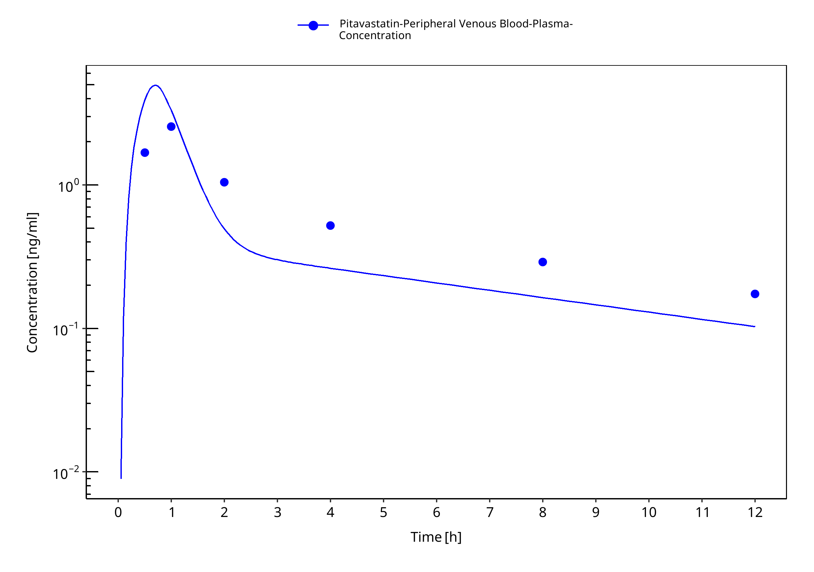

**Figure 3-10: Takehara et al. 2018 - Pitavastatin po 0.2 mg**

 
 

### 3.3.2 Model Verification

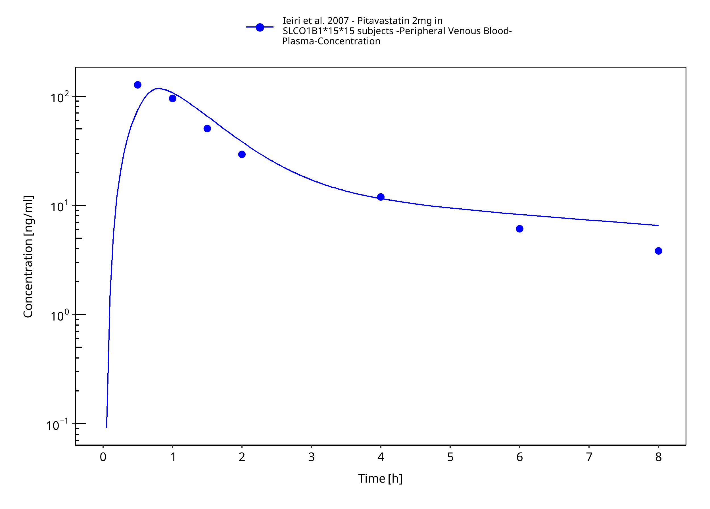

**Figure 3-11: Ieiri et al. 2007 - Pitavastatin 2mg in SLCO1B1*15*15 subjects**

 
 

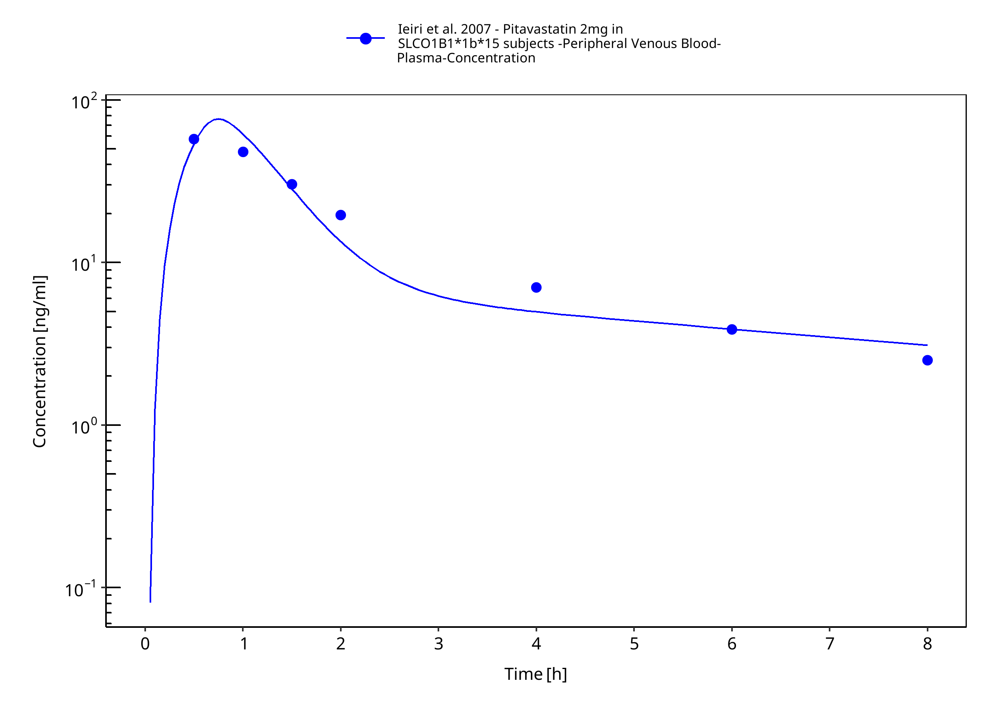

**Figure 3-12: Ieiri et al. 2007 - Pitavastatin 2mg in SLCO1B1*1b*15 subjects**

 
 

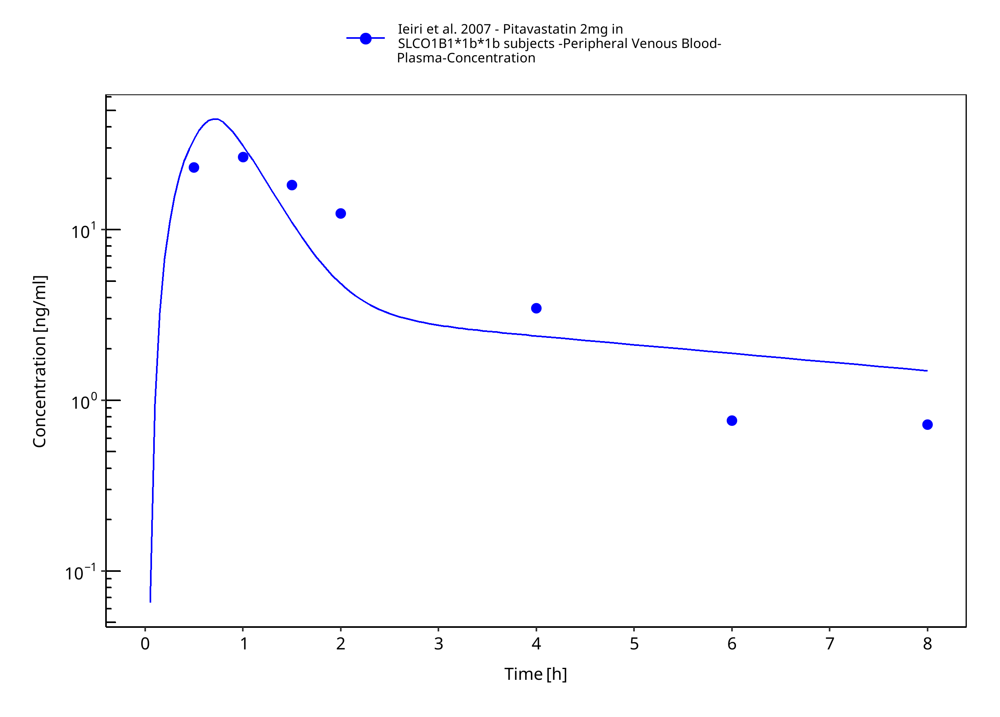

**Figure 3-13: Ieiri et al. 2007 - Pitavastatin 2mg in SLCO1B1*1b*1b subjects**

 
 

# 4 Conclusion

The presented PBPK model adequately describes the intravenous and oral pharmacokinetics of pitavastatin in adults.

# 5 References

**Chen 2013** Y Chen, W Zhang, WH Huang, ZR Tan, YC Wang, X Huang, HH Zhou (2013). Effect of a single-dose rifampin on the pharmacokinetics of pitavastatin in healthy volunteers. *Eur J Clin Pharmacol.*, Nov;69(11):1933-8.

**Cho 2024** CK Cho, JY Mo, E Ko, P Kang, CG Jang, SY Lee, YJ Lee, JW Bae, CI Choi  (2024). Physiologically based pharmacokinetic (PBPK) modeling of pitavastatin in relation to SLCO1B1 genetic polymorphism. *Arch Pharm Res.*, Feb;47(2):95-110.

**Duan 2017** P Duan, P Zhao, L Zhang (2017). Physiologically Based Pharmacokinetic (PBPK) Modeling of Pitavastatin and Atorvastatin to Predict Drug-Drug Interactions (DDIs). *Eur J Drug Metab Pharmacokinet.* Aug;42(4):689-705.

**Ieiri 2007** Ieiri I, Suwannakul S, Maeda K, Uchimaru H, Hashimoto K, Kimura M, Fujino H, Hirano M, Kusuhara H, Irie S, Higuchi S, Sugiyama Y. SLCO1B1 (OATP1B1, an uptake transporter) and ABCG2 (BCRP, an efflux transporter) variant alleles and pharmacokinetics of pitavastatin in healthy volunteers. Clin *Pharmacol Ther.* 2007 Nov;82(5):541-7

**Kimoto 2022** E Kimoto, C Costales, MA West, YA Bi, M Vourvahis, A David Rodrigues, MVS Varma (2022). Biomarker-Informed Model-Based Risk Assessment of Organic Anion Transporting Polypeptide 1B Mediated Drug-Drug Interactions. *Clin Pharmacol Ther*, Feb;111(2):404-415.

**Lou 2015** Z Luo, Y Zhang, J Gu, P Feng, Y Wang (2015). Pharmacokinetic Properties of Single- and Multiple-Dose Pitavastatin Calcium Tablets in Healthy Chinese Volunteers. *Curr Ther Res Clin Exp*, Mar 3;77:52-7.

**Meyer 2012** Meyer M, Schneckener S, Ludewig B, Kuepfer L, Lippert J. (2012). Using expression data for quantification of active processes in physiologically based pharmacokinetic modeling. *Drug Metab Dispos*. May;40(5), 892-901.

**Mochizuki 2022** T Mochizuki, Y Aoki, T Yoshikado, K Yoshida, Y Lai, H Hirabayashi, Y Yamaura, K Rockich, K Taskar, T Takashima, X Chu, MJ Zamek-Gliszczynski, J Mao, K Maeda, K Furihata, Y Sugiyama, H Kusuhara (2022). Physiologically-based pharmacokinetic model-based translation of OATP1B-mediated drug-drug interactions from coproporphyrin I to probe drugs. *Clin Transl Sci.* Jun;15(6):1519-1531. 

**Mori 2020** D Mori, E Kimoto, B Rago, Y Kondo, A King‐Ahmad, R Ramanathan, LS Wood, JG Johnson, VH Le, M Vourvahis, A David Rodrigues (2020). Dose‐dependent inhibition of OATP1B by rifampicin in healthy volunteers: comprehensive evaluation of candidate biomarkers and OATP1B probe drugs. *Clinical Pharmacology & Therapeutics*, Apr;107(4):1004-13.

**Nishimura 2003** Nishimura M, Yaguti H, Yoshitsugu H, Naito S, Satoh T. (2003). Tissue distribution of mRNA expression of human cytochrome P450 isoforms assessed by high-sensitivity real-time reverse transcription PCR. *Yakugaku Zasshi.* May;123(5), 369-75.

**Prasad 2013** Prasad B, Lai Y, Lin Y, Unadkat JD (2013) Interindividual variability in the hepatic expression of the human breast cancer resistance protein (BCRP/ABCG2): effect of age, sex, and genotype. Journal of pharmaceutical sciences 102(3):787–93

**Prasad 2014** Prasad B, Evers R, Gupta A, Hop CECA, Salphati L, Shukla S, Ambudkar SV, Unadkat JD (2014) Interindividual variability in hepatic organic anion-transporting polypeptides and P-Glycoprotein (ABCB1) protein expression: Quantification by liquid chromatography tandem mass spectroscopy and influence of genotype, age, and sex. Drug Metabolism and Disposition 42(1):78–88

**Prueksaritanont 2014**T Prueksaritanont, X Chu, R Evers, SO Klopfer, L Caro, PA Kothare, C Dempsey, S Rasmussen, R Houle, G Chan, X Cai, R Valesky, IP Fraser, SA Stoch (2014). Pitavastatin is a more sensitive and selective organic anion-transporting polypeptide 1B clinical probe than rosuvastatin. Br J Clin Pharmacol., Sep;78(3):587-98.

**Takehara 2018** I Takehara, T Yoshikado, K Ishigame, D Mori, KI Furihata, N Watanabe, O Ando, K Maeda, Y Sugiyama, H Kusuhara (2018). Comparative study of the dose-dependence of OATP1B inhibition by rifampicin using probe drugs and endogenous substrates in healthy volunteers. *Pharmaceutical research*, Jul;35:1-3.

