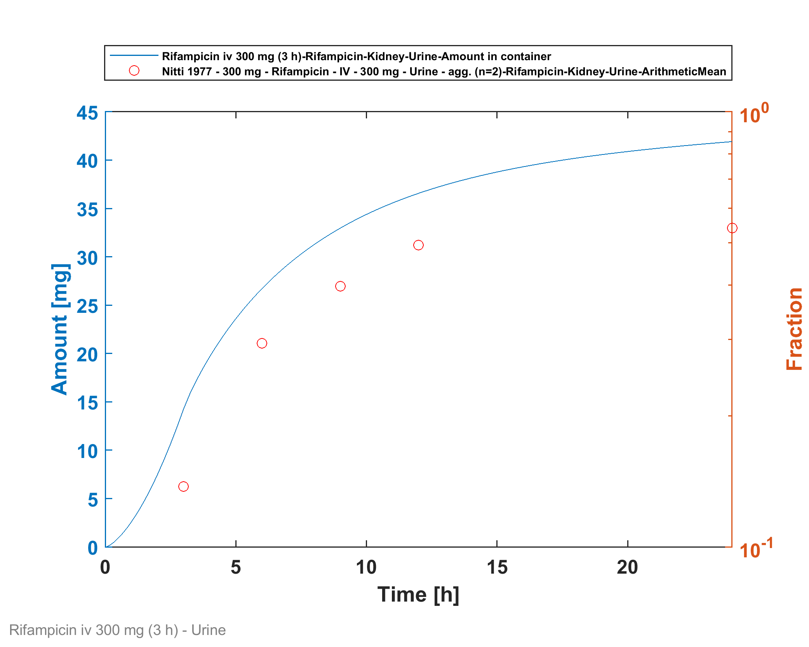
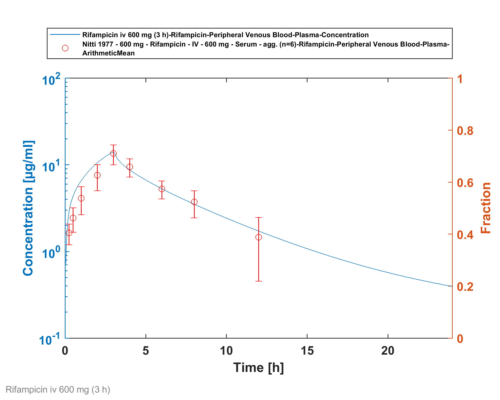
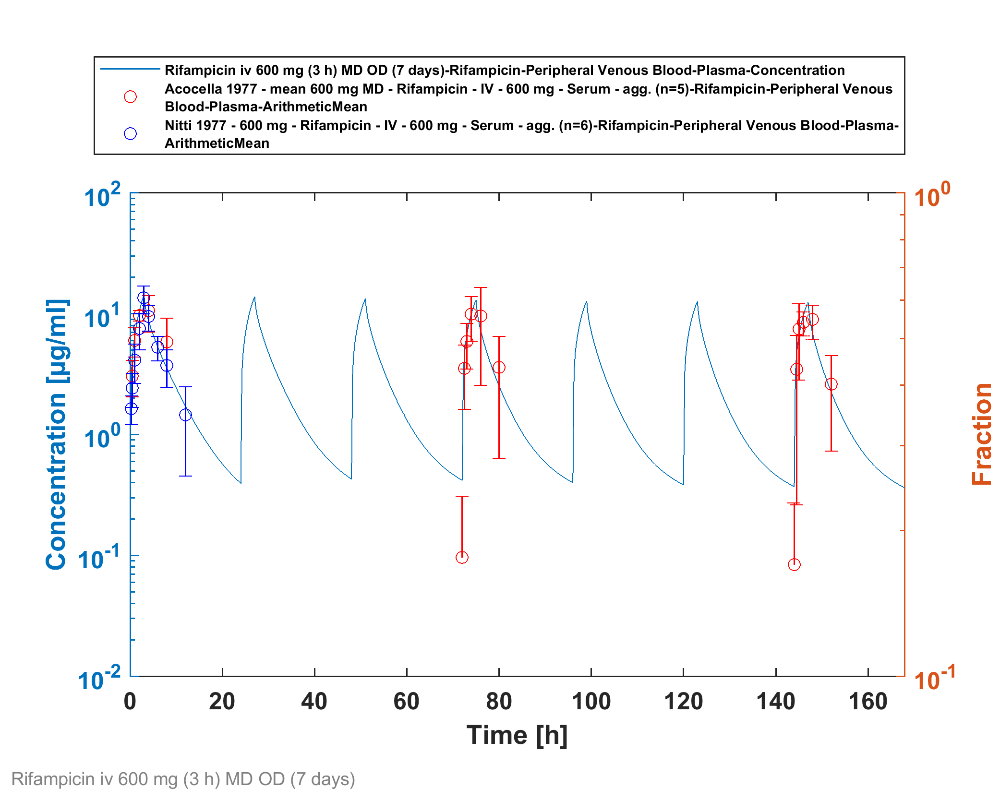
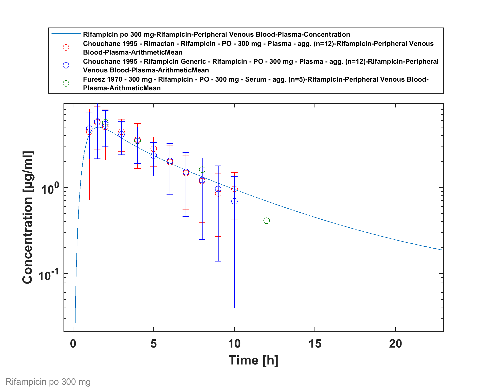
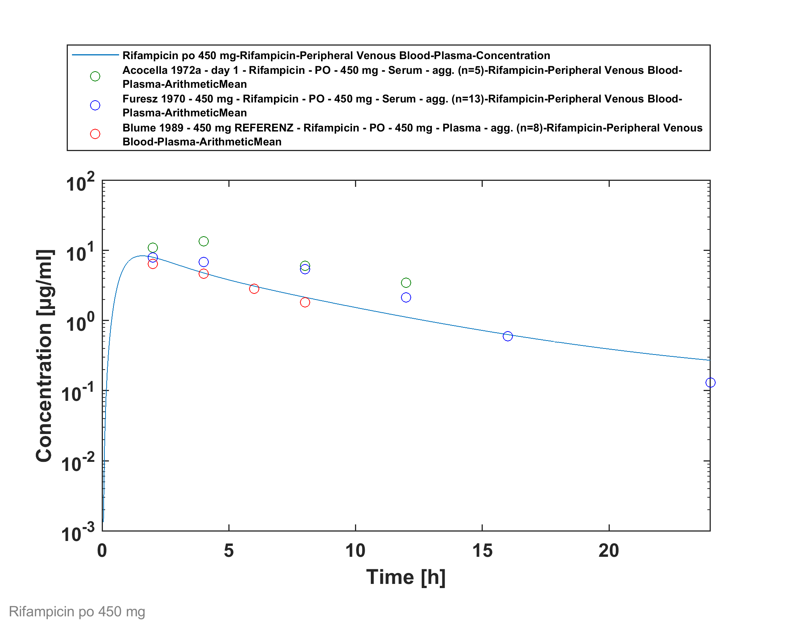
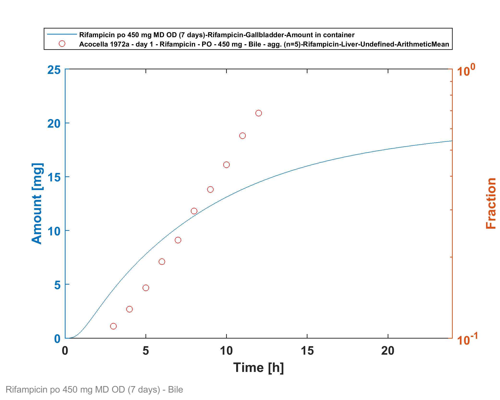
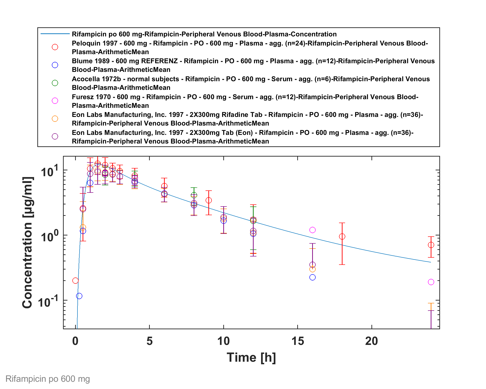
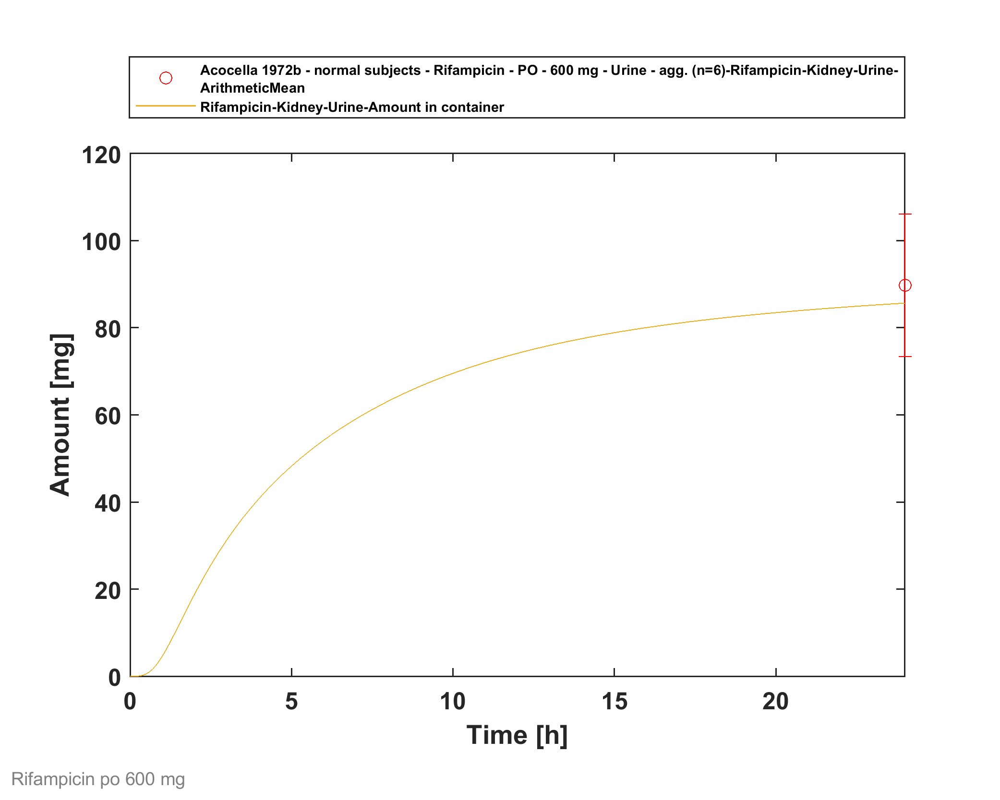

# Building and evaluation of a PBPK model for Rifampicin in healthy adults

| Version                                         | 1.1-OSP9.1                                                   |
| ----------------------------------------------- | ------------------------------------------------------------ |
| based on *Model Snapshot* and *Evaluation Plan* | https://github.com/Open-Systems-Pharmacology/Rifampicin-Model/releases/tag/v1.1 |
| OSP Version                                     | 9.1                                                          |
| Qualification Framework Version                 | 2.2                                                          |

This evaluation report and the corresponding PK-Sim project file are filed at:

https://github.com/Open-Systems-Pharmacology/OSP-PBPK-Model-Library/
# Table of Contents
  * [1 Introduction](#1-introduction)
  * [2 Methods](#2-methods)
    * [2.1 Modeling Strategy](#21-modeling-strategy)
    * [2.2 Data](#22-data)
    * [2.3 Model Parameters and Assumptions](#23-model-parameters-and-assumptions)
  * [3 Results and Discussion](#3-results-and-discussion)
    * [3.1 Final input parameters](#31-final-input-parameters)
    * [3.2 Diagnostics Plots](#32-diagnostics-plots)
    * [3.3 Concentration-Time Profiles](#33-concentration-time-profiles)
  * [4 Conclusion](#4-conclusion)
  * [5 References](#5-references)
# 1 Introduction
Rifampicin is an antibiotic used for the treatment of mycobacterium infections, including tuberculosis and leprosy. For the investigation of DDIs, rifampicin is an established potent inducer of multiple drug metabolizing enzymes (CYP3A4, CYP2B6, CYP2C8, CYP2C9, CYP2C19) and transporters (P-gp, MRP2, MRP3, MRP4, OATP1A2). In addition to its inducing capabilities, rifampicin also competitively inhibits enzymes and transporters like CYP3A4, P-gp, OATP1B1 and OATP1B3.

The herein presented model represents the rifampicin model originally published by Hanke *et al.* ([Hanke 2018](#5-References)), and extended in later publications ([Britz 2019](#5-References), [Türk 2019](#5-References)). The model was originally established using various clinical studies, covering a dosing range of 300 to 600 mg after intravenous and oral administration of rifampicin. The original model focused specifically on the integration of effects on **CYP3A4** and **P-gp** by rifampicin. Britz *et al.* ([Britz 2019](#5-References)) integrated rifampicin-mediated induction of **CYP1A2** (and CYP2E1) and Türk *et al.* ([Türk 2019](#5-References)) extended the model with regard to effects on **CYP2C8** and **OATP1B1**.

It is known that for both CYP3A4 and P-gp, rifampicin shows inductive and inhibitory effects. While induction by rifampicin involves gene expression and therefore takes several days to fully develop, competitive inhibition has an instantaneous effect and is strongest at the time of highest exposure to the inhibitor. As a consequence, the effects of rifampicin caused via competitive inhibition are most prominent 1-2 h after its oral administration and of relatively short duration. These opposing effects of rifampicin can be reasonably considered in PBPK models. 

Integrating and testing processes that were described as vital to the pharmacokinetics of rifampicin itself resulted in a final model that applies transport by OATP1B1, metabolism by arylacetamide deacetylase (AADAC), transport by P-gp and glomerular filtration. Furthermore, auto-induction of OATP1B1, AADAC and P-gp expression has been incorporated.

# 2 Methods

## 2.1 Modeling Strategy
The general concept of building a PBPK model has previously been described by Kuepfer et al. ([Kuepfer 2016](#5-References)). Relevant information on anthropometric (height, weight) and physiological parameters (e.g. blood flows, organ volumes, binding protein concentrations, hematocrit, cardiac output) in adults was gathered from the literature and has been previously published ([Willmann 2007](#5-References)). The information was incorporated into PK-Sim® and was used as default values for the simulations in adults.

The applied activity and variability of plasma proteins and active processes that are integrated into PK-Sim® are described in the publicly available PK-Sim® Ontogeny Database Version 7.3 ([PK-Sim Ontogeny Database Version 7.3](#5-References)) or otherwise referenced for the specific process.

The model was built combining bottom-up and top-down techniques. An extensive literature search yielded (1) physicochemical parameter values (2) information on active ADME and DDI-related (i.e. induction and inhibition) processes and (3) clinical studies of intravenous and oral administration in single and multiple dosing regimens, covering a broad dosing range with observed concentrations. 

A mean PBPK model was developed using a typical European individual. Enterohepatic recycling for transport processes into the bile was enabled in a continuous fashion (continuous flow from the liver to the lumen of duodenum). One study was performed in female patients after cholecystectomy ([Acocella 1972a](#5-References)). The bile of these patients was collected via a T tube. In the simulations of these patients, enterohepatic recycling was switched off and a virtual gallbladder collected the excreted rifampicin over time. Relevant ADME processes reported to influence the PK of rifampicin were implemented into the model and tested. For parameters that could not be (reliably) informed from literature, parameter identification was performed using a representative set of available clinical studies (see below). Model evaluation was based on the ability of the model to describe observed plasma concentration-time profiles and fraction excreted of unchanged drug to urine and bile.

Details about input data (physicochemical, *in vitro* and clinical) can be found in [Section 2.2](#22-Data).

Details about the structural model and its parameters can be found in [Section 2.3](#23-Model-Parameters-and-Assumptions).

## 2.2 Data
### 2.2.1 In vitro and physicochemical data

A literature search was performed to collect available information on physicochemical properties of rifampicin. The obtained information from literature is summarized in the table below, and is used for model building.

| **Parameter**                           | **Unit**                           | **Value**        | Source                            | **Description**                                              |
| :-------------------------------------- | ---------------------------------- | ---------------- | --------------------------------- | ------------------------------------------------------------ |
| MW                                      | g/mol                              | 822.940          | [DrugBank DB01045](#5-References) | Molecular weight                                             |
| pKa,base                     |                                    | 7.9              | [The Merck Index](#5-References)  | Basic dissociation constant                                  |
| pKa,acid                     |                                    | 1.7              | [The Merck Index](#5-References)  | Acid dissociation constant                                   |
| Solubility (pH)                         | mg/L                               | 1100 (6.5)  | [Baneyx 2014](#5-References)      | Solubility                                                   |
|                                         |                                    | 1400 (6.8)  | [Panchagnula 2006](#5-References) | Solubility                                                   |
|                                         |                                    | 990 (4)     | [Agrawal 2005](#5-References)     | Solubility                                                   |
|                                         |                                    | 1650 (6)    | [Agrawal 2005](#5-References)     | Solubility                                                   |
|                                         |                                    | 2540 (6.8)  | [Agrawal 2005](#5-References)     | Solubility                                                   |
|                                         |                                    | 3350 (7.4)  | [Agrawal 2005](#5-References)     | Solubility                                                   |
|                                         |                                    | 2800 (7.5)  | [Boman 1974](#5-References)       | Aqueous solubility                                           |
| logP                                    |                                    | 1.3              | [Baneyx 2014](#5-References)      | Partition coefficient between octanol and water @ pH 7.4     |
|                                         |                                    | 2.7              | [DrugBank DB01045](#5-References) | Partition coefficient between octanol and water              |
| fu                                      | %                                  | 11.1             | [Boman 1974](#5-References)       | Fraction unbound in plasma                                   |
|                                         | %                                  | 16.0             | [Baneyx 2014](#5-References)      | Fraction unbound in plasma in tuberculosis patients          |
|                                         | %                                  | 17               | [Templeton 2011](#5-References)   | Fraction unbound in plasma                                   |
|                                         | %                                  | 17.5             | [Shou 2008](#5-References)        | Fraction unbound in plasma                                   |
| B/P ratio                               |                                    | 0.9              | [Loos 1985](#5-References)        | Blood to plasma concentration ratio                          |
| Vmax, Km OATP1B1  | pmol/min/mg, µmol/L           | 9.3 1.5     | [Tirona 2003](#5-References)      | OATP1B1 uptake in transfected HeLa cells                     |
| Vmax, Km   P-gp | nmol/h/cm2, µmol/L | 4.3 55      | [Collett 2004](#5-References)     | P-gp net secretion across Caco-2 monolayers                 |
| Vmax, Km AADAC    | pmol/min/mg, µmol/L           | 162.6 195.1 | [Nakajima 2011](#5-References)    | Kinetic parameters of the deacetylase activity in HLM        |
| Emax, EC50 CYP3A4 | *dimensionless* µmol/L        | 9 0.34      | [Templeton 2011](#5-References)   | CYP3A4 induction parameters in primary human hepatocytes, EC50 corrected for fraction unbound in human hepatocytes of 0.419 as reported by [Shou 2008](#5-References) |
| Ki CYP3A4                    | µmol/L                             | 18.5             | [Kajosaari 2005](#5-References)    | CYP3A4 inhibition constant                                   |
| Emax P-gp                    | *dimensionless*                    | 2.5              | [Greiner 1999](#5-References)     | P-gp induction parameter based on an increased intestinal P-gp content in duodenal biopsies of 3.5 after rifampicin treatment |
| Ki P-gp                      | µmol/L                             | 169.0            | [Reitman 2011](#5-References)     | P-gp inhibition constant                                     |
| Ki OATP1B1                   | µmol/L                             | 0.477            | [Hirano 2006](#5-References)      | OATP1B1 inhibition constant (based on OATP1B1-mediated pitavastatin uptake) |
| Ki OATP1B3                   | µmol/L                             | 0.9              | [Annaert 2010](#5-References)      | OATP1B3 inhibition constant                                  |
| Emax CYP2C8                  | *dimensionless*                    | 3.2              | [Buckley 2014](#5-References)      | CYP2C8 Emax in primary human hepatocytes (based on activity) |
| Ki CYP2C8                    | µmol/L                             | 30.2             | [Kajosaari 2005](#5-References)    | CYP2C8 inhibition constant                                   |
| Emax CYP1A2                  | *dimensionless*                    | 0.65             | [Chen 2010](#5-References)         | CYP1A2 Emax in cultured human hepatocytes (based on activity) |
| Emax CYP2E1                  | *dimensionless*                    | 0.8              | [Rae 2001](#5-References)          | CYP2E1 fold induction of 1.8 calculated as the normalized ratio of expression in rifampin-treated versus vehicle control-treated cells |

*AADAC* arylacetamide deacetylase

### 2.2.2 Clinical data

A literature search was performed to collect available clinical data (plasma concentrations, fraction excreted into urine, fraction excreted into bile) on rifampicin in adults. The rifampicin model was built and verified using various clinical studies, covering a dosing range of 300 to 600 mg, administered intravenously or orally.

The following dosing scenarios were simulated and compared to respective data:

| Route | Dose [mg] | Dosing                    | PK Data                               | Used for [Optimization](#235-Automated-Parameter-Identification) | Reference                                          |
| ----- | -------------- | ------------------------- | ------------------------------------- | ------------------------------------------------------------ | -------------------------------------------------- |
| iv    | 300            | SD, 30 min infusion       | Plasma                                | x                                                            | [sanofi-aventis U.S. LLC. 2013](#5-References)     |
|       |                | SD, 3 h infusion          | Plasma, excretion into urine          | x                                                            | [Nitti 1977](#5-References)                        |
|       | 450            | SD, 3 h infusion          | Plasma, excretion into urine          | x                                                            | [Nitti 1977](#5-References)                        |
|       | 600            | SD, 30 min infusion       | Plasma                                | x                                                            | [sanofi-aventis U.S. LLC. 2013](#5-References)     |
|       |                | SD, 3 h infusion          | Plasma, excretion into urine          | x                                                            | [Nitti 1977](#5-References)                        |
|       |                | SD, 3 h infusion          | Plasma, excretion into urine          | x                                                            | [Acocella 1977](#5-References)                     |
|       |                | OD (7 days), 3 h infusion | Plasma                                | x                                                            | [Acocella 1977](#5-References)                     |
| po    | 300            | SD                        | Plasma                                | x                                                            | [Chouchane 1995](#5-References)                    |
|       |                | SD                        | Plasma                                |                                                              | [Furesz 1970](#5-References)                       |
|       | 450            | SD                        | Plasma                                | x                                                            | [Blume 1989](#5-References)                        |
|       |                |                           | Plasma                                |                                                              | [Furesz 1970](#5-References)                       |
|       |                | MD                        | Plasma, excretion into urine and bile | x                                                            | [Acocella 1972a](#5-References)                    |
|       | 600            | SD                        | Plasma                                | x                                                            | [Peloquin 1997](#5-References)                     |
|       |                |                           | Plasma                                |                                                              | [Blume 1989](#5-References)                        |
|       |                |                           | Plasma                                |                                                              | [Acocella 1972b](#5-References)                    |
|       |                |                           | Plasma                                |                                                              | [Furesz 1970](#5-References)                       |
|       |                |                           | Plasma, excretion into urine          | x                                                            | [Eon Labs Manufacturing, Inc. 1997](#5-References) |
|       |                | OD (7 days)               | Plasma                                | x                                                            | [Baneyx 2014](#5-References)                       |

## 2.3 Model Parameters and Assumptions
### 2.3.1 Absorption

Herein, the model parameter `Specific intestinal permeability` was optimized to best match clinical data (see  [Section 2.3.5](#235-Automated-Parameter-Identification)). The results of the optimization can be found in [Section 2.3.5](#235-Automated-Parameter-Identification).

Measured aqueous solubility ([Boman 1974](#5-References), see [Section 2.2.1](#221-In-vitro-and-physicochemical-data)) was set as default solubility.

As observed data do not show substantial differences between different formulations for oral rifampicin administration, all oral administrations were modelled as an oral solution.

### 2.3.2 Distribution

Recent measurements of fraction unbound in plasma yielded values of approximately 17% ([Templeton 2011](#5-References), [Shou 2008](#5-References), see [Section 2.2.1](#221-In-vitro-and-physicochemical-data)). This value was implemented in this model.

`Lipophilicity` was optimized within the range of measured values to find a best match of simulated to observed rifampicin PK profile data.

After testing the available organ-plasma partition coefficient and cell permeability calculation methods built in PK-Sim®, observed clinical data was best described by choosing the partition coefficient calculation by `Rodgers and Rowland` and cellular permeability calculation by `PK-Sim Standard ` for rifampicin. The PK-Sim® calculated `Blood/plasma concentration ratio` is well in line with the observed value of 0.9 ([Loos 1985](#5-References)).

### 2.3.3 Metabolism and Elimination

Integrating and testing active processes that were considered vital to the PK of rifampicin after literature review resulted in a final model that applies transport by OATP1B1 ([Tirona 2003](#5-References)), metabolism by arylacetamide deacetylase (AADAC) ([Nakajima 2011](#5-References)), transport by P-gp ([Collett 2004](#5-References)) and glomerular filtration. No study clearly demonstrated that rifampicin is substrate of CYP3A4; hence, in this PBPK model rifampicin only acts as a perpetrator on CYP3A4 without being metabolized by it.

The implemented expression profile of AADAC, P-gp and OATP1B1 were based on high-sensitive real-time RT-PCR ([Nishimura 2003](#5-References)) of the PK-Sim® expression database. The relative expression in the mucosa of the gut wall was modified based on an optimized value as reported by Hanke *et al.* ([Hanke 2018](#5-References)). Herein, this value was increased by a factor of 3.57 based on digoxin PK data in combination with PBPK modeling.

It was assumed that the mRNA concentration is proportional to the respective protein concentration. Thus, the expression of a protein in a specific organ relates to the expression in the organ with the highest expression which is termed reference concentration of the protein ([Meyer 2012](#5-References)). OATP1B1 was configured as influx transporter and P-gp as efflux transporter. Reference concentrations of the implemented active processes (enzymes and transporters) are summarized below:

| Protein | Reference concentration [µmol/L] | Reference Organ        |
| ------- | ------------------------------------- | ---------------------- |
| AADAC   | 1.0 (assumed)                         | Liver                  |
| P-gp    | 1.41 ([Hanke 2018](#5-References))    | Mucosa Small Intestine |
| OATP1B1 | 1.0 (assumed)                         | Liver                  |

The kinetic parameters describing the rifampicin metabolism by AADAC and transport by P-gp and OATP1B1 were imputed in the model as follows: while Michaelis-Menten constants (Km values) of AADAC-catalyzed metabolism and the two transport processes were taken from reported in vitro experiments, enzymatic and transport turnover values (kcat) were optimized based on *in vivo* PK data (see [Section 2.3.5](#235-Automated-Parameter-Identification)).

Multiple dose studies that measured PK profiles of rifampicin at different days of a 600 mg po once daily regimen indicate that rifampicin exposure decreases over time due to auto-induction processes ([Baneyx 2014](#5-References)), ([Smythe 2012](#5-References)). *In-vitro* studies in human hepatocytes suggest that rifampicin induces P-gp ([Collett 2004](#5-References), [Dixit 2007](#5-References), [Williamson 2013](#5-References)) and OATP1B1 ([Dixit 2007](#5-References), [Williamson 2013](#5-References)). It has further been shown in DDI studies with prototypical substrates of these transporters (pravastatin and digoxin, respectively) that the induction of these transporters can also be observed *in vivo* ([Kyrklund 2000](#5-References), [Greiner 1999](#5-References)). As in the case of CYP3A4 induction, both induction processes are mediated via pregnane X receptor (PXR) ([Geick 2001](#5-References)). Furthermore, it has been demonstrated that B-esterases are inducible by rifampicin via PXR ([Smythe 2012](#5-References), [Staudinger 2010](#5-References)) and that AADAC, the enzyme catalyzing the main metabolic pathway of rifampicin, is regulated by PXR ([Zhang 2012](#5-References)). Therefore, (auto-)induction of P-gp, OATP1B1 and AADAC expression was assumed and implemented in the rifampicin model. Modelling induction of an endogenously expressed protein requires three parameters, in particular **EC50** (concentration at which induction is half maximum), **Emax** (maximum induction effect on endogenous synthesis rate) and the endogenous **protein turnover (half-life)**. Little is known about these values *in vivo* for AADAC, P-gp and OATP1B1 induction. 

#### (Auto-) Induction Processes: AADAC, P-gp and OATP1B1

##### EC50

As all induction processes are mediated by PXR, the same unbound EC50 of 0.34 µmol/L (originally measured in primary human hepatocytes for CYP3A4 induction after correcting for the fraction unbound ([Baneyx 2014](#5-References), [Shou 2008](#5-References), [Templeton 2011](#5-References))) was applied for all induction processes. This assumption is supported by the fact that Moore *et al.* [Moore 2000](#5-References) found a general EC50 value for PXR-mediated rifampicin induction of 0.71 µmol/L (resulting in an unbound EC50 of 0.30 µmol/L after correcting for the fraction unbound reported by [Shou 2008](#5-References)). 

##### Emax

Emax values for AADAC and OATP1B1 are unknown and fitted based on observed clinical PK data of rifampicin (see [Section 2.3.5](#235-Automated-Parameter-Identification)).

A study by Greiner et al. ([Greiner 1999](#5-References)) found 3.5-fold elevated P-gp levels in human duodenal biopsies after multiple doses of rifampicin. This value was assumed to represent an *in vivo* maximum effect corresponding to an Emax value of 2.5. This Emax was included in the model for P-gp induction (see also [Section 2.2.1](#221-In-vitro-and-physicochemical-data)).

##### Protein turnover (half-lives)

Endogenous half-lives of these proteins are not known. Therefore, the same values applicable for CYP3A4 turnover (as implemented in PK-Sim ([PK-Sim Ontogeny Database Version 7.3](#5-References)) were assumed, i.e. 36 hours in the liver ([Obach 2007](#5-References)) and 23 hours in the intestine ([Greenblatt 2003](#5-References)).

### 2.3.4 DDI Parameters

The following sub-section describe the model input for DDI-related parameters, i.e. induction and inhibition of certain enzymes and transporters, for which rifampicin may act as a perpetrator. Verification of these model parameters and linked processes is not evaluated in this report. Applications are assessed in specific use cases and reported elsewhere. 

#### CYP3A4 induction and inhibition
Induction of CYP3A4 was incorporated using the weighted mean **EC50** of 0.8 µmol/L and **Emax ** estimate of 9 based on CYP3A4 activity induction in primary human hepatocytes ([Templeton 2011](#5-References), see also [Section 2.2.1](#221-In-vitro-and-physicochemical-data)). Similar values for EC50 (0.77, 0.80 µmol/L) and Emax  (7, 9, 10) have been reported by other groups ([Kolars 1992](#5-References), [Mills 2004](#5-References), [Sahi 2000](#5-References)). The *in vitro* value of EC50 of 0.8 µmol/L was corrected by the unbound fraction of rifampicin in hepatocytes of 0.419 to obtain an **unbound EC50** value of 0.34 µmol/L ([Baneyx 2014](#5-References), [Shou 2008](#5-References), [Templeton 2011](#5-References)) which was used in the PBPK model. 

Competitive inhibition of CYP3A4 by rifampicin was included using a dissociation (inhibition) constant (**Ki**) of 18.5 µmol/L determined in human liver microsomes via inhibition of midazolam 1-hydroxylation ([Kajosaari 2005](#5-References)). No correction of this *in vitro* value was applied to account for potential binding in the assay, as only 0.1 mg/mL human liver microsomal protein was used and a negligible unbound fraction of 0.90 – 0.98 was predicted ([Austin 2002](#5-References)).

Time to reach newly induced CYP3A4 levels and time for de-induction depends on the half-lives of the perpetrator drug but also of the endogenous natural turnover of the induced protein. CYP3A4 turnover featured zero-order synthesis rate and first-order degradation rate. A distinct degradation rate constant (kdeg) was considered for the intestinal mucosa which rather reflects enterocytic turnover than protein turnover, while in all other CYP3A4 expressing organs CYP3A4 turnover was assumed to follow that of the liver. **CYP3A4 half-life** (= ln(2)/kdeg) of 23 and 36 h in intestine and liver, respectively, were incorporated ([Obach 2007](#5-References), [Greenblatt 2003](#5-References), [PK-Sim Ontogeny Database Version 7.3](#5-References)).

#### P-gp induction and inhibition
P-gp induction is described above.

An *in vitro* determined Ki value for rifampicin ([Reitman 2011](#5-References)) served directly as model input (see [Section 2.2.1](#221-In-vitro-and-physicochemical-data)).

#### OATP1B1 induction and inhibition

OATP1B1 induction is described above. 

An *in vitro* determined Ki value for rifampicin ([Hirano 2006](#5-References)) served directly as model input (see [Section 2.2.1](#221-In-vitro-and-physicochemical-data)).

#### OATP1B3 induction and inhibition

The same parameters as for OATP1B1 induction were assumed.

An *in vitro* determined Ki value for rifampicin ([Annaert 2010](#5-References)) served directly as model input (see [Section 2.2.1](#221-In-vitro-and-physicochemical-data)).

#### CYP2C8 induction and inhibition

For PXR-mediated induction, the same unbound EC50 of 0.34 µmol/L (originally measured in primary human hepatocytes for CYP3A4 induction after correcting for the fraction unbound ([Baneyx 2014](#5-References), [Shou 2008](#5-References), [Templeton 2011](#5-References))) was applied (see above).

An Emax value reported by Buckley *et al.* ([Buckley 2014](#5-References)) served as model input (see [Section 2.2.1](#221-In-vitro-and-physicochemical-data)).

CYP2C8 half-life of 23 h in the liver ([Renwick 2000](#5-References), [PK-Sim Ontogeny Database Version 7.3](#5-References)) and of 23 h in the intestine (assuming that the turnover here rather reflects enterocytic turnover than protein turnover) ([Greenblatt 2003](#5-References), [PK-Sim Ontogeny Database Version 7.3](#5-References)) were incorporated.

An *in vitro* determined Ki value for rifampicin ([Kajosaari 2005](#5-References)) served directly as model input.

#### CYP1A2 induction

For PXR-mediated induction, the same unbound EC50 of 0.34 µmol/L (originally measured in primary human hepatocytes for CYP3A4 induction after correcting for the fraction unbound ([Baneyx 2014](#5-References), [Shou 2008](#5-References), [Templeton 2011](#5-References))) was applied (see above).

An Emax value reported by Chen *et al.* ([Chen 2010](#5-References)) served as model input (see [Section 2.2.1](#221-In-vitro-and-physicochemical-data)).

CYP1A2 half-life of 39 h in the liver ([Obach 2007](#5-References), [PK-Sim Ontogeny Database Version 7.3](#5-References)) and of 23 h in the intestine (assuming that the turnover here rather reflects enterocytic turnover than protein turnover) ([Greenblatt 2003](#5-References), [PK-Sim Ontogeny Database Version 7.3](#5-References)) were incorporated.

#### CYP2E1 induction

For PXR-mediated induction, the same unbound EC50 of 0.34 µmol/L (originally measured in primary human hepatocytes for CYP3A4 induction after correcting for the fraction unbound ([Baneyx 2014](#5-References), [Shou 2008](#5-References), [Templeton 2011](#5-References))) was applied (see above).

An Emax value reported by Rae *et al.* ([Rae 2001](#5-References)) served as model input (see [Section 2.2.1](#221-In-vitro-and-physicochemical-data)).

CYP2E1 half-life of 50 h in the liver ([Emery 1999](#5-References), [PK-Sim Ontogeny Database Version 7.3](#5-References)) and of 23 h in the intestine (assuming that the turnover here rather reflects enterocytic turnover than protein turnover) ([Greenblatt 2003](#5-References), [PK-Sim Ontogeny Database Version 7.3](#5-References)) were incorporated.

#### Summary DDI Parameters

| Protein | Ki [µmol/L] | Emax                                 | EC50,u [µmol/L] | Half-life liver [h] | Half-life intestine [h] |
| ------- | --------------------------- | ---------------------------------------------------- | ------------------------------- | ------------------------ | ---------------------------- |
| CYP1A2  | -                           | 0.65                                                 | 0.34                            | 39                       | 23 (assumed)                 |
| CYP2C8  | 30.2                        | 3.2                                                  | 0.34                            | 23                       | 23 (assumed)                 |
| CYP2E1  | -                           | 0.8                                                  | 0.34                            | 50                       | 23 (assumed)                 |
| CYP3A4  | 18.5                        | 9                                                    | 0.34                            | 36                       | 23                           |
| AADAC   | -                           | [optimized](#235-Automated-Parameter-Identification) | 0.34                            | 36 (assumed)             | 23 (assumed)                 |
| P-gp    | 169                         | [optimized](#235-Automated-Parameter-Identification) | 0.34                            | 36 (assumed)             | 23 (assumed)                 |
| OATP1B1 | 0.477                       | [optimized](#235-Automated-Parameter-Identification) | 0.34                            | 36 (assumed)             | 23 (assumed)                 |
| OATP1B3 | 0.9                         | assumed to be equal to OATP1B1                       | 0.34                            | 36 (assumed)             | 23 (assumed)                 |

### 2.3.5 Automated Parameter Identification

This is the result of the final parameter identification:

| Model Parameter                                             | Optimized Value                                              | Unit      |
| ----------------------------------------------------------- | ------------------------------------------------------------ | --------- |
| `Lipophilicity`                                             | 2.5                                                          | Log Units |
| `Specific intestinal permeability`                          | 1.24E-05                                                     | cm/min    |
| `Fraction unbound (plasma, reference value)`                | 17 FIXED (see [Section 2.2.1](#221-In-vitro-and-physicochemical-data)) | %         |
| `Solubility at reference pH`                                | 2800 FIXED (see [Section 2.2.1](#221-In-vitro-and-physicochemical-data)) | mg/L      |
| `kcat` AADAC (with a reference concentration of 1 µmol/L)   | 9.865                                                        | 1/min     |
| `kcat` P-gp (with a reference concentration of 1.41 µmol/L) | 0.6088                                                       | 1/min     |
| `kcat` OATP1B1 (with a reference concentration of 1 µmol/L) | 7.796                                                        | 1/min     |
| `Emax` AADAC                                                | 0.985                                                        |           |
| `Emax` P-gp                                                 | 2.5 FIXED (see [Section 2.2.1](#221-In-vitro-and-physicochemical-data)) |           |
| `Emax` OATP1B1                                              | 0.383                                                        |           |

# 3 Results and Discussion
The rifampicin model was built and verified using various clinical studies. Overall, the model shows good performance to describe plasma concentration-time profiles over a dose range of 300 to 600 mg after intravenous and oral administration. 

The next sections show:

1. the final model input parameters for the building blocks: [Section 3.1](#31-Final-Input-Parameters).
2. the overall goodness of fit: [Section 3.2](#32-Diagnostics-Plots).
3. simulated vs. observed concentration-time profiles for the clinical studies used for model building and for model verification: [Section 3.3](#33-Concentration-Time-Profiles).
## 3.1 Final input parameters
The parameter values of the final PBPK model are illustrated below.

### Compound: Rifampicin

#### Parameters

Name                                             | Value           | Value Origin                                               | Alternative        | Default
------------------------------------------------ | --------------- | ---------------------------------------------------------- | ------------------ | -------
Solubility at reference pH                       | 2800 mg/l       | Publication-Boman 1974                                     | Aqueous solubility | True   
Reference pH                                     | 7.5             | Publication-Boman 1974                                     | Aqueous solubility | True   
Lipophilicity                                    | 2.5 Log Units   | Publication-Parameter Identification-Hanke et al. 2018     | Optimized          | True   
Fraction unbound (plasma, reference value)       | 17 %            | Publication-In Vitro-Templeton 2011 (equilibrium dialysis) | Templeton 2011     | True   
Specific intestinal permeability (transcellular) | 1.24E-05 cm/min | Publication-Parameter Identification-Hanke et al. 2018     | Optimized          | True   
Is small molecule                                | Yes             |                                                            |                    |        
Molecular weight                                 | 822.94 g/mol    |                                                            |                    |        
Plasma protein binding partner                   | Albumin         |                                                            |                    |        
#### Calculation methods

Name                    | Value              
----------------------- | -------------------
Partition coefficients  | Rodgers and Rowland
Cellular permeabilities | PK-Sim Standard    
#### Processes

##### Metabolizing Enzyme: AADAC-Nakajima 2011

Molecule: AADAC
###### Parameters

Name                 | Value          | Value Origin                                          
-------------------- | -------------- | ------------------------------------------------------
Enzyme concentration | 1 µmol/l       |                                                       
Vmax                 | 6.5 µmol/l/min |                                                       
Km                   | 195.1 µmol/l   |                                                       
kcat                 | 9.865 1/min    | Publication-Parameter Identification-Hanke et al. 2018
##### Transport Protein: P-gp-Collett 2004

Molecule: P-gp
###### Parameters

Name                      | Value           | Value Origin                                          
------------------------- | --------------- | ------------------------------------------------------
Transporter concentration | 60 nmol/l       |                                                       
Vmax                      | 2.87 µmol/l/min |                                                       
Km                        | 55 µmol/l       |                                                       
kcat                      | 0.6088 1/min    | Publication-Parameter Identification-Hanke et al. 2018
##### Transport Protein: OATP1B1-Tirona 2003

Molecule: OATP1B1
###### Parameters

Name                      | Value            | Value Origin                                          
------------------------- | ---------------- | ------------------------------------------------------
Transporter concentration | 109.6 µmol/l     |                                                       
Vmax                      | 0.372 µmol/l/min |                                                       
Km                        | 1.5 µmol/l       |                                                       
kcat                      | 7.796 1/min      | Publication-Parameter Identification-Hanke et al. 2018
##### Systemic Process: Glomerular Filtration-GFR

Species: Human
###### Parameters

Name         | Value | Value Origin                            
------------ | -----:| ----------------------------------------
GFR fraction |     1 | Publication-Assumption-Hanke et al. 2018
##### Inhibition: CYP3A4-Kajosaari 2005

Molecule: CYP3A4
###### Parameters

Name | Value       | Value Origin                     
---- | ----------- | ---------------------------------
Ki   | 18.5 µmol/l | Publication-Kajosaari et al. 2005
##### Inhibition: P-gp-Reitman 2011

Molecule: P-gp
###### Parameters

Name | Value      | Value Origin                                                                    
---- | ---------- | --------------------------------------------------------------------------------
Ki   | 169 µmol/l | Publication-Assumption-Reitman 2011 (IC50 = Ki (169 µM / (1+ (0.1 µM / 177 µM) )
##### Induction: CYP3A4-Templeton 2011

Molecule: CYP3A4
###### Parameters

Name | Value       | Value Origin                                      
---- | ----------- | --------------------------------------------------
EC50 | 0.34 µmol/l | Publication-Templeton 2011 (weighted mean for FHH)
Emax | 9           | Publication-Templeton 2011 (weighted mean for FHH)
##### Induction: P-gp-Greiner 1999

Molecule: P-gp
###### Parameters

Name | Value       | Value Origin                              
---- | ----------- | ------------------------------------------
EC50 | 0.34 µmol/l | Publication-Assumption-Hanke et al. 2018  
Emax | 2.5         | Publication-Assumption-Greiner et al. 1999
##### Induction: OATP1B1-Dixit 2007

Molecule: OATP1B1
###### Parameters

Name | Value       | Value Origin                                          
---- | ----------- | ------------------------------------------------------
EC50 | 0.34 µmol/l | Publication-Assumption-Hanke et al. 2018              
Emax | 0.383       | Publication-Parameter Identification-Hanke et al. 2018
##### Induction: AADAC-Assumed

Molecule: AADAC
###### Parameters

Name | Value       | Value Origin                                          
---- | ----------- | ------------------------------------------------------
EC50 | 0.34 µmol/l | Publication-Assumption-Hanke et al. 2018              
Emax | 0.985       | Publication-Parameter Identification-Hanke et al. 2018
##### Inhibition: CYP2C8-Kajosaari 2005

Molecule: CYP2C8
###### Parameters

Name | Value       | Value Origin                     
---- | ----------- | ---------------------------------
Ki   | 30.2 µmol/l | Publication-Kajosaari et al. 2005
##### Inhibition: OATP1B1-Hirano 2006

Molecule: OATP1B1
###### Parameters

Name | Value        | Value Origin                                                                                                                                                      
---- | ------------ | ------------------------------------------------------------------------------------------------------------------------------------------------------------------
Ki   | 0.477 µmol/l | Publication-Hirano M, Maeda K, Shitara Y, Sugiyama Y. Drug-drug interaction between pitavastatin and various drugs via OATP1B1. Drug Metab Dispos. 2006;34:1229–36
##### Induction: CYP2C8-Buckley 2014

Molecule: CYP2C8
###### Parameters

Name | Value       | Value Origin                                                                                                                                                                                                                                                                                                                                                                                          
---- | ----------- | ------------------------------------------------------------------------------------------------------------------------------------------------------------------------------------------------------------------------------------------------------------------------------------------------------------------------------------------------------------------------------------------------------
EC50 | 0.34 µmol/l | Publication-Templeton IE, Houston JB, Galetin A. Predictive utility of in vitro rifampin induction data generated in fresh and cryopreserved human hepatocytes, Fa2N-4, and HepaRG cells. Drug Metab Dispos. 2011;39:1921–9; Shou M, Hayashi M, Pan Y, Xu Y, Morrissey K, Xu L, et al. Modeling, prediction, and in vitro in vivo correlation of CYP3A4 induction. Drug Metab Dispos. 2008;36:2355–70.
Emax | 3.2         | Publication-Buckley DB, Wiegand CM, Prentiss PL, Fahmi OA. Time-course of cytochrome P450 (CYP450) induction in cultured human hepatocytes: Evaluation of activity and mRNA expression profiles for six inducible CYP450 enzymes. ISSX. 2013                                                                                                                                                          
##### Induction: CYP1A2-Chen 2010

Molecule: CYP1A2
###### Parameters

Name | Value       | Value Origin
---- | ----------- | ------------:
EC50 | 0.34 µmol/l |             
Emax | 0.65        |             
##### Induction: CYP2E1-Rae 2001

Molecule: CYP2E1
###### Parameters

Name | Value       | Value Origin
---- | ----------- | ------------:
EC50 | 0.34 µmol/l |             
Emax | 0.8         |             
##### Inhibition: OATP1B3-Annaert 2010

Molecule: OATP1B3
###### Parameters

Name | Value      | Value Origin
---- | ---------- | ------------:
Ki   | 0.9 µmol/l |             

## 3.2 Diagnostics Plots
Below you find the goodness-of-fit visual diagnostic plots for the PBPK model performance of all data used presented in [Section 2.2.2](#222-Clinical-data).

The first plot shows observed versus simulated plasma concentration and the second weighted residuals versus time for itraconazole, hydroxy-itraconazole, keto-itraconazole and N-desalkyl-itraconazole.

GMFE = 1.372542 

## 3.3 Concentration-Time Profiles
Simulated versus observed concentration-time profiles of all data listed in [Section 2.2.2](#222-Clinical-data) are presented below.

# 4 Conclusion
The herein presented PBPK model adequately describes the pharmacokinetics of rifampicin in adults. Little is known on the exact mass balance and the full metabolic profile of rifampicin. In this PBPK model, the implemented processes are those that were considered most vital to describe rifampicin's PK and that could be informed either via *in vitro* data or via parameter optimization based on clinical PK data.

The herein presented quantification of induction processes of OATP1B1 and AADAC are purely based on parameter optimization to describe auto-induction phenomena of rifampicin. The herein presented induction process of P-gp is based on *in vivo* observed P-gp induction measured in duodenal biopsies ([Greiner 1999](#5-References)). The derived Emax value was assumed to be applicable for P-gp induction in all tissues expressing P-gp. This needs to be considered when coupling the herein presented rifampicin model to PBPK models of potential victim drugs that are also subject to P-gp-mediated transport.

Endogenous protein half-lives of OATP1B1, AADAC, and P-gp are not known. Thus, values reported for CYP3A4 were assumed in this PBPK model. These values were needed to implement induction of the three proteins. However, sensitivity of these parameters on simulated rifampicin plasma concentration is very low.

The model features in particular induction of CYP3A4 based on aggregated *in vitro* CYP3A4 activity data in primary human hepatocytes ([Templeton 2011](#5-References)). The model also accounts for competitive inhibition of CYP3A4.

# 5 References

**Acocella 1972a** Acocella G., Lamarina A., Nicolis F. B., Pagani V., Segre G. Kinetic studies on rifampicin II. Multicompartmental analysis of the serum, urine and bile concentrations in subjects treated for one week Eur J Clin Pharmacol. 1972;5(2):111-115.

**Acocella 1972b** Acocella G, Bonollo L, Garimoldi M, Mainardi M, Tenconi LT, Nicolis FB. Kinetics of rifampicin and isoniazid administered alone and in combination to normal subjects and patients with liver disease. Gut. Gut. 1972 Jan;13(1):47-53.

**Acocella 1977** Acocella G, Bonollo L, Mainardi M, Margaroli P, Tenconi LT. Serum and urine concentrations of rifampicin administered by intravenous infusion in man. Arzneimittelforschung. 1977;27(6):1221-6.

**Acocella 1984** Acocella G, Segre G, Conti R, Pagani V, Pallanza R, Perna G, Simone P. Pharmacokinetic study on intravenous rifampicin in man. Pharmacol Res Commun. 1984 Jul;16(7):723-36.

**Acocella 1985** Acocella G, Conti R, Luisetti M, Pozzi E, Grassi C. Pharmacokinetic studies on antituberculosis regimens in humans. I. Absorption and metabolism of the compounds used in the initial intensive phase of the short-course regimens: single administration study. 

**Agrawal 2005** Agrawal S, Panchagnula R. Implication of biopharmaceutics and pharmacokinetics of rifampicin in variable bioavailability from solid oral dosage forms. Biopharm Drug Dispos. 2005 Nov;26(8):321-34.

**Annaert 2010** Annaert P, Ye ZW, Stieger B, Augustijns P. Interaction of HIV protease inhibitors with OATP1B1, 1B3, and 2B1. Xenobiotica. 2010 Mar;40(3):163-76.

**Austin 2002** Austin RP, Barton P, Cockroft SL, Wenlock MC, Riley RJ. The influence of nonspecific microsomal binding on apparent intrinsic clearance, and its prediction from physicochemical properties. Drug Metab Dispos. 2002 Dec;30(12):1497-503.

**Baneyx 2014** Baneyx G, Parrott N, Meille C, Iliadis A, Lavé T. Physiologically based pharmacokinetic modeling of CYP3A4 induction by rifampicin in human: influence of time between substrate and inducer administration. Eur J Pharm Sci. 2014 Jun 2;56:1-15.

**Blume 1989** Blume H., Mutschler E., Graf E. Bioäquivalenz; Qualitätsbewertung wirkstoffgleicher Fertigarzneimittel Pharmazie in unserer Zeit 19.5 (1990): 223-223.

**Boman 1974** Boman G, Ringberger VA. Binding of rifampicin by human plasma proteins. Eur J Clin Pharmacol. 1974 Aug 23;7(5):369-73.

**Britz 2019** Britz H, Hanke N, Volz AK, Spigset O, Schwab M, Eissing T, Wendl T, Frechen S, Lehr T. Physiologically-Based Pharmacokinetic Models for CYP1A2 Drug-Drug Interaction Prediction: A Modeling Network of Fluvoxamine, Theophylline, Caffeine, Rifampicin, and Midazolam. CPT Pharmacometrics Syst Pharmacol. 2019 May;8(5):296-307.

**Buckley 2014** Buckley D. B., Wiegand C. M., Prentiss P. L., Fahmi O. A. Time-course of cytochrome P450 (CYP450) induction in cultured human hepatocytes: evaluation of activity and mRNA expression profiles for six inducible CYP450 enzymes. Poster no. P186. In 10th International ISSX Meeting (Vol. 29). 2014, January.

**Burger 2006** Burger DM, Agarwala S, Child M, Been-Tiktak A, Wang Y, Bertz R. Effect of rifampin on steady-state pharmacokinetics of atazanavir with ritonavir in healthy volunteers. Antimicrob Agents Chemother. 2006 Oct;50(10):3336-42.

**Chen 2010** Chen Y, Liu L, Laille E, Kumar G, Surapaneni S. In vitro assessment of cytochrome P450 inhibition and induction potential of azacitidine. Cancer Chemother Pharmacol. 2010 Apr;65(5):995-1000.

**Chouchane 1995** Chouchane N, Barre J, Toumi A, Tillement JP, Benakis A. Bioequivalence study of two pharmaceutical forms of rifampicin capsules in man. Eur J Drug Metab Pharmacokinet. 1995 Oct-Dec;20(4):315-20.

**Collett 2004** Collett A, Tanianis-Hughes J, Hallifax D, Warhurst G. Predicting P-glycoprotein effects on oral absorption: correlation of transport in Caco-2 with drug pharmacokinetics in wild-type and mdr1a(-/-) mice in vivo. Pharm Res. 2004 May;21(5):819-26.

**Dixit 2007** Dixit V, Hariparsad N, Li F, Desai P, Thummel KE, Unadkat JD. Cytochrome P450 enzymes and transporters induced by anti-human immunodeficiency virus protease inhibitors in human hepatocytes: implications for predicting clinical drug interactions. Drug Metab Dispos. 2007 Oct;35(10):1853-9.

**DrugBank DB01045** (https://www.drugbank.ca/drugs/DB01045)

**Emery 1999** Emery MG, Jubert C, Thummel KE, Kharasch ED. Duration of cytochrome P-450 2E1 (CYP2E1) inhibition and estimation of functional CYP2E1 enzyme half-life after single-dose disulfiram administration in humans. J Pharmacol Exp Ther. 1999 Oct;291(1):213-9.

**Eon Labs Manufacturing, Inc. 1997** Access Data FDA: https://www.accessdata.fda.gov/drugsatfda_docs/anda/97/064150review.pdf 

**Furesz 1970** Furesz S. Chemical and biological properties of rifampicin. Antibiot Chemother. 1970;16:316-51.

**Geick 2001** Geick A, Eichelbaum M, Burk O. Nuclear receptor response elements mediate induction of intestinal MDR1 by rifampin. J Biol Chem. 2001 May 4;276(18):14581-7.

**Greenblatt 2003** Greenblatt DJ, von Moltke LL, Harmatz JS, Chen G, Weemhoff JL, Jen C, Kelley CJ, LeDuc BW, Zinny MA. Time course of recovery of cytochrome p450 3A function after single doses of grapefruit juice. Clin Pharmacol Ther. 2003 Aug;74(2):121-9.

**Greiner 1999** Greiner B, Eichelbaum M, Fritz P, Kreichgauer HP, von Richter O, Zundler J, Kroemer HK. The role of intestinal P-glycoprotein in the interaction of digoxin and rifampin. J Clin Invest. 1999 Jul;104(2):147-53.

**Hanke 2018** Hanke N, Frechen S, Moj D, Britz H, Eissing T, Wendl T, Lehr T. PBPK Models for CYP3A4 and P-gp DDI Prediction: A Modeling Network of Rifampicin, Itraconazole, Clarithromycin, Midazolam, Alfentanil, and Digoxin. CPT Pharmacometrics Syst Pharmacol. 2018 Oct;7(10):647-659.

**Hirano 2006** Hirano M, Maeda K, Shitara Y, Sugiyama Y. Drug-drug interaction between pitavastatin and various drugs via OATP1B1. Drug Metab Dispos. 2006 Jul;34(7):1229-36.

**Kajosaari 2005** Kajosaari LI, Laitila J, Neuvonen PJ, Backman JT. Metabolism of repaglinide by CYP2C8 and CYP3A4 in vitro: effect of fibrates and rifampicin. Basic Clin Pharmacol Toxicol. 2005 Oct;97(4):249-56.

**Kolars 1992** Kolars JC, Schmiedlin-Ren P, Schuetz JD, Fang C, Watkins PB. Identification of rifampin-inducible P450IIIA4 (CYP3A4) in human small bowel enterocytes. J Clin Invest. 1992 Nov;90(5):1871-8.

**Kuepfer 2016** Kuepfer L, Niederalt C, Wendl T, Schlender JF, Willmann S, Lippert J, Block M, Eissing T, Teutonico D. Applied Concepts in PBPK Modeling: How to Build a PBPK/PD Model.CPT Pharmacometrics Syst Pharmacol. 2016 Oct;5(10):516-531.

**Kyrklund 2000** Kyrklund C, Backman JT, Kivistö KT, Neuvonen M, Laitila J, Neuvonen PJ. Rifampin greatly reduces plasma simvastatin and simvastatin acid concentrations. Clin Pharmacol Ther. 2000 Dec;68(6):592-7.

**Loos 1985** Loos U, Musch E, Jensen JC, Mikus G, Schwabe HK, Eichelbaum M. Pharmacokinetics of oral and intravenous rifampicin during chronic administration. Klin Wochenschr. 1985 Dec 2;63(23):1205-11.

**Meyer 2012** Meyer M, Schneckener S, Ludewig B, Kuepfer L, Lippert J. Using expression data for quantification of active processes in physiologically based pharmacokinetic modeling. Drug Metab Dispos. 2012 May;40(5):892-901.

**Mills 2004** Mills JB, Rose KA, Sadagopan N, Sahi J, de Morais SM. Induction of drug metabolism enzymes and MDR1 using a novel human hepatocyte cell line. J Pharmacol Exp Ther. 2004 Apr;309(1):303-9.

**Moore 2000** Moore LB, Parks DJ, Jones SA, Bledsoe RK, Consler TG, Stimmel JB, Goodwin B, Liddle C, Blanchard SG, Willson TM, Collins JL, Kliewer SA.J Biol Chem. Orphan Nuclear Receptors Constitutive Androstane Receptor and Pregnane X Receptor Share Xenobiotic and Steroid Ligands. 2000 May 19;275(20):15122-7.

**Nakajima 2011** Nakajima A, Fukami T, Kobayashi Y, Watanabe A, Nakajima M, Yokoi T. Human arylacetamide deacetylase is responsible for deacetylation of rifamycins: rifampicin, rifabutin, and rifapentine. Biochem Pharmacol. 2011 Dec 1;82(11):1747-56.

**Nishimura 2013** Nishimura M, Yaguti H, Yoshitsugu H, Naito S, Satoh T. Tissue distribution of mRNA expression of human cytochrome P450 isoforms assessed by high-sensitivity real-time reverse transcription PCR. Yakugaku Zasshi. 2003 May;123(5):369-75.

**Nitti 1977** Nitti V, Virgilio R, Patricolo MR, Iuliano A. Pharmacokinetic study of intravenous rifampicin. Chemotherapy. 1977;23(1):1-6.

**Obach 2007** Obach RS, Walsky RL, Venkatakrishnan K. Mechanism-based inactivation of human cytochrome p450 enzymes and the prediction of drug-drug interactions. Drug Metab Dispos. 2007 Feb;35(2):246-55.

**OSP Database** [https://github.com/Open-Systems-Pharmacology/Database-for-observed-data](https://github.com/Open-Systems-Pharmacology/Database-for-observed-data)

**Panchagnula 2007** Panchagnula R., Gulati I., Varma M., Raj Y.A. Dissolution methodology for evaluation of rifampicin-containing fixed-dose combinations using biopharmaceutic classification sytem based approach. Clin. Res. Regul. Aff. 24, 61–76 (2007)

**Peloquin 1997** Peloquin CA, Jaresko GS, Yong CL, Keung AC, Bulpitt AE, Jelliffe RW. Population pharmacokinetic modeling of isoniazid, rifampin, and pyrazinamide. Antimicrob Agents Chemother. 1997 Dec;41(12):2670-9.

**Peloquin 1999** Peloquin CA, Namdar R, Singleton MD, Nix DE. Pharmacokinetics of rifampin under fasting conditions, with food, and with antacids. Chest. 1999 Jan;115(1):12-8.

**PK-Sim Ontogeny Database Version 7.3** (https://github.com/Open-Systems-Pharmacology/OSPSuite.Documentation/blob/38cf71b384cfc25cfa0ce4d2f3addfd32757e13b/PK-Sim%20Ontogeny%20Database%20Version%207.3.pdf)

**Rae 2001** Rae JM, Johnson MD, Lippman ME, Flockhart DA. Rifampin is a selective, pleiotropic inducer of drug metabolism genes in human hepatocytes: studies with cDNA and oligonucleotide expression arrays. J Pharmacol Exp Ther. 2001 Dec;299(3):849-57.

**Reitman 2011** Reitman ML, Chu X, Cai X, Yabut J, Venkatasubramanian R, Zajic S, Stone JA, Ding Y, Witter R, Gibson C, Roupe K, Evers R, Wagner JA, Stoch A. Rifampin's acute inhibitory and chronic inductive drug interactions: experimental and model-based approaches to drug-drug interaction trial design. Clin Pharmacol Ther. 2011 Feb;89(2):234-42. doi: 10.1038/clpt.2010.271.

**Renwick 2000** Renwick AB, Watts PS, Edwards RJ, Barton PT, Guyonnet I, Price RJ, Tredger JM, Pelkonen O, Boobis AR, Lake BG. Differential maintenance of cytochrome P450 enzymes in cultured precision-cut human liver slices. Drug Metab Dispos. 2000 Oct;28(10):1202-9.

**Rodrigues 1999** Rodrigues AD. Integrated cytochrome P450 reaction phenotyping: attempting to bridge the gap between cDNA-expressed cytochromes P450 and native human liver microsomes. Biochem Pharmacol. 1999 Mar 1;57(5):465-80.

**Sahi 2000** Sahi J, Hamilton G, Sinz M, Barros S, Huang SM, Lesko LJ, LeCluyse EL. Effect of troglitazone on cytochrome P450 enzymes in primary cultures of human and rat hepatocytes. Xenobiotica. 2000 Mar;30(3):273-84.

**sanofi-aventis U.S. LLC. 2013** Access Data FDA: https://www.accessdata.fda.gov/drugsatfda_docs/label/2013/050420s075,050627s014lbl.pdf

**Shou 2008** Shou M, Hayashi M, Pan Y, Xu Y, Morrissey K, Xu L, Skiles GL. Modeling, prediction, and in vitro in vivo correlation of CYP3A4 induction. Drug Metab Dispos. 2008 Nov;36(11):2355-70.

**Smythe 2012** Smythe W, Khandelwal A, Merle C, Rustomjee R, Gninafon M, Bocar Lo M, Sow OB, Olliaro PL, Lienhardt C, Horton J, Smith P, McIlleron H, Simonsson US. A semimechanistic pharmacokinetic-enzyme turnover model for rifampin autoinduction in adult tuberculosis patients. Antimicrob Agents Chemother. 2012 Apr;56(4):2091-8.

**Staudinger 2010** Staudinger JL, Xu C, Cui YJ, Klaassen CD. Nuclear receptor-mediated regulation of carboxylesterase expression and activity. Expert Opin Drug Metab Toxicol. 2010 Mar;6(3):261-71.

**Stone 2004** Stone JA, Migoya EM, Hickey L, Winchell GA, Deutsch PJ, Ghosh K, Freeman A, Bi S, Desai R, Dilzer SC, Lasseter KC, Kraft WK, Greenberg H, Waldman SA. Potential for interactions between caspofungin and nelfinavir or rifampin. Antimicrob Agents Chemother. 2004 Nov;48(11):4306-14.

**Templeton 2011** Templeton IE, Houston JB, Galetin A. Predictive utility of in vitro rifampin induction data generated in fresh and cryopreserved human hepatocytes, Fa2N-4, and HepaRG cells. Drug Metab Dispos. 2011 Oct;39(10):1921-9.

**The Merck Index** The Merck Index Online: Rifampin (https://www.rsc.org/Merck-Index/monograph/m9611/rifampin) 

**Tirona 2003** Tirona RG, Leake BF, Wolkoff AW, Kim RB. Human organic anion transporting polypeptide-C (SLC21A6) is a major determinant of rifampin-mediated pregnane X receptor activation. J Pharmacol Exp Ther. 2003 Jan;304(1):223-8.

**Türk 2019** Türk D, Hanke N, Wolf S, Frechen S, Eissing T, Wendl T, Schwab M, Lehr T. Physiologically Based Pharmacokinetic Models for Prediction of Complex CYP2C8 and OATP1B1 (SLCO1B1) Drug-Drug-Gene Interactions: A Modeling Network of Gemfibrozil, Repaglinide, Pioglitazone, Rifampicin, Clarithromycin and Itraconazole. Clin Pharmacokinet. 2019 Dec;58(12):1595-1607.

**Westphal 2000** Westphal K, Weinbrenner A, Zschiesche M, Franke G, Knoke M, Oertel R, Fritz P, von Richter O, Warzok R, Hachenberg T, Kauffmann HM, Schrenk D, Terhaag B, Kroemer HK, Siegmund W. Induction of P-glycoprotein by rifampin increases intestinal secretion of talinolol in human beings: a new type of drug/drug interaction. Clin Pharmacol Ther. 2000 Oct;68(4):345-55.

**Williamson 2013** Williamson B, Dooley KE, Zhang Y, Back DJ, Owen A. Induction of influx and efflux transporters and cytochrome P450 3A4 in primary human hepatocytes by rifampin, rifabutin, and rifapentine. Antimicrob Agents Chemother. 2013 Dec;57(12):6366-9.

**Zhang 2012** Zhang Y, Cheng X, Aleksunes L, Klaassen CD. Transcription factor-mediated regulation of carboxylesterase enzymes in livers of mice. Drug Metab Dispos. 2012 Jun;40(6):1191-7.
