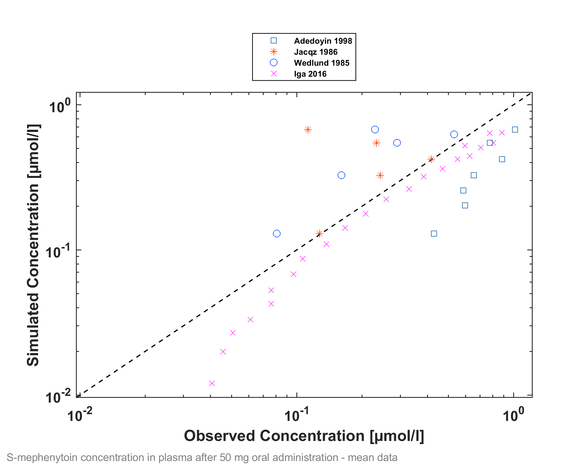
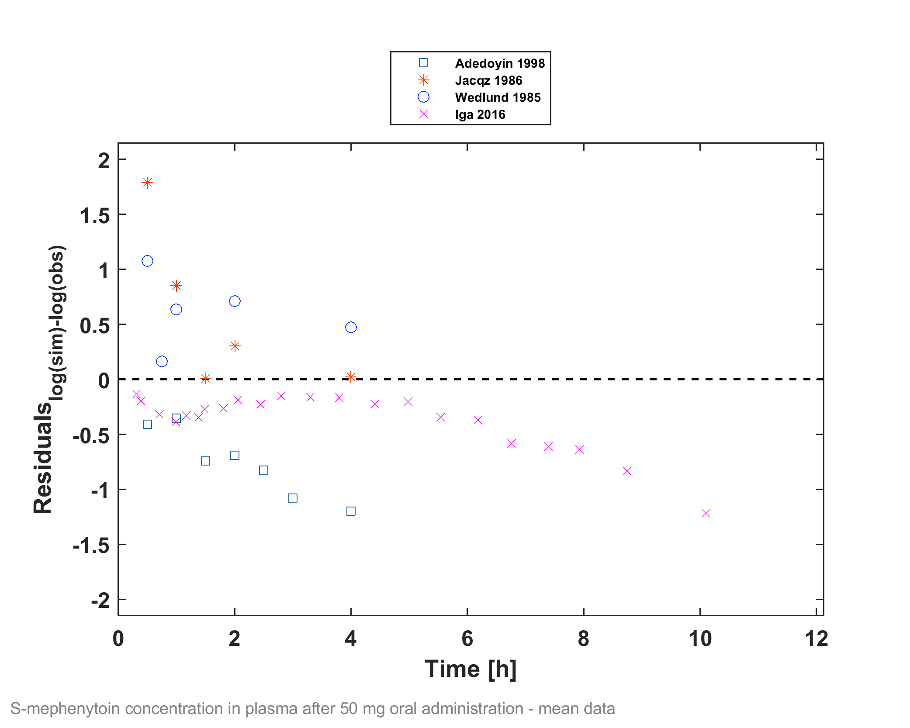
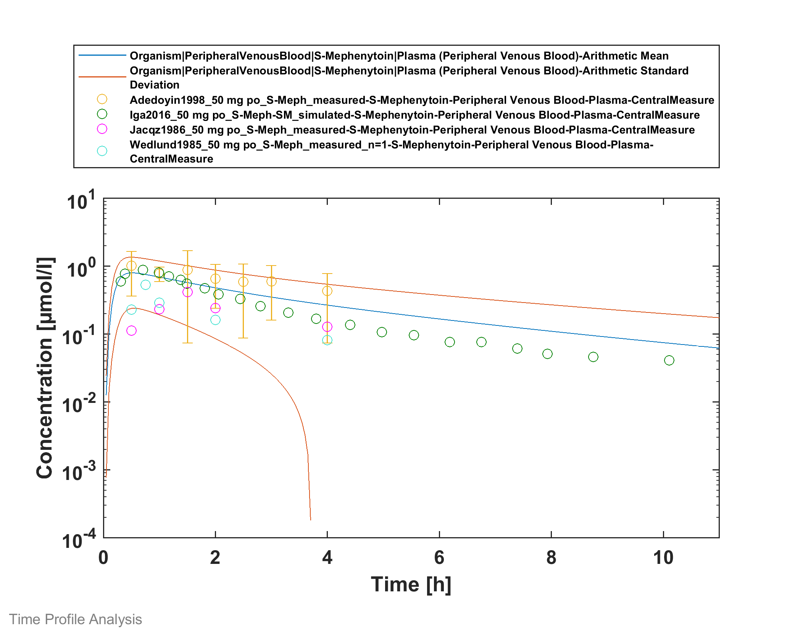

# Building and evaluation of a PBPK model for S-Mephenytoin in adults

| Version                                         | 1.1-OSP10.0                                                  |
| ----------------------------------------------- | ------------------------------------------------------------ |
| based on *Model Snapshot* and *Evaluation Plan* | https://github.com/Open-Systems-Pharmacology/S-Mephenytoin-Model/releases/tag/v1.0 |
| OSP Version                                     | 10.0                                                         |
| Qualification Framework Version                 | 2.3                                                          |

This evaluation report and the corresponding PK-Sim project file are filed at:

https://github.com/Open-Systems-Pharmacology/OSP-PBPK-Model-Library/
# Table of Contents
  * [1 Introduction](#1-introduction)
  * [2 Methods](#2-methods)
    * [2.1 Modeling Strategy](#2.1-modeling-strategy)
    * [2.2 Data](#2.2-data)
    * [2.3 Model Parameters and Assumptions](#2.3-model-parameters-and-assumptions)
  * [3 Results and Discussion](#3-results-and-discussion)
    * [3.1 Final input parameters](#3.1-final-input-parameters)
    * [3.2 Diagnostics Plots](#3.2-diagnostics-plots)
    * [3.3 Concentration-Time Profiles](#3.3-concentration-time-profiles)
      * [3.3.1 Model Verification](#3.3.1-model-verification)
  * [4 Conclusion](#4-conclusion)
  * [5 References](#5-references)
  * [6 Glossary](#6-glossary)
# 1 Introduction
The presented PBPK model of S-mephenytoin has been developed to be used in a PBPK Drug-Drug-Interactions (DDI) network with S-mephenytoin as a substrate of CYP2C19.

Mephenytoin is a hydantoin-derivative anticonvulsant used to control various partial seizures and was first used in the 1940s ([Troupin 1979](#5-References)).

Only limited clinical PK and ADME data are available. Mephenytoin is soluble and rapidly absorbed with a Tmax of 1 hour. The mean half-life in human is 6.8 hours. No hints for dose non-linearity could be found in literature.

Mephenytoin is the mixture of the two enantiomers S- and R-Mephenytoin. S-Mephenytoin is mainly metabolised via CYP2C19. Only a very minor part is metabolised by CYP2C9. The R-enantiomer is not metabolised by CYP2C19. The clearance of S-Mephenytoin in CYP2C19 EM is 40 to 100-fold higher than in PM.

# 2 Methods

## 2.1 Modeling Strategy
The general workflow for building an adult PBPK model has been described by Kuepfer et al. ([Kuepfer 2016](#5-References)). Relevant information on the anthropometry (height, weight) was gathered from the respective clinical study, if reported. Information on physiological parameters (e.g. blood flows, organ volumes, hematocrit) in adults was gathered from the literature and has been incorporated in PK-Sim® as described previously ([Willmann 2007](#5-References)). The  applied activity and variability of plasma proteins and active processes that are integrated into PK-Sim® are described in the publicly available 'PK-Sim® Ontogeny Database Version 7.3' ([PK-Sim Ontogeny Database Version 7.3](#5-References)).

Only the  S-enantiomer of mephenytoin is modeled. The modeling work flow can be summarized as following:

| **Modelling step**                                           | **Data used / comment**                                      |
| ------------------------------------------------------------ | ------------------------------------------------------------ |
| **1.) Development of mean po model (no i.v. data  available)** | IVIVE based on physico-chemistry and in vitro  metabolization or recalculated in vivo clearance.  Alternative middle out fits to in vivo data were tried but could not improve DDI prediction significantly. Additional limited data lead to identifiability problems. |
| **2.) Evaluation of p.o. model with virtual PK-Sim  population** | Range and mean plasma profiles after p.o. admininstration for the study population was in line with the PK-Sim in-built variability of  CYP2C9 and CYP2C19. |

The predefined “Standard European Male for DDI” individual was used (age = 30 y, weight = 73 kg, height = 176 cm, BMI = 23.57 kg/m2). CYP2C19 expression from the PK-Sim in-built RT-PCR database was added.

Due to the limited data, an IVIVE approach has been selected. Parameters describing intrinsic CYP2C19 clearance were recalculated from CL/F ([Adedoyin 1998](# 5 References)) and in vitro metabolism data from human microsomes CYP2C19 clearance and CYP2C9 clearance ([Steere 2015](# 5 References)).

A simulation of a population with 2000 virtual individuals according to the biometrics of the individuals (8 males and females, 32-78 years) used in a study by [Adedoyin 1998](# 5 References) was carried out. Additional variability was included on CYP2C19 among the population, by using the geometric SD as derived from reported CL/F values in [Olivares-Morales 2016](# 5 References).

Details about input data (physicochemical, *in vitro* and clinical) can be found in [Section 2.2](#2.2-Data).

Details about the structural model and its parameters can be found in [Section 2.3](#2.3-Model-Parameters-and-Assumptions).

## 2.2 Data
### 2.2.1 In vitro and physico-chemical data

A literature search was performed to collect available information on physico-chemical properties of S-mephenytoin ([Table 1](#Table 1)).

| **Parameter**                   | **Unit** | **Value**     | Source                            | **Description**              |
| :------------------------------ | -------- | ------------- | --------------------------------- | ---------------------------- |
| MW+                  | g/mol    | 218.52        | [DrugBank DB00532](#5-References) | Molecular weight.            |
| pKa,acid+ |          | 8.51          | [DrugBank DB00532](#5-References) | Acidic dissociation constant |
| Solubility (pH)+     | mg/mL    | 1.27 (7) | [DrugBank DB00532](#5-References) | Aqueous Solubility           |
| logP+                |          | 1.69          | [DrugBank DB00532](#5-References) | Partition coefficient        |
| fu+                  | %        | 70.2          | [Steere 2015](#5-References)      | Fraction unbound in plasma   |

**Table 1:** Physico-chemical and *in-vitro* metabolization properties of S-mephenytoin extracted from literature. *+: Value used in final model*

### 2.2.2 Clinical data

A literature search was performed to collect available clinical data on S-mephenytoin. Data used for model development and validation are listed in [Table 2](#Table 2).

| **Source**           | **Route** | **Dose [mg]/**  **Schedule ** | **Pop.**     | **Age [yrs] (mean) /range** | **Weight [kg] (mean) /range** | **Sex** | **N** | **Form.** | **Comment**                       |
| -------------------- | --------- | ------------------------------- | ------------ | ------- | ----- | --------- | --------------------------------- | --------------------------------- | --------------------------------- |
| [Adedoyin 1998](#5-References) | p.o.      | 100 mg s.d.                   | HV, all EM               | 54.7 / 32-73                | -                             | m/f     | 8     | tablet    | 50 g S-mephenytoin simulated                           |
| [Jacqz 1986](#5-References)    | p.o.      | 100 mg s.d.                   | HV, 6 EM, 1  IM and 1 PM | 25-76                       | -                             | m/f     | 8     | tablet    | 50 g S-mephenytoin simulated                            |
| [Yao 2003](#5-References)      | p.o.      | 100 mg s.d.                   | HV                       | 23-49                       | -                             | m/f     | 12    | -         | S-mephenytoin, with  and without Fluvoxamine MD of 37.5, 62.5 and 87.5 mg/day |
| [Iga 2016](#5-References)      | p.o.      | 100 mg s.d.                   | -                        | -                           | -                             | -       | -     | -         | 50 g S-mephenytoin simulated |
|                                |           |                               |                          |                             |                               |         |       |           |                                                              |
| [Wedlund 1985](#5-References)  | p.o.      | 100 mg s.d.                  | HV                       | 21-7                        | 54-108                        | male    | 8     | tablet    | 50 g S-mephenytoin simulated                    |

**Table 2:** Literature sources of clinical concentration data of S-mephenytoin used for model development and validation. *s.d.: single dose*
## 2.3 Model Parameters and Assumptions
### 2.3.1 Absorption

Intestinal permeability is calculated by PK-Sim. No data are available to estimate the parameter.

### 2.3.2 Distribution

Partition coefficient calculation by `Rodgers and Rowland` and cellular permeability calculation by `PK-Sim Standard` have been assumed. Identification of the best suited calculation methods was not possible due to lack of i.v. data.

### 2.3.3 Metabolism and Elimination

Two linear metabolic pathways for S-mephenytoin were implement in the model:

* CYP2C19
* CYP2C9

Additionally, glomerular filtration was implemented with assumed GFR fraction of 1. No active renal excretion described in literature. Renal clearance is minor compared to overall plasma clearance ([Jacqz 1986](# 5 References)) and can be described by glomerular filtration.

### 2.3.5 Automated Parameter Identification

Performing parameter identification on lipophilicity, CYP2C19 intrinsic clearance, and intestinal permeability did not improve the performance of the model. Therefore, no parameters have been estimated.

# 3 Results and Discussion
The next sections show:

1. Final model input parameters for the building blocks: [Section 3.1](#3.1-Final-Input-Parameters).
2. Overall goodness of fit: [Section 3.2](#3.2-Diagnostics-Plots).
3. Simulated vs. observed concentration-time profiles for the clinical studies used for model building and for model verification: [Section 3.3](#3.3-Concentration-Time-Profiles).

## 3.1 Final input parameters
The parameter values of the final PBPK model are illustrated below.

### Compound: S-Mephenytoin

#### Parameters

Name                                       | Value          | Value Origin              | Alternative | Default
------------------------------------------ | -------------- | ------------------------- | ----------- | -------
Solubility at reference pH                 | 1.27 mg/ml     | Database-DrugBank DB00532 | Measurement | True   
Reference pH                               | 7              | Database-DrugBank DB00532 | Measurement | True   
Lipophilicity                              | 1.69 Log Units | Database-DrugBank DB00532 | Measurement | True   
Fraction unbound (plasma, reference value) | 70.2 %         | Publication-Steere 2015   | Measurement | True   
Is small molecule                          | Yes            |                           |             |        
Molecular weight                           | 218.52 g/mol   | Database-DrugBank DB00532 |             |        
Plasma protein binding partner             | Albumin        |                           |             |        
#### Calculation methods

Name                    | Value              
----------------------- | -------------------
Partition coefficients  | Rodgers and Rowland
Cellular permeabilities | PK-Sim Standard    
#### Processes

##### Metabolizing Enzyme: CYP2C19-Adedoyin1998_Table1_CL_F

Species: Human
Molecule: CYP2C19
###### Parameters

Name                | Value         | Value Origin             
------------------- | ------------- | -------------------------
Intrinsic clearance | 1986.9 ml/min | Publication-Adedoyin 1998
##### Metabolizing Enzyme: CYP2C9-Steere2015_Clint_CYP2C9_Table1

Molecule: CYP2C9
###### Parameters

Name                                        | Value                       | Value Origin              
------------------------------------------- | --------------------------- | --------------------------
In vitro CL for liver microsomes            | 0.39 µl/min/mg mic. protein | Publication-Steere2015    
Content of CYP proteins in liver microsomes | 96 pmol/mg mic. protein     | Publication-Rodrigues 1999
##### Systemic Process: Glomerular Filtration-Assumption

Species: Human
###### Parameters

Name         | Value | Value Origin    
------------ | -----:| ----------------
GFR fraction |     1 | Other-Assumption

## 3.2 Diagnostics Plots
The following section displays the goodness-of-fit visual diagnostic plots for the PBPK model performance of all data listed in [Section 2.2.2](#2.2.2-Clinical-data).

The first plot shows observed versus simulated plasma concentration, the second weighted residuals versus time. 

GMFE = 1.648576 

## 3.3 Concentration-Time Profiles
Simulated versus observed concentration-time profiles of all data listed in [Section 2.2.2](#2.2.2-Clinical-data) are presented below.

### 3.3.1 Model Verification

# 4 Conclusion
A PBPK model describing the limited set of in vivo p.o. data could be established.

Population simulated data had a comparable variability with the observed data when included additional variability for CYP2C19 expression. Moreover, the mean data from other studies ([Jacqz 1986](#5-References), [Wedlund 1985](#5-References)) were in the range of expected variability, confirming the adequacy of the model.
# 5 References
**Adedoyin 1998** Adedoyin A, Arns PA, Richards WO, Wilkinson GR, Branch RA. Selective effect of liver disease on the activities of specific metabolizing enzymes: investigation of cytochromes P450 2C19 and 2D6. *Clin Pharmacol Ther*. 1998;64(1):8-17.

**DrugBank DB00532** (https://www.drugbank.ca/drugs/DB00532)

**Iga 2016** Iga K. Dynamic and Static Simulations of Fluvoxamine-Perpetrated Drug-Drug Interactions Using Multiple Cytochrome P450 Inhibition Modeling, and Determination of Perpetrator-Specific CYP Isoform Inhibition Constants and Fractional CYP Isoform Contributions to Vic. *J Pharm Sci*.Victim Clearance. Journal of Pharmaceutical Sciences. 2016 Mar;105(3):1307-1317–17.

**Jacqz 1986** Jacqz E, Hall SD, Branch RA, Wilkinson GR. Polymorphic metabolism of mephenytoin in man: Pharmacokinetic interaction with a co‐regulated substrate, mephobarbital. *Clin Pharmacol Ther*. 1986;39(6):646-653.

**Kuepfer 2016** Kuepfer L, Niederalt C, Wendl T, Schlender JF, Willmann S, Lippert J, Block M, Eissing T, Teutonico D. Applied Concepts in PBPK Modeling: How to Build a PBPK/PD Model.CPT Pharmacometrics Syst Pharmacol. 2016 Oct;5(10):516-531.

**Olivares-Morales 2016** Olivares-Morales A, Ghosh A, Aarons L, Rostami-Hodjegan A. Development of a Novel Simplified PBPK Absorption Model to Explain the Higher Relative Bioavailability of the OROS(R) Formulation of Oxybutynin. *AAPS J*. 2016;18(6):1532-1549. 

**PK-Sim Ontogeny Database Version 7.3** (https://github.com/Open-Systems-Pharmacology/OSPSuite.Documentation/blob/38cf71b384cfc25cfa0ce4d2f3addfd32757e13b/PK-Sim%20Ontogeny%20Database%20Version%207.3.pdf)

**Steere 2015** Steere B, Baker JAR, Hall SD, Guo Y. Prediction of in vivo clearance and associated variability of CYP2C19 substrates by genotypes in populations utilizing a pharmacogenetics-based mechanistic model. *Drug Metab Dispos*. 2015;43(6):870-883.

**Troupin 1979** Troupin AS, Friel P, Lovely MP, Wilensky AJ. Clinical pharmacology of mephenytoin and ethotoin. *Ann Neurol*. 1979;6(5):410-414.

**Wedlund 1985** Wedlund PJ, Aslanian WS, Jacqz E, McAllister CB, Branch RA, Wilkinson GR. Phenotypic differences in mephenytoin pharmacokinetics in normal subjects. *J Pharmacol Exp Ther*. 1985;234:662-669.

**Willmann 2007** Willmann S, Höhn K, Edginton A, Sevestre M, Solodenko J, Weiss W, Lippert J, Schmitt W. Development of a physiology-based whole-body population model for assessing the influence of individual variability on the pharmacokinetics of drugs. *J Pharmacokinet Pharmacodyn* 2007, 34(3): 401-431.

 **Yao 2003** Yao C, Kunze KL, Trager WF, Kharasch ED, Levy RH. Comparison of in vitro and in vivo inhibition potencies of fluvoxamine toward CYP2C19. *Drug Metab Dispos*. 2003;31(5):565-571.
# 6 Glossary
| ADME    | Absorption, Distribution, Metabolism,  Excretion             |
| ------- | ------------------------------------------------------------ |
| AUC     | Area under the plasma concentration  versus time curve       |
| AUCinf  | AUC until infinity                                           |
| AUClast | AUC until last measurable sample                             |
| AUCR    | Area under the plasma concentration  versus time curve Ratio |
| b.i.d.  | Twice daily (bis in diem)                                    |
| CL      | Clearance                                                    |
| Clint   | Intrinsic liver clearance                                    |
| Cmax    | Maximum concentration                                        |
| CmaxR   | Maximum concentration Ratio                                  |
| CYP     | Cytochrome P450 oxidase                                      |
| CYP1A2  | Cytochrome P450 1A2 oxidase                                  |
| CYP2C19 | Cytochrome P450 2C19 oxidase                                 |
| CYP3A4  | Cytochrome P450 3A4 oxidase                                  |
| DDI     | Drug-drug interaction                                        |
| e.c.    | Enteric coated                                               |
| EE      | Ethinylestradiol                                             |
| EM      | Extensive metabolizers                                       |
| fm      | Fraction metabolized                                         |
| FMO     | Flavin-containing monooxygenase                              |
| fu      | Fraction unbound                                             |
| FDA     | Food and Drug administration                                 |
| GFR     | Glomerular filtration rate                                   |
| HLM     | Human liver microsomes                                       |
| hm      | homozygous                                                   |
| ht      | heterozygous                                                 |
| IM      | Intermediate metabolizers                                    |
| i.v.    | Intravenous                                                  |
| IVIVE   | In Vitro to In  Vivo Extrapolation                           |
| Ka      | Absorption rate constant                                     |
| kcat    | Catalyst rate constant                                       |
| Ki      | Inhibitor constant                                           |
| Kinact  | Rate of enzyme inactivation                                  |
| Km      | Michaelis Menten constant                                    |
| m.d.    | Multiple dose                                                |
| OSP     | Open Systems Pharmacology                                    |
| PBPK    | Physiologically-based pharmacokinetics                       |
| PK      | Pharmacokinetics                                             |
| PI      | Parameter identification                                     |
| PM      | Poor metabolizers                                            |
| RT-PCR  | Reverse transcription polymerase chain  reaction             |
| p.o.    | Per os                                                       |
| q.d.    | Once daily (quaque diem)                                     |
| SD      | Single Dose                                                  |
| SE      | Standard error                                               |
| s.d.SPC | Single doseSummary of Product Characteristics                |
| SD      | Standard deviation                                           |
| TDI     | Time dependent inhibition                                    |
| t.i.d   | Three times a day (ter in die)                               |
| UGT     | Uridine  5'-diphospho-glucuronosyltransferase                |
| UM      | Ultra-rapid metabolizers                                     |
