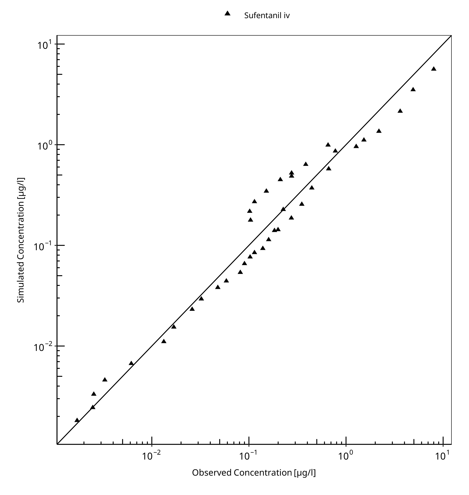
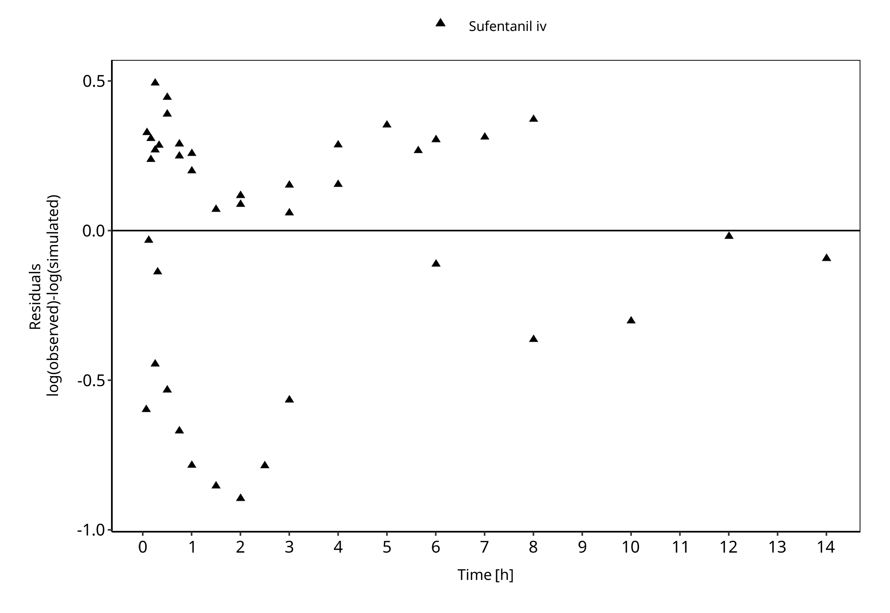
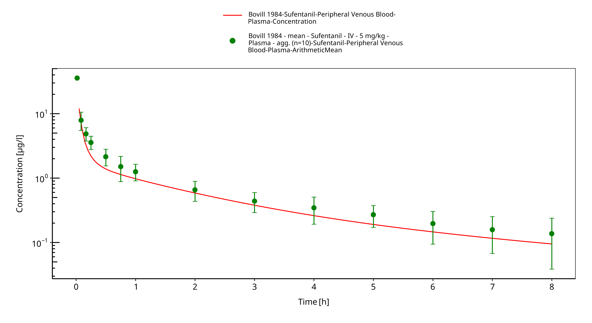
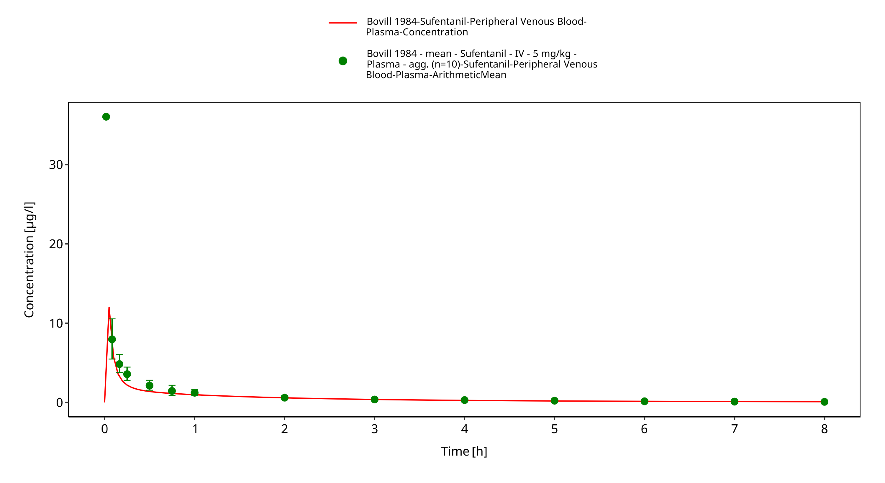
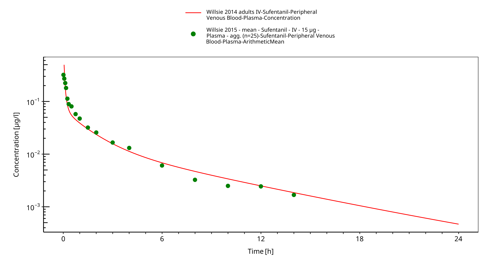
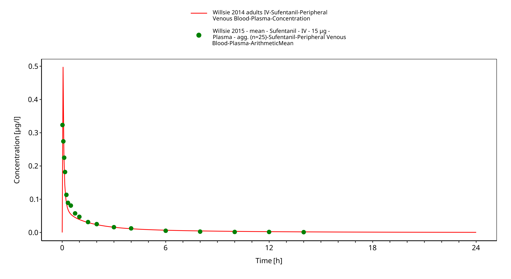
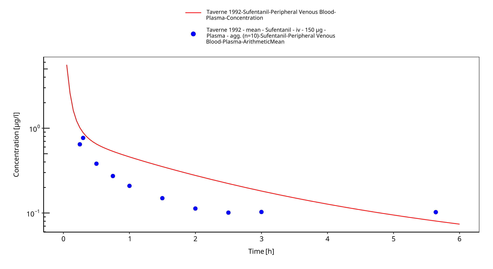
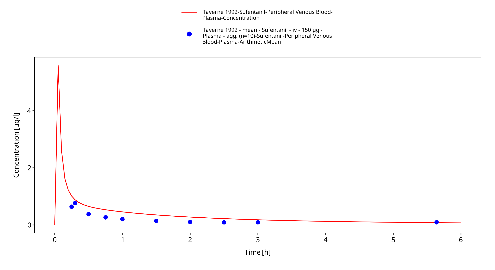

# Building and evaluation of a PBPK model for sufentanil in adults

| Version                                         | 2.0-OSP12.1                                                   |
| ----------------------------------------------- | ------------------------------------------------------------ |
| based on *Model Snapshot* and *Evaluation Plan* | https://github.com/Open-Systems-Pharmacology/Sufentanil-Model/releases/tag/v2.0 |
| OSP Version                                     | 12.1                                                          |
| Qualification Framework Version                 | 3.4                                                          |

This evaluation report and the corresponding PK-Sim project file are filed at:

https://github.com/Open-Systems-Pharmacology/OSP-PBPK-Model-Library/

# Table of Contents

 * [1 Introduction](#introduction)
 * [2 Methods](#methods)
   * [2.1 Modeling strategy](#modeling-strategy)
   * [2.2 Data used](#data)
   * [2.3 Model parameters and assumptions](#model-parameters-and-assumptions)
 * [3 Results and Discussion](#results-and-discussion)
   * [3.1 Sufentanil final input parameters](#final-input-parameters)
   * [3.2 Sufentanil Diagnostics Plots](#diagnostics-plots)
   * [3.3 Sufentanil Concentration-Time profiles](#ct-profiles)
 * [4 Conclusion](#conclusion)
 * [5 References](#main-references)

# 1 Introduction

The presented model building and evaluation report evaluates the performance of a PBPK model for sufentanil in adults.

Sufentanil is a potent synthetic opioid. It has a high lipid solubility, which accounts for the fast onset when given intravenously. The commercial solution comes as preservative‐free sufentanil citrate, injectable with a pH of 4.5–7.0 (Jansen‐Cilag AB, Sweden). Sufentanil is solely metabolised by CYP3A4. Due to the high hepatic extraction ratio, for the overall clearance of sufentanil both CYP3A4 activity as well as liver blood flow rate play dominant roles in the elimination in adult populations. The final sufentanil model applies metabolism by CYP3A4 and glomerular filtration and adequately described the pharmacokinetics of sufentanil in adults.

The sufentanil model is a whole-body PBPK model, allowing for dynamic translation between individuals. The sufentanil report demonstrates the level of confidence in the sufentanil PBPK model build with the OSP suite with regard to reliable predictions of sufentanil PK in adults during model-informed drug development.

# 2 Methods

## 2.1 Modeling strategy

The general concept of building a PBPK model has previously been described by Kuepfer et al. ([Kuepfer 2016](#5-references)). Relevant information on anthropometric (height, weight) and physiological parameters (e.g. blood flows, organ volumes, binding protein concentrations, hematocrit, cardiac output) in adults was gathered from the literature and has been previously published ([Schlender 2016](#5-references)). The information was incorporated into PK-Sim® and was used as default values for the simulations in adults.

The  applied activity and variability of plasma proteins and active processes that are integrated into PK-Sim® are described in the publicly available PK-Sim® Ontogeny Database Version 7.3 ([PK-Sim Ontogeny Database Version 7.3](#5-references)) or otherwise referenced for the specific process.

First, a base mean model was built using data from the single dose escalation study to find an appropriate structure describing the PK of sufentanil. The mean PK model was developed using a typical European individual. Unknown parameters were identified using the Parameter Identification module provided in PK-Sim®. Structural model selection was mainly guided by visual inspection of the resulting description of data and biological plausibility.

Once the appropriate structural model was identified, additional parameters for different formulations were identified, if available. 

A final PBPK model was established and simulations were compared to the reported data to evaluate model appropriateness and to assess model qualification, by means of diagnostics plots and predicted versus observed concentration-time profiles, of which the results support an adequate prediction of the PK in adults.

During model building, uncertainties in data quality, as well as study differences may cause not being able to adequately describe the PK of all reported clinical studies. 

## 2.2 Data used

### 2.2.1 In vitro / physicochemical data

A literature search was performed to collect available information on physicochemical properties of sufentanil. The obtained information from literature is summarized in the table below, and is used for model building.

| **Parameter**   | **Unit**    | **Literature value (reference)** | **Description**                                  |
| :-------------- | ----------- | ----------------------------------- | ------------------------------------------------ |
| MW              | g/mol       | 386.6 ([Zhou 2017](#5-references))  | Molecular weight                                 |
| pKa             |             | 8 ([Zhou 2017](#5-references)) | Base dissociation constant                       |
| Solubility (pH) | mg/L        | 0.076 (7) ([Roy 1988](#5-references)) | Solubility                                       |
| logP            |             | 3.95 ([Zhou 2017](#5-references))   | Partition coefficient between octanol and water  |
| fu              |             | 0.075 ([Zhou 2017](#5-references))  | Fraction unbound                                 |
| CLr*            | L/h         | 1 ([Zhou 2017](#5-references))      | Renal clearance                                  |
| CYP3A4 CLint* | µl/min/pmol | 20.74 ([Zhou 2017](#5-references))  | Cytochrome-P450 3A4 mediated intrinsic clearance |

*CLr and CYP3A4int parameters are built in PK-Sim as glomerular filtration (GF) and CYP3A4 - first order intrinsic clearance, respectively.

### 2.2.2 Clinical data

A literature search was performed to collect available clinical data on sufentanil in adults. 

The following publications were found in adults for model building and evaluation:

| Publication                       | Study description                                            |
| :-------------------------------- | :----------------------------------------------------------- |
| [Bovill 1984](#5-references) | The pharmacokinetics of sufentanil in elective surgical patients, without hepatic or renal dysfunction. |
| [Willsie 2015](#5-references) | Pharmacokinetic properties of single- and repeated-dose sufentanil sublingual tablets in healthy volunteers. |
| [Taverne 1992](#5-references) | Comparative absorption and distribution pharmacokinetics of intravenous and epidural sufentanil in elective surgical patients, without hepatic or renal dysfunction. |

## 2.3 Model parameters and assumptions

### 2.3.1 Absorption

Only intravenous data was available for model building.

### 2.3.2 Distribution

Plasma protein binding of sufentanil, related to the alpha acid glycoprotein concentration, is approximately 93% in healthy males as described in the drug-label for intravenous administration ([FDA drug label](#5-references)). The fraction unbound (fu) of sufentanil is built-in as 0.075 as also reported by Zhou et al. ([Zhou 2017](#5-references)).

After testing the available organ-plasma partition coefficient and cell permeability calculation methods built in PK-Sim, observed clinical data was best described by choosing the partition coefficient calculation method by Schmitt, and PK-Sim standard cell permeability calculation method. Specific organ permeability normalized to surface area was automatically calculated by PK-Sim.

### 2.3.3 Metabolism and Elimination

Sufentanil is solely metabolised by CYP3A4. Due to the high hepatic extraction ratio, for the overall clearance of sufentanil both CYP3A4 values as well as liver blood flow rate play dominant roles in the elimination in adult populations. The final sufentanil model applies metabolism by CYP3A4 and glomerular filtration and adequately described the pharmacokinetics of sufentanil in adults. 

# 3 Results and Discussion

The PBPK model for sufentanil was developed with clinical pharmacokinetic data covering intravenous administration with a dose range of 15 up to 355.5µg (based on a mean patient body weight of 71.5kg receiving 5µg/kg dose), including single dose (SD) clinical data. 

During the model-fitting, the following parameters were estimated (all other parameters were fixed to reported values):

* Lipophilicity
* CYP3A4 First order intrinsic clearance

The fit resulted in an adequate description of the clinical data. In contrast to the PK data derived from Bovill et al.  ([Bovill 1984](#5-references)) and Willsie et al. ([Willsie 2015](#5-references)), the extracted mean concentrations by Taverne et al. ([Taverne 1992](#5-references)) from the reported figure was slightly overpredicted. As the individual data in the reported figure could not be properly extracted and showed considerable variability, it may be that the mean values included outliers and therefore be biased. As only limited amount of data was available, more available data could be used to further evaluate the model performance.

Overall the model results show that the PBPK model of sufentanil adequately described the data for intravenous administration for single dose. 

## 3.1 Sufentanil final input parameters

The compound parameter values of the final sufentanil PBPK model are illustrated below.

### Compound: Sufentanil

#### Parameters

Name                                       | Value                | Value Origin                                      | Alternative              | Default
------------------------------------------ | -------------------- | ------------------------------------------------- | ------------------------ | -------
Solubility at reference pH                 | 0.076 mg/l           | Internet-Other-ROY,SD & FLYNN,GL (1988)           | ROY,SD & FLYNN,GL (1988) | True   
Reference pH                               | 7                    | Internet-Other-ROY,SD & FLYNN,GL (1988)           | ROY,SD & FLYNN,GL (1988) | True   
Lipophilicity                              | 2.896 Log Units      | Parameter Identification-Parameter Identification | Fitted LogP              | True   
Fraction unbound (plasma, reference value) | 0.075                | Publication-Zhou et al. 2017                      | Zhou et al. 2017         | True   
Is small molecule                          | Yes                  |                                                   |                          |        
Molecular weight                           | 386.6 g/mol          | Publication-Zhou et al. 2017                      |                          |        
Plasma protein binding partner             | α1-acid glycoprotein |                                                   |                          |        

#### Calculation methods

Name                    | Value          
----------------------- | ---------------
Partition coefficients  | Schmitt        
Cellular permeabilities | PK-Sim Standard

#### Processes

##### Systemic Process: Glomerular Filtration-GFR

Species: Human

###### Parameters

Name         | Value | Value Origin                
------------ | -----:| ----------------------------
GFR fraction |     1 | Publication-Zhou et al. 2017

##### Metabolizing Enzyme: CYP3A4-Zhou et al. 2017

Species: Human

Molecule: CYP3A4

###### Parameters

Name                | Value              | Value Origin                                     
------------------- | ------------------ | -------------------------------------------------
Intrinsic clearance | 9.6138746106 l/min | Parameter Identification-Parameter Identification

## 3.2 Sufentanil Diagnostics Plots

Below you find the goodness-of-fit visual diagnostic plots for sufentanil PBPK model performance (Individually simulated versus observed plasma concentration and weighted residuals versus time, including the geometric mean fold error (GMFE)) of all data used for model building.

**Table 3-1: GMFE for Goodness of fit plot for concentration in plasma.**

|Group         |GMFE |
|:-------------|:----|
|Sufentanil iv |1.40 |

 
 

**Figure 3-1: Goodness of fit plot for concentration in plasma.**

 
 

**Figure 3-2: Goodness of fit plot for concentration in plasma.**

 
 

## 3.3 Sufentanil Concentration-Time profiles

Simulated versus observed plasma concentration-time profiles of all data are listed below.

**Figure 3-3: Time Profile Analysis**

 
 

**Figure 3-4: Time Profile Analysis 1**

 
 

**Figure 3-5: Time Profile Analysis**

 
 

**Figure 3-6: Time Profile Analysis 1**

 
 

**Figure 3-7: Time Profile Analysis**

 
 

**Figure 3-8: Time Profile Analysis 1**

 
 

# 4 Conclusion

The final sufentanil PBPK model applies elimination by CYP3A4 and glomerular filtration and adequately describes the pharmacokinetics of sufentanil in adults receiving SD of sufentanil ranging from 15µg to 355.5µg intravenously. 

This model could be applied for the investigation of drug-drug interactions (DDI), and translation to special populations such as pediatrics with regard to CYP3A4 based elimination.

# 5 References

**Bovill 1984** Bovill JG, Sebel PS, Blackburn CL, Oei-Lim V, Heykants JJ. The pharmacokinetics of sufentanil in surgical patients. Anesthesiology. 1984 Nov;61(5):502-6. 

**Drugbank.ca** (https://www.drugbank.ca/drugs/DB00512 )

**FDA drug label** (https://www.accessdata.fda.gov/drugsatfda_docs/label/2014/019050s032lbl.pdf)

**Kuepfer 2016** Kuepfer L, Niederalt C, Wendl T, Schlender JF, Willmann S, Lippert J, Block M, Eissing T, Teutonico D. Applied Concepts in PBPK Modeling: How to Build a PBPK/PD Model.CPT Pharmacometrics Syst Pharmacol. 2016 Oct;5(10):516-531. doi: 10.1002/psp4.12134. Epub 2016 Oct 19. 

**PK-Sim Ontogeny Database Version 7.3** (https://github.com/Open-Systems-Pharmacology/OSPSuite.Documentation/blob/38cf71b384cfc25cfa0ce4d2f3addfd32757e13b/PK-Sim%20Ontogeny%20Database%20Version%207.3.pdf)

**Roy 1988** Roy SD, Flynn GL. Solubility and Related Physicochemical Properties of Narcotic Analgesics. Pharm Res. 1988 Sep;5(9):580-6. doi: 10.1023/a:1015994030251.

**Schlender 2016** Schlender JF, Meyer M, Thelen K, Krauss M, Willmann S, Eissing T, Jaehde U. Development of a Whole-Body Physiologically Based Pharmacokinetic Approach to Assess the Pharmacokinetics of Drugs in Elderly Individuals. Clin Pharmacokinet. 2016 Dec;55(12):1573-1589. 

**Taverne 1992** Taverne RH, Ionescu TI , Nuyten ST. Comparative absorption and distribution pharmacokinetics of intravenous and epidural sufentanil for major abdominal surgery. Clin Pharmacokinet. 1992 Sep;23(3):231-7. doi: 10.2165/00003088-199223030-00005.

**Willsie 2015** Willsie SK, Evashenk MA2, Hamel LG, Hwang SS, Chiang YK, Palmer PP. Pharmacokinetic properties of single- and repeated-dose sufentanil sublingual tablets in healthy volunteers. Clin Ther. 2015 Jan 1;37(1):145-55. doi: 10.1016/j.clinthera.2014.11.001. Epub 2014 Dec 24.

**Zhou 2017**  Zhou W, Johnson TN, Bui KH, Cheung SYA, Li J, Xu H, Al-Huniti N, Zhou D. Predictive Performance of Physiologically Based Pharmacokinetic (PBPK) Modeling of Drugs Extensively Metabolized by Major Cytochrome P450s in Children. Clin Pharmacol Ther. 2018 Jul;104(1):188-200. doi: 10.1002/cpt.905. Epub 2017 Nov 20.

