# Building and evaluation of a PBPK model for tizanidine in adults

| Version                                         | 1.0-OSP9.1                                                   |
| ----------------------------------------------- | ------------------------------------------------------------ |
| based on *Model Snapshot* and *Evaluation Plan* | https://github.com/Open-Systems-Pharmacology/Tizanidine-Model/releases/tag/v1.0 |
| OSP Version                                     | 9.1                                                          |
| Qualification Framework Version                 | 2.2                                                          |

This evaluation report and the corresponding PK-Sim project file are filed at:

https://github.com/Open-Systems-Pharmacology/OSP-PBPK-Model-Library/
# Table of Contents
  * [1 Introduction](#1-introduction)
  * [2 Methods](#2-methods)
    * [2.1 Modeling Strategy](#21-modeling-strategy)
    * [2.2 Data](#22-data)
    * [2.3 Model Parameters and Assumptions](#23-model-parameters-and-assumptions)
  * [3 Results and Discussion](#3-results-and-discussion)
    * [3.1 Final input parameters](#31-final-input-parameters)
    * [3.2 Diagnostics Plots](#32-diagnostics-plots)
    * [3.3 Concentration-Time Profiles](#33-concentration-time-profiles)
      * [3.3.1 Model Building](#331-model-building)
      * [3.3.2 Model Verification](#332-model-verification)
  * [4 Conclusion](#4-conclusion)
  * [5 References](#5-references)
  * [6 Glossary](#6-glossary)
# 1 Introduction
The presented PBPK model of tizanidine has been developed to be used in a PBPK Drug-Drug-Interactions (DDI) network with tizanidine as a substrate of CYP1A2.

Tizanidine is a centrally acting skeletal muscle relaxant generally used for the symptomatic treatment of acute painful muscle spasms and chronic spasticity resulting from diverse neurologic disorders ([Granfors 2004](#5-References)).

**Absorption**: After oral administration of tizanidine-HCl it is absorbed fast and completely with peak plasma concentrations reached within 1 hour. Administration of tizanidine together with food increases plasma concentrations. The influence of food on the concentration-time profile is also dependent on the formulation. A capsule given with food leads to a prolonged Tmax, with a Cmax slightly lower than when the drug is given without food. In contrast, giving the tablet with food leads to higher peak concentrations while Tmax remains unchanged.

**Distribution**: Approximately 30% is bound to plasma proteins. The concentration-time profile elicits a monophasic shape.

**Metabolism**: Over 95% of a dose is metabolized. The main enzyme system involved in the metabolism of tizanidine is CYP1A2.

**Excretion**: Only a minor part of the dose is recovered unchanged in the urine <5%.

# 2 Methods

## 2.1 Modeling Strategy
The general workflow for building an adult PBPK model has been described by Kuepfer et al. ([Kuepfer 2016](#5-References)). Relevant information on the anthropometry (height, weight) was gathered from the respective clinical study, if reported. Information on physiological parameters (e.g. blood flows, organ volumes, hematocrit) in adults was gathered from the literature and has been incorporated in PK-Sim® as described previously ([Willmann 2007](#5-References)). The  applied activity and variability of plasma proteins and active processes that are integrated into PK-Sim® are described in the publicly available 'PK-Sim® Ontogeny Database Version 7.3' ([PK-Sim Ontogeny Database Version 7.3](#5-References)).

Since concentration-time profiles following intravenous administration are not publicly available, model building was based on data following oral administration. In general, the following step-wise workflow was followed:

1. Fit intrinsic CL of CYP1A2, and Weibull absorption parameters (renal elimination fixed to GFR) using data from single dose studies where 4 or 8 mg tablets where given in the fasted state to healthy volunteers. The fitting was done for each of the five tissue distribution models available in PK-Sim. 
2. Predictions for fed-state. If adjustments are necessary, only absorption relevant parameters are fitted.
   - Tablet-Fed (2, 4, 8 mg)
   -  Capsule-Fed (4, 8 mg)
3. Model evaluation: Predict multiple dosing of 4 mg (tablet, fasted) using the best model and parameters from the previous step. If no adjustment of parameters is necessary, move on to next step.

The predefined “Standard European Male for DDI” individual (age = 30 y, weight = 73 kg, height = 176 cm, BMI = 23.57 kg/m2) was used for simulations.

Simulations of capsule administrations in fed state were carried out by adding the "High-fat breakfast" meal event at time = 0 in PK-Sim. Simulations of tablets administration in fed state were carried out without a food event but with adjusted dissolution profile.

To judge the predictive variability of the model, a population simulation was carried out generating a virtual population of 2000 healthy European male subjects with the weight and age range according to [Granfors 2004](#5-References) (21 – 31 years, 65 – 83 kg).

Details about input data (physicochemical, *in vitro* and clinical) can be found in [Section 2.2](#2.2-Data).

Details about the structural model and its parameters can be found in [Section 2.3](#2.3-Model-Parameters-and-Assumptions).

## 2.2 Data
### 2.2.1 In vitro and physico-chemical data

A literature search was performed to collect available information on physico-chemical properties of tizanidine ([Table 1](#Table 1)).

| **Parameter**                   | **Unit**  | **Value**        | Source                            | **Description**                 |
| :------------------------------ | --------- | ---------------- | --------------------------------- | ------------------------------- |
| MW+                  | g/mol     | 253.711          | [DrugBank DB00697](#5-References) | Molecular weight                |
| pKa,base+ |           | 7.49             | [DrugBank DB00697](#5-References) | Acidic dissociation constant    |
| Solubility (pH)+     | mg/mL     | 0.133 (7.4) | [DrugBank DB00697](#5-References) | Aqueous Solubility              |
| logP+                |           | 1.4              | [DrugBank DB00697](#5-References) | Partition coefficient           |
| fu+                  | %         | 70               | [SmPC tizanidine](#5-References)  | Fraction unbound in plasma      |
| Intrinsic CL                    | ml/min/kg | 17               | [Granfors 2004](#5-References)    | Predicted from microsomal assay |

**Table 1:** Physico-chemical and *in-vitro* metabolization properties of tizanidine extracted from literature. *+: Value used in final model*

### 2.2.2 Clinical data

A literature search was performed to collect available clinical data on tizanidine ([Table 2](#Table 2)).

| **Source**           | **Dose [mg]/**  **Schedule \*** | **Pop.**     | Age [yrs] (mean or range) | Weight [kg] (mean or range) | **Sex** | **N** | **Form.** | Fasted or Fed | **Comment**                       |
| -------------------- | ------------------------------- | ------------ | ------- | ----- | --------- | --------------------------------- | --------------------------------- | --------------------------------- | -------------------- |
| [Momo 2010](#5-References)+ | 2               | HV                | 29                      | 70                        | m    | 12   | Tablet         | Fed       |              |
| [Granfors 2004](#5-References)+ | 4                               | HV       | 21-31                     | 65-83                       | m       | 10    | Tablet           | Fasted        |                                          |
| [Schellenberger 1999](#5-References) | 4 t.i.d.                        | HV       | 19-37                     | 70-97                       | m       | 12    | Tablet           | Fasted        |                                          |
| [Henney 2007](#5-References)+ | 4                               | HV       | 26                        | 71                          | m12/f6  | 18    | Tablet /Capsule  | Fed           |                                          |
| [Backman 2008](#5-References)+ | 4                               | HV       | 23                        | 78                          | m       | 38    | Tablet           | Fasted        | Male/female-non-smokers and male-smokers |
| [Backman 2006](#5-References)+ | 4                               | HV       | 21                        | 71                          | m6/f4   | 10    | Tablet           | Fasted        | Only control group used                  |
| [Shah 2006](#5-References)           | 8                               | HV       | 18-52                     | 46-102                      | m54/f42 | 96    | Tablet / Capsule | Fed/   Fasted |                        |
| [Henney 2008](#5-References)         | 6                               | HV       | 18-39                     | NA                          | m19/f9  | 27    | Capsule          | Fasted        | |
| [Tse 1987](#5-References)            | 4 t.i.d.                        | HV       | 21-48                     | 57-86                       | m       | 6     | Tablet           | Fasted        | |
| [Al-Ghazawi 2013](#5-References)+ | 4                               | HV       | 28                        | 75                          | m       | 36    | Tablet           | Fasted        | |

**Table 2:** Literature sources of clinical concentration data of tizanidine sused for model development and validation.  *\*: single dose unless otherwise specified; EM: extensive metabolizers;+: Data used for final parameter identification*
## 2.3 Model Parameters and Assumptions
### 2.3.1 Absorption

Release of tizanidine from the tablet is modelled using the Weibull-formulation, with parameter values identified by fitting the model to observed concentration profiles after po administration of 4 and 8 mg to healthy volunteers after an overnight fast.

The same parameter values are used for the capsule and tablet formulations in fasted state. In the fed state, the capsule formulation is equal to that in the fasted state. For the tablet formulation, the parameter values differ from those in fasted state.

### 2.3.2 Distribution

Physico-chemical parameters were set to the reported values (see [Section 2.2.1](#2.2.1-In-vitro-and-physico-chemical-data)). It was assumed that the major binding partner in plasma is albumin.

After testing the available organ-plasma partition coefficient and cell permeability calculation methods available in PK-Sim, observed clinical data were best described by choosing the partition coefficient calculation by `Berezhkovskiy` and cellular permeability calculation by `PK-Sim Standard`.

### 2.3.3 Metabolism and Elimination

Metabolization of tizanidine is modeled as CYP1A2 Intrinsic clearance. with parameter `Intrinsic clearance` being identified by fitting the model to concentration data after po administration.

Glomerular filtration with `GFR fraction = 1` has been assumed.

### 2.3.4 Automated Parameter Identification

Following parameter values were estimated for the base model:

- Intrinsic CL (CYP1A2)

- Dissolution shape (Weibull formulation)

- Dissolution time (50% dissolved) (Weibull formulation)

# 3 Results and Discussion
The next sections show:

1. Final model input parameters for the building blocks: [Section 3.1](#3.1-Final-Input-Parameters).
2. Overall goodness of fit: [Section 3.2](#3.2-Diagnostics-Plots).
3. Simulated vs. observed concentration-time profiles for the clinical studies used for model building and for model verification: [Section 3.3](#3.3-Concentration-Time-Profiles).

## 3.1 Final input parameters
The parameter values of the final PBPK model are illustrated below.

### Formulation: Tizanidine tablet fasted

Type: Weibull
#### Parameters

Name                             | Value       | Value Origin            
-------------------------------- | ----------- | ------------------------
Dissolution time (50% dissolved) | 38.5287 min | Parameter Identification
Lag time                         | 0 min       |                         
Dissolution shape                | 0.963       | Parameter Identification
Use as suspension                | Yes         |                         

### Formulation: Tizanidine tablet fed

Type: Weibull
#### Parameters

Name                             | Value      | Value Origin            
-------------------------------- | ---------- | ------------------------
Dissolution time (50% dissolved) | 3.7642 min | Parameter Identification
Lag time                         | 0 min      |                         
Dissolution shape                | 0.3881     | Parameter Identification
Use as suspension                | Yes        |                         

### Compound: Tizanidine

#### Parameters

Name                                       | Value         | Value Origin              | Alternative | Default
------------------------------------------ | ------------- | ------------------------- | ----------- | -------
Solubility at reference pH                 | 0.133 mg/ml   | Database-DrugBank DB00697 | S_aq        | True   
Reference pH                               | 7.4           | Database-DrugBank DB00697 | S_aq        | True   
Lipophilicity                              | 1.4 Log Units | Database-DrugBank DB00697 | LogP        | True   
Fraction unbound (plasma, reference value) | 0.7           | Unknown-SmPC tizanidine   | fu_plasma   | True   
Cl                                         | 1             | Database-DrugBank DB00697 |             |        
Is small molecule                          | Yes           |                           |             |        
Molecular weight                           | 253.711 g/mol | Database-DrugBank DB00697 |             |        
Plasma protein binding partner             | Albumin       |                           |             |        
#### Calculation methods

Name                    | Value          
----------------------- | ---------------
Partition coefficients  | Berezhkovskiy  
Cellular permeabilities | PK-Sim Standard
#### Processes

##### Metabolizing Enzyme: CYP1A2-CLint

Species: Human
Molecule: CYP1A2
###### Parameters

Name                | Value        | Value Origin            
------------------- | ------------ | ------------------------
Intrinsic clearance | 7.2862 l/min | Parameter Identification
##### Systemic Process: Glomerular Filtration-Assumption

Species: Human
###### Parameters

Name         | Value | Value Origin    
------------ | -----:| ----------------
GFR fraction |     1 | Other-Assumption

## 3.2 Diagnostics Plots
The following section displays the goodness-of-fit visual diagnostic plots for the PBPK model performance of all data listed in [Section 2.2.2](#2.2.2-Clinical-data).

The first plot shows observed versus simulated plasma concentration, the second weighted residuals versus time. 

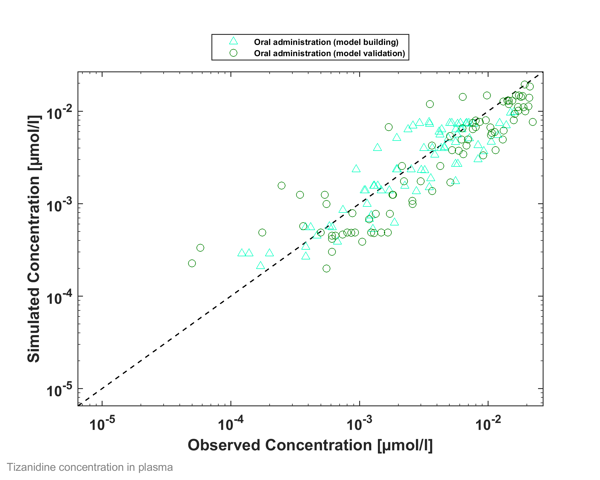

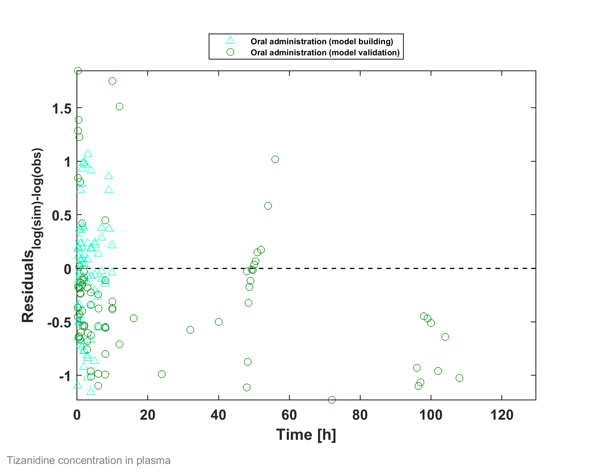

GMFE = 1.645811 

## 3.3 Concentration-Time Profiles
Simulated versus observed concentration-time profiles of all data listed in [Section 2.2.2](#2.2.2-Clinical-data) are presented below.

### 3.3.1 Model Building

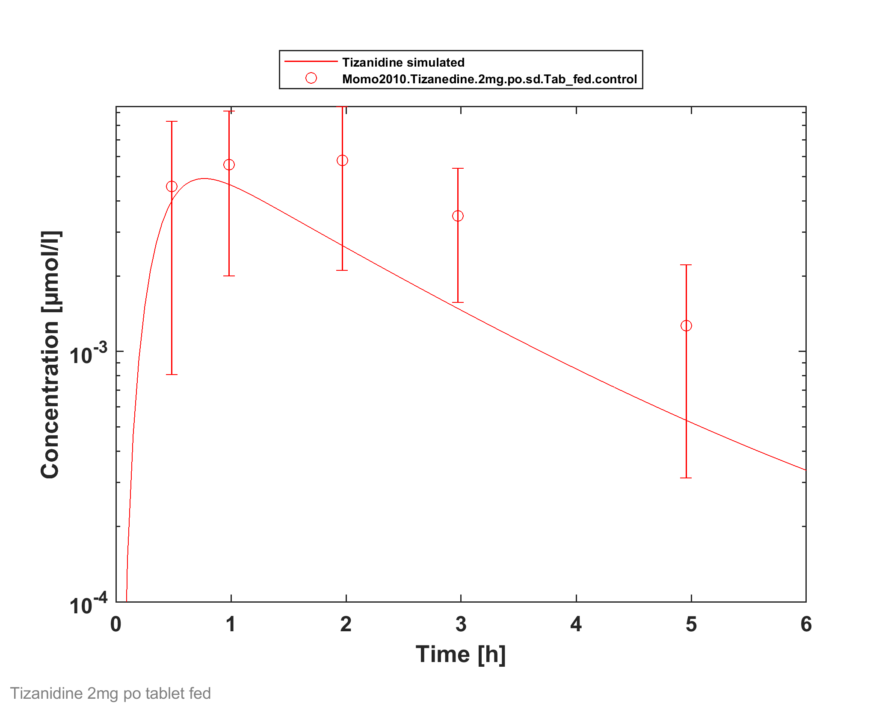

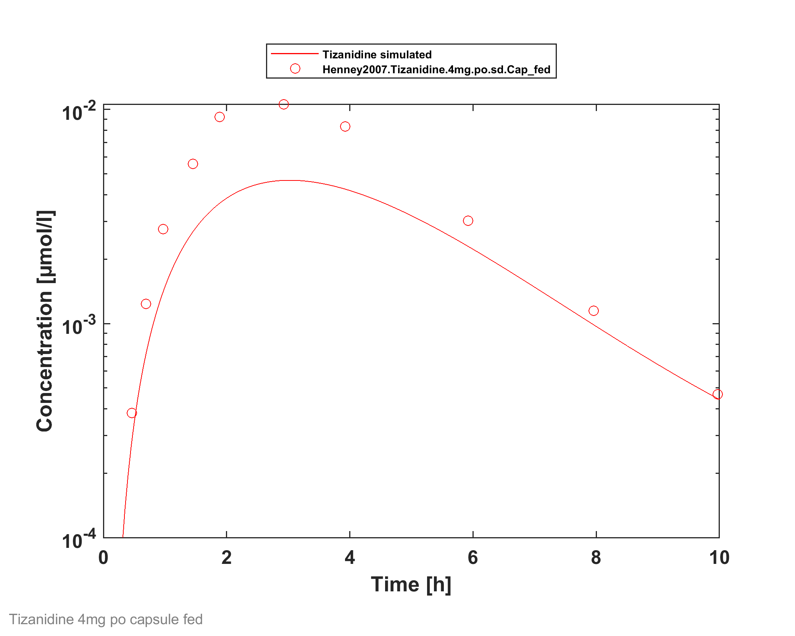

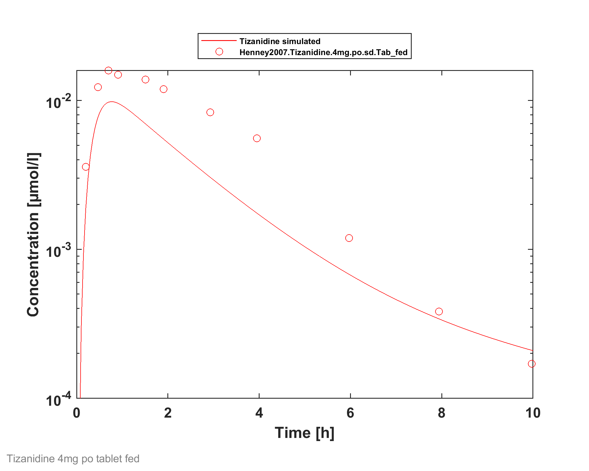

### 3.3.2 Model Verification

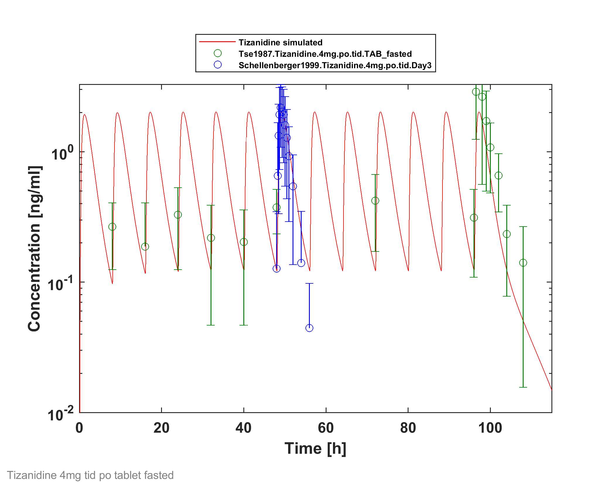

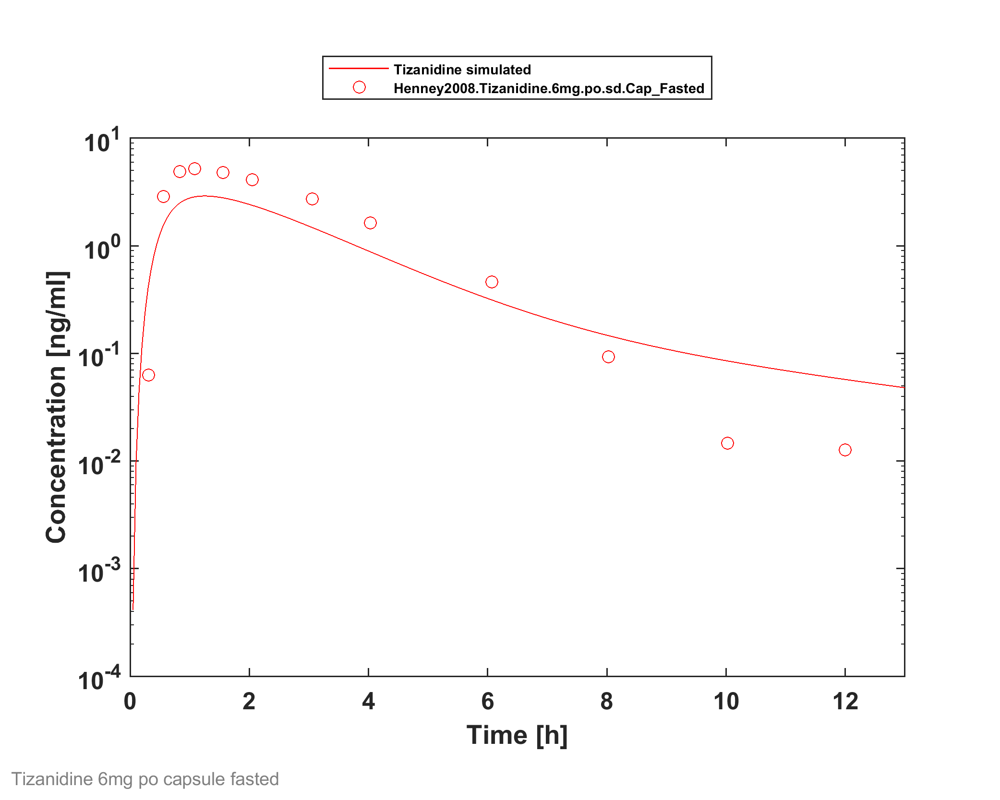

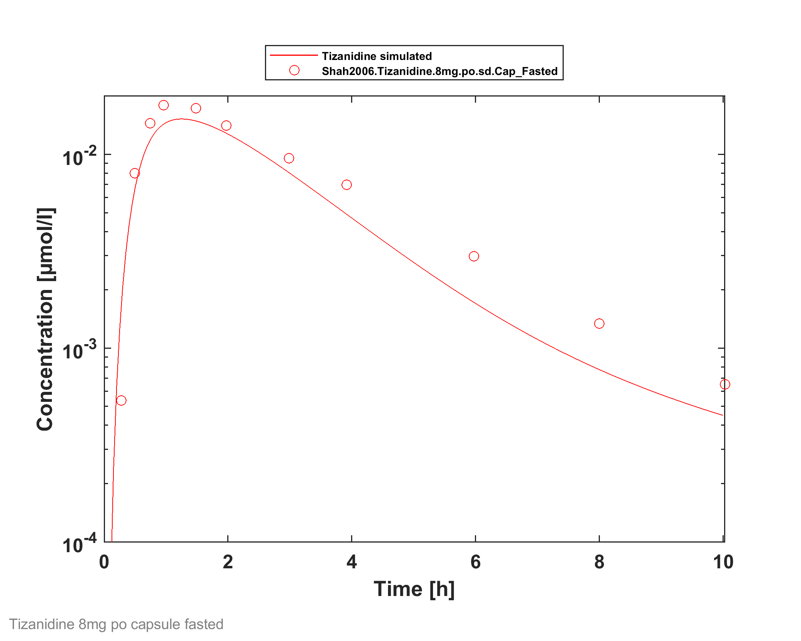

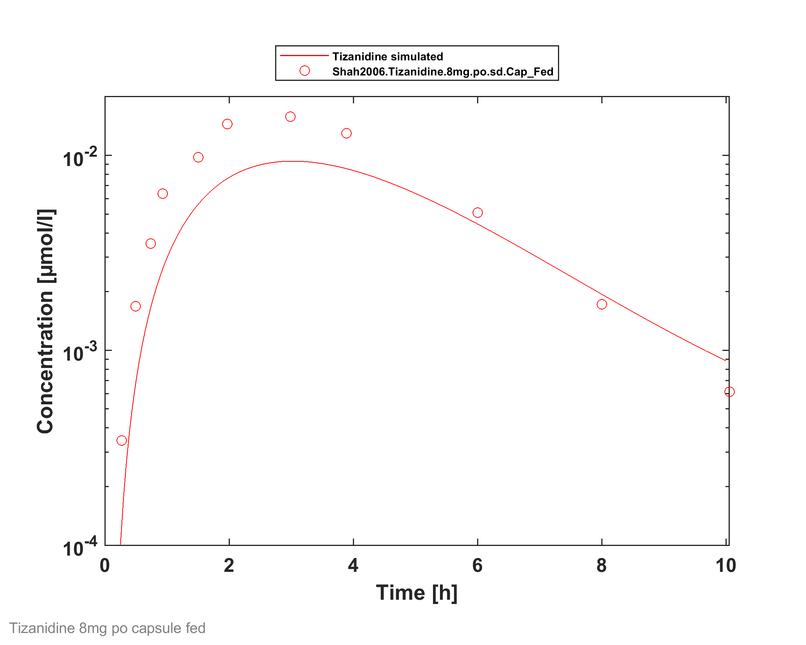

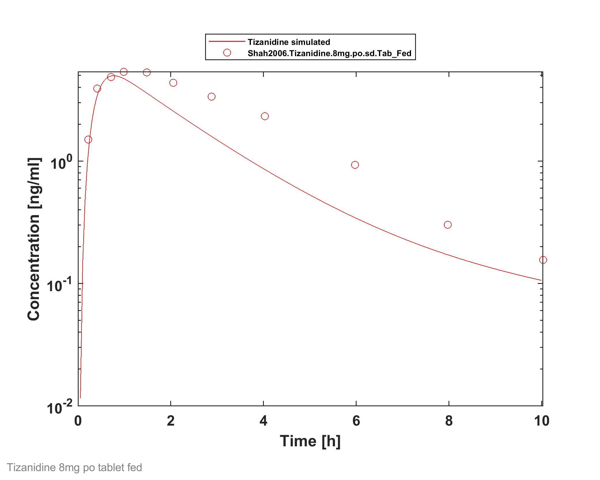

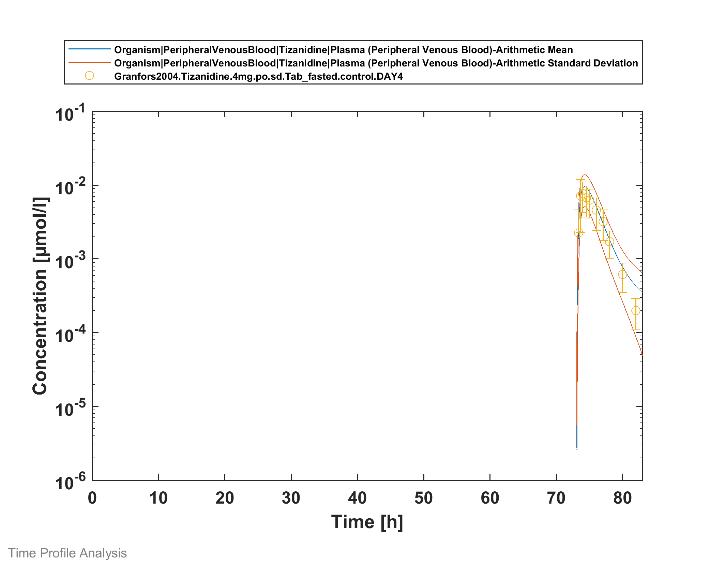

# 4 Conclusion
The PBPK model developed for tizanidine accurately predicts the time-profiles following single and multiple dosing of tizanidine. Population simulations show that predicted PK variability is in accordance with the literature.

The renal elimination is limited to glomerular filtration only. The predicted small fraction eliminated in Urine (~1%) is in line with literature reports (<5%). Given the minor contribution of the renal pathway no further exploration of active secretion was considered as the impact on DDI predictions is likely small.

Observed data suggests that administration of food accelerates the dissolution of tizanidine tablets, which is modeled through a separate set of parameter values. The effect of food on the capsule could not be described well in terms of peak concentrations. DDI predictions should be restricted to the tablet formulation. The fa estimated by PK-Sim was 1.0 in both fed and fasted condition, indicating that fa was not the limiting factor in this model.

As the model was developed in non-smoking subjects, it cannot be used to predict tizanidine concentrations in smokers.

# 5 References
**Al-Ghazawi 2013 ** Al-Ghazawi M, Alzoubi M, Faidi B. Pharmacokinetic comparison of two 4 mg tablet formulations of tizanidine. Int Journal of Clinical Pharmacology and Therapeutics. 2013 Mar 1;51(03):255–63.

**Backman 2006** Backman JT, Granfors MT, Neuvonen PJ. Rifampicin is only a weak inducer of CYP1A2-mediated presystemic and systemic metabolism: Studies with tizanidine and caffeine. Eur J Clin Pharmacol. 2006;62(6):451-461. 

**Backman 2008** Backman JT, Schröder MT, Neuvonen PJ. Effects of gender and moderate smoking on the pharmacokinetics and effects of the CYP1A2 substrate tizanidine. Eur J Clin Pharmacol. 2008;64(1):17-24. 

**DrugBank DB00697** (https://www.drugbank.ca/drugs/DB00697)

**Granfors 2004** Granfors MT, Backman JT, Laitila J, Neuvonen PJ. Tizanidine is mainly metabolized by cytochrome P450 1A2 in vitro: Tizanidine is mainly metabolized by cytochrome P450 IA2 in vitro. British Journal of Clinical Pharmacology. 2004 Jan 8;57(3):349–53.

**Haezlewood 1983** Heazlewood V, Symoniw P, Maruff P, Eadie M. Tizanidine- Initial pharmacokinetic studies in patients with spasticity. Eur J Clin Pharmacol. 1983; 25:65-67.

**Henney 2007** Henney HR, Shah J. Relative bioavailability of tizanidine 4-mg capsule and tablet formulations after a standardized high-fat meal: A single-dose, randomized, open-label, crossover study in healthy subjects. Clin Ther. 2007;29(4):661-669.

**Henney 2008** Henney HR, Fitzpatrick A, Stewart J, Runyan JD. Relative bioavailability of tizanidine hydrochloride capsule formulation compared with capsule contents administered in applesauce: A single-dose, open-label, randomized, two-way, crossover study in fasted healthy adult subjects. Clinical Therapeutics. 2008 Dec;30(12):2263–71.

**Kuepfer 2016** Kuepfer L, Niederalt C, Wendl T, Schlender JF, Willmann S, Lippert J, Block M, Eissing T, Teutonico D. Applied Concepts in PBPK Modeling: How to Build a PBPK/PD Model.CPT Pharmacometrics Syst Pharmacol. 2016 Oct;5(10):516-531.

**Mathias 1989** Mathias C, Luckitt J, Desai P, Baker H, Masri W El, Hans I. Pharmacodynamics and pharmacokinetics of the oral antispastic agent tizanidine in patients with spinal cord injury. J Rehabil Res. 1989;26(4):9-16.

**Momo 2010** Momo K, Homma M, Osaka Y, Inomata SI, Tanaka M, Kohda Y. Effects of mexiletine, a CYP1A2 inhibitor, on tizanidine pharmacokinetics and pharmacodynamics. J Clin Pharmacol. 2010;50(3):331-337. 

**PK-Sim Ontogeny Database Version 7.3** (https://github.com/Open-Systems-Pharmacology/OSPSuite.Documentation/blob/38cf71b384cfc25cfa0ce4d2f3addfd32757e13b/PK-Sim%20Ontogeny%20Database%20Version%207.3.pdf)

**Schellenberger 1999** Schellenberger MK, Groves L, Shah J, Novack GD. A controlled pharmacokinetic evaluation of tizanidine and baclofen at steady state. Drug Metabolism and Disposition.1999;2:201–4.

**Shah 2006** Shah J, Wesnes KA, Kovelesky RA, Henney HR. Effects of food on the single-dose pharmacokinetics/pharmacodynamics of tizanidine capsules and tablets in healthy volunteers. Clin Ther. 2006;28(9):1308-1317. 

**SmPC tizanidine** Zanaflex prescribing information. Website: accessdata.fda.gov/drugsatfda_docs/label/2006/020397s021,021447s002lbl.pdf, 2006, Acorda Therapeutics Inc

**Tse 1987** Tse FLS, Jaffe JM, Bhuta S. Pharmacokinetics Of Orally Administered Tizanidine In Healthy Volunteers. Fundamental & Clinical Pharmacology. 1987 Nov 12;1(6):479–88.

**Willmann 2007** Willmann S, Höhn K, Edginton A, Sevestre M, Solodenko J, Weiss W, Lippert J, Schmitt W. Development of a physiology-based whole-body population model for assessing the influence of individual variability on the pharmacokinetics of drugs. *J Pharmacokinet Pharmacodyn* 2007, 34(3): 401-431.

# 6 Glossary
| ADME    | Absorption, Distribution, Metabolism,  Excretion             |
| ------- | ------------------------------------------------------------ |
| AUC     | Area under the plasma concentration  versus time curve       |
| AUCinf  | AUC until infinity                                           |
| AUClast | AUC until last measurable sample                             |
| AUCR    | Area under the plasma concentration  versus time curve Ratio |
| b.i.d.  | Twice daily (bis in diem)                                    |
| CL      | Clearance                                                    |
| Clint   | Intrinsic liver clearance                                    |
| Cmax    | Maximum concentration                                        |
| CmaxR   | Maximum concentration Ratio                                  |
| CYP     | Cytochrome P450 oxidase                                      |
| CYP1A2  | Cytochrome P450 1A2 oxidase                                  |
| CYP2C19 | Cytochrome P450 2C19 oxidase                                 |
| CYP3A4  | Cytochrome P450 3A4 oxidase                                  |
| DDI     | Drug-drug interaction                                        |
| e.c.    | Enteric coated                                               |
| EE      | Ethinylestradiol                                             |
| EM      | Extensive metabolizers                                       |
| fm      | Fraction metabolized                                         |
| FMO     | Flavin-containing monooxygenase                              |
| fu      | Fraction unbound                                             |
| FDA     | Food and Drug administration                                 |
| GFR     | Glomerular filtration rate                                   |
| HLM     | Human liver microsomes                                       |
| hm      | homozygous                                                   |
| ht      | heterozygous                                                 |
| IM      | Intermediate metabolizers                                    |
| i.v.    | Intravenous                                                  |
| IVIVE   | In Vitro to In  Vivo Extrapolation                           |
| Ka      | Absorption rate constant                                     |
| kcat    | Catalyst rate constant                                       |
| Ki      | Inhibitor constant                                           |
| Kinact  | Rate of enzyme inactivation                                  |
| Km      | Michaelis Menten constant                                    |
| m.d.    | Multiple dose                                                |
| OSP     | Open Systems Pharmacology                                    |
| PBPK    | Physiologically-based pharmacokinetics                       |
| PK      | Pharmacokinetics                                             |
| PI      | Parameter identification                                     |
| PM      | Poor metabolizers                                            |
| RT-PCR  | Reverse transcription polymerase chain  reaction             |
| p.o.    | Per os                                                       |
| q.d.    | Once daily (quaque diem)                                     |
| SD      | Single Dose                                                  |
| SE      | Standard error                                               |
| s.d.SPC | Single doseSummary of Product Characteristics                |
| SD      | Standard deviation                                           |
| TDI     | Time dependent inhibition                                    |
| t.i.d   | Three times a day (ter in die)                               |
| UGT     | Uridine  5'-diphospho-glucuronosyltransferase                |
| UM      | Ultra-rapid metabolizers                                     |
