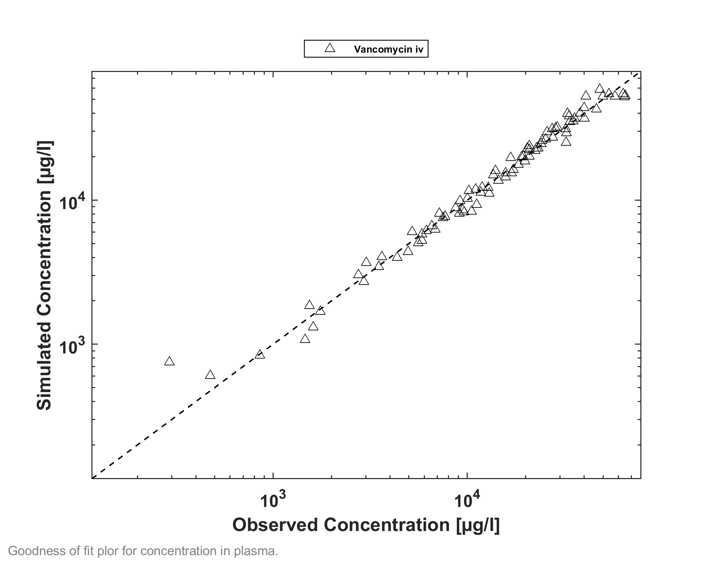
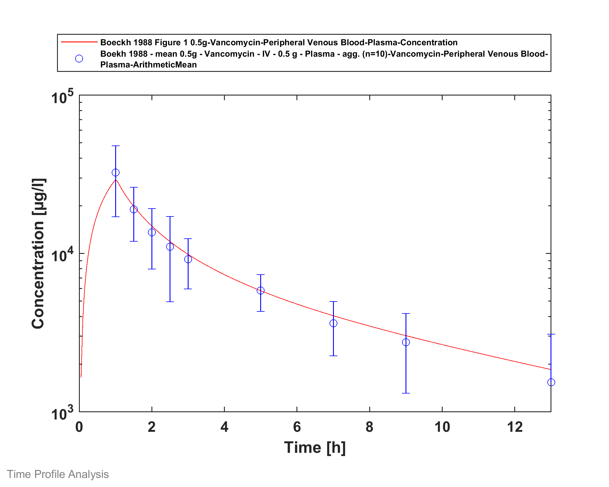
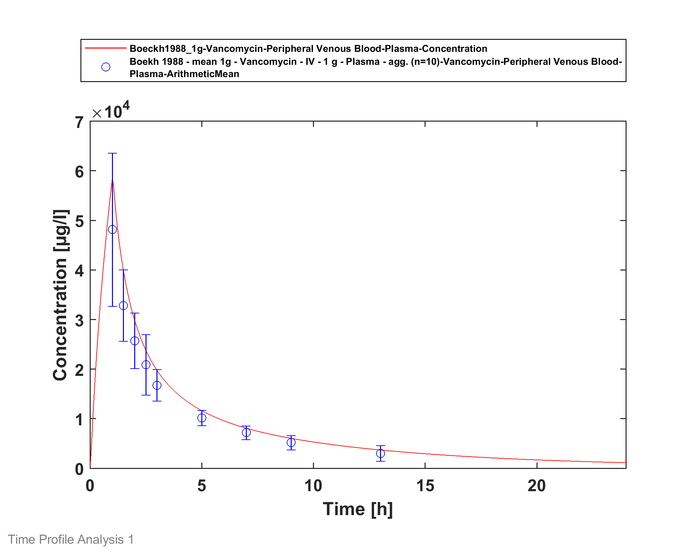
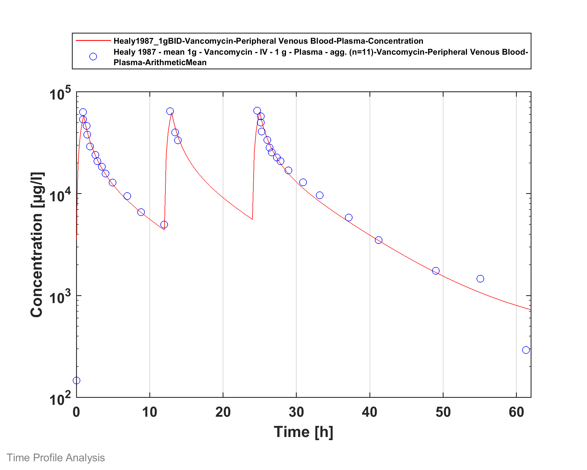
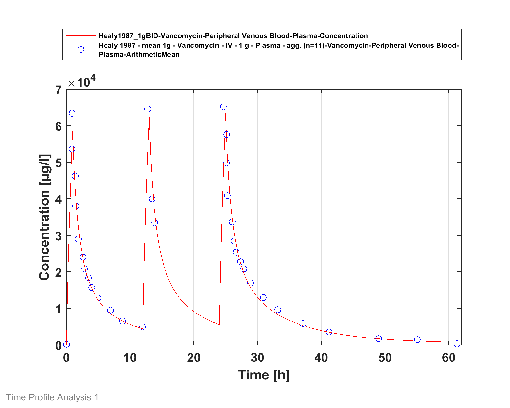

# Building and evaluation of a PBPK model for vancomycin in adults





| Version                                         | 1.2-OSP11.3                                                   |
| ----------------------------------------------- | ------------------------------------------------------------ |
| based on *Model Snapshot* and *Evaluation Plan* | https://github.com/Open-Systems-Pharmacology/Vancomycin-Model/releases/tag/v1.2 |
| OSP Version                                     | 11.3                                                          |
| Qualification Framework Version                 | 2.3                                                          |





This evaluation report and the corresponding PK-Sim project file are filed at:

https://github.com/Open-Systems-Pharmacology/OSP-PBPK-Model-Library/
# Table of Contents
  * [1 Introduction](#1-introduction)
  * [2 Methods](#2-methods)
    * [2.1 Modeling strategy](#21-modeling-strategy)
    * [2.2 Data used](#22-data-used)
    * [2.3 Model parameters and assumptions](#23-model-parameters-and-assumptions)
  * [3 Results and Discussion](#3-results-and-discussion)
    * [3.1 Vancomycin final input parameters](#31-vancomycin-final-input-parameters)
    * [3.2 Vancomycin Diagnostics Plots](#32-vancomycin-diagnostics-plots)
    * [3.3 Vancomycin Concentration-Time profiles](#33-vancomycin-concentration-time-profiles)
  * [4 Conclusion](#4-conclusion)
  * [5 References](#5-references)
# 1 Introduction
The presented model building and evaluation report evaluates the performance of a PBPK model for vancomycin in adults.

Vancomycin is a glycopeptide antibiotic related to ristocetin that inhibits bacterial cell wall assembly and is used to treat a number of bacterial infections. It can be administered intravenously, as well as orally in case of diarrhea therapy. Vancomyin is mainly eliminated via glomerular filtration (GF). A previous PBPK model for vancomycin using PK-Sim was reported by Radke et al. ([Radke 2017](#5-references)), with the dose fraction extreted unchanged into urine in adults beeing 90% with 10% hepatic elimination. Our final vancomycin model was rebuild that applies only GFR mediated clearance that adequately described the pharmacokinetics in adults. No further improvement of vancomycin pharmacokinetics could be determined after introducing hepatic clearance.

The vancomyin model is a whole-body PBPK model, allowing for dynamic translation between individuals. The vancomyin report demonstrates the level of confidence in the vancomyin  PBPK model built with the OSP suite with regard to reliable predictions of vancomyin PK in adults during model-informed drug development.

# 2 Methods

## 2.1 Modeling strategy
The general concept of building a PBPK model has previously been described by Kuepfer et al. ([Kuepfer 2016](#5-references)). Relevant information on anthropometric (height, weight) and physiological parameters (e.g. blood flows, organ volumes, binding protein concentrations, hematocrit, cardiac output) in adults was gathered from the literature and has been previously published ([Schlender 2016](#5-references)). The information was incorporated into PK-Sim® and was used as default values for the simulations in adults.

The  applied activity and variability of plasma proteins and active processes that are integrated into PK-Sim® are described in the publicly available PK-Sim® Ontogeny Database Version 7.3 ([PK-Sim Ontogeny Database Version 7.3](#5-references)) or otherwise referenced for the specific process.

First, a base mean model was built using data from the single dose escalation study to find an appropriate structure describing the PK of vancomycin. The mean PK model was developed using a typical European individual. Unknown parameters were identified using the Parameter Identification module provided in PK-Sim®. Structural model selection was mainly guided by visual inspection of the resulting description of data and biological plausibility.

Once the appropriate structural model was identified, additional parameters for different formulations were identified, if available. 

A final PBPK model was established and simulations were compared to the reported data to evaluate model appropriateness and to assess model qualification, by means of diagnostics plots and predicted versus observed concentration-time profiles, of which the results support an adequate prediction of the PK in adults.

During model building, uncertainties in data quality, as well as study differences may cause not being able to adequately describe the PK of all reported clinical studies. 

## 2.2 Data used
### 2.2.1 In vitro / physicochemical data

A literature search was performed to collect available information on physicochemical properties of vancomycin. The obtained information from literature is summarized in the table below, and is used for model building.

| **Parameter**      | **Unit**  | **Literature value (reference)**                             | **Description**                                 |
| :----------------- | --------- | ------------------------------------------------------------ | ----------------------------------------------- |
| MW                 | g/mol     | 1449.3 ([Radke 2017](#5-references))                         | Molecular weight                                |
| pKa                |           | Acid 2.18, Base 7.75, Base 8.89 ([Radke 2017](#5-references)) | Acid/base dissociation constant                 |
| Solubility (pH)    | mg/L      | 225 (7) ([Drugbank.ca](#5-references))                       | Solubility                                      |
| logP               |           | -4.41 ([Zhou 2016](#5-references)), 1.11 ([Drugbank.ca](#5-references)), 2.45 ([Radke 2017](#5-references)) | Partition coefficient between octanol and water |
| fu                 |           | 0.48 ([Zhou 2016](#5-references)), 0.67 ([Radke 2017](#5-references)) | Fraction unbound                                |
| GFR fraction       | µM        | 1 ([Zhou 2016](#5-references))                               | fraction of Glomerular filtration rate          |
| Hepatic clearance* | mL/min/kg | 0.11 ([Radke 2017](#5-references))                           | Hepatic clearance                               |
| Renal clearance*   | mL/min/kg | 0.95 ([Radke 2017](#5-references))                           | Renal clearance                                 |

*Both Hepatic and Renal clearance reported by others have not been used in the final model.

### 2.2.2 Clinical data

A literature search was performed to collect available clinical data on vancomycin in adults. 

The following publications were found in adults for model building and evaluation:

| Publication                       | Study description                                            |
| :-------------------------------- | :----------------------------------------------------------- |
| [Boeckh 1988](#5-references) | Pharmacokinetics and serum bactericidal activity of vancomycin alone and in combination with ceftazidime in healthy volunteers |
| [Healy 1987](#5-references) | Comparison of steady-state pharmacokinetics of two dosage regimens of vancomycin in normal volunteers |

## 2.3 Model parameters and assumptions
### 2.3.1 Absorption

Only intravenous data was available for model building.

### 2.3.2 Distribution

Sun et al. ([Sun 1993](#5-references)) reported that albumin and immunoglobulin A are the dominant protein binding partners of vancomycin, and that vancomycin does not bind to alpha-1 acid glycoprotein (AAG). As in PK-Sim there is only the option to bind to albumin or AAG, vancomycin binding is built-in as bound to albumin only in the PBPK model. The fraction unbound (fu) of vancomycin is built-in as 0.67 as reported by Radke et al. ([Radke 2017](#5-references)).

After testing the available organ-plasma partition coefficient and cell permeability calculation methods built in PK-Sim, observed clinical data was best described by choosing the partition coefficient calculation method by Schmitt, and cell permeability calculation method by Charge dependent Schmidt. Specific organ permeability normalized to surface area was automatically calculated by PK-Sim.

### 2.3.3 Metabolism and Elimination

A previous PBPK model for vancomycin using PK-Sim was reported by Radke et al. ([Radke 2017](#5-references)) , with the dose fraction excreted unchanged into urine in adults being 90% with 10% hepatic elimination.  Zhou et al. ([Zhou 2016](#5-references)) also published a PBPK model for vancomycin introducing an unknown hepatic clearance process being roughly 20% of total elimination. Our final vancomycin model was rebuilt that applies only GFR mediated clearance that adequately described the pharmacokinetics in adults. No further improvement of vancomycin pharmacokinetics could be determined after introducing hepatic clearance.

# 3 Results and Discussion
The PBPK model vancomycin was developed with clinical pharmacokinetic data covering intravenous administration with a dose range of 500-1000mg, including single dose (SD) as well as multiple dose (MD) clinical data. 

During the model-fitting, the following parameter was estimated (all other parameters were fixed to reported values):

* Lipophilicity

The fit resulted in an adequate description of all data. As only limited amount of data was available, and the description of the data was adequate, an additional inclusion of hepatic clearance did not further improve the description of the data as proposed in other published PBPK models, and is therefore not included in the model. Further data were not available to further evaluate the model performance.

The model results show that the PBPK model of vancomycin adequately described the data for intravenous administration for single and multiple dose. 

## 3.1 Vancomycin final input parameters
The compound parameter values of the final vancomycin PBPK model are illustrated below.

### Compound: Vancomycin

#### Parameters

Name                                       | Value                  | Value Origin                                      | Alternative | Default
------------------------------------------ | ---------------------- | ------------------------------------------------- | ----------- | -------
Solubility at reference pH                 | 225 mg/l               | Internet-Drugbank                                 | Drugbank    | True   
Reference pH                               | 7                      | Internet-Drugbank                                 | Drugbank    | True   
Lipophilicity                              | 2.2307891407 Log Units | Parameter Identification-Parameter Identification | LogP        | True   
Fraction unbound (plasma, reference value) | 0.67                   | Parameter Identification-Parameter Identification | Measurement | True   
Is small molecule                          | Yes                    |                                                   |             |        
Molecular weight                           | 1449.3 g/mol           | Publication-Other-Radke 2017                      |             |        
Plasma protein binding partner             | Albumin                |                                                   |             |        

#### Calculation methods

Name                    | Value                   
----------------------- | ------------------------
Partition coefficients  | Schmitt                 
Cellular permeabilities | Charge dependent Schmitt

#### Processes

##### Systemic Process: Glomerular Filtration-Zhou et al. 2016 GFR

Species: Human

###### Parameters

Name         | Value | Value Origin               
------------ | -----:| ---------------------------
GFR fraction |     1 | Publication-Other-Zhou 2016

## 3.2 Vancomycin Diagnostics Plots
Below you find the goodness-of-fit visual diagnostic plots for vancomycin PBPK model performance (Individually simulated versus observed plasma concentration and weighted residuals versus time, including the geometric mean fold error (GMFE)) of all data used for model building.

GMFE = 1.108908 

## 3.3 Vancomycin Concentration-Time profiles
Simulated versus observed plasma concentration-time profiles of all data are listed below.

# 4 Conclusion
The final vancomycin PBPK model applies elimination by glomerular filtration and adequately describes the pharmacokinetics of vancomycin in adults receiving SD, MD of vancomycin ranging from 500mg to 1000mg intravenously. 

This model could be applied for the investigation of drug-drug interactions (DDI), and translation to special populations such as pediatrics with regard GFR based elimination.

# 5 References
**Boeck 1988** Boeckh M, Lode H, Borner K, Höffken G, Wagner J, Koeppe P. Pharmacokinetics and serum bactericidal activity of vancomycin alone and in combination with ceftazidime in healthy volunteers. Antimicrob Agents Chemother. 1988 Jan;32(1):92-5.

**Drugbank.ca** (https://www.drugbank.ca/drugs/DB00512 )

**Healy 1987** Healy DP, Polk RE, Garson ML, Rock DT, Comstock TJ. Comparison of steady-state pharmacokinetics of two dosage regimens of vancomycin in normal volunteers. Antimicrob Agents Chemother. 1987 Mar;31(3):393-7.

**Kuepfer 2016** Kuepfer L, Niederalt C, Wendl T, Schlender JF, Willmann S, Lippert J, Block M, Eissing T, Teutonico D. Applied Concepts in PBPK Modeling: How to Build a PBPK/PD Model.CPT Pharmacometrics Syst Pharmacol. 2016 Oct;5(10):516-531. doi: 10.1002/psp4.12134. Epub 2016 Oct 19. 

**PK-Sim Ontogeny Database Version 7.3** (https://github.com/Open-Systems-Pharmacology/OSPSuite.Documentation/blob/38cf71b384cfc25cfa0ce4d2f3addfd32757e13b/PK-Sim%20Ontogeny%20Database%20Version%207.3.pdf)

**Radke 2017** Radke C, Horn D, Lanckohr C, Ellger B, Meyer M, Eissing T, Hempel G. Development of a Physiologically Based Pharmacokinetic Modelling Approach to Predict the Pharmacokinetics of Vancomycin in Critically Ill Septic Patients. Clin Pharmacokinet. 2017 Jul;56(7):759-779. doi: 10.1007/s40262-016-0475-3.

**Schlender 2016** Schlender JF, Meyer M, Thelen K, Krauss M, Willmann S, Eissing T, Jaehde U. Development of a Whole-Body Physiologically Based Pharmacokinetic Approach to Assess the Pharmacokinetics of Drugs in Elderly Individuals. Clin Pharmacokinet. 2016 Dec;55(12):1573-1589. 

**Sun 1993** Sun H, Maderazo EG, Krusell AR. Serum Protein-Binding Characteristics of Vancomycin. Antimicrob Agents Chemother. 1993 May;37(5):1132-6.

**Zhou 2016**  Zhou W, Johnson TN, Xu H, Cheung S, Bui KH, Li J, Al-Huniti N, Zhou D. Predictive Performance of Physiologically Based Pharmacokinetic and Population Pharmacokinetic Modeling of Renally Cleared Drugs in Children. CPT Pharmacometrics Syst Pharmacol. 2016 Sep;5(9):475-83. 
