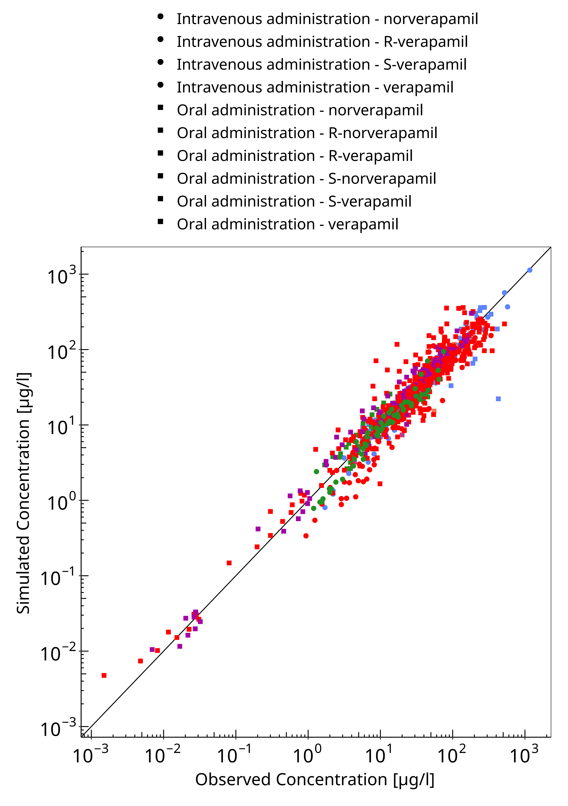
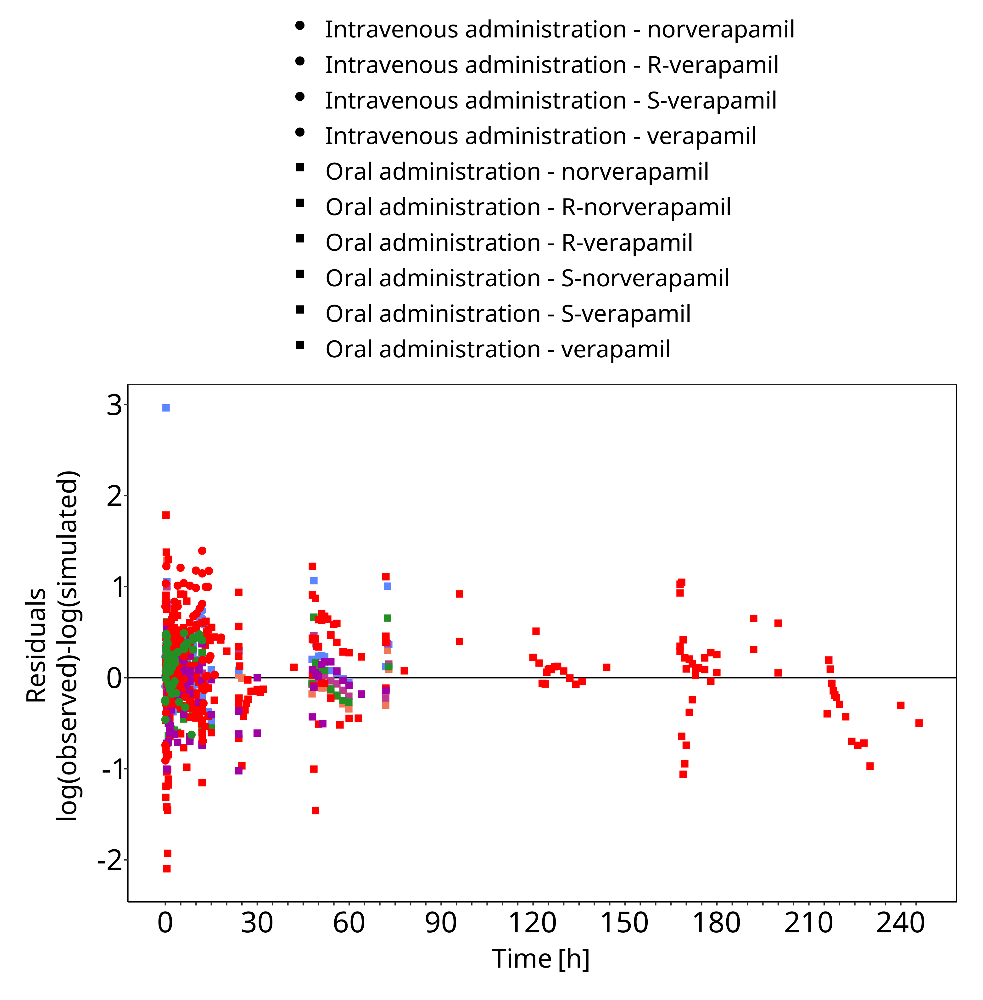
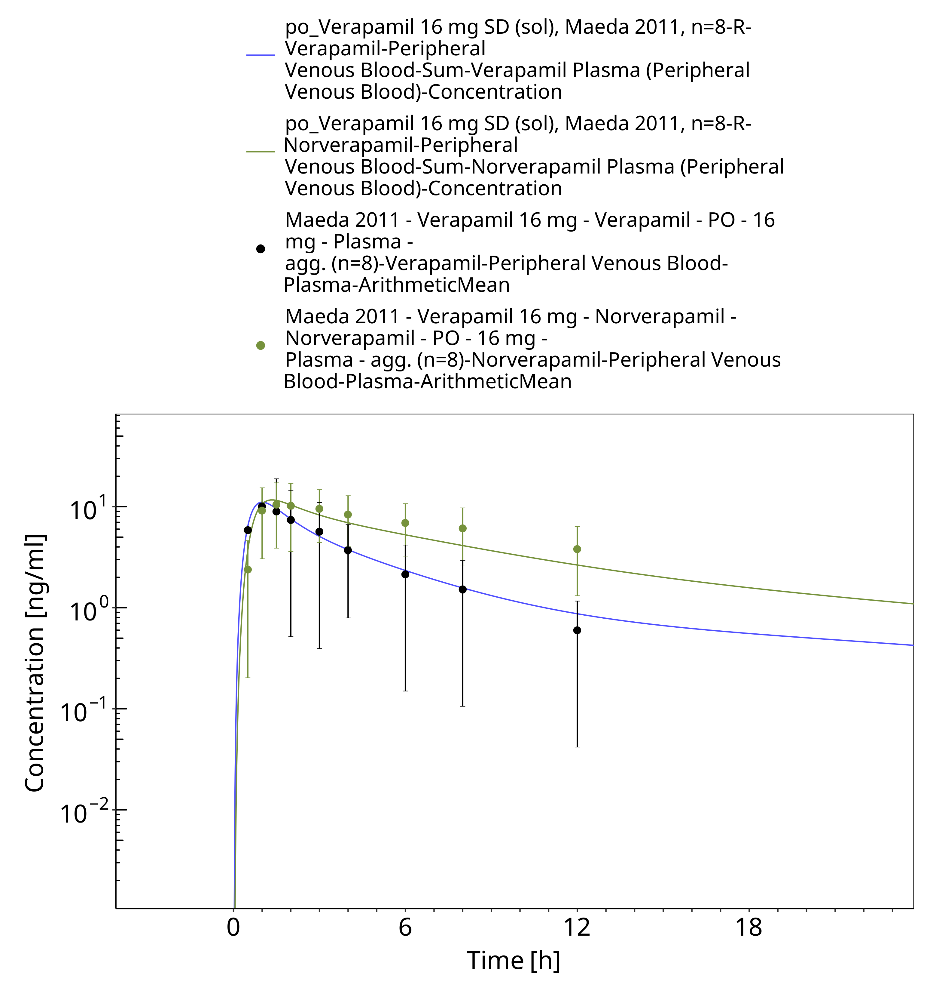
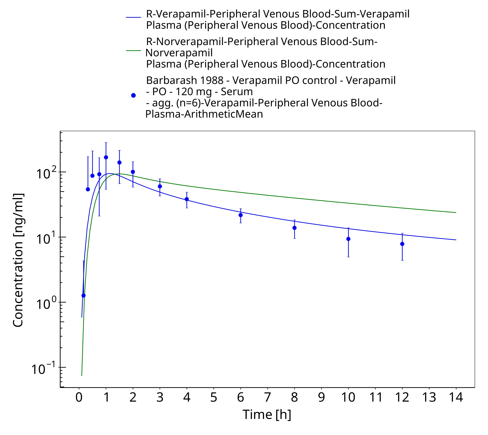
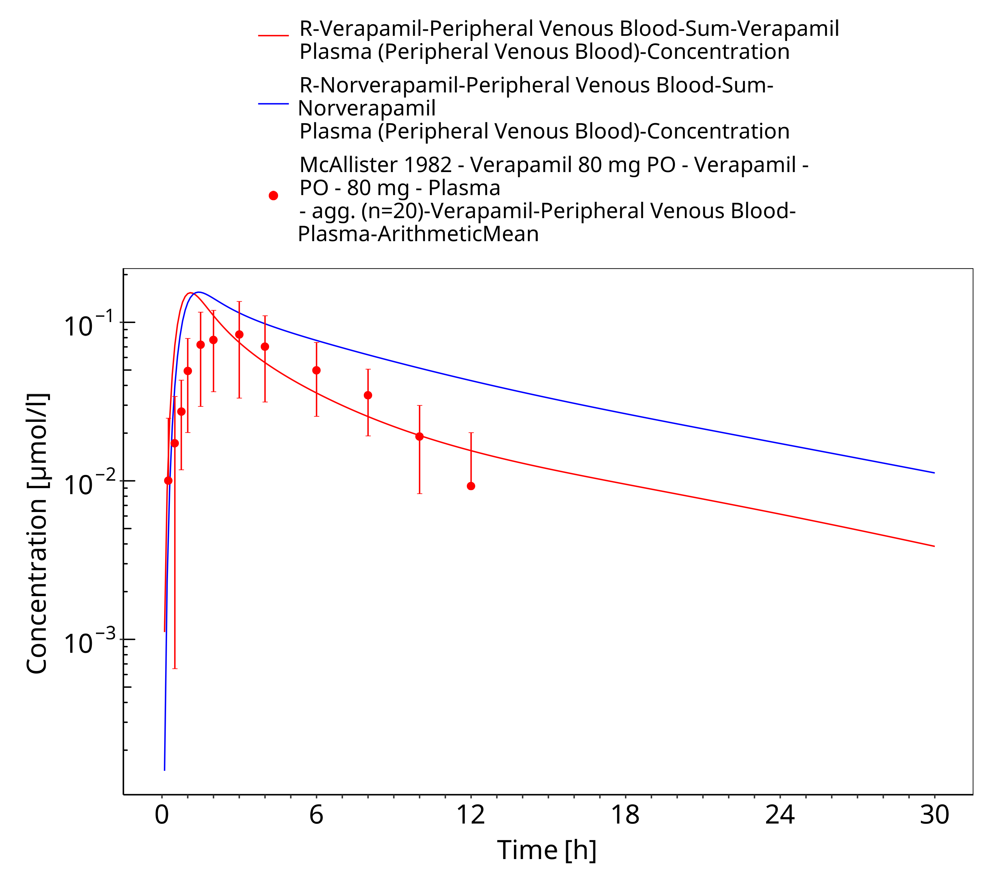
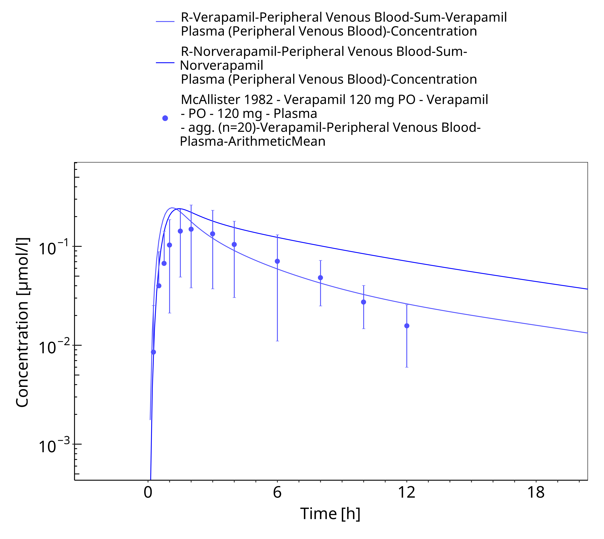

# Building and Evaluation of a PBPK Model for Verapamil in Adults

| Version                                         | 2.1-OSP12.1                                                   |
| ----------------------------------------------- | ------------------------------------------------------------ |
| based on *Model Snapshot* and *Evaluation Plan* | https://github.com/Open-Systems-Pharmacology/Verapamil-Model/releases/tag/v2.1 |
| OSP Version                                     | 12.1                                                          |
| Qualification Framework Version                 | 3.4                                                          |

This evaluation report and the corresponding PK-Sim project file are filed at:

https://github.com/Open-Systems-Pharmacology/OSP-PBPK-Model-Library/

# Table of Contents

 * [1 Introduction](#introduction)
 * [2 Methods](#methods)
   * [2.1 Modeling Strategy](#modeling-strategy)
   * [2.2 Data](#methods-data)
   * [2.3 Model Parameters and Assumptions](#model-parameters-and-assumptions)
 * [3 Results and Discussion](#results-and-discussion)
   * [3.1 Final input parameters](#final-input-parameters)
   * [3.2 Diagnostics Plots](#diagnostics-plots)
   * [3.3 Concentration-Time Profiles](#ct-profiles)
 * [4 Conclusion](#conclusion)
 * [5 References](#main-references)

# 1 Introduction

Verapamil is used for the treatment of high blood pressure, angina (chest pain from not enough blood flow to the heart), and supraventricular tachycardia.

Verapamil is administered as a 1:1 racemat of R- and S-verapamil which are metabolized mainly by CYP3A4 to S- and R-norverapamil. All four entities are mechanism-based inactivators of CYP3A4 and non-competitive inhibitors of P-gp. 

The presented verapamil model was established using observed concentration-time profiles of more than 45 clinical studies with doses from 0.1 mg to 250 mg in different verapamil dosing schedules including multiple doses and different routes of administration (intravenous, single and multiple oral administration). It includes enantioselective plasma protein binding, enantioselective metabolism by CYP3A4, non-stereospecific P-gp transport, and passive glomerular filtration 
The model building and application has been published by Hanke *et al.* 2020 ([Hanke 2020](#5-references)). 

The herein presented model building and evaluation report evaluates the performance of the PBPK model for verapamil in (healthy) adults. 

# 2 Methods

## 2.1 Modeling Strategy

The general concept of building a PBPK model has previously been described by e.g. Kuepfer et al. ([Kuepfer 2016](#5-references)). The relevant anthropometric (height, weight) and physiological information (e.g. blood flows, organ volumes, binding protein concentrations, hematocrit, cardiac output) in adults was gathered from the literature and has been previously published ([Schlender 2016](#5-references)). This information was incorporated into PK-Sim® and was used as default values for the simulations in adults.

Variability of plasma proteins and CYP enzymes are integrated into PK-Sim® and described in the publicly available PK-Sim® Ontogeny Database Version 7.3 ([PK-Sim Ontogeny Database Version 7.3](#5-references), [Schlender 2016](#5-references)) or otherwise referenced for the specific process.

First, a base mean model was built and adjusted to clinical data including single and multiple dose studies with intravenous (only single dose) and oral applications of verapamil to find an appropriate structure to describe the pharmacokinetics in plasma. The mean PBPK model was developed using a typical European individual adjusted to the demography of the respective study population.

Unknown parameters (see below) were identified using the Parameter Identification module provided in PK-Sim®. Structural model selection was mainly guided by visual inspection of the resulting description of data and biological plausibility.

Details about input data (physicochemical, *in vitro* and clinical) can be found in [Section 2.2](#22-data).

Details about the structural model and its parameters can be found in [Section 2.3](#23-model-parameters-and-assumptions).

## 2.2 Data

### In vitro / physico-chemical Data

A literature search was performed to collect available information on physiochemical properties of R- and S-verapamil and R- and S-norverapamil. The obtained information from literature is summarized in the tables below. 

#### R-verapamil

| **Parameter**   | **Unit** | **Value**       | Source                                                       | **Description**                                 |
| :-------------- | -------- | --------------- | ------------------------------------------------------------ | ----------------------------------------------- |
| MW              | g/mol    | 454.611     | [Wishart 2006](#5-references)                                    | Molecular weight                                |
| pKa (base)  | -  | 8.75          | [Hasegawa 1984](#5-references)              | Acid dissociation constant                      |
| Solubility (pH 6.54) | g/L     | 46.0 | [Vogelpoel 2004](#5-references)    | Water solubility                               |
| logP            |  | 3.79                       | [Hansch  1995](#5-references) | Partition coefficient between octanol and water |
| fu              |  %       | 5.1 | [Sanaee 2011](#5-references) | Fraction unbound in plasma                      |
| CYP3A4 Km -> Norvera            | µmol/L | 19.59 | [Wang 2013](#5-references) | CYP3A4 Michaelis-Menten constant for norverapamil formation    |
| CYP3A4 Km -> D617		  | µmol/L | 35.34 | [Wang 2013](#5-references) | CYP3A4 Michaelis-Menten constant for D617 formation    |
| P-gp Km		  | µmol/L | 1.01 | [Shirasaka 2008](#5-references) | Pgp Michaelis-Menten constant    |
| CYP3A4 MBI KI		  | µmol/L | 27.63 | [Wang 2013](#5-references) | Conc. for half-maximal inactivation    |
| CYP3A4 MBI kinact		  | 1/min | 0.038 | [Wang 2013](#5-references) | Maximum inactivation rate    |
| Pgp non-competitive Ki		  | µmol/L | 0.31 | [Döppenschmitt 1999](#5-references) | Conc. for half-maximal inactivation    |

#### S-verapamil

| **Parameter**   | **Unit** | **Value**       | Source                                                       | **Description**                                 |
| :-------------- | -------- | --------------- | ------------------------------------------------------------ | ----------------------------------------------- |
| MW              | g/mol    | 454.611     |[Wishart 2006](#5-references)                                    | Molecular weight                                |
| pKa (base)  | -  | 8.75          | [Hasegawa 1984](#5-references)            | Acid dissociation constant                      |
| Solubility (pH 6.54) | g/L     | 46.0 | [Vogelpoel 2004](#5-references) | Water solubility                               |
| logP            |  | 3.79                       | [Hansch  1995](#5-references) | Partition coefficient between octanol and water |
| fu              |  %       | 11 | [**Sanaee 2011**](#5-references) | Fraction unbound in plasma                      |
| CYP3A4 Km -> Norvera            | µmol/L | 9.72 | [Wang 2013](#5-references) | CYP3A4 Michaelis-Menten constant for norverapamil formation    |
| CYP3A4 Km -> D617		  | µmol/L | 23.64 | [Wang 2013](#5-references) | CYP3A4 Michaelis-Menten constant for D617 formation    |
| P-gp Km		  | µmol/L | 1.01 | [Shirasaka 2008](#5-references) | Pgp Michaelis-Menten constant    |
| CYP3A4 MBI KI		  | µmol/L | 3.85 | [Wang 2013](#5-references) | Conc. for half-maximal inactivation    |
| CYP3A4 MBI kinact		  | 1/min | 0.034 | [Wang 2013](#5-references) | Maximum inactivation rate    |
| Pgp non-competitive Ki		  | µmol/L | 0.31 | Döppenschmitt 1999 (#5-references) | Conc. for half-maximal inactivation    |

#### R-norverapamil

| **Parameter**   | **Unit** | **Value**       | Source                                                       | **Description**                                 |
| :-------------- | -------- | --------------- | ------------------------------------------------------------ | ----------------------------------------------- |
| MW              | g/mol    | 440.584     | [Wishart 2006](#5-references)                                    | Molecular weight                                |
| pKa (base)  | -  | 8.6 - 8.9          | [Sigma-Aldrich 2013](#5-references)             | Acid dissociation constant                      |
| fu              |  %       | 5.1 | assumed (from parent) | Fraction unbound in plasma                      |
| CYP3A4 Km -> D620            | µmol/L | 144 | [Tracy 1999](#5-references) | CYP3A4 Michaelis-Menten constant for norverapamil degradation |
| P-gp Km		  | µmol/L | 1.01 | assumed (from parent) | Pgp Michaelis-Menten constant    |
| CYP3A4 MBI KI		  | µmol/L | 6.1 | [Wang 2013](#5-references) | Conc. for half-maximal inactivation    |
| CYP3A4 MBI kinact		  | 1/min | 0.048 | [Wang 2013](#5-references) | Maximum inactivation rate    |
| Pgp non-competitive Ki		  | µmol/L | 0.30 | [Pauli-Magnus 2000](#5-references) | Conc. for half-maximal inactivation    |

#### S-norverapamil

| **Parameter**   | **Unit** | **Value**       | Source                                                       | **Description**                                 |
| :-------------- | -------- | --------------- | ------------------------------------------------------------ | ----------------------------------------------- |
| MW              | g/mol    | 440.584     | [Wishart 2006](#5-references)                                    | Molecular weight                                |
| pKa (base)  | -  | 8.6 - 8.9          | [Sigma-Aldrich 2013](#5-references)            | Acid dissociation constant                      |
| fu              |  %       | 11 | assumed (from parent) | Fraction unbound in plasma                      |
| CYP3A4 Km -> D620            | µmol/L | 36 | [Tracy 1999](#5-references) | CYP3A4 Michaelis-Menten constant for norverapamil degradation |
| P-gp Km		  | µmol/L | 1.01 | assumed (from parent) | Pgp Michaelis-Menten constant    |
| CYP3A4 MBI KI		  | µmol/L | 2.90 | [Wang 2013](#5-references) | Conc. for half-maximal inactivation    |
| CYP3A4 MBI kinact		  | 1/min | 0.080 | [Wang 2013](#5-references) | Maximum inactivation rate    |
| Pgp non-competitive Ki		  | µmol/L | 0.30 | [Pauli-Magnus 2000](#5-references) | Conc. for half-maximal inactivation    |

### Clinical Data

A literature search was performed to collect available clinical data on verapamil in healthy adults.

#### Model Building and parameterizing of CYP3A4 interaction

The following studies were used for model building and parameterization of CYP3A4 interaction:
If not stated otherwise, the drug was given as a 1:1 racemat of S- and R-verapamil.

| Publication                      | Arm / Treatment / Information used for model building        |
| :------------------------------- | :----------------------------------------------------------- |
| [Eichelbaum 1984](#5-references) | Healthy subjects receiving single intravenous doses of 5, 25 and 50 mg of R-verapamil and 5, 7.5 and 10 mg of S-verapamil |
| [Streit 2005](#5-references) | Healthy subjects receiving single intravenous doses of 5 mg |
| [Barbarash 1988](#5-references)  | Healthy subjects receiving single intravenous doses of 10 mg |
| [Abernethy 1993](#5-references) | Healthy subjects receiving single intravenous doses of 20 mg |
| [Maeda 2011](#5-references) | Healthy subjects receiving single oral doses of 0.1, 3 and 16 mg |
| [Blume 1989](#5-references) | Healthy subjects receiving single oral doses of 80 mg |
| [Ratiopharm 1988](#5-references) | Healthy subjects receiving single oral doses of 80 mg |
| [Johnson 2001](#5-references)   | Healthy subjects receiving multiple oral doses of 80 mg TID. | 
| [Härtter 2012](#5-references) | Healthy subjects receiving single oral doses of 120 mg and multiple oral doses of 120 mg BID |
| [Hla 1987](#5-references)       | Healthy subjects receiving multiple oral doses of 120 mg BID |

#### Model verification 

The following studies were used for model verification:

| Publication                      | Arm / Treatment / Information used for model building        |
| :------------------------------- | :----------------------------------------------------------- |
| [Mooy 1985](#5-references) |  Healthy subjects receiving single intravenous doses of 3 mg and single oral doses of 80 mg |
| [Johnston 1981](#5-references)   | Healthy subjects receiving single intravenous doses of 0.1 mg/kg and single oral doses of 120 mg |
| [Abernethy 1985](#5-references) | Healthy subjects receiving single intravenous doses of 10 mg and single oral doses of 120 mg |
| [Barbarash 1988](#5-references)  | Healthy subjects receiving single oral doses of 120 mg |
| [Wing 1985](#5-references) | Healthy subjects receiving single intravenous doses 10mg and single oral doses of 80 mg |
| [McAllister 1982](#5-references) | Healthy subjects receiving single intravenous doses of 10 mg |
| [Smith 1984](#5-references) | Healthy subjects receiving single intravenous doses of 10 mg and single oral doses of 120 mg |
| [Freedman 1981](#5-references) | Healthy subjects receiving single intravenous doses of 13.1 mg |
| [Vogelsang 1984](#5-references) | Healthy subjects receiving single oral doses of 250mg R-verapamil |
| [Blume 1983](#5-references) | Healthy subjects receiving single oral doses of 40 mg |
| [Blume 1990](#5-references) | Healthy subjects receiving single oral doses of 40 mg |
| [John 1992](#5-references) | Healthy subjects receiving single oral doses of 40 mg |
| [Sawicki 2002](#5-references) | Healthy subjects receiving single oral doses of 40 mg |
| [Choi 2008](#5-references) | Healthy subjects receiving single oral doses of 60 mg |
| [Wing 1985](#5-references) | Healthy subjects receiving single oral doses of 80 mg |
| [Maeda 2011](#5-references) | Healthy subjects receiving single oral doses of 80 mg |
| [Ratiopharm 1989](#5-references) | Healthy subjects receiving single oral doses of 80 mg |
| [Boehringer 2018](#5-references) | Healthy subjects receiving single oral doses of 120 mg |
| [Blume 1987](#5-references) | Healthy subjects receiving single oral doses of 120 mg |
| [Johnston 1981](#5-references) | Healthy subjects receiving single oral doses of 120 mg |
| [Mikus 1990](#5-references) | Healthy subjects receiving single oral doses of 160 mg |
| [van Haarst 2009](#5-references) | Healthy subjects receiving multiple oral doses of 180 mg BID |
| [Blume 1994](#5-references) | Healthy subjects receiving single oral doses of 240 mg QD |
| [Joergenson 1988](#5-references) | Healthy subjects receiving multiple oral doses of 120 mg BID |
| [Shand 1981](#5-references)     | Healthy subjects receiving multiple oral doses of 120 mg TID |
| [Karim 1995](#5-references)     | Healthy subjects receiving single oral doses of 240 mg |

## 2.3 Model Parameters and Assumptions

### Absorption

Verapamil is transported by P-gp. The model includes non-stereospecific P-gp transport. 

### Distribution

After testing the available organ-plasma partition coefficient and cell permeability calculation methods built in PK-Sim, observed clinical data was best described by choosing the partition coefficient calculation by `Rodgers and Rowland` and cellular permeability calculation by `PK-Sim Standard`. 

### Metabolism, Elimination and Inhibition

Verapamil is metabolized by CYP3A4 and transported by P-gp. The model includes enantioselective metabolism by CYP3A4, non-stereospecific P-gp transport. Additionally passive glomerular filtration was integrated. 

Mechanism-based inactivation of CYP3A4 and non-competitive inhibition of P-gp by all four entities (S-verapamil, R-verapamil, S-norverapamil and R-norverapamil) was taken into account. The CYP3A4 MBI KI and kinact values were taken from literature, the KI values for P-gp inhibition were optimized.

### Automated Parameter Identification

The parameter identification tool in PK-Sim has been used to estimate selected model parameters by adjusting to PK data of the clinical studies that were used in the model building process. 

The result of the final parameter identification is shown in the tables below:

#### R-verapamil

| Model Parameter            | Optimized Value | Unit |
| -------------------------- | --------------- | ---- |
| logP            		|  2.84  	||
| CYP3A4 kcat -> Norvera        |  34.94 	|1/min|
| CYP3A4 kcat -> D617           |  43.98	|1/min|
| P-gp kcat            		|  12.60	|1/min|
| Pgp non-competitive Ki        |  0.038	|µmol/L|
| Cellular permeability         |  9.94E-02	|cm/min|
| Intestinal permeability       |  3.54E-06	|cm/min|
| SR tablet Weibull time        |  155.24	|min|
| SR tablet Weibull shape       |  2.37		| |

#### S-verapamil

| Model Parameter            | Optimized Value | Unit |
| -------------------------- | --------------- | ---- |
| logP            		|  2.84  	||
| CYP3A4 kcat -> Norvera        |  26.17 	|1/min|
| CYP3A4 kcat -> D617           |  56.42	|1/min|
| P-gp kcat            		|  12.60	|1/min|
| Pgp non-competitive Ki        |  0.038	|µmol/L|
| Cellular permeability         |  9.94E-02	|cm/min|
| Intestinal permeability       |  3.54E-06	|cm/min|
| SR tablet Weibull time        |  155.24	|min|
| SR tablet Weibull shape       |  2.37		| |

#### R-norverapamil

| Model Parameter            | Optimized Value | Unit |
| -------------------------- | --------------- | ---- |
| logP            		|  2.84  	||
| CYP3A4 kcat -> D620           |  145.64	|1/min|
| P-gp kcat            		|  3.39		|1/min|
| Pgp non-competitive Ki        |  0.038	|µmol/L|
| Cellular permeability         |  9.94E-02	|cm/min|
| Intestinal permeability       |  3.54E-06	|cm/min|

#### S-norverapamil

| Model Parameter            | Optimized Value | Unit |
| -------------------------- | --------------- | ---- |
| logP            		|  2.84  	||
| CYP3A4 kcat -> D620           |  41.10	|1/min|
| P-gp kcat            		|  3.39		|1/min|
| Pgp non-competitive Ki        |  0.038	|µmol/L|
| Cellular permeability         |  9.94E-02	|cm/min|
| Intestinal permeability       |  3.54E-06	|cm/min|

# 3 Results and Discussion

The PBPK model for verapamil was developed and evaluated using publically available, clinical pharmacokinetic data from studies listed in [Section 2.2](#clinical-data).

The next sections show:

1. the final model parameters for the building blocks: [Section 3.1](#31-final-input-parameters).
2. the overall goodness of fit: [Section 3.2](#32-diagnostics-plots).
3. simulated vs. observed concentration-time profiles for the clinical studies used for model building and for model verification: [Section 3.3](#33-concentration-time-profiles).

## 3.1 Final input parameters

The compound parameter values of the final PBPK model are illustrated below.

### Compound: R-Verapamil

#### Parameters

Name                                             | Value                   | Value Origin                                                                                           | Alternative | Default
------------------------------------------------ | ----------------------- | ------------------------------------------------------------------------------------------------------ | ----------- | -------
Solubility at reference pH                       | 46 mg/ml                |                                                                                                        | Measurement | True   
Reference pH                                     | 6.54                    |                                                                                                        | Measurement | True   
Lipophilicity                                    | 2.8407448658 Log Units  | Parameter Identification-Parameter Identification-Value updated from '30b - final' on 2019-12-30 13:23 | logP        | True   
Fraction unbound (plasma, reference value)       | 5.1 %                   | Publication-In Vivo                                                                                    | Measurement | True   
Permeability                                     | 0.0994098912 cm/min     | Parameter Identification-Parameter Identification-Value updated from '30b - final' on 2019-12-30 13:23 | Fitted      | True   
Specific intestinal permeability (transcellular) | 3.5447164381E-06 cm/min | Parameter Identification-Parameter Identification-Value updated from '30b - final' on 2019-12-30 13:23 | Fitted      | True   
Is small molecule                                | Yes                     |                                                                                                        |             |        
Molecular weight                                 | 454.611 g/mol           |                                                                                                        |             |        
Plasma protein binding partner                   | Unknown                 |                                                                                                        |             |        

#### Calculation methods

Name                    | Value              
----------------------- | -------------------
Partition coefficients  | Rodgers and Rowland
Cellular permeabilities | PK-Sim Standard    

#### Processes

##### Systemic Process: Glomerular Filtration-GFR

Species: Human

###### Parameters

Name         | Value | Value Origin
------------ | -----:| ------------:
GFR fraction |     1 |             

##### Transport Protein: P-gp-Paper

Molecule: P-gp

###### Parameters

Name                      | Value                                | Value Origin                                                                                          
------------------------- | ------------------------------------ | ------------------------------------------------------------------------------------------------------
In vitro Vmax/transporter | 0.00057724 pmol/min/pmol transporter |                                                                                                       
Km                        | 1.01 µmol/l                          |                                                                                                       
kcat                      | 12.5970868779 1/min                  | Parameter Identification-Parameter Identification-Value updated from '30b - final' on 2019-12-30 13:23

##### Inhibition: P-gp-Non-competitive

Molecule: P-gp

###### Parameters

Name | Value               | Value Origin                                                                                          
---- | ------------------- | ------------------------------------------------------------------------------------------------------
Ki   | 0.0383697779 µmol/l | Parameter Identification-Parameter Identification-Value updated from '30b - final' on 2019-12-30 13:23

##### Inhibition: CYP3A4-MBI

Molecule: CYP3A4

###### Parameters

Name          | Value        | Value Origin
------------- | ------------ | ------------:
kinact        | 0.038 1/min  |             
K_kinact_half | 27.63 µmol/l |             

##### Metabolizing Enzyme: CYP3A4-Norverapamil

Molecule: CYP3A4

Metabolite: R-Norverapamil

###### Parameters

Name                               | Value                         | Value Origin                                                                                          
---------------------------------- | ----------------------------- | ------------------------------------------------------------------------------------------------------
In vitro Vmax for liver microsomes | 1.27 nmol/min/mg mic. protein |                                                                                                       
Km                                 | 19.59 µmol/l                  |                                                                                                       
kcat                               | 34.9352466212 1/min           | Parameter Identification-Parameter Identification-Value updated from '30b - final' on 2019-12-30 13:23

##### Metabolizing Enzyme: CYP3A4-D617

Molecule: CYP3A4

###### Parameters

Name                               | Value                         | Value Origin                                                                                          
---------------------------------- | ----------------------------- | ------------------------------------------------------------------------------------------------------
In vitro Vmax for liver microsomes | 1.17 nmol/min/mg mic. protein |                                                                                                       
Km                                 | 35.34 µmol/l                  |                                                                                                       
kcat                               | 43.9812289146 1/min           | Parameter Identification-Parameter Identification-Value updated from '30b - final' on 2019-12-30 13:23

### Compound: S-Verapamil

#### Parameters

Name                                             | Value                   | Value Origin                                                                                           | Alternative | Default
------------------------------------------------ | ----------------------- | ------------------------------------------------------------------------------------------------------ | ----------- | -------
Solubility at reference pH                       | 46 mg/ml                |                                                                                                        | Measurement | True   
Reference pH                                     | 6.54                    |                                                                                                        | Measurement | True   
Lipophilicity                                    | 2.8407448658 Log Units  | Parameter Identification-Parameter Identification-Value updated from '30b - final' on 2019-12-30 13:23 | logP        | True   
Fraction unbound (plasma, reference value)       | 11 %                    | Publication-In Vivo                                                                                    | Measurement | True   
Permeability                                     | 0.0994098912 cm/min     | Parameter Identification-Parameter Identification-Value updated from '30b - final' on 2019-12-30 13:23 | Fitted      | True   
Specific intestinal permeability (transcellular) | 3.5447164381E-06 cm/min | Parameter Identification-Parameter Identification-Value updated from '30b - final' on 2019-12-30 13:23 | Fitted      | True   
Is small molecule                                | Yes                     |                                                                                                        |             |        
Molecular weight                                 | 454.611 g/mol           |                                                                                                        |             |        
Plasma protein binding partner                   | Unknown                 |                                                                                                        |             |        

#### Calculation methods

Name                    | Value              
----------------------- | -------------------
Partition coefficients  | Rodgers and Rowland
Cellular permeabilities | PK-Sim Standard    

#### Processes

##### Systemic Process: Glomerular Filtration-GFR

Species: Human

###### Parameters

Name         | Value | Value Origin
------------ | -----:| ------------:
GFR fraction |     1 |             

##### Transport Protein: P-gp-Paper

Molecule: P-gp

###### Parameters

Name                      | Value                                | Value Origin                                                                                          
------------------------- | ------------------------------------ | ------------------------------------------------------------------------------------------------------
In vitro Vmax/transporter | 0.00057724 pmol/min/pmol transporter |                                                                                                       
Km                        | 1.01 µmol/l                          |                                                                                                       
kcat                      | 12.5970868779 1/min                  | Parameter Identification-Parameter Identification-Value updated from '30b - final' on 2019-12-30 13:23

##### Inhibition: P-gp-Non-competitive

Molecule: P-gp

###### Parameters

Name | Value               | Value Origin                                                                                          
---- | ------------------- | ------------------------------------------------------------------------------------------------------
Ki   | 0.0383697779 µmol/l | Parameter Identification-Parameter Identification-Value updated from '30b - final' on 2019-12-30 13:23

##### Inhibition: CYP3A4-MBI

Molecule: CYP3A4

###### Parameters

Name          | Value       | Value Origin
------------- | ----------- | ------------:
kinact        | 0.034 1/min |             
K_kinact_half | 3.85 µmol/l |             

##### Metabolizing Enzyme: CYP3A4-Norverapamil

Molecule: CYP3A4

Metabolite: S-Norverapamil

###### Parameters

Name                               | Value                         | Value Origin                                                                                          
---------------------------------- | ----------------------------- | ------------------------------------------------------------------------------------------------------
In vitro Vmax for liver microsomes | 1.02 nmol/min/mg mic. protein |                                                                                                       
Km                                 | 9.72 µmol/l                   |                                                                                                       
kcat                               | 26.1743386639 1/min           | Parameter Identification-Parameter Identification-Value updated from '30b - final' on 2019-12-30 13:23

##### Metabolizing Enzyme: CYP3A4-D617

Molecule: CYP3A4

###### Parameters

Name                               | Value                         | Value Origin                                                                                          
---------------------------------- | ----------------------------- | ------------------------------------------------------------------------------------------------------
In vitro Vmax for liver microsomes | 0.86 nmol/min/mg mic. protein |                                                                                                       
Km                                 | 23.64 µmol/l                  |                                                                                                       
kcat                               | 56.4245798193 1/min           | Parameter Identification-Parameter Identification-Value updated from '30b - final' on 2019-12-30 13:23

### Compound: R-Norverapamil

#### Parameters

Name                                             | Value                   | Value Origin                                                                                           | Alternative | Default
------------------------------------------------ | ----------------------- | ------------------------------------------------------------------------------------------------------ | ----------- | -------
Solubility at reference pH                       | 46 mg/ml                |                                                                                                        | Measurement | True   
Reference pH                                     | 6.54                    |                                                                                                        | Measurement | True   
Lipophilicity                                    | 2.8407448658 Log Units  | Parameter Identification-Parameter Identification-Value updated from '30b - final' on 2019-12-30 13:23 | logP        | True   
Fraction unbound (plasma, reference value)       | 5.1 %                   | Other-Assumption                                                                                       | Measurement | True   
Permeability                                     | 0.0994098912 cm/min     | Parameter Identification-Parameter Identification-Value updated from '30b - final' on 2019-12-30 13:23 | Fitted      | True   
Specific intestinal permeability (transcellular) | 3.5447164381E-06 cm/min | Parameter Identification-Parameter Identification-Value updated from '30b - final' on 2019-12-30 13:23 | Fitted      | True   
Is small molecule                                | Yes                     |                                                                                                        |             |        
Molecular weight                                 | 440.584 g/mol           |                                                                                                        |             |        
Plasma protein binding partner                   | Unknown                 |                                                                                                        |             |        

#### Calculation methods

Name                    | Value              
----------------------- | -------------------
Partition coefficients  | Rodgers and Rowland
Cellular permeabilities | PK-Sim Standard    

#### Processes

##### Metabolizing Enzyme: CYP3A4-D620

Molecule: CYP3A4

###### Parameters

Name                             | Value                       | Value Origin                                                                                          
-------------------------------- | --------------------------- | ------------------------------------------------------------------------------------------------------
In vitro Vmax/recombinant enzyme | 9 pmol/min/pmol rec. enzyme |                                                                                                       
Km                               | 144 µmol/l                  |                                                                                                       
kcat                             | 145.6385399671 1/min        | Parameter Identification-Parameter Identification-Value updated from '30b - final' on 2019-12-30 13:23

##### Systemic Process: Glomerular Filtration-GFR

Species: Human

###### Parameters

Name         | Value | Value Origin
------------ | -----:| ------------:
GFR fraction |     1 |             

##### Transport Protein: P-gp-Paper

Molecule: P-gp

###### Parameters

Name                      | Value                                | Value Origin                                                                                          
------------------------- | ------------------------------------ | ------------------------------------------------------------------------------------------------------
In vitro Vmax/transporter | 0.00057724 pmol/min/pmol transporter |                                                                                                       
Km                        | 1.01 µmol/l                          |                                                                                                       
kcat                      | 3.3916609583 1/min                   | Parameter Identification-Parameter Identification-Value updated from '30b - final' on 2019-12-30 13:23

##### Inhibition: P-gp-Non-competitive

Molecule: P-gp

###### Parameters

Name | Value               | Value Origin                                                                                          
---- | ------------------- | ------------------------------------------------------------------------------------------------------
Ki   | 0.0383697779 µmol/l | Parameter Identification-Parameter Identification-Value updated from '30b - final' on 2019-12-30 13:23

##### Inhibition: CYP3A4-MBI

Molecule: CYP3A4

###### Parameters

Name          | Value       | Value Origin
------------- | ----------- | ------------:
kinact        | 0.048 1/min |             
K_kinact_half | 6.1 µmol/l  |             

### Compound: S-Norverapamil

#### Parameters

Name                                             | Value                   | Value Origin                                                                                           | Alternative | Default
------------------------------------------------ | ----------------------- | ------------------------------------------------------------------------------------------------------ | ----------- | -------
Solubility at reference pH                       | 46 mg/ml                |                                                                                                        | Measurement | True   
Reference pH                                     | 6.54                    |                                                                                                        | Measurement | True   
Lipophilicity                                    | 2.8407448658 Log Units  | Parameter Identification-Parameter Identification-Value updated from '30b - final' on 2019-12-30 13:23 | logP        | True   
Fraction unbound (plasma, reference value)       | 11 %                    | Other-Assumption                                                                                       | Measurement | True   
Permeability                                     | 0.0994098912 cm/min     | Parameter Identification-Parameter Identification-Value updated from '30b - final' on 2019-12-30 13:23 | Fitted      | True   
Specific intestinal permeability (transcellular) | 3.5447164381E-06 cm/min | Parameter Identification-Parameter Identification-Value updated from '30b - final' on 2019-12-30 13:23 | Fitted      | True   
Is small molecule                                | Yes                     |                                                                                                        |             |        
Molecular weight                                 | 440.584 g/mol           |                                                                                                        |             |        
Plasma protein binding partner                   | Unknown                 |                                                                                                        |             |        

#### Calculation methods

Name                    | Value              
----------------------- | -------------------
Partition coefficients  | Rodgers and Rowland
Cellular permeabilities | PK-Sim Standard    

#### Processes

##### Metabolizing Enzyme: CYP3A4-D620

Molecule: CYP3A4

###### Parameters

Name                             | Value                         | Value Origin                                                                                          
-------------------------------- | ----------------------------- | ------------------------------------------------------------------------------------------------------
In vitro Vmax/recombinant enzyme | 6.5 pmol/min/pmol rec. enzyme |                                                                                                       
Km                               | 36 µmol/l                     |                                                                                                       
kcat                             | 41.0994047535 1/min           | Parameter Identification-Parameter Identification-Value updated from '30b - final' on 2019-12-30 13:23

##### Systemic Process: Glomerular Filtration-GFR

Species: Human

###### Parameters

Name         | Value | Value Origin
------------ | -----:| ------------:
GFR fraction |     1 |             

##### Transport Protein: P-gp-Paper

Molecule: P-gp

###### Parameters

Name                      | Value                                | Value Origin                                                                                          
------------------------- | ------------------------------------ | ------------------------------------------------------------------------------------------------------
In vitro Vmax/transporter | 0.00057724 pmol/min/pmol transporter |                                                                                                       
Km                        | 1.01 µmol/l                          |                                                                                                       
kcat                      | 3.3916609583 1/min                   | Parameter Identification-Parameter Identification-Value updated from '30b - final' on 2019-12-30 13:23

##### Inhibition: P-gp-Non-competitive

Molecule: P-gp

###### Parameters

Name | Value               | Value Origin                                                                                          
---- | ------------------- | ------------------------------------------------------------------------------------------------------
Ki   | 0.0383697779 µmol/l | Parameter Identification-Parameter Identification-Value updated from '30b - final' on 2019-12-30 13:23

##### Inhibition: CYP3A4-MBI

Molecule: CYP3A4

###### Parameters

Name          | Value      | Value Origin
------------- | ---------- | ------------:
kinact        | 0.08 1/min |             
K_kinact_half | 2.9 µmol/l |             

### Formulation: Solution

Type: Dissolved

### Formulation: Retard Tablet Verapamil (Knoll)

Type: Weibull

#### Parameters

Name                             | Value              | Value Origin                                                                                                                               
-------------------------------- | ------------------ | -------------------------------------------------------------------------------------------------------------------------------------------
Dissolution time (50% dissolved) | 155.2445399403 min | Parameter Identification-Parameter Identification-Value updated from '240 mg retard (Isoptin RR) QD vs Verabeta 240 RR' on 2019-12-31 11:13
Lag time                         | 0 min              |                                                                                                                                            
Dissolution shape                | 2.3662989419       | Parameter Identification-Parameter Identification-Value updated from '240 mg retard (Isoptin RR) QD vs Verabeta 240 RR' on 2019-12-31 11:13
Use as suspension                | Yes                |                                                                                                                                            

## 3.2 Diagnostics Plots

Below you find the goodness-of-fit visual diagnostic plots for the PBPK model performance of all data used presented in [Section 2.2](#clinical-data).

The first plot shows observed versus simulated plasma concentration, the second weighted residuals versus time. 

**Table 3-1: GMFE for Goodness of fit plot for concentration in plasma**

|Group                                     |GMFE |
|:-----------------------------------------|:----|
|Intravenous administration - norverapamil |1.66 |
|Intravenous administration - R-verapamil  |1.25 |
|Intravenous administration - S-verapamil  |1.31 |
|Intravenous administration - verapamil    |1.45 |
|Oral administration - norverapamil        |1.29 |
|Oral administration - R-norverapamil      |1.14 |
|Oral administration - R-verapamil         |1.33 |
|Oral administration - S-norverapamil      |1.16 |
|Oral administration - S-verapamil         |1.31 |
|Oral administration - verapamil           |1.42 |
|All                                       |1.36 |

 
 

**Figure 3-1: Goodness of fit plot for concentration in plasma**

 
 

**Figure 3-2: Goodness of fit plot for concentration in plasma**

 
 

## 3.3 Concentration-Time Profiles

Simulated versus observed concentration-time profiles of all data listed in [Section 2.2](#clinical-data) are presented below.

**Figure 3-3: Time Profile Analysis**

 
 

**Figure 3-4: Time Profile Analysis**

 
 

**Figure 3-5: Time Profile Analysis**

 
 

**Figure 3-6: Time Profile Analysis**

 
 

**Figure 3-7: Time Profile Analysis**

 
 

**Figure 3-8: Time Profile Analysis**

 
 

**Figure 3-9: Time Profile Analysis**

 
 

**Figure 3-10: Time Profile Analysis**

 
 

**Figure 3-11: Time Profile Analysis**

 
 

**Figure 3-12: Time Profile Analysis**

 
 

**Figure 3-13: Time Profile Analysis**

 
 

**Figure 3-14: Time Profile Analysis**

 
 

**Figure 3-15: Time Profile Analysis**

 
 

**Figure 3-16: Time Profile Analysis**

 
 

**Figure 3-17: Time Profile Analysis**

 
 

**Figure 3-18: Time Profile Analysis**

 
 

**Figure 3-19: Time Profile Analysis**

 
 

**Figure 3-20: Time Profile Analysis**

 
 

**Figure 3-21: Time Profile Analysis**

 
 

**Figure 3-22: Time Profile Analysis**

 
 

**Figure 3-23: Time Profile Analysis**

 
 

**Figure 3-24: Time Profile Analysis**

 
 

**Figure 3-25: Time Profile Analysis**

 
 

**Figure 3-26: Time Profile Analysis**

 
 

**Figure 3-27: Time Profile Analysis**

 
 

**Figure 3-28: Time Profile Analysis**

 
 

**Figure 3-29: Time Profile Analysis**

 
 

**Figure 3-30: Time Profile Analysis**

 
 

**Figure 3-31: Time Profile Analysis**

 
 

**Figure 3-32: Time Profile Analysis**

 
 

**Figure 3-33: Time Profile Analysis**

 
 

**Figure 3-34: Time Profile Analysis**

 
 

**Figure 3-35: Time Profile Analysis**

 
 

**Figure 3-36: Time Profile Analysis**

 
 

**Figure 3-37: Time Profile Analysis**

 
 

**Figure 3-38: Time Profile Analysis**

 
 

**Figure 3-39: Time Profile Analysis**

 
 

**Figure 3-40: Time Profile Analysis**

 
 

**Figure 3-41: Time Profile Analysis**

 
 

**Figure 3-42: Time Profile Analysis**

 
 

**Figure 3-43: Time Profile Analysis**

 
 

**Figure 3-44: Time Profile Analysis**

 
 

**Figure 3-45: Time Profile Analysis**

 
 

**Figure 3-46: Time Profile Analysis**

 
 

**Figure 3-47: Time Profile Analysis**

 
 

**Figure 3-48: Time Profile Analysis**

 
 

**Figure 3-49: Time Profile Analysis**

 
 

**Figure 3-50: Time Profile Analysis**

 
 

**Figure 3-51: Time Profile Analysis**

 
 

**Figure 3-52: Time Profile Analysis**

 
 

**Figure 3-53: Time Profile Analysis**

 
 

**Figure 3-54: Time Profile Analysis**

 
 

# 4 Conclusion

The herein presented PBPK model adequately describes the pharmacokinetics of R-verapamil, S-verapamil, R-norverapamil and S-norverapamil after single and multiple administration of a variety of doses to healthy adults.  Furthermore, mechanism-based CYP3A4 (auto-) inactivation on verapamil itself can be described well with the optimized parameterization. 

# 5 References

**Abernethy 1985** Abernethy DR, Schwartz JB, Todd EL. Lack of interaction between verapamil and cimetidine. Clin Pharmacol Ther. 1985 Sep;38(3):342-9. doi: 10.1038/clpt.1985.183. PMID: 4028631.

**Abernethy 1993** Abernethy DR, Wainer IW, Longstreth JA, Andrawis NS (1993) Stereoselective verapamil disposition and dynamics in aging during racemic verapamil administration. The Journal of pharmacology and experimental therapeutics 266(2):904–11

**Barbarash 1988** Barbarash RA, Bauman JL, Fischer JH, Kondos GT, Batenhorst RL. Near-total reduction in verapamil bioavailability by rifampin. Electrocardiographic correlates. Chest. 1988 Nov;94(5):954-9.

**Blume 1983** Blume H, Mutschler E (1989) Bioäquivalenz: Qualitätsbewertung wirkstoffgleicher Fertigarzneimittel: Anleitung, Methoden, Materialien. Govi-Verlag

**Blume 1994** Blume H, Mutschler E (1989) Bioäquivalenz: Qualitätsbewertung wirkstoffgleicher Fertigarzneimittel: Anleitung, Methoden, Materialien. Govi-Verlag

**Blume 1987** Blume H, Mutschler E (1989) Bioäquivalenz: Qualitätsbewertung wirkstoffgleicher Fertigarzneimittel: Anleitung, Methoden, Materialien. Govi-Verlag

**Blume 1989** Blume H, Mutschler E (1989) Bioäquivalenz: Qualitätsbewertung wirkstoffgleicher Fertigarzneimittel: Anleitung, Methoden, Materialien. Govi-Verlag

**Blume 1990** Blume H, Mutschler E (1989) Bioäquivalenz: Qualitätsbewertung wirkstoffgleicher Fertigarzneimittel: Anleitung, Methoden, Materialien. Govi-Verlag

**Blume 1994** Blume H, Mutschler E (1989) Bioäquivalenz: Qualitätsbewertung wirkstoffgleicher Fertigarzneimittel: Anleitung, Methoden, Materialien. Govi-Verlag

**Boehringer 2018** Boehringer Ingelheim Pharma GmbH & Co KG (2018) The effect of potent inhibitors of drug transporters (verapamil, rifampin, cimetidine, probenecid) on pharmacokinetics of a transporter probe drug cocktail consisting of digoxin, furosemide, metformin and rosuvastatin. EudraCT 2017-001549-29. https://clinicaltrials.gov/ct2/show/record/NCT03307252, accessed: 2020-02-25

**Choi 2008** Choi DH, Shin WG, Choi JS (2008) Drug interaction between oral atorvastatin and verapamil in healthy subjects: effects of atorvastatin on the pharmacokinetics of verapamil and norverapamil. European journal of clinical pharmacology 64(5):445–9

**Döppenschmitt 1999** Döppenschmitt S, Langguth P, Regårdh CG, Andersson TB, Hilgendorf C, Spahn-Langguth H. Characterization of binding properties to human P-glycoprotein: development of a [3H]verapamil radioligand-binding assay. J Pharmacol Exp Ther. 1999 Jan;288(1):348-57. PMID: 9862789.

**Eichelbaum 1984** Eichelbaum M, Mikus G, Vogelgesang B. Pharmacokinetics of (+)-, (-)- and (+/-)-verapamil after intravenous administration. Br J Clin Pharmacol. 1984 Apr;17(4):453-8. doi: 10.1111/j.1365-2125.1984.tb02371.x. PMID: 6721991; PMCID: PMC1463390.

**Freedman 1981** Freedman SB, Richmond DR, Ashley JJ, Kelly DT (1981) Verapamil kinetics in normal subjects and patients with coronary artery spasm. Clinical pharmacology and therapeutics 30(5):644–52

**Härtter 2012** Härtter S, Sennewald R, Nehmiz G, Reilly P (2012) Oral bioavailability of dabigatran etexilate (Pradaxa(®) ) after co-medication with verapamil in healthy subjects. British journal of clinical pharmacology 75(4):1053–62

**Hasegawa 1984** Hasegawa J, Fujita T, Hayashi Y, Iwamoto K, Watanabe J. pKa determination of verapamil by liquid-liquid partition. J Pharm Sci. 1984 Apr;73(4):442-5. doi: 10.1002/jps.2600730405. PMID: 6726625.

**Hansch  1995** Hansch C, Leo A, Hoekman D (1995) Exploring QSAR: Hydrophobic, electronic, and steric constants. American Chemical Society, Washington, DC

**Heikkinen 2012** Heikkinen AT, Baneyx G, Caruso A, Parrott N. Application of PBPK modeling to predict human intestinal metabolism of CYP3A substrates - an evaluation and case study using GastroPlus. Eur J Pharm Sci. 2012 Sep 29;47(2):375-86. doi: 10.1016/j.ejps.2012.06.013. Epub 2012 Jul 1.

**Hla 1987** Hla KK, Henry JA, Latham AN. Pharmacokinetics and pharmacodynamics of two formulations of verapamil. Br J Clin Pharmacol. 1987 Nov;24(5):661-4.

**Joergenson 1988** Jørgensen NP, Walstad RA. Pharmacokinetics of verapamil and norverapamil in patients with hypertension: a comparison of oral conventional and sustained release formulations. Pharmacol Toxicol. 1988 Aug;63(2):105-7.

**John 1992** John DN, Fort S, Lewis MJ, Luscombe DK (1992) Pharmacokinetics and pharmacodynamics of verapamil following sublingual and oral administration to healthy volunteers. British journal of clinical pharmacology 33(6):623–7

**Johnson 2001** Johnson BF, Cheng SL, Venitz J. Transient kinetic and dynamic interactions between verapamil and dofetilide, a class III antiarrhythmic. J Clin Pharmacol. 2001 Nov;41(11):1248-56.

**Johnston 1981** Johnston A, Burgess CD, Hamer J. Systemic availability of oral verapamil and effect on PR interval in man. Br J Clin Pharmacol. 1981 Sep;12(3):397-400.

**Karim 1995** Karim A, Piergies A. Verapamil stereoisomerism: enantiomeric ratios in plasma dependent on peak concentrations, oral input rate, or both. Clin Pharmacol Ther. 1995 Aug;58(2):174-84.

**Kuepfer 2016** Kuepfer L, Niederalt C, Wendl T, Schlender JF, Willmann S, Lippert J, Block M, Eissing T, Teutonico D. Applied Concepts in PBPK Modeling: How to Build a PBPK/PD Model.CPT Pharmacometrics Syst Pharmacol. 2016 Oct;5(10):516-531.

**Maeda 2011** Maeda K, Takano J, Ikeda Y, Fujita T, Oyama Y, Nozawa K, Kumagai Y, Sugiyama Y (2011) Nonlinear pharmacokinetics of oral quinidine and verapamil in healthy subjects: a clinical microdosing study. Clinical pharmacology and therapeutics 90(2):263–70

**McAllister 1982** McAllister RG Jr, Kirsten EB. The pharmacology of verapamil. IV. Kinetic and dynamic effects after single intravenous and oral doses. Clin Pharmacol Ther. 1982 Apr;31(4):418-26.

**Mikus 1990** Mikus G, Eichelbaum M, Fischer C, Gumulka S, Klotz U, Kroemer HK (1990) Interaction of verapamil and cimetidine: stereochemical aspects of drug metabolism, drug disposition and drug action. The Journal of pharmacology and experimental therapeutics 253(3):1042–8

**Mooy 1985** Mooy J, Schols M, v Baak M, v Hooff M, Muytjens A, Rahn KH (1985) Pharmacokinetics of verapamil in patients with renal failure. European journal of clinical pharmacology 28(4):405–10

**Nishimura 2003** Nishimura, M., Yaguti, H., Yoshitsugu, H., Naito, S. & Satoh, T. Tissue distribution of mRNA expression of human cytochrome P450 isoforms assessed by high-sensitivity real-time reverse transcription PCR. J. Pharm. Soc. Japan 123, 369–75 (2003).

**Pauli-Magnus 2000** Pauli-Magnus C, von Richter O, Burk O, Ziegler A, Mettang T, Eichelbaum M, Fromm MF. Characterization of the major metabolites of verapamil as substrates and inhibitors of P-glycoprotein. J Pharmacol Exp Ther. 2000 May;293(2):376-82. PMID: 10773005.

**Perdaems 2010** Perdaems N, Blasco H, Vinson C, Chenel M, Whalley S, Cazade F, Bouzom F. Predictions of metabolic drug-drug interactions using physiologically based modelling: Two cytochrome P450 3A4 substrates coadministered with ketoconazole or verapamil. Clin Pharmacokinet. 2010 Apr;49(4):239-58.

**PK-Sim Ontogeny Database Version 7.3** (https://github.com/Open-Systems-Pharmacology/OSPSuite.Documentation/blob/38cf71b384cfc25cfa0ce4d2f3addfd32757e13b/PK-Sim%20Ontogeny%20Database%20Version%207.3.pdf)

**Ratiopharm 1988** ratiopharm GmbH (2016) Fachinformation Verapamil-ratiopharm® N 40 mg / 80 mg Filmtabletten

**Ratiopharm 1989** ratiopharm GmbH (2016) Fachinformation Verapamil-ratiopharm® N 40 mg / 80 mg Filmtabletten

**Rowland-Yeo 2011** Rowland Yeo K, Walsky RL, Jamei M, Rostami-Hodjegan A, Tucker GT. Prediction of time-dependent CYP3A4 drug-drug interactions by physiologically based pharmacokinetic modelling: impact of inactivation parameters and enzyme turnover. Eur J Pharm Sci. 2011 Jun 14;43(3):160-73.

**Sanaee 2011** Sanaee F, Clements JD, Waugh AW, Fedorak RN, Lewanczuk R, Jamali F. Drug-disease interaction: Crohn's disease elevates verapamil plasma concentrations but reduces response to the drug proportional to disease activity. Br J Clin Pharmacol. 2011 Nov;72(5):787-97. doi: 10.1111/j.1365-2125.2011.04019.x. PMID: 21592185; PMCID: PMC3243013.

**Sandström 1999** Sandström R, Knutson TW, Knutson L, Jansson B, Lennernäs H. The effect of ketoconazole on the jejunal permeability and CYP3A metabolism of (R/S)-verapamil in humans. Br J Clin Pharmacol. 1999 Aug;48(2):180-9.

**Sawicki 2002** Sawicki W, Janicki S (2002) Pharmacokinetics of verapamil and its metabolite norverapamil from a buccal drug formulation. International journal of pharmaceutics 238(1-2):181–9

**Schlender 2016** Schlender JF, Meyer M, Thelen K, Krauss M, Willmann S, Eissing T, Jaehde U. Development of a Whole-Body Physiologically Based Pharmacokinetic Approach to Assess the Pharmacokinetics of Drugs in Elderly Individuals. Clin Pharmacokinet. 2016 Dec;55(12):1573-1589. 

**Shand 1981** Shand DG, Hammill SC, Aanonsen L, Pritchett EL. Reduced verapamil clearance during long-term oral administration. Clin Pharmacol Ther. 1981 Nov;30(5):701-6. 

**Shirasaka 2008** Shirasaka Y, Sakane T, Yamashita S. Effect of P-glycoprotein expression levels on the concentration-dependent permeability of drugs to the cell membrane. J Pharm Sci. 2008 Jan;97(1):553-65. doi: 10.1002/jps.21114. PMID: 17828734.

**Sigma-Aldrich 2013** Sigma-Aldrich Inc (2013) A Case Study in SPE Method Development - Understanding the Dual Interaction Properties of Discovery DSC-SCX SPE Using Verapamil (and Metabolite) from Serum as a Test Example.

**Smith 1984** Smith MS, Benyunes MC, Bjornsson TD, Shand DG, Pritchett EL (1984) Influence of cimetidine on verapamil kinetics and dynamics. Clinical pharmacology and therapeutics 36(4):551–4

**Streit 2005** Streit M, Göggelmann C, Dehnert C, Burhenne J, Riedel KD, Menold E, Mikus G, Bärtsch P, Haefeli WE. Cytochrome P450 enzyme-mediated drug metabolism at exposure to acute hypoxia (corresponding to an altitude of 4,500 m). Eur J Clin Pharmacol. 2005 Mar;61(1):39-46.

**Tracy 1999** Tracy TS, Korzekwa KR, Gonzalez FJ, Wainer IW. Cytochrome P450 isoforms involved in metabolism of the enantiomers of verapamil and norverapamil. Br J Clin Pharmacol. 1999 May;47(5):545-52.

**van Haarst 2009** van Haarst AD, Dijkmans AC, Weimann HJ, Kemme MJB, Bosch JJ, Schoemaker RC, Cohen AF, Burggraaf J (2009) Clinically important interaction between tedisamil and verapamil. Journal of clinical pharmacology 49(5):560–7

**Vogelpoel 2004** Vogelpoel H, Welink J, Amidon GL, Junginger HE, Midha KK, Möller H, Olling M, Shah VP, Barends DM. Biowaiver monographs for immediate release solid oral dosage forms based on biopharmaceutics classification system (BCS) literature data: verapamil hydrochloride, propranolol hydrochloride, and atenolol. J Pharm Sci. 2004 Aug;93(8):1945-56.

**Vogelgesang 1984** Vogelgesang B, Echizen H, Schmidt E, Eichelbaum M (1984) Stereoselective first-pass metabolism of highly cleared drugs: studies of the bioavailability of L- and D-verapamil examined with a stable isotope technique. British journal of clinical pharmacology 18(5):733–40

**Wang 2013** Wang J, Xia S, Xue W, Wang D, Sai Y, Liu L, Liu X. A semi-physiologically-based pharmacokinetic model characterizing mechanism-based auto-inhibition to predict stereoselective pharmacokinetics of verapamil and its metabolite norverapamil in human. Eur J Pharm Sci. 2013 Nov 20;50(3-4):290-302. doi: 10.1016/j.ejps.2013.07.012. Epub 2013 Jul 31. PMID: 23916407.

**Wing 1985** Wing LM, Miners JO, Lillywhite KJ (1985) Verapamil disposition–effects of sulphinpyrazone and cimetidine. British journal of clinical pharmacology 19(3):385–91

**Wishart 2006** Wishart DS, Knox C, Guo AC, Shrivastava S, Hassanali M, Stothard P, Chang Z, Woolsey J. DrugBank: a comprehensive resource for in silico drug discovery and exploration. Nucleic Acids Res. 2006 Jan 1;34(Database issue):D668-72. doi: 10.1093/nar/gkj067. PMID: 16381955; PMCID: PMC1347430.

