# Building and Evaluation of a PBPK Model for Verapamil in Adults

| Version                                         | 1.1-OSP9.1                                                   |
| ----------------------------------------------- | ------------------------------------------------------------ |
| based on *Model Snapshot* and *Evaluation Plan* | https://github.com/Open-Systems-Pharmacology/Verapamil-Model/releases/tag/v1.1 |
| OSP Version                                     | 9.1                                                          |
| Qualification Framework Version                 | 2.2                                                          |

This evaluation report and the corresponding PK-Sim project file are filed at:

https://github.com/Open-Systems-Pharmacology/OSP-PBPK-Model-Library/
# Table of Contents
  * [1 Introduction](#1-introduction)
  * [2 Methods](#2-methods)
    * [2.1 Modeling Strategy](#21-modeling-strategy)
    * [2.2 Data](#22-data)
    * [2.3 Model Parameters and Assumptions](#23-model-parameters-and-assumptions)
  * [3 Results and Discussion](#3-results-and-discussion)
    * [3.1 Final input parameters](#31-final-input-parameters)
    * [3.2 Diagnostics Plots](#32-diagnostics-plots)
    * [3.3: Concentration-Time Profiles](#33-concentration-time-profiles)
      * [3.3.1 Model Building](#331-model-building)
      * [3.3.2 Model verification](#332-model-verification)
  * [4 Conclusion](#4-conclusion)
  * [5 References](#5-references)
# 1 Introduction
Verapamil is used for the treatment of high blood pressure, angina (chest pain from not enough blood flow to the heart), and supraventricular tachycardia.

Its major metabolizing enzyme is CYP3A4, but also CY2C8 to some extent ([Tracy 1999](#5-References)). The dose- and time-dependent nonlinear behavior of verapamil is well described through implementation of the synergistic CYP3A4 mechanism-based (auto-)inactivation by verapamil. 

The presented verapamil model was established using observed concentration-time profiles of more than 10 clinical studies with doses from 0.1 mg to 240 mg in different verapamil dosing schedules including multiple doses over up to 10 days and different routes of administration (intravenous, single and multiple oral administration). 

The herein presented model building and evaluation report evaluates the performance of the PBPK model for verapamil in (healthy) adults. 

The established verapamil PBPK model is verified for the use as a perpetrator drug in drug-drug interaction simulations.
# 2 Methods

## 2.1 Modeling Strategy
The general concept of building a PBPK model has previously been described by e.g. Kuepfer et al. ([Kuepfer 2016](#5-References)). The relevant anthropometric (height, weight) and physiological information (e.g. blood flows, organ volumes, binding protein concentrations, hematocrit, cardiac output) in adults was gathered from the literature and has been previously published ([PK-Sim Ontogeny Database Version 7.3](#5-References)). This information was incorporated into PK-Sim® and was used as default values for the simulations in adults.

Variability of plasma proteins and CYP enzymes are integrated into PK-Sim® and described in the publicly available PK-Sim® Ontogeny Database Version 7.3 ([PK-Sim Ontogeny Database Version 7.3](#5-References), [Schlender 2016](#5-References)) or otherwise referenced for the specific process.

First, a base mean model was built and adjusted to clinical data including single and multiple dose studies with oral applications of verapamil to find an appropriate structure to describe the pharmacokinetics in plasma. The mean PBPK model was developed using a typical European individual adjusted to the demography of the respective study population. The relative tissue specific expressions of enzymes predominantly being involved in the metabolism of verapamil were derived from RT-PCR data from [Nishimura 2003](#5-References).

Unknown parameters (see below) were identified using the Parameter Identification module provided in PK-Sim®. Structural model selection was mainly guided by visual inspection of the resulting description of data and biological plausibility.

Details about input data (physicochemical, *in vitro* and clinical) can be found in [Section 2.2](#22-Data).

Details about the structural model and its parameters can be found in [Section 2.3](#23-Model-Parameters-and-Assumptions).

## 2.2 Data
### 2.2.1 In vitro / physico-chemical Data

A literature search was performed to collect available information on physiochemical properties of verapamil. The obtained information from literature is summarized in the table below. 

| **Parameter**   | **Unit** | **Value**       | Source                                                       | **Description**                                 |
| :-------------- | -------- | --------------- | ------------------------------------------------------------ | ----------------------------------------------- |
| MW              | g/mol    | 454.6     | https://www.drugbank.ca/                                     | Molecular weight                                |
| pKa  | 8.92  | (base)          | [Perdaems 2010](#5-References)               | Acid dissociation constant                      |
| Solubility (pH) | mg/L     | 46.0 | [Heikkinen 2012](#5-References) | Water solubility                               |
| logP            |  | 2.7                       | [Sandström 1999](#5-References) | Partition coefficient between octanol and water |
| fu              |         | 0.1 | [Vogelpoel 2004](#5-References) | Fraction unbound in plasma                      |
| KI             | µmol/L | 1.2 | [Rowland-Yeo 2011](#5-References) | Inhibition constant    |
| kinact   		| 1/h | 2.8 | [Rowland-Yeo 2011](#5-References) | Rate of enzyme inactivation   |

### 2.2.2 Clinical Data

A literature search was performed to collect available clinical data on verapamil in healthy adults.

#### 2.2.2.1 Model Building and parameterizing of CYP3A4 interaction

The following studies were used for model building and parameterization of CYP3A4 interaction:

| Publication                      | Arm / Treatment / Information used for model building        |
| :------------------------------- | :----------------------------------------------------------- |
| [Barbarash 1988](#5-References)  | Healthy subjects receiving single intravenous doses of 10 mg and single oral doses of 120 mg |
| [Johnston 1981](#5-References)   | Healthy subjects receiving single intravenous doses of 0.1 mg/kg and single oral doses of 120 mg |
| [McAllister 1982](#5-References) | Healthy subjects receiving single intravenous doses of 10 mg and single oral doses of 120 mg |

#### 2.2.2.2 Model verification 

The following studies were used for model verification:

| Publication                      | Arm / Treatment / Information used for model building        |
| :------------------------------- | :----------------------------------------------------------- |
| [Maeda 2011](#5-References)      | Healthy subjects receiving single oral doses of 80 mg |
| [Streit 2005](#5-References)    | Healthy subjects receiving single intravenous doses of 5 mg |
| [Hla 1987](#5-References)       | Healthy subjects receiving multiple oral doses of 120 mg BID |
| [Joergenson 1988](#5-References) | Healthy subjects receiving multiple oral doses of 120 mg BID |
| [Shand 1981](#5-References)     | Healthy subjects receiving multiple oral doses of 120 mg TID |
| [Johnson 2001](#5-References)   | Healthy subjects receiving multiple oral doses of 400 mg verapamil  QD. On day 14, subjects receive a single oral verapamil dose of 3 mg. |
| [Karim 1995](#5-References)     | Healthy subjects receiving single oral doses of 240 mg |

## 2.3 Model Parameters and Assumptions
### 2.3.1 Absorption

Absorption observed in clinical studies can be fully explained by passive absorption.

### 2.3.2 Distribution

After testing the available organ-plasma partition coefficient and cell permeability calculation methods built in PK-Sim, observed clinical data was best described by choosing the partition coefficient calculation by `Rodgers and Rowland` and cellular permeability calculation by `PK-Sim Standard`. 

### 2.3.3 Metabolism, Elimination and Induction

Verapamil is metabolized by CYP3A4  and CYP2C8. 

Mechanism-based inactivation of CYP3A4  was taken into account. KI was taken from literature ([Rowland-Yeo 2011](#5-References)), kinact was optimized.

The first model simulations showed that gut wall metabolization was too low in the PBPK model. In order to increase gut wall metabolization, the “mucosa permeability on basolateral side” (jointly the model parameters in the mucosa: ``P (interstitial->intracellular)`` and ``P (intracellular->interstitial)``) was estimated. This may lead to higher gut wall concentrations and, in turn, to a higher gut wall elimination.

### 2.3.4 Automated Parameter Identification

The parameter identification tool in PK-Sim has been used to estimate selected model parameters by adjusting to PK data of the clinical studies that were used in the model building process. 

The result of the final parameter identification is shown in the table below:

| Model Parameter            | Optimized Value | Unit |
| -------------------------- | --------------- | ---- |
| Specific intestinal permeability | 1.6341738226E-05 | cm/min |
| Solubility at reference pH | 43514.8753161441 | mg/l |
| kinact CYP3A4 | 0.0376212371 | 1/min |
| Basolateral mucosa permeability (``P (interstitial->intracellular)``, ``P (intracellular->interstitial)``)| 5.415E-4 | cm/min |
| CYP3A4 - CLspec | 4.6482034823 | l/µmol/min |
| CYP2C8 - CLspec | 0.3179498362 | l/µmol/min |

# 3 Results and Discussion
The PBPK model for verapamil was developed and evaluated using publically available, clinical pharmacokinetic data from studies listed in [Section 2.2.2](#222-Clinical-Data).

The next sections show:

1. the final model parameters for the building blocks: [Section 3.1](#31-Final-Input-Parameters).
2. the overall goodness of fit: [Section 3.2](#32-Diagnostics-Plots).
3. simulated vs. observed concentration-time profiles for the clinical studies used for model building and for model verification: [Section 3.3](#33-Concentration-Time-Profiles).

## 3.1 Final input parameters
The compound parameter values of the final PBPK model are illustrated below.

### Formulation: controlled release

Type: Weibull
#### Parameters

Name                             | Value             | Value Origin                                                                                                         
-------------------------------- | ----------------- | ---------------------------------------------------------------------------------------------------------------------
Dissolution time (50% dissolved) | 38.5979819554 min | Parameter Identification-Parameter Identification-Value updated from 'Parameter Identification 4' on 2019-11-26 13:43
Lag time                         | 0 min             |                                                                                                                      
Dissolution shape                | 1.2441115042      | Parameter Identification-Parameter Identification-Value updated from 'Parameter Identification 4' on 2019-11-26 13:43
Use as suspension                | Yes               |                                                                                                                      

### Formulation: solution

Type: Dissolved

### Compound: Verapamil

#### Parameters

Name                                             | Value                   | Value Origin                                                                                                          | Alternative | Default
------------------------------------------------ | ----------------------- | --------------------------------------------------------------------------------------------------------------------- | ----------- | -------
Solubility at reference pH                       | 43514.8753161441 mg/l   | Parameter Identification-Parameter Identification-Value updated from 'Parameter Identification 2' on 2019-11-26 10:33 | Measurement | True   
Reference pH                                     | 6.54                    |                                                                                                                       | Measurement | True   
Lipophilicity                                    | 2.7 Log Units           |                                                                                                                       | Measurement | True   
Fraction unbound (plasma, reference value)       | 0.1                     |                                                                                                                       | Measurement | True   
Specific intestinal permeability (transcellular) | 1.6341738226E-05 cm/min | Parameter Identification-Parameter Identification-Value updated from 'Parameter Identification 2' on 2019-11-26 10:33 | fitted      | True   
Is small molecule                                | Yes                     |                                                                                                                       |             |        
Molecular weight                                 | 454.6 g/mol             |                                                                                                                       |             |        
Plasma protein binding partner                   | Albumin                 |                                                                                                                       |             |        
#### Calculation methods

Name                    | Value              
----------------------- | -------------------
Partition coefficients  | Rodgers and Rowland
Cellular permeabilities | PK-Sim Standard    
#### Processes

##### Metabolizing Enzyme: CYP2C8-Tracy 1999

Molecule: CYP2C8
###### Parameters

Name                           | Value                         | Value Origin                                                                                                         
------------------------------ | ----------------------------- | ---------------------------------------------------------------------------------------------------------------------
In vitro CL/recombinant enzyme | 0.057 µl/min/pmol rec. enzyme |                                                                                                                      
CLspec/[Enzyme]                | 0.3179498362 l/µmol/min       | Parameter Identification-Parameter Identification-Value updated from 'Parameter Identification 1' on 2019-11-26 09:16
##### Metabolizing Enzyme: CYP3A4-Tracy 1999

Molecule: CYP3A4
###### Parameters

Name                           | Value                          | Value Origin                                                                                                         
------------------------------ | ------------------------------ | ---------------------------------------------------------------------------------------------------------------------
In vitro CL/recombinant enzyme | 0.8333 µl/min/pmol rec. enzyme |                                                                                                                      
CLspec/[Enzyme]                | 4.6482034823 l/µmol/min        | Parameter Identification-Parameter Identification-Value updated from 'Parameter Identification 1' on 2019-11-26 09:16
##### Inhibition: CYP3A4-Rowland-Yeo 2010

Molecule: CYP3A4
###### Parameters

Name          | Value              | Value Origin                                                                                                         
------------- | ------------------ | ---------------------------------------------------------------------------------------------------------------------
kinact        | 0.0376212371 1/min | Parameter Identification-Parameter Identification-Value updated from 'Parameter Identification 2' on 2019-11-26 10:33
K_kinact_half | 1.2 µmol/l         |                                                                                                                      
##### Systemic Process: Glomerular Filtration-GFR

Species: Human
###### Parameters

Name         | Value | Value Origin
------------ | -----:| ------------:
GFR fraction |     1 |             

## 3.2 Diagnostics Plots
Below you find the goodness-of-fit visual diagnostic plots for the PBPK model performance of all data used presented in [Section 2.2.2](#222-Clinical-Data).

The first plot shows observed versus simulated plasma concentration, the second weighted residuals versus time. 

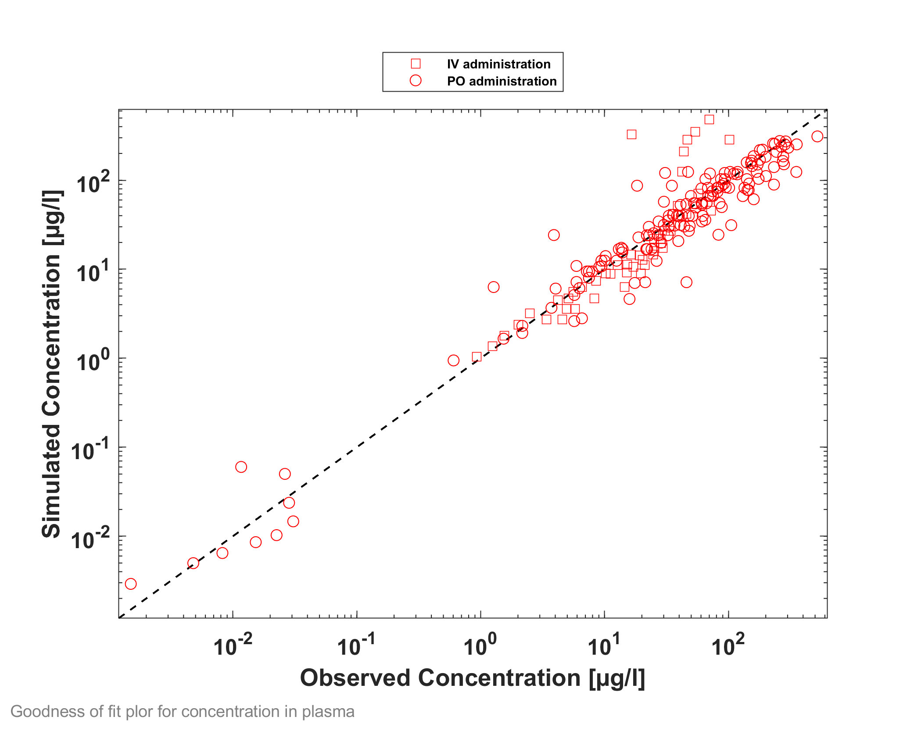

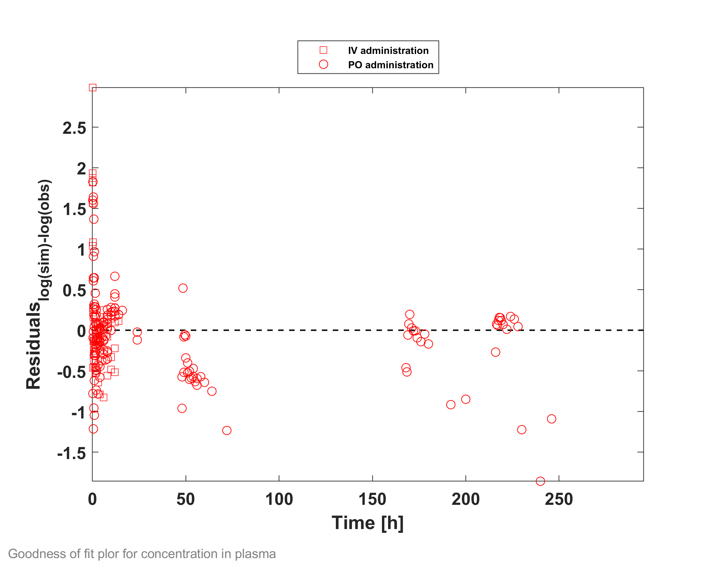

GMFE = 1.486734 

## 3.3: Concentration-Time Profiles
Simulated versus observed concentration-time profiles of all data listed in [Section 2.2.2](#222-Clinical-Data) are presented below.

### 3.3.1 Model Building

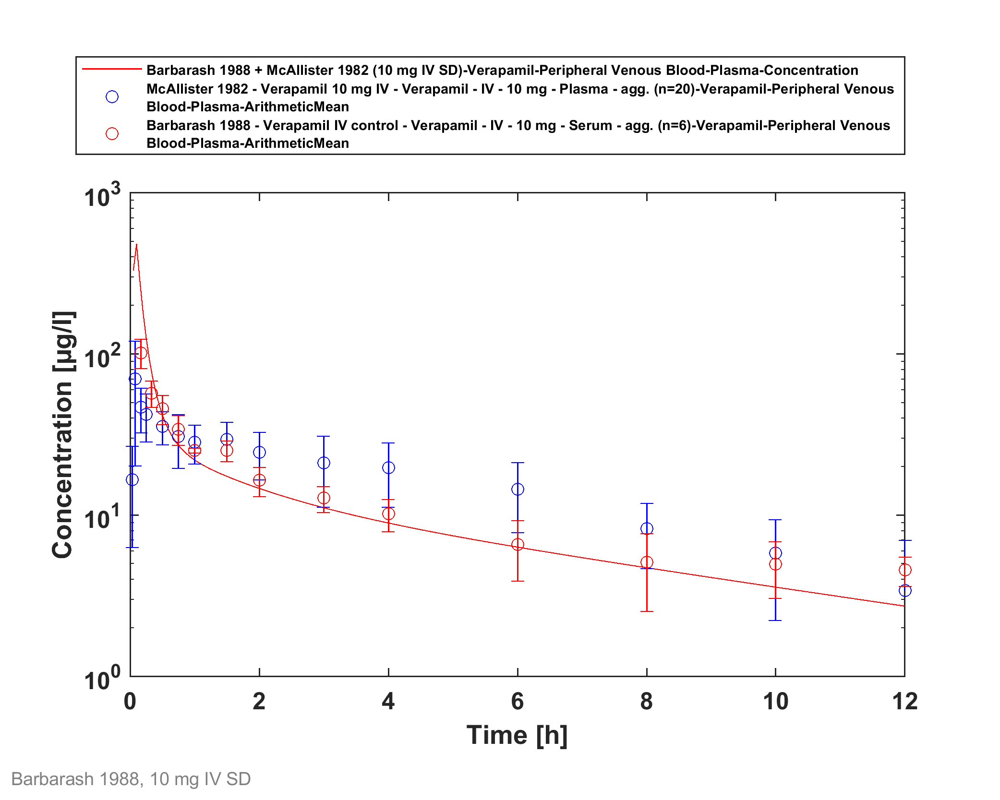

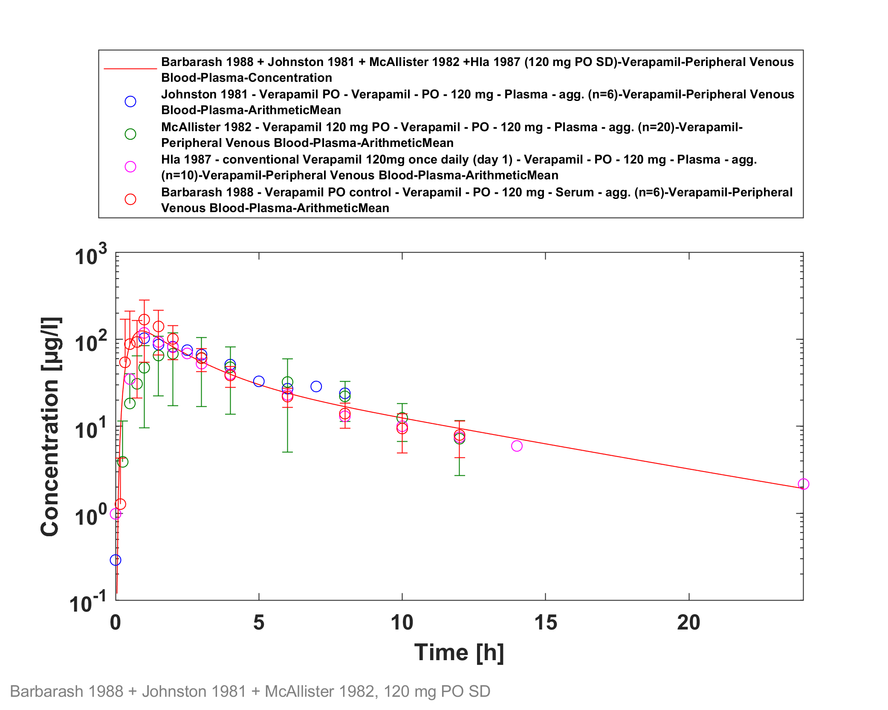

### 3.3.2 Model verification

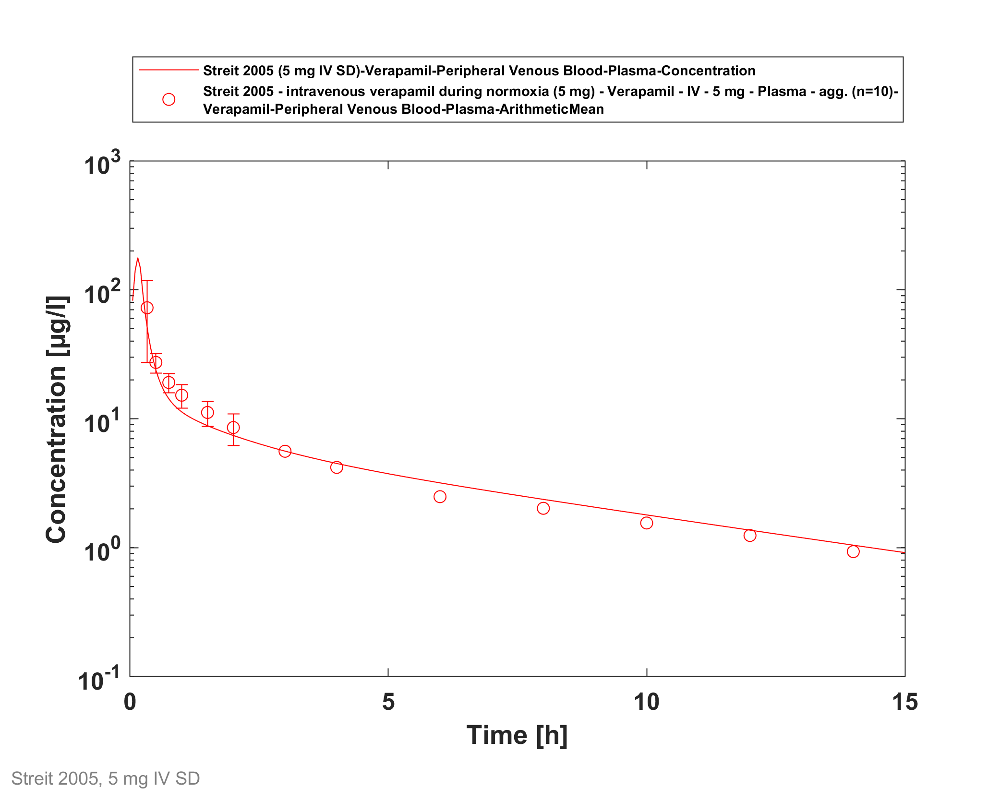

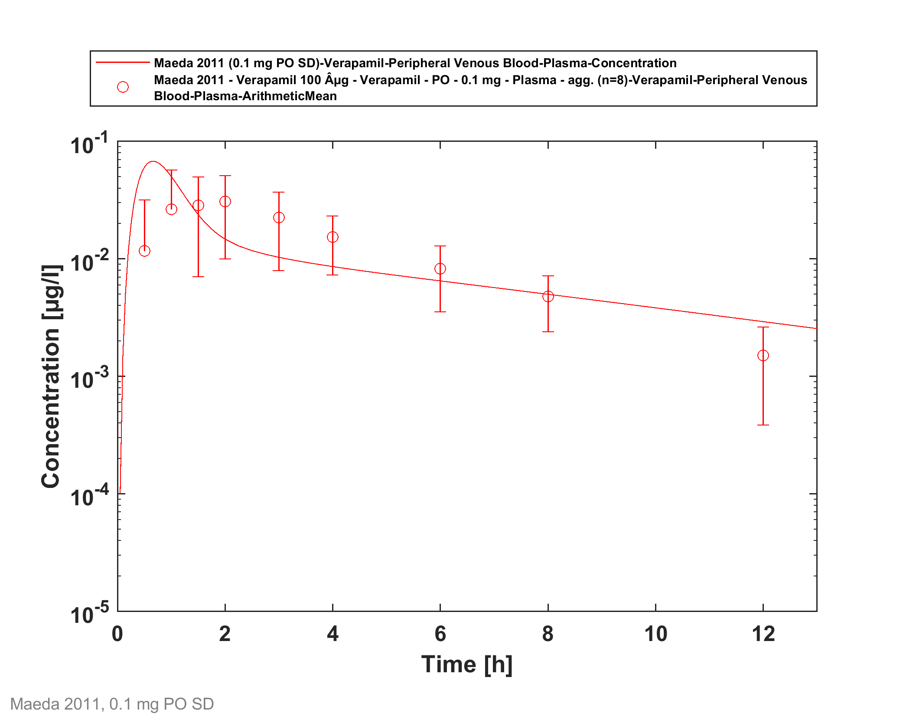

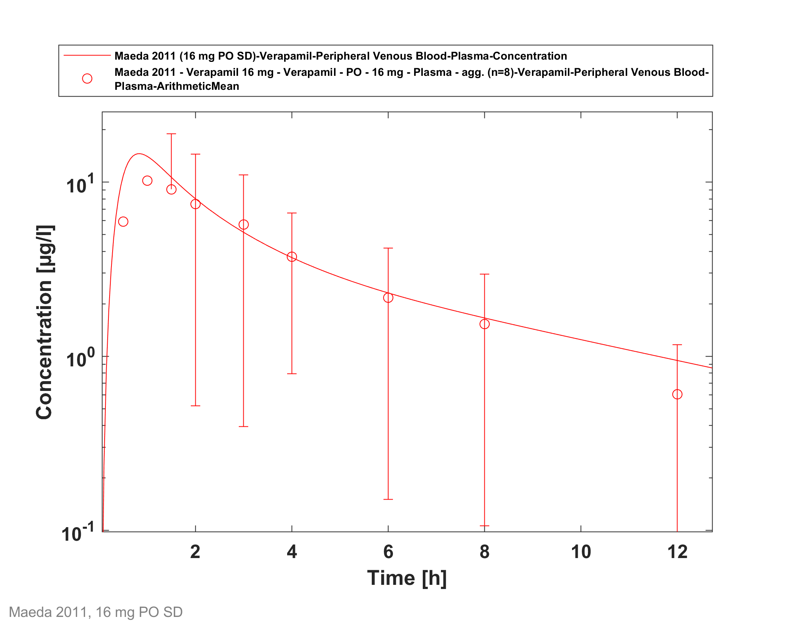

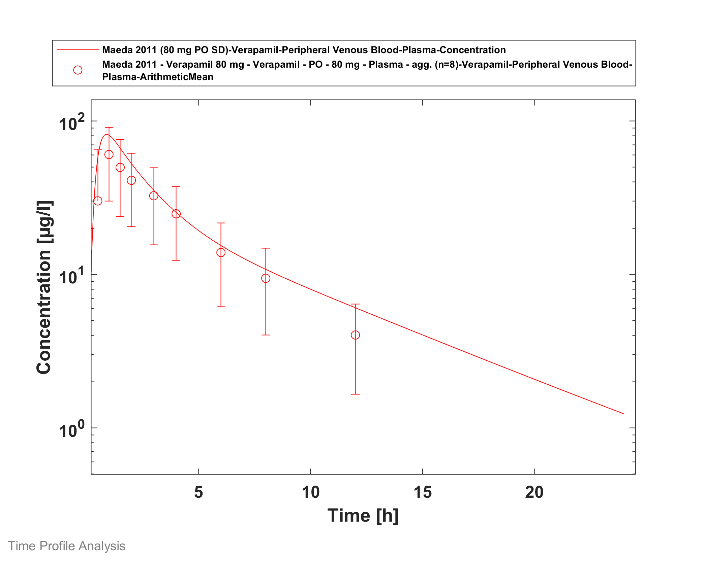

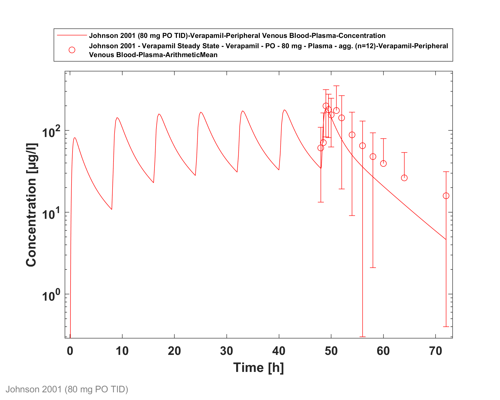

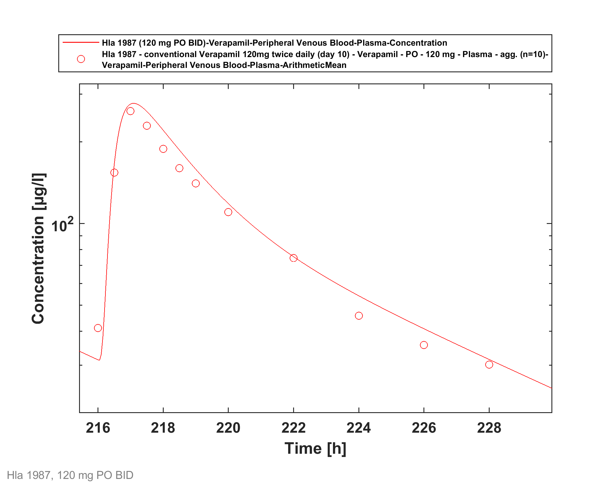

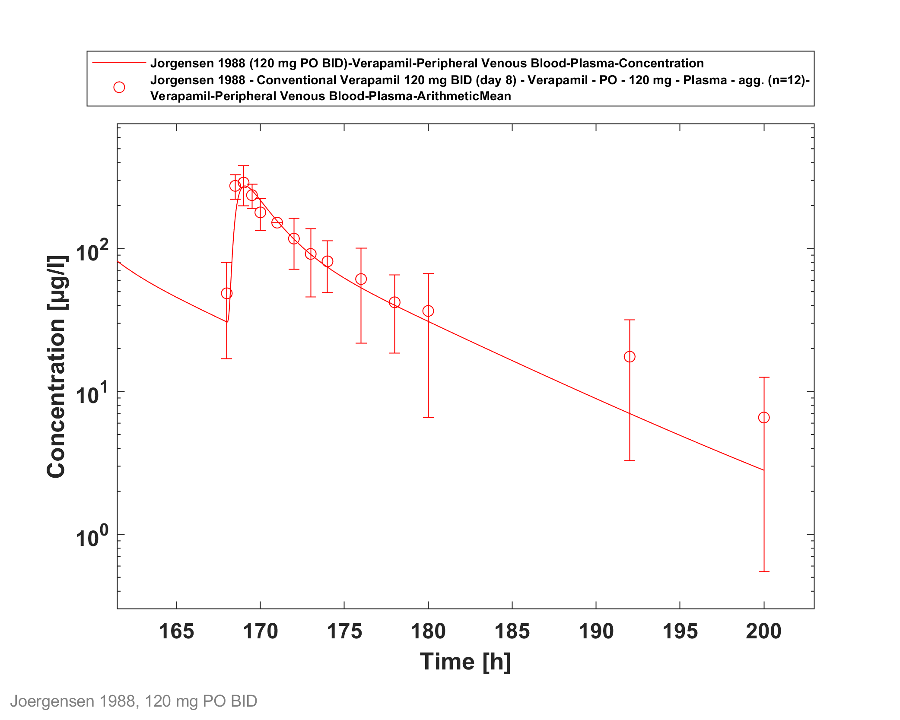

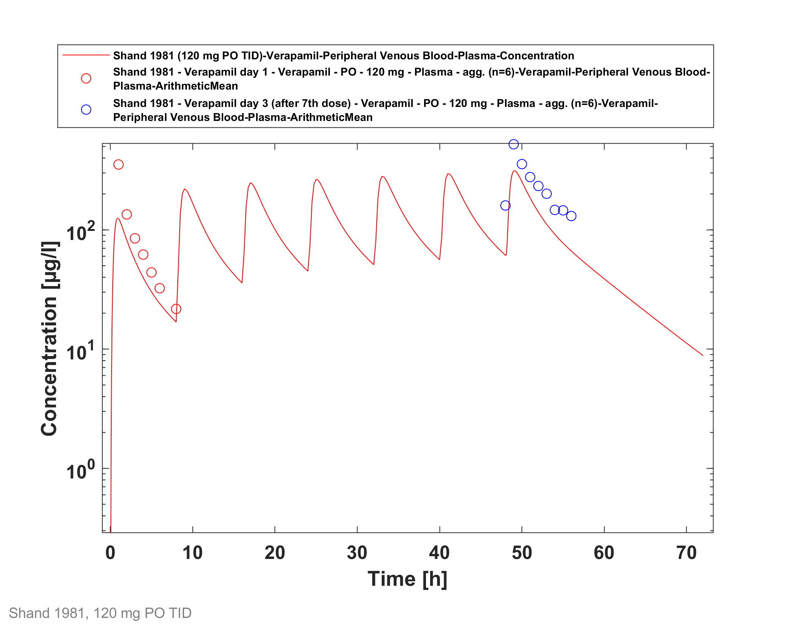

# 4 Conclusion
The herein presented PBPK model adequately describes the pharmacokinetics of verapamil after single and multiple administration of a variety of doses to healthy adults.  Furthermore, mechanism-based CYP3A4 (auto-) inactivation on verapamil itself can be described well with the optimized parameterization. 

In conclusion, the presented verapamil PBPK model is well-suited to be applied in drug-drug-interaction scenarios.

# 5 References
**Barbarash 1988** Barbarash RA, Bauman JL, Fischer JH, Kondos GT, Batenhorst RL. Near-total reduction in verapamil bioavailability by rifampin. Electrocardiographic correlates. Chest. 1988 Nov;94(5):954-9.

**Heikkinen 2012** Heikkinen AT, Baneyx G, Caruso A, Parrott N. Application of PBPK modeling to predict human intestinal metabolism of CYP3A substrates - an evaluation and case study using GastroPlus. Eur J Pharm Sci. 2012 Sep 29;47(2):375-86. doi: 10.1016/j.ejps.2012.06.013. Epub 2012 Jul 1.

**Hla 1987** Hla KK, Henry JA, Latham AN. Pharmacokinetics and pharmacodynamics of two formulations of verapamil. Br J Clin Pharmacol. 1987 Nov;24(5):661-4.

**Joergenson 1988** Jørgensen NP, Walstad RA. Pharmacokinetics of verapamil and norverapamil in patients with hypertension: a comparison of oral conventional and sustained release formulations. Pharmacol Toxicol. 1988 Aug;63(2):105-7.

**Johnson 2001** Johnson BF, Cheng SL, Venitz J. Transient kinetic and dynamic interactions between verapamil and dofetilide, a class III antiarrhythmic. J Clin Pharmacol. 2001 Nov;41(11):1248-56.

**Johnston 1981** Johnston A, Burgess CD, Hamer J. Systemic availability of oral verapamil and effect on PR interval in man. Br J Clin Pharmacol. 1981 Sep;12(3):397-400.

**Karim 1995** Karim A, Piergies A. Verapamil stereoisomerism: enantiomeric ratios in plasma dependent on peak concentrations, oral input rate, or both. Clin Pharmacol Ther. 1995 Aug;58(2):174-84.

**Kuepfer 2016** Kuepfer L, Niederalt C, Wendl T, Schlender JF, Willmann S, Lippert J, Block M, Eissing T, Teutonico D. Applied Concepts in PBPK Modeling: How to Build a PBPK/PD Model.CPT Pharmacometrics Syst Pharmacol. 2016 Oct;5(10):516-531.

**McAllister 1982** McAllister RG Jr, Kirsten EB. The pharmacology of verapamil. IV. Kinetic and dynamic effects after single intravenous and oral doses. Clin Pharmacol Ther. 1982 Apr;31(4):418-26.aeda K, Takano J, Ikeda Y, Fujita T, Oyama Y, Nozawa K, Kumagai Y, Sugiyama Y. Nonlinear pharmacokinetics of oral quinidine and verapamil in healthy subjects: a clinical microdosing study. Clin Pharmacol Ther. 2011 Aug;90(2):263-70.

**Nishimura 2003** Nishimura, M., Yaguti, H., Yoshitsugu, H., Naito, S. & Satoh, T. Tissue distribution of mRNA expression of human cytochrome P450 isoforms assessed by high-sensitivity real-time reverse transcription PCR. J. Pharm. Soc. Japan 123, 369–75 (2003).

**Perdaems 2010** Perdaems N, Blasco H, Vinson C, Chenel M, Whalley S, Cazade F, Bouzom F. Predictions of metabolic drug-drug interactions using physiologically based modelling: Two cytochrome P450 3A4 substrates coadministered with ketoconazole or verapamil. Clin Pharmacokinet. 2010 Apr;49(4):239-58.

**PK-Sim Ontogeny Database Version 7.3** (https://github.com/Open-Systems-Pharmacology/OSPSuite.Documentation/blob/38cf71b384cfc25cfa0ce4d2f3addfd32757e13b/PK-Sim%20Ontogeny%20Database%20Version%207.3.pdf)

**Rowland-Yeo 2011** Rowland Yeo K, Walsky RL, Jamei M, Rostami-Hodjegan A, Tucker GT. Prediction of time-dependent CYP3A4 drug-drug interactions by physiologically based pharmacokinetic modelling: impact of inactivation parameters and enzyme turnover. Eur J Pharm Sci. 2011 Jun 14;43(3):160-73.

**Sandström 1999** Sandström R, Knutson TW, Knutson L, Jansson B, Lennernäs H. The effect of ketoconazole on the jejunal permeability and CYP3A metabolism of (R/S)-verapamil in humans. Br J Clin Pharmacol. 1999 Aug;48(2):180-9.

**Schlender 2016** Schlender JF, Meyer M, Thelen K, Krauss M, Willmann S, Eissing T, Jaehde U. Development of a Whole-Body Physiologically Based Pharmacokinetic Approach to Assess the Pharmacokinetics of Drugs in Elderly Individuals. Clin Pharmacokinet. 2016 Dec;55(12):1573-1589. 

**Shand 1981** Shand DG, Hammill SC, Aanonsen L, Pritchett EL. Reduced verapamil clearance during long-term oral administration. Clin Pharmacol Ther. 1981 Nov;30(5):701-6. 

**Streit 2005** Streit M, Göggelmann C, Dehnert C, Burhenne J, Riedel KD, Menold E, Mikus G, Bärtsch P, Haefeli WE. Cytochrome P450 enzyme-mediated drug metabolism at exposure to acute hypoxia (corresponding to an altitude of 4,500 m). Eur J Clin Pharmacol. 2005 Mar;61(1):39-46.

**Tracy 1999** Tracy TS, Korzekwa KR, Gonzalez FJ, Wainer IW. Cytochrome P450 isoforms involved in metabolism of the enantiomers of verapamil and norverapamil. Br J Clin Pharmacol. 1999 May;47(5):545-52.

**Vogelpoel 2004** Vogelpoel H, Welink J, Amidon GL, Junginger HE, Midha KK, Möller H, Olling M, Shah VP, Barends DM. Biowaiver monographs for immediate release solid oral dosage forms based on biopharmaceutics classification system (BCS) literature data: verapamil hydrochloride, propranolol hydrochloride, and atenolol. J Pharm Sci. 2004 Aug;93(8):1945-56.
